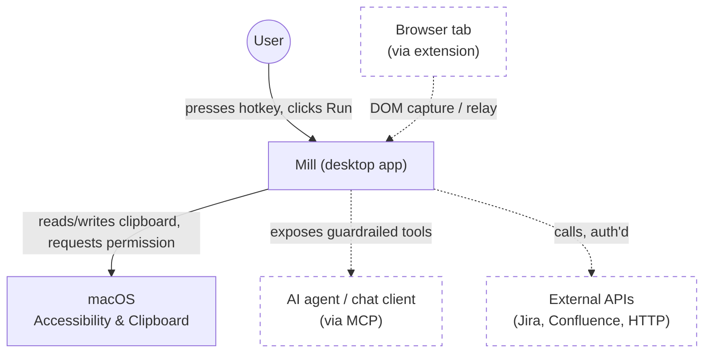

# Mill — Living Spec

This document is the single source of truth for what Mill is. Edit this
file, not a copy of it. (It was rendered inside the app itself — a Spec
view — until 2026-08-10, retired by owner decision: the in-app rendering
never actually *enforced* doc/app coherence — the same-change
SPEC-update rule and the seeded-example discipline do that (every
shipped capability seeds a runnable in-app proof, .claude/rules/
testing.md) — while costing the app's largest bundle chunk (mermaid +
svg-pan-zoom + marked) and a sidebar slot that wasn't a work
destination. The repo is the reading surface; GitHub renders the
diagrams below natively.)

Status key: `LOCKED` (decided), `OPEN` (actively undecided), `PARKED` (named,
not yet worth deciding).

Where a section describes something with an actual UI, that same status key
covers whether the *decision* to build it is settled — not whether the
pixels are the intended design. A second, orthogonal tag covers that:
`UX: PROTOTYPE` (built to prove a capability/architecture works end-to-end;
functional, not a considered design — expect it to be redesigned, not
treated as the target) vs. `UX: FINAL` (the deliberate, intentional design
for that surface). Absence of a `UX:` tag on a section with a built UI
means it hasn't been classified yet — treat that as a gap to fill, not as
an implicit `FINAL`.

---

## 0. Origin

- Proven on the work laptop already: M365 Copilot (chat agent) driving
  Hammerspoon (macOS Lua automation) as the executor. The point being proven
  was that a chat agent can be made to solve these use cases at all — proven,
  done. `LOCKED`
- That proof-of-concept is not the foundation to build on. Repeatedly hit
  three failure modes trying to grow it: **inner-platform effect** (Hammerspoon
  config drifting into an ad-hoc bespoke platform instead of staying a
  scripting tool), **point solutions** (one-off scripts per use case instead of
  a general capability), and **NIH** (reaching for custom Lua glue where a
  real library/standard already existed). Mill-as-a-Wails-app is the
  do-over specifically to avoid those three, which is why §3–§8 lean so hard
  on citing existing tools/patterns (n8n, React Flow, native messaging,
  Claude Code's project scoping) instead of inventing fresh ones. `LOCKED`

## 1. Positioning

- **What "AI-friendly" actually means — the thesis, not a slogan: what you
  see is what I see.** `LOCKED` Everything Mill composes already exists and
  is already possible by hand. The gap isn't capability, it's that an AI
  acting on a system it can't verify has to *guess* at the actual state
  (what's really on the clipboard, what a command will really do, what a
  setting is really set to) — and the distance between the guess and reality
  is exactly where hallucination and silent failure live. Mill's job is to
  give an AI the same verified, structured view of state a human has, not a
  text blob to infer from. Every recurring pain point this spec addresses is
  a specific instance of this: heredoc failures (shell syntax generated
  blind, no structured view of the real quoting context), the Confluence
  clipboard ambiguity (nothing told either party whether HTML was actually
  present until it was made checkable), MCP's typed tool calls over freehand
  bash (a structured result instead of text to parse and hope), the
  guardrail preview itself (make sure the human's view and the AI's
  about-to-happen action are the same view, before it happens), and the
  original multi-tab session-identity problem (the human's view and the
  AI's context silently diverging with no shared state to reconcile them).
  This is the actual mechanism behind "compose, don't reinvent" below — not
  a separate preference, the same one.
- Mill is not novel. It composes existing primitives — a workflow
  authoring layer with guardrails, not a new category. `LOCKED`
- Reference points: **1Password** (generic capability across every site/app,
  not site-specific), **n8n** (generic workflow/automation composition).
  `LOCKED`
- Product posture: agentic, like M365 Copilot or claude.ai — not turn-by-turn
  operator mode like Claude Code's manual-gear review. The guardrail has to be
  ambient, not a tax on every step. `LOCKED`
- Hard constraint: the guardrailed path must not be harder than the baseline
  of what a person can already do natively (copy/paste, running a command
  themselves by hand). If it is, nobody adopts it. `LOCKED`
- **Blocked ≠ unsupported — Mill carries the capability superset; the
  environment decides which are live.** `LOCKED` (owner-stated
  2026-08-11, with the locked-down enterprise environment-reality reframe). Ground truth on the
  target work machine: MCP is deny-all (the TLS-inspecting network proxy blocks the port) until
  the enterprise environment's AI-tool control plane lands; no Confluence/Jira API
  access; full-page clipboard copy loses structure. So Mill's true
  near-term product is the local/offline/open-source substrate that
  makes M365 Copilot and/or local Ollama usable there — reliable
  structure-preserving DOM capture → markdown (§5, ADR-0030's decision
  matrix), the §2.1 bridge, and a local AI step (pending decision) —
  while the MCP/connector/canvas platform stays the long game, built
  and shipped even where blocked. Never rip a capability out because
  one environment blocks it (exactly how MCP already works: built,
  live here, unusable in a locked-down enterprise environment). Open-source is load-bearing
  distribution, not ideology: enterprise network-security scanning passes `git clone` of
  OSS, which is what makes §1.1's install story the legal way onto the
  work machine.
- **Everything is real-time — the user never reloads or reopens to see
  current state.** `LOCKED` (product value, owner-stated 2026-08-10).
  A well-built Mill has nothing to "refresh": any change — a run
  completing, an approval landing, an entity edited (by the UI, a
  headless trigger, or an external MCP author) — propagates live to
  every open surface via the event layer (`mill-data-changed`,
  `guardrail-pending-changed`, the activity feed), never a manual
  refresh or a close-and-reopen. This is *why* ⌘R-as-reload feels
  wrong as a Mill concept (§0009's keymap): reload is a browser/dev
  escape hatch (⌘⇧R), not a product affordance — if a user ever needs
  it to see truth, a real-time surface is missing and that's the bug.
  The standing audit this implies: every surface must ask "can this
  ever show stale state the user would have to manually refresh?" and
  close that gap (goal 0017). Same family as the §1 thesis (no gap
  between what you see and what's real) — applied to *time*, not just
  structure. **Including Mill's own UI mutations, not just external
  ones**: goal 0017's audit found the event layer's emit side lived in
  ONE place (`mcpsvc`, MCP-authored writes only) — a direct-UI create/
  edit/delete through `CompositionService`/`ConfigureService`/
  `GuardrailService` emitted nothing at all, so it only ever reached the
  tab that made the change, never another open surface. Fixed by giving
  every direct-mutation service its own `dataevent.Emit` call (one
  shared package, `internal/services/dataevent`) rather than treating
  MCP as the sole live-sync source. **The thesis's completion criterion
  includes a user never *needing* ⌘⇧R as a trust ritual** (goal
  0033-reload-session-restore.md, owner-observed live: a real hard
  reload mid-session, tab 3 of 3, discarded the open tab and landed on
  Home) — goal 0017 above is the real fix (nothing should ever look
  stale enough to make someone want to reload); this is the safety net
  for the residual, legitimate dev/debug reload goal 0017 doesn't
  eliminate: the current sidebar view and the open/active work tabs
  now round-trip through `localStorage` (`shared/store.ts`'s zustand
  `persist`, `shared/workTabs.ts`'s pure restore helpers) so a reload
  — deliberate or not — restores the same place instead of resetting
  to Home. **Update (2026-08-12, e2e CI flake investigation): goal
  0017's per-service `dataevent.Emit` fanout had a real race.** Giving
  every direct-mutation service its own emit call means a single
  logical write can now fire the SAME `mill-data-changed` event more
  than once for the same entity (an MCP `update_workflow` write emits
  from both `SnapshotDraft` and `UpdateWorkflow`; a canvas that just
  created its own workflow can still be mid-flight on that emit when it
  re-subscribes) — and since the event carries no payload, every
  handler independently re-fetches, so several near-simultaneous
  fetches can resolve out of order. `useCanvasLiveSync.ts`
  (`frontend/src/composition/`) was the one caller sensitive to this
  (its clean-vs-dirty decision), fixed with a monotonic per-hook
  request-sequence guard that drops a response once a newer event has
  arrived since it was dispatched — the general lesson for any FUTURE
  `mill-data-changed` consumer that both reacts to the event AND
  compares against locally-held state: assume the event can fire more
  than once per logical change and can deliver out of order, don't
  assume "one event in, one fetch, apply unconditionally" is safe.
- **Scope filter, learned from the screenshot-to-clipboard tangent**: before
  any capability goes into Mill, check whether the OS (or an existing
  launcher like Alfred/Raycast) already does it simply and well. If yes,
  Mill's job is at most to surface/point at it (a Runbook tip, not a
  reimplementation) — reimplementing a solved OS capability is the §0
  inner-platform trap aimed at macOS instead of at Hammerspoon. Mill earns
  its keep specifically where there's no native answer at all: guardrailed
  command execution, structure-preserving capture across inconsistent
  sources, cross-session identity, workflow composition — genuine gaps, not
  a "screenshot but ours" competitor to what already works. `LOCKED`

### 1.1 Hard constraints & delivery model

- No `cargo`/Rust compilation anywhere in Mill's own build or dependency
  pipeline. Reason: in a locked-down enterprise environment, TLS-inspecting proxies intercept/break cargo's network
  calls to crates.io, and Artifactory has no Rust feed to route around it —
  so anything that requires `cargo build`/`cargo install` from source will
  not build there, in CI or locally. This rules out e.g. Tauri as an
  alternative app shell (its build step compiles Rust). `LOCKED`
  Narrower than it first sounds: a **pre-built** Rust binary installed via
  Homebrew (a compiled bottle, no local cargo invocation) is not the same
  problem — brew already works there (it's how pueue got installed). So a
  Rust-authored local dev tool installed as a pre-built binary (e.g. `mise`
  via `brew install mise`) isn't automatically disqualified by this rule;
  only compiling Rust from source is. `LOCKED`
  Same reading applies to npm packages that ship prebuilt Rust binaries:
  checked directly (ADR-0003) that Vite 8's default bundler (Rolldown,
  used transitively by `frontend/`'s `vite` dependency) and its companion
  `lightningcss` both distribute as platform-specific prebuilt native
  binaries via npm's `optionalDependencies` mechanism — `npm install`
  never invokes `cargo`/`rustc`. Same shape as the Homebrew-bottle case,
  different package manager. `LOCKED`
- No AI API calls from Mill itself, and no phone-home telemetry of any kind.
  Mill is the substrate that mediates/guards actions initiated by other
  systems (an agent CLI, a chat client) — it is not itself an LLM client, and
  it must run fully offline/on-prem with zero outbound calls it didn't
  explicitly initiate on the user's own behalf via a user-configured
  connector. `LOCKED`
  **Invariant, owner-confirmed 2026-08-11, sharpening (not weakening)
  the above: Mill exposes AI as a user-configured step (local Ollama /
  BYO key), but never runs an autonomous decide-and-act agent loop
  itself — the guardrail always sits between any AI output and a real
  action.** An AI step is exactly the user-configured-connector case
  this bullet already permits: the user brings the endpoint/key, a
  local-Ollama call is zero-egress, and each step is one deterministic
  configured call — never Mill deciding what to call next. What stays
  forbidden is unchanged: Mill bundling a key, phoning home, or being
  the agent. `LOCKED`
- Single binary, no separate CLI/backend split. Wails3 already satisfies
  this (one Go binary embeds the compiled frontend) — this reinforces the
  existing scaffold choice, no change needed. `LOCKED`
- Install story: `git clone` + a documented local build, runnable on any work
  machine that can install the app. No hosted-service dependency for the
  core loop. `LOCKED`
- CI/CD wired from day one, not bolted on later. `LOCKED`
- Command/bash execution is mediated through Mill's own process (that's the
  guardrail hook point), but the mechanism underneath is standard OS
  primitives — `os/exec` with an explicit `Dir`/`Env`/shell-argv, never a
  custom-built sandboxing/process-isolation layer — and the guardrail
  engine (ADR-0022) is the safety layer. `LOCKED` — confirmed by explicit
  owner acceptance of
  [ADR-0026](adr/0026-code-execution-capability.md), whose research pass
  verified no sandbox library fits macOS+Linux+no-daemon anyway
  (go-landlock Linux-only, sandbox-exec Apple-deprecated, gVisor a
  second runtime).
- Architecture discipline: SOLID, DRY, DDD — proper domain/class separation
  once real domain logic exists. Not retrofitted onto the current two-file
  scaffold prematurely; applies as soon as actual capabilities land. `LOCKED`

### 1.2 Working method

- Research → Plan → Implement (the workflow Boris Cherny has described for
  Claude Code) is the standing method for every capability added to Mill:
  research what already exists before assuming it doesn't — a claimed
  "nothing exists for X" must be backed by an actual search, not an
  assumption (this is also the NIH guardrail from §0) — then plan/lock the
  approach, then implement. `LOCKED`
- DBOS and pueue were surfaced as possible durable-execution/process-queue
  candidates from earlier M365-context research, and got conflated with each
  other in that discussion — they're not the same kind of thing (DBOS is a
  durable-execution library you embed and typically pairs with Postgres;
  pueue is a standalone CLI/daemon for queueing shell commands). Both have
  now been independently evaluated — see §7 and
  [`docs/adr/0004-execution-process-tracking.md`](adr/0004-execution-process-tracking.md).
  `LOCKED` (evaluation) — ADR-0004 itself is `proposed`, not yet `accepted`.
- Concrete failure mode already hit once, worth locking as a hard filter for
  §7's eventual candidate list: pueue was `brew install`ed on the work
  machine for the M365 prototype, which (a) is written in Rust — disqualified
  by §1.1 on its own — and (b) is a separately-installed daemon outside the
  single binary, meaning anyone who `git clone`s Mill would also need to
  install and keep it in sync via a package manager Mill doesn't control.
  Generalized rule: **any process/job-queue mechanism must be embeddable
  directly in the Go binary** (a library, not a separately-installed
  daemon/CLI) — it cannot require Homebrew or any other external package
  manager at install time. This doesn't pick a replacement yet (that's
  §7's job), it just eliminates a whole class of candidate. `LOCKED`
- **Delivery planning is a committed goal backlog, separate from this
  doc — `LOCKED`, by direct decision ("we should not put everything in
  SPEC.md ... SPEC is just a requirement; the goal is to deliver
  something based on a plan").** `docs/goals/BACKLOG.md` is the one
  hand-reorderable priority queue (UX/frontend-first standing
  tiebreak), one file per goal (Goal/Plan/Acceptance, referencing this
  doc's sections rather than restating them), archived on delivery.
  Adopted as a pattern after real research rejected the tools
  (spec-kit: competes with this doc + new Python toolchain;
  task-master: 61-dep JSON database; OpenSpec: second spec-of-record,
  and its own maintainers hand-write exactly this ordering file;
  BMAD: team-persona ceremony) — the missing capability was only ever
  a committed, ordered markdown file.
- Access boundary: the actual work laptop this is being built for is behind
  a TLS-inspecting proxy in a locked-down enterprise environment and is not something the assistant helping design Mill
  has any live access to — no inspecting the real clipboard, no observing
  M365/Loop/Copilot behavior directly, no running commands against that
  machine's real session. Design and research proceed from the user's
  descriptions, not empirical testing against the real target environment,
  unless the user explicitly runs something themselves and reports back.
  `LOCKED`

### 1.3 Repo layout & CI/CD

Full rationale in [`docs/adr/0001-go-module-path-and-repo-layout.md`](adr/0001-go-module-path-and-repo-layout.md)
and [`docs/adr/0002-cicd-pipeline-phased-rollout.md`](adr/0002-cicd-pipeline-phased-rollout.md).

- Go module renamed from the scaffold default `changeme` to
  `github.com/alicoding/mill` (no git remote configured yet at the time of
  this decision; path chosen to match the intended future GitHub owner
  rather than deferring and repo-wide-renaming later). `LOCKED`
- Repo layout: flat root `*.go` files stay at root (`main.go` + thin
  Wails-binding `*service.go` files) — matches wailsapp/wails v3's own CLI
  repo convention, not golang-standards/project-layout (not an official Go
  standard per Russ Cox; aimed at multi-binary services Mill isn't).
  `internal/domain/runbook` (hand-written: the Capture→Process→Apply
  orchestration for Runbook actions) and `internal/adapters/{clipboard,
  markdown,hotkey}` (thin wrappers behind small interfaces around commodity
  libs: clipboard I/O, `html-to-markdown`, `golang.design/x/hotkey`) shipped
  per ADR-0001 Phase 2. Future domain packages (guardrail eval, capability
  composition, session identity) land the same way as they're built — no
  `cmd/`, `pkg/`, `api/`. `LOCKED`
- No generic `Capability`/`Action`/`Node` interface — §3 is still `OPEN` and
  only 2 concrete Runbook actions exist; the domain/adapter boundary above
  is stable regardless of what §3 decides, the capability schema itself is
  §3's call alone. `OPEN` (defer to §3)
- npm workspaces (`frontend/` + a future `browser-extension/`, §5) — not
  adopted yet, revisit when a real second JS package is scaffolded. `go.work`
  not applicable — single Go module is permanent per §1.1. `PARKED`
- **Frontend state management: Zustand adopted.** The PARKED trigger below
  fired — `ActivityView` (a second stateful view) needed the same
  `actions`/`activity` state `App.tsx` fetched, threaded down as props.
  `frontend/src/store.ts` holds `actions`/`activity` in one small store (no
  multi-slice split — an 8-file frontend doesn't need it yet); `App.tsx`
  keeps its two data-fetching effects but writes into the store instead of
  local `useState`, and `RunbookView`/`ActivityView` read the store
  directly instead of receiving props. Hotkey-recording UI state
  (`bindings`, `bindingErrors`, `recordingId` in `RunbookView.tsx`)
  deliberately stayed local `useState` — genuinely single-view state, not
  a candidate for the shared store. `LOCKED`
- **Frontend CSS: migrated to CSS Modules.** Primer React v38 (Mill is on
  38.35.0) dropped its `styled-components`/`sx`/`Box` dependency entirely
  and its own release notes say to "prefer to use CSS modules over
  styled-components and css variables over javascript theming"
  (github.com/primer/react discussion #7086) — not an outside opinion,
  the framework's own current direction, which Mill's single hand-rolled
  `public/style.css` predated. Genuinely global chrome (design tokens,
  `html`/`body` reset, the `.app-shell` flex root, the shared `.view-pane`
  scroll-clip class) moved to `frontend/src/index.css`, imported from
  `main.tsx` so it goes through Vite's own pipeline instead of a raw
  `<link>` tag that bypassed it. Per-view styling split into co-located
  `*.module.css` files (`RunbookView.module.css` shared by `RunbookView`
  and `ActivityView`, which already reused the same card/list visual
  language). `frontend/public/style.css` deleted. `LOCKED`
- **Copy management: `react-i18next` v17.0.11 + `i18next` v26.3.6
  adopted, namespace-per-bounded-context JSON — `LOCKED`, migration
  complete + guarded (goal 0032, closed).** Owner-observed: 40 of 72
  `.tsx` files carried inline hardcoded copy, no i18n library present.
  Research first framed this as a headless-CMS question (Decap/
  Sveltia/Keystatic/Tina) — rejected on architecture fit, not quality:
  every git-native CMS candidate needs either a hosted OAuth
  intermediary or a locally-running backend daemon, disqualified
  outright by §1.1's no-hosted-service/no-second-daemon constraint. The
  owner reframed it mid-research: this is plain i18n (key → string
  JSON, no authoring UI, no CMS product), not localization or
  centralized authoring — so the real adopt-vs-build call is a plain
  i18n library, and `react-i18next` is MIT, zero-server, and the
  standard choice for React. Resources
  (`frontend/src/locales/en/{common,app,composition,configure,
  views}.json`, mirroring `frontend/src`'s own bounded-context folders)
  are imported statically and bundled at build time — no runtime
  fetch, no network call, matching every hard constraint in §1.1.
  Initialized once in `frontend/src/app/i18n.ts`, imported for its
  side effect from `main.tsx`; every other folder just calls
  `useTranslation()` from the `react-i18next` package directly, never
  importing the init module (dependency-cruiser's existing bounded-
  context boundaries, ADR-0012, apply unchanged). Migrated in five
  staged PRs off the `SettingsView.tsx` proof-of-pattern slice:
  `app/`, `composition/` (split further into panels/canvas/inspector
  sub-PRs — the largest slice, ~6600 non-test lines), `configure/`,
  and `views/` minus Settings — every `.tsx`/`.ts` file's inline
  user-facing string literals (including aria-labels/placeholders/
  titles) extracted, translated text matching the original English
  exactly so existing e2e assertions kept passing unchanged. A handful
  of pure-function modules (validation/formatting helpers whose copy
  is baked in at module-load time, not render time — e.g.
  `composition/draftWorkflowSchema.ts`, `configure/openapiSynth.ts`,
  `views/homeFormat.ts`) take a `t` translate function as an explicit
  argument instead of a React hook, since they're called outside
  component render. `eslint-plugin-i18next`'s `no-literal-string` rule
  is now wired into `frontend/eslint.config.js`, scoped to
  `src/**/*.{ts,tsx}` (test files excluded), in `jsx-text-only` mode —
  checked empirically against this exact codebase before enabling:
  `jsx-only` mode (which also checks JSX attribute values) produced
  ~290 warnings dominated by Primer/DataTable prop names sitting on
  custom JSX elements, not real copy, and would need a large, brittle
  attribute-name allowlist to tame for a marginal catch; `jsx-text-only`
  (JSX text children only, the plugin's own default) gave a small,
  accurate signal that caught five genuine remaining hardcoded strings
  in `shared/` (never in this migration's four-slice scope, since
  `shared/` isn't a bounded-context page folder) plus two in already-
  migrated files, all fixed in the same change that turned the rule on.
- CI: GitHub Actions, all four ADR-0002 phases shipped in
  `.github/workflows/ci.yml` + `.github/workflows/release.yml`.
  `golangci-lint` v2, ESLint flat config, Vitest, `go test -race -cover`,
  `go build`/`go vet` (macOS desktop + Linux server-mode), Playwright E2E,
  `govulncheck` (advisory only, still experimental upstream), all
  merge-blocking except govulncheck. Precedent: wailsapp/wails's own v3 CI
  (native-OS matrix, no GoReleaser — wailsapp/wails#747 closed wont-fix).
  `LOCKED`
- **Operating model: trunk-based locally, PR-per-goal to a
  ruleset-gated `main`, push at least per session — `LOCKED`,
  [ADR-0034](adr/0034-git-ci-operating-model.md)** (owner-ratified
  2026-08-11 after research found the ignored-pipeline failure mode on
  record in this repo's own run history: rapid direct pushes
  cancelling a 43-minute suite until pushing stopped). Direct pushes
  to `main` are blocked for everyone including the owner (bypass =
  "for pull requests only"; a green PR self-merges reviewer-free);
  required checks make green-before-main mechanical, not aspirational
  — GitHub can't gate a direct push on checks at all. Secret-scanning
  push protection enabled ahead of the 273-commit catch-up push.
  **CI path filtering adopted (goal 0024, ADR-0034's own Update
  section)** — not the workflow-level `on.paths` mechanism the ADR
  originally deferred (that footgun is real and unchanged), but a
  `changes` job (`dorny/paths-filter`) whose output gates every other
  job via a job-level `if:`, so a skipped job still reports a real
  (passing) status and a required check can never hang. Docs-only PRs
  now fast-skip the full matrix instead of paying for it.
- **Linux server-mode builds require `CGO_ENABLED=0` explicitly** — not
  optional, confirmed by actually building natively in a linux/amd64
  container, not assumed. Without it, Wails3's own
  `internal/operatingsystem`/`internal/assetserver/webview` packages pull
  in GTK4/webkitgtk-6.0 regardless of the `server` build tag. Matches
  `build/docker/Dockerfile.server`'s own default — that answer was already
  in the repo, just not applied to CI until this was caught. Applies to
  any future Linux build/test/lint step touching the root package. `LOCKED`
- `internal/adapters/hotkey` is split by build tag:
  `hotkey_desktop.go` (`!server`, the real `golang.design/x/hotkey`-backed
  implementation) and `hotkey_server.go` (`server`, a zero-dependency stub
  returning a clear error) — not just a build-fix, architecturally correct
  either way, since server mode has no native run loop to ever deliver a
  keypress through. `LOCKED`
- Lefthook (Go, MIT, Evil Martians) mirrors the same checks locally as a
  pre-commit hook (`lefthook.yml`) — go vet/build/test, golangci-lint,
  eslint, vitest, tsc — verified end-to-end (a deliberate lint violation
  was caught and blocked, a clean commit passed). Playwright E2E is
  deliberately NOT in the local hook (real server build + browser launch
  is meaningfully slower than everything else there; suited to CI, not
  every local commit). `task setup:hooks` installs it once per clone.
  `LOCKED`
- **Max 500 lines per hand-written `.go`/`.ts`/`.tsx` source file** —
  `scripts/check-loc.sh`, run by both Lefthook and CI's `file-loc-limit`
  job (one script, not two copies that can drift, same "mirrors CI"
  principle as Lefthook's own header comment). Generated Wails bindings
  and the vendored gomobile scaffold (`build/ios/`, `build/android/`) are
  exempt. Introduced once two files crossed it during the Configure-
  surface work (`internal/domain/composition/composition.go` at 944
  lines, `frontend/src/CompositionCanvas.tsx` at 623) — both split along
  real package/component seams (composition.go into `types.go`/
  `nodetypes.go`/`graph.go`/`integration.go`/`execute.go`/
  `capabilitymap.go`; CompositionCanvas.tsx into `CanvasNodeView.tsx`/
  `draftWorkflowSchema.ts`/`canvasConversion.ts`/`NodePalette.tsx`), zero
  behavior change, verified via the full check suite plus a real
  server-mode Playwright smoke pass before landing. `LOCKED`
  **Checked directly, not assumed, whether this hand-rolled script
  duplicates commodity tooling** (prompted by a direct question —
  CLAUDE.md's own "default to adopting, hand-roll only when no adopted
  option satisfies the constraint" rule applies to this too, not just to
  whole libraries): ESLint ships a real built-in `max-lines` rule
  (confirmed against its own docs) that could cover the `.ts`/`.tsx` half
  today with zero new dependency — Mill doesn't currently enable it.
  Go's side is different: confirmed directly against the actually-
  installed `golangci-lint v2.12.2`'s own linter list (`golangci-lint
  linters`) that no file-length linter ships in it — `funlen` limits a
  *function's* length, `lll` limits *line width*, neither is "lines per
  file." A third-party `filen` linter exists upstream
  (github.com/DanilXO/filen, golangci-lint PR #5081) but isn't merged
  into a released version yet. Splitting into "ESLint's `max-lines` for
  TS + something else for Go" was considered and rejected: it would
  reintroduce exactly the "two copies that can drift" problem this
  bullet's own one-script design already exists to avoid (a limit number,
  an exemption list, defined twice, in two config languages, checked by
  two different tools) — the actual constraint this script satisfies
  isn't "no line-count tool exists anywhere," it's "one identical rule
  enforced the same way across both languages Mill writes," which no
  single commodity tool covers. `LOCKED` (script stays; documented
  reasoning, not an unchecked assumption).
- **`.claude/rules/*.md` frontmatter is validated the same way — a
  second small script, same "one script, mirrored by Lefthook and CI"
  shape.** Prompted directly, after a real instance: a `globs:` vs
  `paths:` typo in `.claude/rules/frontend.md` (§9.1) shipped and sat
  silently broken — the rule's path-scoping just never worked, with
  nothing anywhere flagging it. Researched before hand-rolling a fix,
  not assumed: `cclint` (github.com/carlrannaberg/cclint, MIT, active)
  is a real, existing linter for Claude Code project files, checked
  directly against its own docs — but it validates agent/command
  frontmatter, `settings.json`, and `CLAUDE.md`, not `.claude/rules/*.md`
  specifically, and Mill has no agents or commands yet for it to apply
  to regardless (adopting it now would be tooling for a problem that
  doesn't exist yet, the exact thing this repo's own anti-proliferation
  instinct exists to catch). `scripts/check-rules-frontmatter.sh` is a
  small, zero-new-dependency bash script (no YAML parser needed — the
  real schema is one optional key, `paths`, a list of strings) that
  flags any other top-level frontmatter key, run by both Lefthook
  (`rules-frontmatter` job) and a new CI job of the same name. Verified
  it actually catches the bug it was written for, not just that it
  passes on already-correct files: reintroduced the original `globs:`
  typo temporarily, confirmed the script fails with a clear message
  naming the bad key, then restored the correct file and confirmed a
  clean pass. `LOCKED`
- **`frontend/src/` reorganized into enforced bounded-context folders,
  prompted by a direct ask: the Go side already has real bounded
  contexts (`internal/domain/*`/`internal/adapters/*`) and the
  43-file-flat frontend never got the equivalent.** Full research,
  decision, and folder map are in
  [`docs/adr/0012-frontend-bounded-context-folders.md`](adr/0012-frontend-bounded-context-folders.md).
  `eslint-plugin-boundaries` was tried first (ESLint-native, zero new
  pipeline) and abandoned after real, extensive debugging — its pattern
  matching never fired against this project's own files even when
  reproducing its own upstream test fixtures exactly, confirmed by
  instrumenting the plugin's compiled source directly, not assumed
  broken. **`dependency-cruiser`** (MIT, standalone CLI, TS-aware
  module-graph resolver) replaced it: worked correctly on the first
  real run, and correctly caught a deliberately-reintroduced violation
  on verification. Five folders — `app/` (shell only), `views/`
  (top-level pages), `composition/` (§3's canvas domain), `configure/`
  (§3.5's Configure domain), `shared/` (genuinely cross-cutting, 2+
  consumers) — with import direction enforced one-way
  (`shared ← configure ← composition ← views ← app`) via
  `frontend/.dependency-cruiser.cjs`, run as `npm run boundaries`,
  wired into both Lefthook and CI's `frontend` job alongside `npm run
  lint`. The tool caught a real design mistake mid-implementation, not
  just a hypothetical one: `store.ts`/`Tabs.tsx` were first placed in
  `app/` on the assumption that "global state" and "the app shell" were
  the same context — the first clean-tree `depcruise` run then flagged
  9 files across three other folders importing them, the actual
  definition of `shared/`; moved accordingly. Documented as a standing
  rule in `.claude/rules/frontend.md` (new files land in their
  bounded-context folder from creation, not flat-then-reorganized).
  `LOCKED`
- **Testing discipline formalized as a rule, prompted by a direct ask to
  stop "paying the tax" of re-discovering the same bugs manually.**
  Four real bugs in one session (a canvas node-drop collision, a
  duplicate-trigger-drop rejection, a disabled palette item's hover
  background, the node-type-swap feature) were each verified live —
  hovering an element, dragging a node, reading a computed style via a
  throwaway Playwright script — then the script was discarded once it
  confirmed the fix, leaving zero permanent coverage for any of the
  four. `.claude/rules/testing.md` (unscoped — applies regardless of
  language) encodes the actual discipline: a bug confirmed via manual
  reproduction isn't done until that reproduction becomes a committed
  test, since the reproduction already exists at the moment of
  confirmation and re-deriving it later costs real time. Applied
  retroactively to all four bugs this pass: `canvasLayout.test.ts`
  (Vitest, `findFreeDropPosition` — previously zero test coverage on a
  pure function that had a real, demonstrated bug) and four new
  `composition.spec.ts` Playwright cases covering the other three plus
  the collision fix end-to-end. Surfaced a small real coupling issue
  while adding the unit test: `canvasLayout.ts` imported
  `CANVAS_NODE_WIDTH`/`CANVAS_NODE_HEIGHT` from `CanvasNodeView.tsx` (a
  React component file with a CSS import chain Vitest's transform
  pipeline couldn't handle), breaking the new test outright — split
  into a zero-dependency `canvasConstants.ts` both files import from
  instead, the same "split along the seam a limit just surfaced"
  discipline the 500-line rule above already established, just found
  via test-writing instead of a line count. `LOCKED`
- `HotkeyService` cannot be exercised by headless/server-mode CI — no live
  macOS Cocoa run loop in that mode. Verification stays an explicit manual
  desktop-mode check (`.claude/skills/run-mill`), never a silent CI
  skip/fake-pass. Same reasoning extends to `internal/adapters/clipboard`'s
  real round-trip test (skipped specifically in CI, not just on non-macOS —
  GitHub's `macos-latest` runners are headless, no GUI/pasteboard session
  for `osascript` either) and to the Playwright E2E suite (asserts only
  what's environment-independent — page load, both actions listed, Spec
  content, the deterministic "no HTML on clipboard" path — never the
  clipboard-dependent success content). `LOCKED`
- Release pipeline (ADR-0002 Phase 4) ships **macOS only**, deliberately:
  Linux desktop needs GTK4/webkitgtk-6.0 system packages never installed
  or tested here; Windows needs a toolchain with zero local verification
  possible from this macOS-only dev environment. Shipping CI for platforms
  nobody's actually run it against is the exact mistake the CGO_ENABLED
  finding above already caught once — not repeated for a release artifact
  people would download. Windows/Linux desktop release builds `PARKED`,
  revisit when there's a way to actually verify them. Server-mode Docker
  image also not part of v1 release scope — no confirmed hosted-deployment
  use case. `LOCKED` (macOS-only scope) / `PARKED` (the rest)
- **Release cadence: a release tags when a user-visible capability goal
  archives, not on a clock** — release notes then describe something a
  user can feel (goal 0045). The release asset is the launchable
  `mill.app` zip (no build required, provenance-attested); `git clone`
  + local build remains the fully documented developer path, per §1.1's
  install-story constraint. `LOCKED`

### 1.4 Architecture at a glance

Two standard architecture views, kept as mermaid sources in this doc
(GitHub renders them natively; the in-app Spec tab that once rendered
them — `SpecView.tsx` + `mermaid`/`svg-pan-zoom` — was retired
2026-08-10 with the Spec view itself, see the header note) — a layered
system with this many pieces built is harder to hold in your head as
text than as a picture. Mermaid's own
`C4Context`/`C4Component` diagram types would match this pair's naming
even more closely, but Mermaid's own docs flag C4 diagrams as
experimental (syntax/properties still changing); the standard, stable
`graph`/subgraph syntax gets the same two conceptual views without
that risk. Dashed nodes are planned, not built — same distinction as
everywhere else in this doc, never implied as done. `LOCKED` (the
diagrams-in-this-doc practice; the in-app rendering stack and its
wiring notes went with the Spec view's retirement).

**System Context** — Mill, its user, and the systems it touches:

**Logical / Component view** — Mill's own layered architecture:

## 2. Core primitive: Capture → Process → Apply

- **Capture**: pull content from a source preserving structure (e.g. DOM copy
  keeps HTML structure, not just flattened text).
- **Process**: a workflow transforms the captured payload into
  whatever the target needs (markdown, plain text, a structured object).
- **Apply**: deliver the processed payload to a target location — e.g. paste
  at the cursor.
- This loop is meant to be generic: the same shape applies whether the
  "capture" is a DOM selection or an LLM tool-call request, and the "apply" is
  a paste or an actual command execution. `LOCKED` (as a shape) — the concrete
  node/connector model that implements it is `OPEN`.

### 2.1 First concrete milestone — the M365 Copilot chat bridge

The use case that should drive the first real build, not further
architecture discussion. M365 Copilot chat proposes a command in its
transcript; today the user manually reads it, runs it themselves, copies the
output, pastes it back into the chat box, and hits enter. Wanted workflow:

1. User reads the proposed command in the M365 Copilot chat (no live access
   for Mill's design process into this — see §1.2's access-boundary note;
   this all comes from the user's own machine at the time they use Mill).
2. User presses a configurable hotkey. **The hotkey press is the guardrail
   gesture** — a deliberate, human-initiated trigger, not a separate
   blocking approval popup. See the open question in §8 about whether that's
   sufficient or whether a lightweight preview still belongs in between.
3. Mill captures the command (from clipboard, or via the browser bridge
   reading the chat DOM directly — §5), executes it locally through Mill's
   own guardrailed process (§6/§7 govern cwd/shell/logging), and gets the
   result payload back.
4. Mill applies the payload back into the chat's input box (auto-paste).
5. Enter is either left to the user, or sent automatically by Mill — user
   explicitly wants the option to have Mill do it, closing the loop
   end-to-end with just the one hotkey press.

This is Capture → Process → Apply instantiated concretely: Capture = read
the proposed command from the chat, Process = execute it, Apply = paste the
result back and optionally submit. It requires §5 (browser bridge, to read
the chat DOM and write back into it), a global-hotkey mechanism (not yet
researched — needs a pure-Go, non-cargo library, per §1.1), and §6/§7 for
the execution itself. `OPEN` on the concrete implementation, `LOCKED` as the
first thing to build once the browser bridge and hotkey pieces are
researched.

### 2.2 Retired milestone — the Runbook page

`UX: PROTOTYPE`, now fully retired. Built to de-risk the two pieces of
§2.1 that didn't need live M365 access: a list of runnable actions
(click to run, no hotkey required) and per-action keyboard-shortcut
assignment (`HotkeyService`/`golang-design/hotkey`, `internal/domain/
runbook`, seeded with a **clipboard → Markdown** action via
`JohannesKaufmann/html-to-markdown`). It proved the concept end-to-end,
including a real bug worth remembering: a generic "copy every action's
result to clipboard" step in the old fire path clobbered actions (like
`load-sample-html`) that already wrote their own result to the
clipboard — fixed by moving the clipboard write into each action's own
Apply step and deleting the generic post-hoc copy, establishing the
"each action owns its own Apply" pattern Composition still follows.
**Superseded by Composition (§3):** the two seeded actions live on as
ordinary, fully-editable workflows (`composition.BuiltInWorkflows()`),
matching the industry pattern of an editable-not-protected template
(confirmed via Zapier's own docs). Hotkey binding, the one Runbook
capability Composition didn't initially have an equivalent for, is now
`TriggerService`'s job, keyed by workflow ID with real
one-combo-per-workflow exclusivity — see §3.4. `RunbookService`,
`internal/domain/runbook`, `RunbookView.tsx`, and the `runbook-page`
capability entry are all deleted, not hidden. `LOCKED`.

**Cross-cutting app-shell decisions that landed during this milestone
and are still current** (not Runbook-specific, so they outlived it):

- **Accessibility permission UX**: macOS's `x-apple.systempreferences:`
  deep-link scheme (the same mechanism Hammerspoon/Raycast/1Password
  use) opens straight to Privacy & Security → Accessibility — verified
  directly on-machine (macOS 26.5.2/25F84), not assumed. It's
  community-reverse-engineered,
  not an official Apple API, and has broken across past macOS System
  Settings rewrites, so re-verify if it stops landing correctly after a
  future OS update. Messaging distinguishes a self-serve grant from a
  managed/MDM machine where the user lacks the rights to change it (say
  what to ask IT for, don't imply a self-serve fix that isn't
  available). **Progressive enhancement, not a hard gate**: the
  zero-permission floor (browse/run by click) always works; Accessibility
  is additive convenience (hotkeys, simulated auto-paste/submit) on top
  — ungranted permission degrades features, never blocks the app. `LOCKED`.
- **Dev-build ad-hoc codesigning re-triggers the Accessibility grant on
  every rebuild** — `codesign --force --deep --sign -` changes the app's
  code identity each build, and TCC ties the grant to that identity, so
  every dev rebuild looks ungranted to macOS. Root cause `LOCKED`; a
  fix (e.g. a stable local signing identity) is `OPEN`, not attempted.
- **Hotkey fire path is logged end-to-end** (registered/fired/action
  succeeded-or-failed/clipboard-write succeeded-or-failed, via Wails3's
  own `application.DefaultLogger`) — a debuggability stopgap, not §7's
  real process-tracking mechanism (that's ADR-0004). Bindings persist
  across restarts via `internal/adapters/settings` (wraps Wails3's
  `KVStoreService`, JSON-file-backed at
  `~/Library/Application Support/mill/settings.json` on macOS),
  deliberately not exposed through Wails' Service lifecycle so the
  frontend can't bypass the owning service's own validation; restored
  on `events.Common.ApplicationStarted` since the native run loop isn't
  up yet during `ServiceStartup`. Verified end-to-end on a real rebuilt
  binary, not just unit-tested. `LOCKED` (now owned by `TriggerService`,
  §3.4, rather than the deleted `HotkeyService`).
- **Activity page**: rows expand to show a hotkey fire's full clipboard
  result, not just a byte count; broadened from hotkey-only to every
  run (Runbook/Composition Run clicks push directly, hotkey fires push
  via a Go→JS event) with client-side Source/Outcome filters over a
  session-only, in-memory 50-entry ring buffer — deliberately not
  persisted or date-ranged (distinct from workflow *definitions*
  persisting, closer to §7's still-open execution-history question).
  `LOCKED`.
- **Small `DEV` ribbon** (`App.tsx`, gated on `import.meta.env.DEV`,
  mount-time timestamp only — an HMR-self-subscription version was
  tried and reverted after React Fast Refresh left stray listeners).
  `LOCKED`.
- **Capability status index**: real Go data (`internal/domain/
  capabilities.List()`), not parsed markdown — deliberately not parsing
  this doc's own `LOCKED`/`OPEN`/`PARKED` tags out of prose (rejected as
  fragile; `spec-sync-checker`, §9.2, is the eventual place to close
  that drift risk). `CapabilitiesService.List()` drives the Spec tab's
  `CapabilityIndex` and, later, the sidebar (§3.5's restructuring
  superseded the index's original top-`UnderlineNav` presentation with
  a persistent sidebar once capability count overflowed Primer's "More"
  dropdown). A built capability's row links to its page; an unbuilt
  one opens a placeholder; one with an `EditorPath` (e.g. `docs/adr/
  0004-execution-process-tracking.md`) gets a dev-mode "Open in editor"
  action, verified to resolve to a file that exists today
  (`TestList_EditorPathsExist`), never an aspirational one. §5 (browser
  bridge) is deliberately excluded — a separate extension deliverable,
  not a Mill window page. `LOCKED`.
- **Window/scroll layout foundation**: `main.go`'s window sets
  `MinWidth: 640, MinHeight: 420` (Wails' own documented mechanism);
  in-page scrolling is the standard flexbox scrolling-pane pattern
  (`flex: 1 1 auto; min-height: 0; overflow-y: auto`), which needed a
  *bounded*-height flex root (`html { height: 100%; overflow: hidden }`,
  matching Wails' own overscroll-bounce guidance) and `App.tsx`
  rendering its own `.app-shell` flex-column root sized in `dvh` units,
  since Primer's `ThemeProvider`/`BaseStyles` inject plain `
`s
  between `#root` and Mill's content that would otherwise break the
  flex chain. The original `PageLayout.Sidebar` + collapse-to-icon-rail
  + light/dark/system theme switcher (via Primer's own `colorMode`/
  `useTheme()`, no custom theming layer) built here were themselves
  later superseded/extended by §3.5's own sidebar restructuring — this
  entry stays only for the still-true foundational CSS facts (the
  `.app-shell` root, the scrolling-pane pattern, `MinWidth`/`MinHeight`).
  `LOCKED`.
  **Update — a real, reported layout bug fixed, `.app-shell`'s own
  padding was the root cause, not `PageLayout` itself.** Prompted
  directly by screenshots: a visible gap between the window's left edge
  and the sidebar, and excessive dead padding around every page's
  content (including a cramped Composition canvas). Root cause was
  `.app-shell`'s own outer padding (golden-ratio tokens) wrapping the
  *entire* `PageLayout` — sidebar included — stacked on top of each
  page's own separate padding, applied twice. Compounding it: two
  ad-hoc CSS classes (`.page` 1400px, `.formPage` 960px, in
  `ListCard.module.css`) were hand-copied into 13 usages across 11 view
  files with no single owner, and `.page`'s own max-width was traced to
  a leftover
  760px *prose*-reading-width cap inherited wholesale when the class
  got reused for card/list/canvas UI it was never designed for.
  Researched before fixing (two passes, cross-checked against a direct
  fetch of Primer's own docs after the two disagreed on one claim):
  confirmed no adopted library exists for "fixed sidebar+content+footer
  shell with no page scroll" (the adjacent libraries —
  `react-resizable-panels`, `allotment`, `golden-layout` — all solve
  draggable/resizable panes, a different, heavier problem); confirmed
  Mill already uses Primer's `PageLayout` for this shell (adopted
  `a7fa116`) and Primer ships no separate app-shell primitive, so
  replacing it wasn't warranted — the three structural `:has()` hacks
  already in `App.module.css` are a sunk, working cost, not what was
  causing the reported bug; confirmed real design systems (Chakra, MUI)
  expose content-width capping as one shared `Container`-style
  component with a size variant, never a hand-copied class per page;
  and confirmed max-width capping is a prose-readability pattern real
  dashboard products don't apply to list/table/canvas UI. Fixed
  narrowly, without touching `PageLayout`: `.app-shell`'s own padding
  is now safe-area-insets only (sidebar/content/footer each already
  supply their own inset independently — Primer's `padding="condensed"`
  on the sidebar, `shared/PageContainer.tsx` on content, `.footer`'s own
  padding); `shared/PageContainer.tsx` (a `wide`/`narrow`/`full` variant
  prop) replaces `.page`/`.formPage` at all 13 call sites; `wide`
  (Workflows/Activity/every Configure list/the Runs panel — genuinely
  card/list-shaped) dropped its max-width entirely rather than move the
  same misapplied number; `narrow` (RequestForm/RequestSummary/
  SettingsView/ConfigureAttributes/the inline Lists/MCP-Servers create
  forms — genuinely single-column form UI, a legitimate width cap, not
  the same misapplication) kept 960px. `LOCKED`.

### 2.3 Seed lifecycle — provenance, upgrade-in-place, reset, restore

`LOCKED` (`docs/goals/0037-seed-lifecycle.md`). §2.2's "fully editable,
not a protected template" principle created a real gap once seeding
became top-up rather than fresh-install-only (goal 0010): an existing
install's copy of a seeded example could never receive a later
improvement, and there was no way to tell "still exactly what shipped"
from "the user has since edited this," so an upgrade could never be
done safely. The fix, researched against prior art rather than
invented (Kubernetes Server-Side Apply's move from client-side hash/
diff detection to write-time field ownership; Grafana's own
ignored-provisioning-`version` bug; Helm's versioned-history-over-
in-place-mutation): every built-in-origin artifact carries
`SeedOrigin{SeedRevision, Modified}`, `Modified` latched at the moment
any real mutation reaches it through any path (never re-derived later
by diffing content); reconcile then safely upgrades an unmodified,
stale artifact in place (a new published workflow version, or an
in-place Configure-entity content replace) while leaving a `Modified`
one alone regardless of how far its revision has drifted. A reset-to-
shipped-example and a restore-deleted-example affordance give the
owner an explicit, on-demand way back to golden either way.

**No ambient "N seeds outdated" badge anywhere** — deliberate,
converged from the same prior art (none of k8s/Grafana/Helm's own UIs
nag ambiently about drift either): staleness is on-demand disclosure
only, surfaced at the row/canvas level exactly where a user is already
looking at that specific artifact, never as a standing indicator
competing for attention across the whole app.

## 3. Capability composition — how nodes connect

- `OPEN`. Reference lineage: n8n (typed node inputs/outputs, credentials
  separated from node config, JSON workflow definition under the canvas) and
  React Flow / `@xyflow/react` (canvas engine; Vue Flow is the same team's Vue
  port — moot for us since Mill's frontend is already React).
- Not yet decided: node schema shape, how a "capability" is declared/
  registered, whether workflows are user-authored on a canvas or
  config-first with canvas as a later view.
- **Terminology, locked**: the composed artifact is a **workflow**, made
  of ordered **steps** — not "recipe," which this doc used
  inconsistently alongside "workflow" (the canvas/surface) for
  overlapping concepts. Both the reference decisioning platform (§3.2)
  and n8n (this section's other reference) call the composed thing a
  "workflow"; the reference platform's own language for what's inside
  one is "steps that is specific to the workflow" (relayed directly by
  the user, not paraphrased). Mill adopts that vocabulary everywhere —
  code, docs, UI — rather than maintaining two words for one concept.
  A **node type** stays the reusable, Mill-defined primitive a step is
  a configured instance of (unchanged naming — this only retires
  "recipe"). `LOCKED`
- **A concrete proposal for all three exists now, not yet accepted:**
  [`docs/adr/0005-capability-composition-node-schema.md`](adr/0005-capability-composition-node-schema.md).
  Drafted against a detailed feature breakdown of the same reference
  no-code decisioning platform named in §3.2 (kept generic there and
  here per the standing no-vendor-names rule) — its actual node taxonomy
  (Ruleset, Decision, Value Assignment, Integration, Code, Child
  Workflow, Parallel Steps, ML Model, Database Call) and its treatment
  of Form/JSON as a coequal authoring path alongside its canvas, not a
  fallback, directly informed the recommendation below. Also surfaced,
  not yet addressed anywhere in this doc: that reference platform has a
  draft/live versioning model with staged-traffic promotion that Mill
  has no equivalent of yet — real gap, deliberately left for a future
  decision once an actual Mill workflow exists to version.
  Recommendation (ADR-0005, `proposed`): two node families — MCP-tool
  nodes (schema inherited from the wrapped tool, per §3.1's already-
  locked MCP layer) plus a small, hand-written set of Mill-native
  control-flow nodes (Decision, Value Assignment, Parallel, Child
  Workflow) that stay Mill's own code per CLAUDE.md's core-domain rule;
  composed into a data-driven workflow (JSON), authored via a form/JSON
  side panel generalized from Runbook's current UI; React Flow deferred
  (not rejected) until 2+ real multi-step workflows exist to design a
  canvas against actual content instead of speculation. `OPEN` until
  accepted.
- **Composing a workflow is inseparable from configuring it — corrected
  by the user after the first prototype pass only showed a read-only
  preview.** A step is never a bare reference to a node type; it always
  carries that node type's configuration, resolved in full (explicit
  values or the node type's own declared defaults) the moment it's
  added to a workflow. There is no such thing as an unconfigured step —
  composing without configuring was named directly as "the most
  violation" of how workflow composition should work. `LOCKED` (the
  principle) — feeds directly into the prototype below.
- **`UX: PROTOTYPE` — a Capability Composition page tests ADR-0005's
  shape, and the compose-with-configure principle above, on real,
  working capabilities**, same "actually buildable now, de-risk before
  the full architecture is decided" discipline §2.2 used for the
  Runbook milestone. `internal/domain/composition` is a new, additive
  package (not a replacement for `internal/domain/runbook`, which stays
  exactly as-is, untouched, still the tested/tuned path) — its node
  primitives (`capture-clipboard-html`, `process-html-to-markdown`,
  `apply-clipboard-write-html`, `apply-clipboard-write-text`) call the
  *same* adapter functions Runbook's actions already call. One node
  type (`apply-clipboard-write-html`) now declares a real `ConfigField`
  (the HTML it writes, defaulting to the existing sample) instead of a
  hardcoded constant — the smallest real example of a configurable
  primitive, not a contrived one. The page lets a user **compose a new
  workflow**: pick node types, and each one's config fields appear
  inline the moment it's added — composing and configuring happen in
  one motion, never as separate passes. Built and user-composed
  workflows render as plain lists with their step chain as chips
  showing the actual configured values (not just the node type's
  label) — configuration stays visible as part of composition. Newly
  composed workflows **persist across restarts**, via
  `internal/adapters/settings` (the same JSON-file store
  `HotkeyService` already uses for hotkey bindings, reapplied verbatim,
  not a new mechanism) — deliberately scoped to persisting a workflow's
  authored *definition* only; persisting/resuming a *running* workflow's
  execution state stays §7's still-open question, untouched and not
  presupposed by this. What this prototype does *not* prove:
  `ExecuteWorkflow`'s errors are plain/technical, not Runbook's tuned
  soft-failure copy (deliberate simplification, not a regression — the
  careful UX still lives in `runbook.go`); node *types* stay Mill-
  defined, not user-authorable (a "define a new node kind" UI, the
  reference platform's separate Configure-surface-for-kinds idea, is a
  bigger, unproven feature, deliberately cut from this pass); and it
  says nothing about branching/parallel/typed-payload steps, still real
  future work per ADR-0005. §3 stays `OPEN`, ADR-0005 stays `proposed`
  — this is a testable prototype to react to, not a lock.
- **`CompositionCanvas.tsx` (React Flow / `@xyflow/react`) is the composition
  surface, adopted ahead of ADR-0005 B2's own stated deferral trigger ("2+
  real multi-step workflows exist to design against") by explicit decision
  — see ADR-0005's own Update section, not a silent resolution of §3's
  `OPEN` status.** Drag a step type from the palette onto the canvas,
  connect steps by dragging between handles, click a step or edge to
  configure it in a right-side Inspector — composing and configuring
  happen in one motion. `Workflow.Nodes []Node` + `Workflow.Edges []Edge`
  (§3.3's schema) replaced the old `Workflow.Steps []Step`; the
  persisted-workflow settings key was versioned (`composition-workflows`
  → `composition-workflows-v2`) to orphan pre-canvas data harmlessly
  rather than migrate it. Companion libraries, picked from what real OSS
  React Flow projects (Langflow, Dify) pair with it: `zundo` (undo/redo,
  wrapping the canvas's own scoped zustand store, `canvasStore.ts`),
  `elkjs` (auto-layout, dynamically imported only when used — ~2.5MB in
  its own bundle chunk, dual-licensed EPL-2.0/GPL-3.0-or-later rather
  than MIT like the rest of Mill's tree, same shape as §3.1's MCP SDK
  license-transition note and worth the same compliance glance given
  the locked-down enterprise environment context), and `zod` (validates a draft workflow against the
  same shape `CreateWorkflow` receives, before Save). Graph validity is
  enforced at three points that must agree: `isValidConnection` at draw
  time (client), `ValidateGraph` (composition.go) at save/run time
  (server, since the client can't be trusted), and the zod schema at
  save time — a canvas can represent shapes the domain can't execute,
  unlike the old linear-list form. `UX: PROTOTYPE`.
- **`elkjs` license verdict (goal 0028, recorded — not previously
  resolved despite being flagged above): EPL-2.0, the license of the
  two `elkjs` offers under its dual license, is the one Mill takes.**
  `LOCKED`. EPL-2.0 is copyleft on modifications to the covered work
  itself, not on separate works that merely link/import it — and Mill
  never modifies `elkjs`'s source, only imports the unmodified npm
  package. It's also loaded via a dynamic `import()` into its own
  separate bundle chunk (not statically bundled into Mill's Apache-2.0
  code), which is the clean case even under EPL-2.0's own stricter
  "larger work" language: an unmodified dependency, distributed as its
  own separate file, invoked at runtime rather than compiled together.
  No Apache-2.0/EPL-2.0 conflict on this shape. No tooling change
  follows from this — it's a recorded verdict, not a new check.
- **A workflow opens into the canvas via "New workflow" or by editing an
  existing one, each in its own tab — `CompositionView.tsx`'s tab bar,
  built on `@primer/react/experimental`'s headless `Tabs` state/ARIA
  primitives via `shared/Tabs.tsx`'s thin markup wrappers (the package
  ships the hooks, not ready-made `Tab`/`TabList`/`TabPanel`
  components).** The Workflows list is a pinned, always-open tab;
  re-editing an already-open workflow reuses its tab instead of
  duplicating it. Every open tab's canvas stays independently mounted
  with its own state (Primer's `useTabPanel` hides inactive panels
  rather than unmounting them) — `canvasStore.ts` exposes a
  `createCanvasStore()` factory rather than a module-level singleton,
  so each mounted canvas tab gets its own store instance.
  `CompositionService.UpdateWorkflow` (Go) saves in place, same
  validation as create (`ResolveNodeDefaults`, non-empty label/nodes),
  keyed by the workflow's existing ID; built-in workflows aren't in the
  editable set (same disjoint-ID-space reasoning as Delete), so they're
  view- and Run-only with no Edit/Delete controls. The node-type
  palette lives in a collapsible "Add steps" panel (closed by default,
  toolbar-toggled) rather than an always-visible row. A brand-new
  workflow starts with one real node already placed
  (`capture-clipboard-html`) rather than a blank canvas or a fabricated
  stub — Mill deliberately has no Decision/Parallel/Child-Workflow stub
  node kinds (ADR-0005). `NodeInspector.tsx` holds the node-selected
  half of the Inspector (type swap, trigger-hotkey binding, the
  ConfigFields form, and `payloadNonce` — which forces fresh
  config-field defaults after a type swap or "Generate test payload"),
  split out of `CompositionCanvas.tsx` along the same seam
  `DecisionEdgeInspector.tsx` already established for the edge-selected
  half once the file crossed the 500-line limit (§1.3, at 538 lines);
  `CompositionCanvas.tsx` keys `NodeInspector`'s render by node id so
  switching the selected node remounts it cleanly, and
  `useHotkeyCapture` stays owned by the parent and is passed down as a
  prop rather than re-derived inside `NodeInspector`, since it's keyed
  by *workflow* id (not node id) and its live keydown-recording
  subscription must survive a node re-selection.
- **The "Add steps" palette groups `NodeType`s by Kind in a `TreeView`**
  (`NodePalette.tsx`, 13 types across 5 Kinds at the time — see §9.1
  for the process fix this prompted, checking the kit's collection/
  hierarchy components before hand-rolling one) rather than a flat list
  — the existing `draggable`/`onDragStart` drag-source mechanism
  (`CompositionCanvas.tsx`'s `onCanvasDrop` reads the dragged node type
  ID off the DOM event) carries over unchanged, since `TreeView.Item`
  spreads its remaining props onto the rendered `<li>`. Each leaf
  renders via `shortLabel()`, which strips the now-redundant
  `"<Kind>: "` prefix from `NodeType.Label` for display only (canvas
  node cards and saved-workflow step chips still use the full label),
  pairs it with a `title` tooltip carrying the full label, and styles
  it as a chip/card rather than plain nav-link text; the palette panel
  widened from 220px to 260px to fit. The e2e drag helper
  (`composition.spec.ts`) matches a stable `data-node-type-id`
  attribute rather than visible label text, since the display text is
  expected to keep changing independently of which node type it labels.
- **Dropping a node enforces the single-root rule and avoids overlap.**
  Every Trigger `NodeType` is structurally a graph root, so
  `NodePalette.tsx` disables every other Trigger entry once the canvas
  already has one (`onCanvasDrop` also rejects the drop client-side as
  a second layer, matching the draw-time/save-time-agree discipline
  §3.3's Decision work also follows) — `composition.go`'s `findRoot`
  already rejected a two-root graph at Save time, but nothing caught it
  earlier. `canvasLayout.ts`'s `findFreeDropPosition` nudges any
  dropped node along an outward spiral if it would overlap an existing
  node's fixed-size card, adapted from `@xyflow/react`'s own documented
  node-collision example (reactflow.dev/examples/layout/node-collisions).
- **A selected node can swap its `NodeType` in place, restricted to
  NodeTypes sharing its Kind** (`canvasStore.ts`'s
  `changeNodeType(id, nodeTypeID, label, config)` — same id/position/
  edges, no edge rewiring needed since `isValidConnection`'s per-kind
  rules and any already-drawn edges stay valid) — modeled on Zapier's
  own in-place trigger-event swap rather than n8n, which has no
  "replace node" feature (a standing, unresolved community request).
  Surfaced as a "Step type" `Select` in the Inspector, shown only when
  the selected node's Kind has more than one NodeType to choose from
  (most Kinds today have exactly one — Capture, Decision — where a
  single-option dropdown would be noise, not a control, same reasoning
  as §3.5's Configure recheck); the palette's disabled-Trigger tooltip
  points here directly rather than at delete-and-redrag.
- **Canvas-first layout: chrome collapses when unused rather than
  permanently reserving space**, matching the pattern's convergence
  across the workflow-builder space (n8n's inline-editable workflow
  name; React Flow's own `Panel`/`NodeToolbar` conditional-visibility
  primitives — the palette already did this via its own `paletteOpen`
  toggle). The workflow Label is a compact, always-visible input rather
  than a full-width form field; Description sits behind a disclosure
  toggle ("Add details"/"Hide details"), collapsed unless already set.
  The Inspector collapses to 0 width when nothing is selected and
  expands to 260px once a node or edge is. `UX: PROTOTYPE` still
  applies to Composition overall.
- **Step detail (goal 0058): a large three-pane overlay — recorded
  input | configuration | recorded output — opened from a canvas
  double-click or an explicit expand `IconButton` in the sidebar
  Inspector's header, in place of splitting a step's config (sidebar)
  and its run data (the separate Runs tab) across two undersized
  surfaces.** Precedent review (n8n, Windmill, Retool, Zapier, current
  versions): the field converged on one interaction opening config and
  run data together from the canvas; n8n alone gives true side-by-side
  co-visibility (its Node Details View). `StepDetailOverlay.tsx` builds
  from Primer's own `Dialog`, at a custom CSS width
  (`min(1400px, calc(100vw - 64px))`) rather than its largest named
  preset (`xlarge`, 640px, too narrow for three real panes) — `Dialog`'s
  own `width` prop is documented to accept any CSS width value, so this
  stays the kit's supported surface, not a hand-rolled overlay; Esc/
  backdrop-click/close-button/focus-trap all stay `Dialog`'s own
  behavior. The CONFIG pane renders `NodeConfigFields.tsx`, extracted
  out of `NodeInspector.tsx` (which now composes it) so the sidebar and
  the overlay share the exact same generic ConfigField rendering and
  edit semantics — never a forked copy. The DATA panes
  (`StepDetailDataPane.tsx`) show the workflow's LATEST recorded run
  regardless of status, fetched via `useLatestRunStep.ts`
  (`ExecutionService.ListRunsForWorkflow` + `GetRun`, mirroring
  `WorkflowRunsPanel.tsx`'s own sequence) — deliberately independent of
  the canvas's `useLiveRun`, which only auto-adopts a run still in
  flight at mount time by design. Each data pane offers a Text/JSON
  toggle (`SegmentedControl`, `stepDetailJson.ts`'s `isJsonLike`) when
  its payload parses as a JSON object/array, and one empty-state line
  when the step has no recorded data yet. Drag-to-map from input into
  config fields is explicitly deferred (a capability, not a layout).
  `UX: PROTOTYPE`.

### 3.1 Raw material — root cause of the heredoc pain, not yet resolved

The actual heredoc frustration (see the mise/Taskfile discussion) isn't
about which task runner executes a shell string — it's that an LLM has to
freehand-generate shell syntax at all. Four related ideas surfaced together,
captured here before being lost, none yet resolved:

- **Bring-your-own-model chat bridge**: Mill could expose a Claude-Code-like
  agent loop where the user points it at any LLM (a local Ollama model, or
  any API key) and that model drives Mill's tools directly — Mill as "a
  bridge to your allowed folder," not itself an LLM client (consistent with
  §1.1's no-AI-API-from-Mill-itself rule — the model is always brought by the
  user/host, never bundled). Composability mechanism unclear — see below.
- **Declarative/no-code action definition**: reference pattern is a no-code
  decisioning platform style the user has worked with professionally —
  generic HTTP-connector nodes configured against external data
  vendors, with typed input/decision nodes wired into a workflow (see §3.2
  for the fuller pattern description — kept vendor-name-free deliberately,
  Mill's docs stay OSS-ready from day one, no citing specific commercial
  products by name). Applied to Mill: if a user has some CLI tool installed
  locally, expose it as a typed "action" (declared inputs/outputs) instead
  of the LLM freehand-generating a shell command to invoke it.
- **Diff preview**: frustration that a prior AI tool had no file-diff
  preview for a proposed change; floated IDE integration to get it. Likely
  not a separate feature — probably the same PreToolUse-style preview
  already planned in §8, just rendering a diff when the action is a
  file write instead of a raw command. Confirm this framing once §8 is
  worked.
- **Structured primitive tools with swappable backends**: instead of the LLM
  needing to remember shell invocations, Mill exposes stable primitives —
  `Read()`, `Write()`, `Find()` — whose implementation can be Mill's own
  default (e.g. `fd`/ripgrep-equivalent, or a RAG index) or something the
  user brings themselves.

**MCP verdict: good fit, adopt as the capability-exposure layer.** `LOCKED`
Researched and independently spot-checked (repo/release/go.mod/license all
confirmed directly, not taken on the research pass's word alone):

- **Go SDK**: [`modelcontextprotocol/go-sdk`](https://github.com/modelcontextprotocol/go-sdk)
  — official, "maintained in collaboration with Google," v1.7.0
  (2026-07-28). `go.mod` deps are 100% pure Go (`jsonschema-go`,
  `segmentio/encoding`, `golang-jwt`, `x/oauth2`, `x/time`, `x/tools`, etc.)
  — no cgo, no Rust, no Node/Python. Server *and* client roles both
  implemented. Clean fit with the single-binary constraint. License
  mid-transition MIT → Apache-2.0 (new code Apache-2.0; unrelicensed old
  contributions stay MIT) — confirmed directly against the repo's `LICENSE`
  file, worth a compliance glance given the locked-down enterprise environment context but not a blocker.
- **Bring-your-own-model is real, not assumed**: the spec is explicit that
  MCP "does not dictate how AI applications use LLMs" — the host owns the
  model choice, Ollama-or-any-key is genuinely in-scope, this isn't Mill
  inventing a workaround.
- **Wrapping a local CLI as a typed tool is the mainstream pattern**, not a
  novel use — see
  [github-mcp-server](https://github.com/github/github-mcp-server) (32k★,
  Go, single binary) as a real precedent.
- **No PreToolUse-equivalent exists in the MCP spec** — that stays entirely
  Mill's own responsibility, as expected. The Go SDK does expose a real seam
  for it though: `Server.AddReceivingMiddleware(...)` wraps `tools/call`
  before dispatch — the SDK's own examples only use it for response
  caching, not approve/deny, so Mill would be writing the actual guardrail
  logic, but the interception point already exists and doesn't need to be
  built from scratch.
- **No-code workflow canvas is confirmed out of scope for MCP** — its
  primitives are flat tools/resources/prompts with no chaining semantics.
  React Flow (§3's other reference) over MCP-exposed tools as nodes still
  stands as the composition layer on top.
- **Correction to the transport question**: local **stdio** transport is
  confirmed to be pure local IPC — "newline-delimited messages over the
  standard streams of a client-launched subprocess," zero network egress,
  never touches the network security stack. Remote transports
  (SSE, streamable HTTP) are the actual egress path and what enterprise
  MCP-security policy typically targets. Not verified against the enterprise environment's
  actual policy text — **worth asking IS&C directly** whether the block
  names remote/HTTP MCP specifically, since local stdio MCP may already be
  usable today regardless of the broader block.
- **Prior art worth reading before designing Mill's own version**:
  [mcphost](https://github.com/mark3labs/mcphost) (Go, Ollama-native, had
  hook-based tool approval) — archived April 2026, successor project
  "Kit." Closest existing thing to "Mill's idea #1," already attempted and
  abandoned once; worth understanding why before repeating its shape.
- **Alternatives checked, not just MCP confirmed in isolation**: Eino
  (ByteDance) and langchaingo are agent *frameworks*, not protocols —
  complementary at most, heavier than Mill needs, not competing options.
  MCP isn't overkill here; the alternative would be hand-rolling the same
  tool-schema contract worse.

**The host/client conflict this surfaced is now resolved — `LOCKED`,
by the owner-confirmed 2026-08-11 invariant (§1.1).** The invariant
splits idea #1 cleanly instead of accepting or rejecting it whole:
**AI-as-a-node is in scope** — one deterministic, user-configured
completion call per step (local Ollama or BYO endpoint/key),
structurally identical to `mcp-tool-call`/`integration-http` being
protocol clients, with the guardrail between the AI's output and any
real action; **Mill-as-agent-loop-host is permanently out** — Mill
never orchestrates a model's decide-and-act tool-calling loop (that
remains the external host's job, with Mill as MCP server exposing
guardrailed tools to it). See §3.3's capability map for the AI node
row.

### 3.2 Composition pattern from professional experience — kept generic, no vendor names

Composition's shape borrows from a no-code decisioning platform (fintech
domain) the user has worked with professionally. Described here without
naming the product — Mill's docs stay citeable/OSS-ready, a standing rule
for this entry.

- **Three distinct surfaces, not two.** The reference platform separates
  **Settings** (global/app-level config — credentials, preferences, things
  that apply across the whole app) from **Configure** (where node *kinds* —
  input, decision, integration, and others — get defined: schema, required
  fields, auth for integrations) from the **workflow canvas** itself (where
  already-configured node *instances* get dragged in and wired together).
  Deliberately not collapsed into one screen just because both are
  nominally "configuration." Same type-vs-instance split n8n uses for its
  second half (node package defines the type; workflow canvas composes
  instances) — two independent references converging on the same shape.
  `LOCKED` (three-surface separation) — which settings live where, `OPEN`.
- **Cardinality differs by node kind.** Input nodes are 1:1 — configured for
  and used within a single workflow. Integration/vendor-connector nodes are
  reusable 1:* — one configured connector (e.g. one authenticated HTTP
  connector to a given vendor) can be wired into many different workflows.
  Decision node cardinality is unconfirmed — check before assuming either
  way when this gets designed.
- **Connector protocol/auth support should be incrementally extensible, not
  fixed upfront.** The reference platform started with plain HTTP and grew
  — driven by real, incoming vendor requirements — to also support
  XML/SOAP, OAuth and other auth schemes, and eventually mTLS. Lesson for
  Mill's own connector design (§4): build the generic HTTP connector
  first, but don't hardcode assumptions that would block adding SOAP/XML
  translation or new auth schemes later without a rearchitecture. Add real
  protocol/auth support when a real connector needs it, not speculatively.
- **A fuller UX/feature breakdown of the same platform** surfaced four more
  things, still kept generic:
  - **Left-nav surfaces beyond the three already locked**: Workflows
    (canvas) / Configure (node-type definition) / **AI Analytics** /
    **Review**. The latter two have no Mill equivalent — an
    analytics/observability view over past runs, and a case/queue-style
    review surface (statuses, visibility). Relevant to §7 (still `OPEN` on
    what a "history" view looks like) — Mill's Activity page is the
    closest thing to the analytics half.
  - **Per-record schema + single-record test harness.** The platform
    treats a workflow's record schema (metadata, mappings, attributes,
    JSON schema) as first-class, and lets you test one record via a Form
    or raw JSON before trusting a full run. Directly relevant to §3's
    node-schema question (ADR-0005 leans on this precedent) and to §8's
    requirement that a skip-condition rule be testable before going live.
    The Form half is built, via
    [ADR-0008](adr/0008-single-execution-path.md)'s test-input dialog
    (§3.4 has the full writeup) — an auto-filled, editable form per
    declared Attribute before a test Run. The raw-JSON half (paste a whole
    record instead of per-field inputs) stays unbuilt.
  - **Draft/live versioning with staged-traffic promotion — a real gap.**
    Edits create a new version; versions are tested/validated, saved as a
    draft, then promoted live with configurable traffic allocation (a
    canary/staged rollout, not an all-at-once cutover). Mill has no
    equivalent concept anywhere — no draft vs. live version, no rollout
    mechanism. `OPEN`: worth a real decision once an actual Mill workflow
    exists to version.
  - **Live + "shadow" events, filterable/exportable history.** The
    analytics surface shows live events plus "shadow" events (a
    draft/candidate version evaluated against real traffic without taking
    effect, for comparison) filterable by input/event type/date range,
    exportable. Relevant to §7's open analytics/history design, and
    precedent for §8's dry-run requirement — "shadow" is the same idea as
    a policy dry-run, applied to a whole workflow version instead of one
    rule.
  `OPEN` (all four — design input for §3/§7/§8, not decided here).
- **The reference platform's Integration/Connector surface, reviewed in
  depth via its create/view/edit/test flow.** Feeds §4.1's capability map
  and §10's open-questions log; nothing here is decided or built.
  - **Read/edit-mode split — the precedent [ADR-0014](adr/0014-configure-layout-inspect-vs-edit.md)
    later adopted for Mill's own Connector layout.** A saved integration
    opens read-only, in four tabs (Details — a flat key/value dump
    including masked secrets — Available attributes, Input parameters,
    Testing) plus explicit Delete/Duplicate/Edit; editing is a deliberate
    mode switch. The create/edit flow itself is one long single-column
    scroll, sectioned by plain headings (Name → Integration type →
    Connection → Request → Authentication → Additional headers → Input
    parameters → XML configuration → Output parameters → Caching) — no
    tabs while authoring. Opens as its own pinned tab in the platform's
    app-wide tab bar, the same tabbed-multi-editing shape Mill's
    `Tabs.tsx` already has. Takeaway: tabs belong on an already-saved
    record you're scanning, not on the act of authoring one.
  - **Connection mode — a connector-level, immutable-at-creation property
    with three options; ties into §3.4's open webhook-trigger row.**
    *Real-time* (call vendor, get a response instantly — Mill's only mode
    today, `integration-http`). *Send & wait* (call vendor, get the
    result later via webhook or polling — no Mill equivalent). *Receive
    only* (run workflow when an event is received — this **is** §3.4's
    own open "Webhook / incoming HTTP" trigger row, reframed as a
    connector property rather than a standalone Trigger kind). The
    reference platform locks this choice at creation — worth adopting as
    a design constraint regardless of implementation, since letting an
    already-wired workflow's execution shape change underneath it is a
    real correctness hazard. Send & wait plausibly maps onto DBOS's own
    durable-workflow signal/await primitives (already adopted, §7) rather
    than a hand-built correlation-ID mechanism — needs confirming against
    DBOS-Go's actual API before designing.
  - **Integration type (connector kind) — a real, closed list: Generic
    REST API (Mill's only kind today), BigQuery, Postgres, Redshift,
    Snowflake, Custom Python Function.** Concrete evidence for what
    future `HTTPRequest.Type` values would look like, matching this
    section's own "incrementally extensible, not fixed upfront"
    principle. "Custom Python Function" is a new idea — a connector
    backed by user-authored code rather than an external call — adjacent
    to but distinct from ADR-0005's deferred "Code" node.
  - **Auth is three independent, additive layers, not one dropdown.** A
    base Auth type (Mill's `none`/`apikey`/`bearer`, plus OAuth2 implied
    by observed "Auth token in header"/"Auth token in query" flags) plus
    two optional add-ons layered on top of any Auth type: **JOSE
    Encryption** (encrypts the outbound request, optionally decrypts the
    response via JWE) and **Mutual TLS** (client-certificate identity) —
    confirmed live by a real error message from a test run: "Invalid mTLS
    client certificate — verify P12 contents, alias and password." Neither
    existed anywhere in Mill's `AuthType` at the time (`none`/`apikey`/
    `bearer`). Adopt candidates: `crypto/tls.Config.Certificates` (stdlib)
    + `software.sslmate.com/src/go-pkcs12` (P12 decode, successor to the
    frozen `golang.org/x/crypto/pkcs12`) for mTLS; `github.com/go-jose/
    go-jose/v4` (JWE/JWS/JWT, RFC 7516/7515/7519) for JOSE.
  - **XML is a first-class, fully-parallel protocol mode, not a
    Content-Type footnote.** A real "Enable XML request and response"
    toggle, plus (from a saved integration's field dump)
    `xml preserve raw response`, `xml strip namespaces`,
    `xml response mode` (`"auto"`), `xml array force paths`,
    `unflatten response`, `content type value`. Mill's HTTP connector is
    JSON-only — exactly the gap this section's "started with plain HTTP
    and grew to also support XML/SOAP" principle anticipated. Adopt
    candidates: `github.com/clbanning/mxj` (XML↔`map[string]interface{}`,
    dynamic — fits Mill's runtime-configured, schema-less connectors
    better than stdlib `encoding/xml`'s struct-based model), or
    `github.com/basgys/goxml2json` for one-directional XML→JSON only.
  - **Schema authoring gets a "Paste sample" path** — infer the field list
    from a real example payload, for input and output independently.
    Distinct from Mill's then-existing three paths (paste raw OpenAPI,
    hand-author via Manual editor, CSV import): none inferred a schema
    from an example. Adopt candidate: `genson-js` (npm, MIT) — client-side
    JSON→JSON-Schema inference. Now built as a fourth `ManualSchemaEditor`
    accelerator, §4.1's table (ADR-0011's Update).
  - **Schema fields carried more than Mill's `Field` did at the time.**
    The output-schema editor's column set: Attribute*(name) / Type /
    Required / Alias / Default value / Description — Mill's
    `openapispec.Field` had no `Default`/`Description` (OpenAPI supports
    both; Mill's adapter just didn't surface them). Nine Types offered
    (Boolean, Number, Integer, String, Array, Object, Map, Date, Datetime)
    vs. Mill's original six; Object types recursively expandable (nested
    "Add field"); a String field could declare an Enum values list — the
    same idea as `ConfigField.FieldOptions`, one level down. Now built,
    §4.1's table (ADR-0011's Update).
  - **Output handling had three capabilities Mill had none of**:
    **Response extract path** — a document-level, JSONPath-like root
    extraction applied *before* per-field extraction (examples:
    `*`, `*.result`, `data.items[0]`, `$.data.result`) — complementary
    to, and more general than, Mill's per-field `x-mill-path` (ADR-0011),
    which only extracts one field at a time from an already-known
    response shape. Now built (narrower grammar, no bracket/`$.` syntax),
    §4.1's table. **Restructure response into nested fields** — a
    flattening/restructuring toggle whose exact semantics weren't legible
    from the review — flagged as genuinely uncertain, same as the
    deferred "primary key" concept (§4/ADR-0011). **Save a file from the
    response**, paired with **include a file with input fields** on the
    request side — file-bearing requests/responses are entirely
    unaddressed by Mill's connector model. Both `OPEN`, §4.1's table.
  - **Response caching — a real capability with zero Mill equivalent.**
    Stores and reuses API responses for identical requests within a cache
    window, matched by request content, headers, and record ID; a Cache
    duration (TTL, default 30 days) and a "Share cache across records"
    toggle. Valuable for a decisioning-style workload (avoid re-paying for
    an expensive external bureau lookup on identical input) but a real
    design surface of its own — cache key derivation, invalidation, where
    the cache actually lives (in-process vs. DBOS-backed vs.
    `internal/adapters/settings`). `OPEN`, §4.1's table — design question
    first, library pick after.
  - **The Testing tab, already built in Mill via ADR-0013, compared
    directly against a real equivalent** — two small gaps found, no
    fundamental redesign needed: the reference platform's test payload is
    one raw, colorized JSON blob (not Mill's per-field table), and its
    results are a collapsed table (Time sent / status icon) expandable
    per row, with a **"Copy error"** button. Both now built, §4.1's
    table.
  - **The Configure left-nav has more top-level entities than Mill's four
    Configure tabs.** Observed: Inputs, Attributes, Integrations,
    Decisions, ML Models, Jobs, Lists. New, unrecorded entities: a
    separate **Inputs** tab distinct from Attributes (scope/semantics
    unclear from the review), **ML Models** (already `OPEN`/deferred in
    ADR-0005's taxonomy discussion, §3.3), and **Jobs** (possibly Mill's
    Schedule-trigger concept, or a background-execution/queue view closer
    to §7's own execution-tracking machinery — genuinely unclear which).
    `OPEN`, real future research if any of these get prioritized.
- **A consolidated review, scoped to record only directly-observed
  behavior, resolved/corrected several items above and found real new
  surface area.** Kept generic; still `OPEN` throughout, nothing decided
  or built.
  - **Auth type is a 7-option catalogue, not the None/API-key/Bearer set
    Mill had.** Observed: None, Header, HMAC, a vendor-specific OAuth
    1.0a variant, OAuth 1.0 HMAC, OAuth 2.0, Query parameter. OAuth 2.0
    has real sub-configuration: grant type (`client_credentials`
    observed), token URL, client ID, client secret, OAuth scope,
    token-request content type. Now `LOCKED` and built — 5 of 7
    implemented, per §4.1's table ([ADR-0015](adr/0015-connector-auth-strategy.md)
    Phase 2).
  - **mTLS's full field set, now complete**: client certificate upload
    (`.p12`), keystore password, an optional certificate alias (defaults
    to the first key entry in the P12 if blank), an optional trusted CA
    bundle in PEM (defaults to the system trust store if blank), and a
    **"disable certificate validation"** toggle — flagged independently
    by the review as high-risk. Matches Mill's own fail-safe guardrail
    posture (§8) closely enough to adopt verbatim as a constraint if mTLS
    is ever built: never permit disabling certificate validation except
    through an explicit, governed non-production exception, not a plain
    checkbox. Implementation stays `OPEN`, §4.1's table (the extensibility
    seam itself is built, ADR-0015).
  - **SOAP/XML has a real templating layer, not just structural
    toggles.** A "SOAP version" field (`Standard XML` observed) and an
    "XML request template" supporting field substitution, conditionals,
    and iteration over arrays (a repeated-address-object example was
    observed). Go stdlib `text/template` (native conditionals/range) is
    the obvious first candidate to check against whatever the real
    expression grammar turns out to need — that grammar itself is **not**
    established even by this fuller review. `OPEN`.
  - **Response caching's match key is now fully resolved**: request body,
    headers, and record ID — record ID is part of the default cache key;
    "Share cache across records" removes only that record-ID boundary,
    identical requests still required otherwise. Confirms §4.1's design
    surface is real and specific, not vague — still `OPEN` overall.
  - **The QA/Testing surface, independently confirmed, closely matches
    what Mill already built (ADR-0013)**: one JSON record generated
    from/conforming to the input schema, Run/Test-again, Refresh,
    timestamped results, a success indicator, the parsed response —
    validates `ConnectorTestPanel.tsx`'s shape rather than surfacing a
    new gap. One caution worth carrying into Mill's own docs/UI copy: "a
    green transport result does not by itself prove the vendor returned a
    successful business outcome" — Mill's test log already separates
    transport status from a body's contents, satisfying this, but worth
    stating explicitly if the Test tab ever grows a pass/fail judgment
    beyond raw status.
  - **The Integration/node relationship is confirmed to already match how
    Mill is built, not a gap.** "An Integration is not itself a workflow
    node definition — it is a reusable typed capability configuration. A
    workflow node references the published Integration, maps workflow
    data into its typed input parameters, and exposes the typed output
    parameters to downstream steps." Exactly Connector (Configure-
    authored, reusable, §3.5) vs. `integration-http` (a workflow-scoped
    node referencing a `connectorId`, §3.3) — independent confirmation
    Mill's existing split is the right one.
  - **Ten reused UX/component patterns**, named as shared product
    primitives rather than per-surface implementations — the single most
    actionable finding for Mill's own frontend architecture, since it's a
    statement about *component reuse discipline*, the same concern
    `.claude/rules/frontend.md` already enforces one level down: a shared
    **resource-inventory table** (search, name-as-link, status badge,
    sort-by-updated, one primary create action, row-click opens without
    leaving the list — Mill's Connector/List/MCP-Server rows already look
    like this by convention, never formalized as one component); a shared
    **pinned work-tab shell** (Mill already built this for Composition,
    `Tabs.tsx` — the finding is that it should extend to Configure too);
    a shared **inspect-vs-edit split** (tab the read-only summary of a
    saved resource, use one full-width guided form for create/edit —
    never reuse inspect tabs as fragmented authoring steps); a shared
    **hierarchical schema-editor** (one component authoring Connector
    input schema, Connector output schema, Workflow Attributes, and any
    future fixture/test schema, differences expressed as configuration
    passed into one editor — Mill's `ManualSchemaEditor.tsx` is
    Connector-schema-specific only, not yet generalized this far); a
    shared **read-only typed-tree summary** (the same compact, searchable,
    type-badged tree for viewing a schema in Configure, a canvas node's
    config, a run's input/output, and a test fixture); a shared
    **secret-field pattern** (masked value + reveal control for a plain
    secret; upload-status + remove, never re-displaying contents, for
    certificate material — Mill's write-only secret design, §3.5, already
    gets the "never re-display" half right; formalizing certificate-shaped
    secrets the same way is new); a shared **progressive-disclosure form**
    (which fields appear is driven by prior choices — connection mode,
    auth type, JOSE/mTLS toggles, XML enablement — as one conditional-form
    framework, not a hand-coded flow per connector kind); a shared
    **test-and-evidence viewer** (one execution-result viewer reused by
    fixture testing, a real workflow run, and future Action/Playbook-
    shaped testing, distinguishing transport success / capability success
    / policy verdict / business result as four separate signals, not one
    conflated "green checkmark"); a shared **duplicate-and-edit action
    set** (consistent placement/confirmation/validation/dirty-state
    handling at both the resource level and the schema-row level — Mill's
    ADR-0013 Duplicate and `ManualSchemaEditor`'s row actions already do
    this independently, never checked against each other for
    consistency); and a shared **capability-reference-by-identifier
    pattern** (a workflow node configures a *binding* to a registry
    resource — Connector, List, MCP Server — referenced by immutable ID,
    never a copy of the resource's own definition — confirms Mill's
    existing `connectorId`/`listId`/`mcpServerId` `RefKind` picker design,
    ADR-0009, is already this pattern). None of these are being built now
    — a real, cited precedent for *if/when* Mill generalizes any one of
    its current per-surface implementations.
  - **A curated set of genuinely-still-unresolved questions**, even after
    this deeper pass — folded into §10 rather than reproduced here:
    Integration-level draft/publish/version/rollback lifecycle (distinct
    from the already-`OPEN` workflow-level draft/live versioning above);
    exact Send-&-wait/Receive-only webhook and polling field-level
    config, correlation contract, and inbound auth/signature
    verification; the full typed-field system beyond what's already
    listed (nullable semantics, files, unions); exact URL-path
    substitution syntax/escaping; non-2xx response handling; and the
    caching system's canonicalization/invalidation rules. Each is a "don't
    guess, research or ask before designing" flag for whichever of these
    Mill eventually prioritizes.

### 3.2.1 Review/case-management reference review — design input, mostly future

**A third owner-supplied reference-platform review (2026-08-10, nine
screenshots, kept vendor-generic), covering its Review/case subsystem.
`OPEN` throughout except where marked — recorded so the next Review
pass designs against evidence, not memory.** Key observed semantics:
a Manual Review Decision *creates a durable Case* (name/due-date/tags/
priority/status/queue — each settable statically or via a typed
expression evaluated from workflow context); Review Settings holds
reusable configured resources (**Statuses, Checklists, Automations**)
plus **Queues** referenced by stable identity everywhere (authoring,
case workspace, automations) — never free-text strings; Review
**Automations** are a bounded event-condition-action model (trigger:
on-queue/status/decision-change → action), explicitly *not* the full
workflow canvas; the case workspace includes an **AI summary card**
(regenerable, grounded in case/workflow data); and the Decision node
carries two deliberately separate contracts — case metadata vs. typed
output mapping — never collapsed into one property bag. Seven reused
primitives named (configured-resource picker; literal-vs-expression
binding control; schema-driven progressive disclosure; one typed
mapping foundation; import/export/auto-match; pinned work tabs; compact
canvas + detailed inspector) — extending §3.2's existing ten.

**Mill boundaries this review sharpens, decided or constrained now:**
- **The Review drill-down verdict (goal 0002, built from this):** a
  Review row opens its run in the app-wide work-tab shell — the
  reference's own "same shell for case inspection, run inspection,
  approval handling" — reusing the workflow's Runs tab as the ONE
  run-detail viewer (§7's lock), never a second viewer on Review.
- **AI summary vs. §1.1's hard lock (no AI API calls from Mill,
  ever):** in Mill this card can only be a *derived field written by an
  external agent* through the MCP surface (ADR-0025's authoring loop —
  the agent reads run/case evidence via MCP, writes a summary back),
  or via a user-configured connector — never Mill calling an LLM.
  Consistent with the review's own boundary ("a derived convenience
  view over immutable evidence"), just with the generator outside Mill
  by constitution. `LOCKED` (the constraint's application) — the
  feature itself is unbuilt/`OPEN`.
- **Review Automations = adopt a bounded ECA shape, never expose the
  canvas for case ops** — the same "composed over primitives, not
  Camunda" line ADR-0023 already drew. `OPEN` (unbuilt), direction
  recorded.
- **Case-as-durable-entity** (vs. today's parked-run-only Review v1,
  ADR-0023/0027): the growth path for manual-review Decisions —
  case identity correlating run + Decision + input snapshot + evidence.
  `OPEN`, gated on a real need; the review's own evidence gaps
  (resume-vs-terminal mechanics, status lifecycle, QC) are the
  research questions to answer first.

### 3.2.2 Lists reference review — design input, `OPEN` throughout

**Fourth owner-supplied reference review (2026-08-10, ten
screenshots, vendor-generic): Lists as typed, governed tabular
datasets — a substantially bigger animal than Mill's key/value
`List{ID, Label, Entries}`.** Observed: typed column schema + rows;
**system-managed audit columns** (created/updated by/at, Active/
Expired row lifecycle) that are reserved, platform-owned, never
user-removable; CSV/JSON/JSON-Schema import with downloadable
examples; schema-generated row-edit forms; and **List Search** as the
workflow step — multiple match parameters (workflow value → typed
list attribute → match type), exact/fuzzy (adopt a matching library,
never invent — the review's own instruction), a **typed Object
output** (`results[]/matched/first_match/match_count` + a
first-match-only toggle that must not dynamically change the
published type), required default-next (non-terminal), and per-node +
workflow-count validation — **the exact model ADR-0028 decided hours
earlier, independently confirmed**. Boundaries worth adopting
verbatim: a List is never an ungoverned database/secrets/policy
replacement; the runtime must **record the List identity + resolved
snapshot per execution** so replay never silently evaluates different
rows — intersecting ADR-0026's intentional re-execution principle
(Mill's redrive already reuses checkpointed lookup results; what's
missing is recording which dataset version a lookup originally saw).
Mill's goal-0007 shared inventory already covers the review's
resource-inventory prescription. Capability map + build plan: goal
0011; evidence gaps (lifecycle/versioning, fuzzy semantics,
first-match schema behavior) recorded there, not guessed at.

**Update — goal 0011 delivered the core of this review's model,
`LOCKED`/built; a few items stay named-and-deferred, not guessed
at.** Typed column schema (reusing ADR-0029's canonical
`typedfield.Field`, never a fifth vocabulary), system-managed audit
columns (`Row.CreatedAt`/`UpdatedAt`/`Status`, platform-owned,
excluding `CreatedBy`/`UpdatedBy` — Mill is single-user forever,
§3.7), a schema-generated row editor, `list-search` as the workflow
step (multiple match parameters, exact/fuzzy via an adopted matching
library — `github.com/hbollon/go-edlib`, never invented — a typed
Object output, Expired excluded from matching by default with a
per-step opt-in), and in-place migration of pre-existing key/value
Lists (`list.MigrateLegacyEntries`) are all built — see §3.3's List
row for the full writeup. Still open, deliberately deferred: CSV/
JSON/JSON-Schema row+schema import, a first-match-only toggle's exact
schema behavior, a per-column Jaro-Winkler override, and full
per-execution dataset-version snapshotting (today's `list_id` on the
output Object is the goal's own named minimum evidence bar, not the
full snapshot this review calls for).

### 3.2.3 Home/landing-dashboard reference review — design input, `OPEN`

**Fifth owner-supplied reference review (2026-08-10, five screenshots,
vendor-generic): the platform's landing surface.** Observed: an
operational launch dashboard — quick create, "suggested workflows"
cards (identity + version + lifecycle + traffic badges, read from the
canonical control plane, never a second copy of that state), an
extensible KPI-card row (value+label, with a create-new-KPI slot), ONE
shared time-range selector governing all widgets, and paired
volume+rate charts (counts directly above error-percentage — a rate
without its volume is operationally incomplete). Boundaries worth
adopting verbatim: Home summarizes and drills through to real
workspaces, never authors; KPI definitions are governed reusable
resources, never dashboard-local formulas; metric definitions must
document numerator/denominator/retry/test-traffic/interval; **adopt an
existing observability/BI capability — never invent charting, metric
storage, or time-series aggregation** (the review's own instruction,
identical to §0's doctrine); historical dashboard values must stay
explainable from retained definitions + execution evidence — the third
independent signal for §9.5's run-evidence-completeness debt. Mill has
no Home today (lands on Workflows); Activity is the nearest analytics
surface. Recorded as goal 0014, unscheduled; evidence gaps (suggestion
basis, KPI authoring, metric semantics, freshness) stay open there.

### 3.2.4 Workflow entry/ending contract reference review — design input, `OPEN`

**Sixth owner-supplied reference review (2026-08-11, four
screenshots, vendor-generic): how the platform models a workflow's
required entry point and ending — the strictest divergence from
Mill's own model found so far.** Observed, directly:

- **Create is a two-way fork** — "Start from Scratch" or "Import
  Workflow (JSON)". Mill already has both (New workflow / Import), no
  gap.
- **Start-from-scratch forces INPUT SELECTION before the canvas
  exists** — a mandatory "Select workflow input" step: pick a
  reusable, Configure-authored **Input** from a registry (the
  owner's own tenant showed 45, searchable, with created/updated-by
  columns) or "+ New input". The Input is a **first-class,
  1:many-reusable entity picked up front**, not authored inline —
  the single biggest divergence from Mill.
- **The Input node is the un-deletable entry point**, a distinct
  `Input` kind (NOT labeled a "Trigger"), carrying a typed **Schema**
  (observed attributes: `context`/`country_of_incorporation`/
  `business_structure`/`owners_info`/`structured_address`/
  `business_number`, each typed String/Object) and a **required
  "Default next step"** ("Go to → choose a starting step"; "A
  starting step is required" is a hard, Save-blocking error — the
  editor showed "2 errors").
- **A workflow must reach a terminal** — the seeded example ran
  Input → Decision (Approve), a real terminal outcome (§3.3's
  Decision row / ADR-0027).

**How this maps to Mill (the actionable part):** Mill splits what the
reference fuses. Mill's entry point is a **Trigger** node; its typed
data is separately-declared **Attributes**. The reference collapses
both into ONE reusable **Input** entity that is simultaneously the
entry point AND the typed schema AND a Configure-authored,
cross-workflow-reusable resource. This is direct evidence for §3.2's
already-open, scope-unclear "a separate **Inputs** tab distinct from
Attributes" observation — the Inputs entity IS the typed entry point,
reusable 1:many, and §3.2's Attributes are the per-workflow 1:1 half.
The un-deletable-entry + required-next-step + required-terminal
contract is a **stricter form of ADR-0028's ending model**: Mill
today *warns* on a process-leaf and requires a Trigger root, where the
reference *hard-blocks* Save until entry→…→terminal is complete.

**The mechanism behind the strictness — owner-clarified, and it's the
§1 thesis applied to authoring, not mere validation ceremony.** The
reason the platform enforces a defined input contract before you can
build is that a **schema-driven, contract-first** model makes every
downstream variable reference reliable *by construction*: because the
input's typed attributes are known up front, an expression builder or
binding picker can offer a **dropdown/autocomplete of the real,
defined attributes**, and referencing one is guaranteed to resolve at
run time because the contract says it exists. Without the upfront
contract, an author types variable names blind and hopes they're
present when the workflow actually runs — the exact guess-vs-reality
gap §1 names as where hallucination and silent failure live, here
applied to *authoring* rather than execution (the same shape as the
guardrail preview closing that gap for the about-to-run action). This
reframes the divergence: it isn't "they block saves and Mill
doesn't," it's "a required typed contract is what makes reliable
variable autocomplete possible at all." Mill already proves the
pattern works on the surfaces that DO pull from declared Attributes
(the Decision rule builder offers the workflow's real Attributes as
fields, §3.3; the integration/MCP binding editors take `attr:<name>`
against them) — what's missing is that Attributes are optional and
authored piecemeal, so the guarantee is partial: a reference can be
offered before the schema that backs it is complete.

**Researched 2026-08-11 (owner asked "is this the right pattern"), and
the answer corrects the tilt above: schema-FIRST-REQUIRED is one
camp, and the wrong one for Mill — but the autocomplete win the owner
actually wants is real and separable from it.** A primary-source
survey (n8n/Zapier/Make/Workato/Pipedream/Retool/Windmill/Temporal/
AWS Step Functions/Azure Logic Apps/Google Workflows/Dagster/Prefect/
Airflow/Camunda) found a clean split by MECHANISM, not merit:
- **Developer/typed-language tools** (Temporal, Windmill, Dagster,
  Prefect) are schema-first only because the host language types the
  input *for free* — compiler inheritance, not an authoring ceremony.
- **Visual/no-code tools** (n8n, Zapier, Make, Retool, Pipedream)
  converge hard on **schema-OPTIONAL, prior-actual-output-driven**:
  none requires declaring a schema before the canvas is usable; they
  deliver field-level autocomplete by introspecting something *real*
  — a captured test/sample payload, a named prior step's actual
  output, the diagram's own mappings.
- **Camunda is the decisive datapoint** — the closest sibling to the
  reference decisioning platform, doing the same regulated job, and
  its own docs state the OPPOSITE posture: "In Camunda, you do not
  declare process variables in the process model. This allows for a
  lot of flexibility" — autocomplete comes from static analysis of
  the diagram's mappings, not a predeclared record. So the reference
  platform's upfront-schema enforcement is *that vendor's* choice for
  cross-team contract stability at scale, not an industry universal.
- **AWS Step Functions** (the most-deployed production orchestration
  DSL) has ZERO input contract but strictly gates on GRAPH
  COMPLETENESS (start resolves, every path reaches a terminal) — which
  decouples "must reach a terminal" (worth enforcing, and already
  ADR-0028's exact model) from "must have a typed input contract"
  (SaaS governance ceremony).

**The autocomplete-crux finding, directly refuting the earlier tilt:**
a required upfront schema is NOT necessary for reliable variable
autocomplete. What it uniquely buys is a guarantee before any data has
ever flowed (cold-start typo-catching) — a narrow benefit, not the
mechanism autocomplete depends on. Every schema-optional tool solves
"no undefined reference" by validating against the *actual current
graph/run state* at save/run time — late-bound but still enforced.

**Verdict (`LOCKED` as a direction, nothing built): schema-OPTIONAL /
late-bound, with Mill's own advantage over every SaaS tool — durable
DBOS run history (§7) as a *real observed-shape* autocomplete source,
which is exactly n8n's "pinned data" mechanism except Mill already has
it.** So the two questions this section opened resolve:
(1) **Do NOT converge Trigger+Attributes into a required upfront Input
entity.** Keep `AttributeDef` (§3.4) as an OPT-IN contract that
*sharpens* autocomplete when declared and never gates canvas usability
when absent (matching Workato's optional typed Variables / Azure's
optional Request-schema box). The mandatory-upfront-schema +
un-deletable-entry + migration-blocking-schema-change shape is
multi-tenant governance for many authors against one governed record
— a single local user iterating on their own workflow has no other
team depending on the contract, so the rigidity buys nothing and costs
exactly the friction §1 already disqualifies ("must not be harder than
the baseline").
(2) **Keep ADR-0028's warn-don't-block for data-completeness, but the
STRUCTURAL gate (a start node, reaches a terminal) is the
AWS-precedented thing genuinely worth enforcing** — which ADR-0028
already does. No change needed; the reference's "must have a terminal"
is right, its "must have a typed input first" is not.

**The actual near-term opportunity this surfaces (a real gap, not
ceremony):** variable-reference **autocomplete sourced from prior-node
output / run history** — the n8n/Camunda pattern Mill's binding
editors (Decision rule builder, integration/MCP `attr:<name>`) don't
fully have yet. That's the piece worth building; it delivers the
reliability the owner wants WITHOUT the schema-first requirement.
Recorded as future work, not scheduled. `OPEN` (the build); the
adopt-vs-reject direction above is decided.

### 3.3 Capability map — designing the node/edge schema against the full known need, not just today's two workflows

Deciding the node/edge schema from today's two built-in, purely-linear
workflows risks locking in exactly the point-solution shape §0 already
names as a failure mode this project has been burned by once — a schema
that fits the narrow immediate case and has to be migrated (persisted
data and all) the moment a real branching/trigger use case surfaces.
The counter-discipline, applied here for the first time and worth
reusing whenever a schema/adopt-vs-build decision spans more than one
real future use: **list every known capability first, whether it's
something to adopt or something that must stay Mill's own, before
locking the schema** — not to build all of it now, but so the *shape*
of what's built now doesn't have to be undone later. See CLAUDE.md's
Plan step for this as a standing rule.

| Capability | What it needs to do | Adopt or build | Status / source |
|---|---|---|---|
| **Capture / Process / Apply** | Read structured state from a source, transform it, deliver it | Build (core domain) | `LOCKED`, §2 — built for clipboard/markdown |
| **Text injection** (a fixed hint/instruction pasted alongside a workflow's real output — e.g. telling an M365 Copilot chat what other tools are available) | Prepend or append configured static text to the payload | Build (core domain, `process-inject-text`, ADR-0006's self-registration pattern) — no templating engine; conditional injection composes for free with an upstream Decision node instead of adding branching logic to the node itself | `LOCKED`, built — `internal/domain/composition/processinjecttext.go`, e2e-verified (`composition-canvas-interactions.spec.ts`) end-to-end including via the generic ConfigField Inspector, no bespoke UI |
| **File write (apply)** (persist a workflow's payload to a local file — the write inverse of `capture-file`: scratch-note append, log/CSV accumulation, writing a processed result where another local tool reads it) | Append or overwrite the payload at a configured path, optionally date-stamping appended entries and creating missing parent folders | Build (core domain, `apply-file-write`, ADR-0006's self-registration pattern) — config shape adopted from the converged self-hosted-platform precedent (append/overwrite + literal path + create-missing-dirs + write-time entry shaping; researched against n8n/Node-RED/Huginn primary docs, goal 0044), never invented; effect class `local` per ADR-0022 (a local file write is the native baseline a person already performs by hand, so it composes into one-keystroke capture ungated while staying guardable); path stays literal — the "dated file" need is met by entry stamps, keeping §3.3's no-templating decision intact | `LOCKED`, built — `internal/domain/composition/applyfilewrite.go`, unit-tested across its input range, seeded proof "Example: Scratch capture" (goal 0044's JIT scratch-capture loop is the driving use) |
| **Trigger** | Entry-point node: listen for *any* event source (hotkey, clipboard change, a browser-bridge DOM event per §5, an incoming MCP `tools/call` per §3.1, a schedule, Mill's own execution engine) and emit its data as the workflow's starting input — not "the hotkey mechanism," a general category the hotkey is one instance of. A trigger's output *is* the workflow's input; these are one concept, not two. | Each concrete event source adopts its own library behind an adapter (hotkey/schedule/filesystem-watch do; clipboard-watch is a small build); the abstraction unifying them into one node kind, and `TriggerService`'s registry/exclusivity, are Mill's own | `LOCKED`, built (manual/hotkey/schedule/clipboard-watch/filesystem-watch/callable/system-event) — see §3.4 for the fuller map, including `trigger-system-event`'s [ADR-0035](adr/0035-core-vs-composition-boundary.md) unparking. DOM-event and MCP-call triggers remain unbuilt, gated on §5/§3.1 |
| **Branch / routing** (UI-renamed from "Decision: route", ADR-0027) | Route execution down one of several named output edges based on a condition evaluated against the running payload | Node/graph semantics: build (core domain — composition rules). Expression evaluation underneath: adopt (`expr-lang/expr`, MIT, sandboxed/side-effect-free/loop-bounded by design — verified directly, not assumed) rather than hand-writing a condition parser | `LOCKED` (execution engine + authoring) — `internal/domain/composition`'s `ExecContext`/`ValidateGraph`/`nextNode` walk real branches end-to-end; `KindDecision` + `decision-route` NodeType render and connect on the canvas. Conditions are authored visually via a `react-querybuilder` rule builder (`DecisionEdgeInspector.tsx`), translated to `expr-lang/expr` — see §3.5's Branch row |
| **Decision (terminal outcome)** | Terminate a branch with a reusable, Configure-authored typed outcome: category + typed outputs + optional webhook; manual-review category parks into the Review queue first | Entity/CRUD/terminal-node semantics: build (core domain, the List/MCP-Server pattern). Webhook transport: reuse (the referenced HTTPRequest's own execution path via the extracted `httpsend.go` — never a second HTTP client). Park mechanism: reuse (the same `waitForApprovalFn` human-review uses) | `LOCKED`, built — [ADR-0027](adr/0027-decision-terminal-outcome.md): `internal/domain/decision`, `KindTerminal` + `decision-outcome` (no source handle, three-layer outgoing-edge rejection), Configure → Decisions tab, typed `outputBindings`, seeded branch-to-decision + manual-review examples proven against real DBOS, 96/96 e2e twice. Building it surfaced and fixed a real latent bug: the guardrail gate and dry-run tester read the *static* per-NodeType effect class, which would have hung a manual-review Decision run — generalized to `EffectForNode` (dynamic: a webhook-bearing Decision is `external`, a plain one `local`) and `NodeAlwaysParks` (human-review's hardcoded check, generalized). MCP write-tools for Decisions (`import_decision`/`export_decision`) are a named, mechanical follow-up — read Resources (`mill://decisions`) shipped |
| **Parallel Steps** | Fan out to multiple steps concurrently, then join | Graph/fan-in semantics: build. Concurrency execution: DBOS's `Queue`/`WithWorkerConcurrency` (§7) is a plausible real backing mechanism once designed, not hand-rolled goroutine management | ADR-0005 names it, deferred |
| **Child Workflow** | One workflow invokes another as a step | Graph/node semantics: build. Execution: **adopt** — DBOS (already adopted, §7) has real, native parent/child primitives (`RunWorkflow` called from inside a running workflow auto-tracks `ParentWorkflowID`; a workflow ID is DBOS's own idempotency key), corrected from ADR-0005's original "no library has an opinion" verdict | `LOCKED` — [ADR-0010](adr/0010-child-workflow.md), built |
| **Integration / Connector node** | Call an external HTTP API, auth'd | Wire protocol: adopt (stdlib `net/http`, via `internal/adapters/httpconnector`). Connector config/credential model: build (`internal/domain/connector`) + adopt (`zalando/go-keyring` via `internal/adapters/credential`) | `LOCKED` (execution) — `internal/domain/connector`'s `Connector{ID, Label, Type, BaseURL, AuthType, Headers}` + a new `integration-http` `NodeType` (`KindProcess`) execute real HTTP calls, resolving `AuthType`/secret into the right header (`X-Api-Key` or `Authorization: Bearer`) via `composition.SetConnectorLookup`'s injected seam (mirrors `TriggerService`'s `Syncer` pattern — the domain package doesn't own connector storage). §4 stays `OPEN` on the Configure-surface UI to author a Connector; see §3.5's own row |
| **List** (a reusable typed tabular dataset) | Look up an Attributes value against a named, Configure-authored table, write the match back into Attributes — either a single exact key (`list-lookup`) or multiple exact/fuzzy match parameters against typed columns (`list-search`) | Build (core domain — no library has an opinion on Mill's own List model; matching itself is a plain map read or, for fuzzy, an adopted library) | `LOCKED` (execution), grown from a flat key/value map to typed columns + rows by goal 0011: `internal/domain/list.List{ID, Label, Description, Columns []typedfield.Field, Rows []Row}` — `Row{ID, Values, CreatedAt, UpdatedAt, Status}` (`Status` is `Active`/`Expired`, a platform-owned audit field, never a user-declared Column; no `CreatedBy`/`UpdatedBy` — Mill is single-user forever, §3.7). `list-lookup` (`KindProcess`) keeps working completely unchanged against a typed List via `list.DeriveEntries` (a flat key/value view over the first two Columns). `list-search` (`KindProcess`) is the richer successor: multiple match parameters (JSON-encoded in one `matchParams` ConfigField, the `inputBindings`/`argumentsJSON` precedent), each a column + a literal-or-`attr:<name>` value + exact/fuzzy match type, AND'd together; fuzzy matching adopts `github.com/hbollon/go-edlib` (MIT) behind `internal/adapters/fuzzymatch`, Damerau-Levenshtein by default (industry research: the most explainable algorithm, and Elasticsearch's/OpenRefine's own default); exact match is always plain string equality, never routed through the fuzzy library. Expired rows are excluded from matching by default, uniform across exact and fuzzy (industry research: the soft-delete/OFAC-sanctions-screening/Informatica-MDM convention), with a per-step `includeExpired` opt-in. Output is a typed Object Attribute (`{results, matched, first_match, match_count, list_id}`) — `list_id` is the goal's own minimum execution-evidence bar (full per-run dataset-version snapshotting stays deferred). Both nodes resolve a `listId` via `composition.SetListLookup` (unchanged seam, now returning `Entries`+`Columns`+`Rows`). Configure's Lists tab (`ConfigureLists.tsx`) authors the typed schema (a flat column editor mirroring `ConfigureAttributes.tsx`) and rows (a schema-generated row editor, type-aware inputs); pre-existing key/value Lists migrate in place on first load (`list.MigrateLegacyEntries`, synthesized `key`/`value` Columns) — was previously `OPEN` on the Configure-surface UI, now closed. CSV/JSON row import, per-column Jaro-Winkler override, and full per-run dataset snapshot/versioning are named, deliberately deferred future work. |
| **MCP tool call** (§3.6's extension point — call a tool on a Configure-authored MCP server) | Call one tool on a locally-configured MCP server over stdio, replace the payload with its text result | Wire protocol: adopt (`modelcontextprotocol/go-sdk`'s client role, via `internal/adapters/mcpclient`). Server config/CRUD: build, same shape as Connector | `LOCKED` (execution + authoring, end-to-end) — `internal/domain/mcpserver.MCPServer{ID, Label, Command, Args}` + a new `mcp-tool-call` `NodeType` (`KindProcess`) resolve an `mcpServerId` via `composition.SetMCPServerLookup` and call `toolName` with `argumentsJSON`. Verified against a real spawned subprocess (an official MCP reference server via `npx`), not just unit tests — see §3.6 for the full writeup. This is the "add a new capability without a core code change" answer §3.6 set out to find |
| **AI node family** (goal 0031: completion + extract-structured + classify, converged from n8n/Ollama/Anthropic/Zapier/Make/Dify research) | Send a configured prompt (+ the running payload) to a user-configured LLM endpoint; one deterministic call per step, never a loop (§1.1's owner-confirmed invariant, 2026-08-11). completion replaces the payload; extract-structured writes typed fields into Attributes (composes with Branch for decisioning); classify (Dify precedent, dedicated node not a compose-with-Branch primitive) writes a chosen category into a named Attribute | Transport: build two dedicated adapters (`internal/adapters/aiclient`: `openaicompat` covers Ollama's own `/v1` shim + LM Studio/vLLM/any BYO endpoint with zero per-provider code; `anthropic` speaks the native Messages API, not Anthropic's own OpenAI-compat shim, which its docs disqualify for production) behind one `Complete(req)` port, reusing `httpconnector` for the actual HTTP transport — not routed through the HTTPRequest/Connector entity (its `AuthType` has no chat/schema concept, and templating a chat wire shape through it was the exact anti-pattern this row's own §3.3 precedent already rejected). Node/config model: build (`internal/domain/aiprovider.AIProvider{Kind, BaseURL, Model}`, the stamped Configure-entity recipe, same shape as MCP Server — no `AuthType` catalogue, since every wire shape here needs at most one bearer-shaped keychain secret) | `LOCKED`, all three members built (PR1 + PR2) — `AIProvider` Configure entity (CRUD, Configure tab, `RefKind: "aiprovider"`, MCP read resource `mill://aiproviders`), both adapters (httptest-proven against both wire shapes, structured-output request shape verified directly against Ollama's/Anthropic's own docs before building — Ollama's `/v1` speaks the standard OpenAI `response_format.json_schema` envelope, not its separate native-`/api/chat` `format` field; Anthropic structured output via a single forced tool call, its own documented pattern for reliable JSON, since the Messages API has no `response_format` concept). `process-ai-completion` (system prompt from node config, user message = Prompt + payload, output replaces payload). `process-ai-extract-structured` (own dedicated output-field editor, `AIExtractFieldsEditor.tsx` — node-standard item 1: typed fields, not raw JSON; every declared field required in the schema request, zero-valued in Attributes if the provider's response omits it). `process-ai-classify` (categories authored as a node-local newline-separated list — `.claude/rules/architecture.md`'s Configure-vs-workflow split: a business decision, not a shared resource; fail-safe rejects a response outside the declared categories rather than writing it through). Effect: static `ClassExternal` on all three, `EffectForNode` dynamically downgrades to `ClassLocal` for a loopback (`localhost`/`127.0.0.1`/`::1`, exact match) `AIProvider.BaseURL` — remote/BYO asks by default, local Ollama frictionless (§1's not-harder-than-baseline invariant), owner-ratified 2026-08-12. Seeded: "Example: Summarize with local AI" (ai-completion) and "Example: AI classify -> branch" (ai-classify + Branch routing on the written category — THE decisioning composition), both disabled and referencing the seeded "Local Ollama (localhost:11434)" provider; ai-extract-structured is proven at the unit layer instead (`.claude/rules/testing.md`'s "never force the seed pattern onto everything" — two different extraction steps legitimately want different output shapes). Proven end-to-end against real DBOS runs + an httptest fixture endpoint (`executionsvc.TestSeededAISummarizeExample_RunsEndToEndAgainstFixtureEndpoint`, `TestSeededAIClassifyBranchExample_UrgentRoutesToUrgentBranch`/`_NormalRoutesToNormalBranch`) |
| **Decision table** (rows of conditions → outcome, DMN-shaped) | Evaluate multiple ordered condition-rows against Attributes, route/output on the first (or all) matching row | Deferred — no adopted option exists: GoRules Zen Engine disqualified outright (Rust core + CGO bindings, verified against the project's own repos — violates §1.1's no-Rust constraint); `hyperjumptech/grule-rule-engine`'s decision-table support (`dectab/`) is a `DRAFT`-status design doc with zero implementing code, not a shipped feature. When a real need lands: compose as data feeding the *existing* `expr-lang`-powered Decision node, same fail-safe row-iteration `ruleset.go` already does — not a new engine | `OPEN` (research done, 2026-08-12) — no concrete need named in this backlog yet; capability map recorded so a future need doesn't restart the research |
| **Rule engine** (multi-rule chains beyond a single `expr-lang` condition — forward-chaining inference) | Evaluate ordered/interacting rules, potentially rules that trigger other rules | Deferred — Mill's existing `expr-lang` Decision routing + `ruleset.go`'s fail-safe multi-rule validation already cover what n8n's Switch (Rules mode) and Zapier's Paths demonstrate as the real-world shape (ordered condition rows → branch/outcome). `hyperjumptech/grule-rule-engine` (Apache-2.0, pure Go, actively maintained — verified, not archived) is the adopt candidate *only if* genuine forward-chaining inference is ever needed; would sit behind a ports/adapters interface, never become the Decision/guardrail domain model itself | `OPEN` (research done, 2026-08-12) — no concrete need today |
| **Aggregation** (combine many items into one — n8n Aggregate/Zapier line-item-shaped) | Collapse multiple prior-step/list-row outputs into one object or array | Build (small, hand-rolled) — neither n8n nor Zapier adopt a library for this either; both hand-built it as plain product-node logic, confirmed via their own docs. When a real need lands: a new composition-shaped `NodeType` alongside Decision/Child Workflow, never a kernel change (ADR-0035) | `OPEN` (research done, 2026-08-12) — no concrete need today; distinct from Child Workflow's existing cross-workflow `attr:<name>` data access, which already ships |
| **Durable step execution / retry / resume** | Survive the process dying mid-workflow, checkpoint per step, retry transient failures | Adopt (DBOS-Go) | `LOCKED` — ADR-0004 `accepted`, `internal/adapters/execution` + `executionservice.go` built and e2e-verified; a real regression test (`TestResumeAfterFailure_DoesNotReExecuteCheckpointedStep`) proves a checkpointed step doesn't re-execute on resume against a real DBOS SQLite runtime. Since [ADR-0008](adr/0008-single-execution-path.md), this is the *only* execution path — every run is durable, not an opt-in alternative to a plain in-memory Run |
| **Replay / re-run from history** | Re-invoke a past run, ideally resuming rather than restarting | Mechanism: adopt (DBOS `ForkWorkflow`/workflow-ID resume). UI/policy: build | `LOCKED` — a workflow's own Runs tab's "Retry from this step" (UI-renamed from "Redrive from here" 2026-08-11 — redrive is AWS-specific jargon, the no-code space says Retry/Replay/Resubmit; `ExecutionService.RedriveRun`/`dbos.ForkWorkflow` keep their code names per ADR-0016's code-vs-UI split) is exactly this, built and e2e-verified |
| **Draft/live versioning** | Edit a workflow without breaking the currently-live version | Build (no library owns Mill's own versioning semantics -- verified against installed DBOS v1.0.0: its `ApplicationVersion` versions the app binary, not definition data) | `LOCKED`, built -- [ADR-0021](adr/0021-workflow-lifecycle-and-versioning.md): head = draft, `Versions` = immutable snapshots, `PublishedVersion` = live (publish ≡ live), `Disabled` pauses triggers/child calls while test runs stay allowed (n8n's semantics); child-workflow version pinning; every run records its executed version. Shadow evaluation explicitly deferred (side-effectful nodes need §8's purity model first) |
| **Live + shadow events / execution history** | Filterable log of past runs; dry-run a candidate change against real traffic before trusting it | Data: adopt (DBOS `GetStatus`/`ListWorkflows`). UI: build | `LOCKED` (execution-history half) — §7's per-workflow Runs tab (`WorkflowRunsPanel.tsx`, `ListRunsForWorkflow`/`GetWorkflowSteps`) built and e2e-verified. Shadow-events (dry-run a draft version against real traffic) stays unbuilt — no draft/live versioning concept exists yet (§3.2's own draft/live versioning gap, still real) |
| **Guardrail preview / policy gate** | Approve/deny before a step actually runs | Build (core domain: `internal/domain/guardrail`); durable parking: adopt (DBOS `Send`/`Recv`/`SetEvent`, already adopted §7) | `LOCKED`, built — §8/ADR-0022: effect classes on every NodeType, ambient gate + explicit "Wait for approval" node, Configure → Guardrails authoring + dry-run tester |
| **Human review / HITL step** | Pause a run for a person: queue it, take their typed input, resume or stop | Park mechanism: adopt (DBOS Send/Recv, §7). Queue surface + input model: build (thin — composed over ListRuns + pending, not a case-management engine) | `LOCKED`, built — ADR-0023: `human-review` node + the Review queue (sidebar); reviewer input coerces via the same path as the test-input form |
| **Ruleset validation** | Validate the payload/attributes flowing through a step against named business rules | Data model: build (JDM's shape reduced — GoRules ZEN is CGO/Rust, disqualified; grule rejected). Evaluation: adopt (`expr-lang`, already adopted) | `LOCKED`, built — ADR-0023: `ruleset` node, fail-safe (unevaluable rule counts as failed), failures named per rule |
| **Node standard** (minimum conformance every `NodeType` is reviewed against) | Adopt a published node/plugin conformance checklist rather than reviewing each new node ad hoc | Adopt the converged checklist (research against n8n's community-node verification/UX/error-handling guidelines, Zapier's publishing requirements, Raycast's store checklist — never invented); build the enforcement itself, since no library has an opinion on Mill's own `NodeType` shape | `LOCKED`, built — goal 0030, `.claude/rules/node-standard.md`: an 8-item checklist, 5 items machine-checked in `TestNodeTypes` (`nodetypes_test.go`) — `ConfigField.Description` non-empty, an explicit `Effect` class (closed `pureNodeTypes` allow-list catches the zero-value-silently-means-ClassNone/allow danger), `Output` non-empty universally, ID prefixed by its `Kind` (closed `idPrefixExceptions` allow-list for pre-pattern IDs); the error-prefix convention stays review-checked, not grep-tested (fragile-test tradeoff, recorded in the rule file). The audit fixed three real gaps: `list-lookup`/`list-search`/`child-workflow` had no declared `Effect` (child-workflow's fix makes ADR-0022's already-decided `ClassNone` explicit rather than accidental; list-lookup/list-search get `ClassRead`, matching capture-file's precedent), and `decision-route` had no `Output`. `NodeType`-level versioning is named as a real, latent gap (independent of `Workflow.Versions`) — not built speculatively ahead of a concrete need |
| **Visual composition surface** | Author a DAG, not just a list | Adopt (React Flow / `@xyflow/react`) — built ahead of ADR-0005 B2's original deferral trigger, by explicit decision (see the ADR's Update section) | §3, `CompositionCanvas.tsx`, `UX: PROTOTYPE`. **View vs. edit mode (goal 0022):** a workflow row click opens the canvas READ-ONLY — React Flow interactions inert (`nodesDraggable`/`nodesConnectable`/`deleteKeyCode` off; `elementsSelectable` stays on, so a node's config is still inspectable), no authoring toolbar, `NodeInspector` wrapped in a disabled `<fieldset>` (cascades to every sub-editor, no per-field prop threading); Run/step-debug/Runs/Versions all work. Edit is the explicit switch (the row pencil, or a canvas Edit button) — same tab, in place, no remount (`mode: 'view'\|'edit'` on the `workflow-edit` WorkTabSpec). Extends ADR-0014's inspect-vs-edit split (built for Integrations) to workflows. **Hardening (goal 0036):** table view now has the same click-to-view entry as row view (`WorkflowsTable`'s Label cell is a Link opening VIEW mode, not just the pencil's straight-to-Edit); a "Viewing" mode chip (`CanvasMetaHeader`) makes read-only status legible before any interaction; the disabled `<fieldset>` now renders visibly muted (`opacity`/`cursor` on `:disabled`) — root cause: Primer's `TextInput`/`Select` key their muted visuals off their own `disabled` React prop (a `data-disabled` attribute on an internal wrapper), not off the native `:disabled` CSS pseudo-class the fieldset cascade puts on the actual `<input>`/`<select>`, so the fieldset blocked input but looked fully editable until fixed at the fieldset-ancestor CSS level |

**React Flow, checked directly against its actual source/docs (not
assumed) specifically to shape the schema now without adopting the
canvas yet**:
- MIT-licensed. Its own runtime dependencies are `@xyflow/system`
  (its own internal package), `classcat` (a tiny classname utility),
  and **`zustand`** — already an adopted Mill dependency for frontend
  state (§1.3) — one of React Flow's three dependencies is something
  Mill already vetted for an unrelated reason, not new surface.
- A React Flow node is `{id, type, data, position}` — `type` maps via
  a `nodeTypes` registry to a component, `data` is arbitrary. This is
  already close to `composition.Step{NodeTypeID, Config}` — adding
  `Position` (ignorable until a canvas exists) is the only real gap.
  Not a coincidence worth engineering around; a reason to shape Mill's
  own schema this way now, so adopting the canvas later is additive,
  not a migration.
- A node can expose multiple named `Handle`s, and edges reference a
  specific `sourceHandle` — this is exactly a Decision node's "yes"/
  "no" (or N-way) branching, natively, not something to hack around.

**Schema direction this map and the React Flow shape point to — now
built, not just captured as design input:**
`Node{ID, Kind, NodeTypeID, Config, Position}` +
`Edge{ID, Source, SourceHandle, Target}`, replacing the former flat
`Workflow.Steps []Step` (`internal/domain/composition/composition.go`).
`LOCKED` as the schema actually in use — ADR-0005 itself stays
`proposed` (not `accepted`), since the A2 control-flow-node question and
the versioning/replay gaps this map names are still real, unbuilt future
work; only the node/edge shape moved from proposed to shipped.

**Decision node execution and authoring are built, no dedicated ADR.**
A Decision node's outgoing edges are evaluated in order, first match
wins, with exactly one required `"otherwise"` edge as fallback.
`ValidateGraph` compiles every edge's `expr-lang/expr` condition
against the workflow's declared `Attributes` schema at *save* time (a
bad expression or a missing `otherwise` is rejected before Save
succeeds); `nextNode`/`ExecuteWorkflow` walk the same conditions at
*run* time. `ExecContext{Payload, Attributes}` is what a condition
evaluates against — `Attributes` seeds from the workflow's declared
schema at each field's zero value, overridable by a real Run value
(§3.4). `internal/adapters/expression` wraps `expr-lang/expr`
(`Compile`/`Eval`) behind Mill's own names. On the canvas,
`KindDecision` + a single `decision-route` NodeType (no
`ConfigFields` — its conditions live entirely on its edges) render
with a real icon (`GitBranchIcon`); `isValidConnection` exempts
Decision nodes from the single-outgoing-edge limit every other kind
still has, checked again client-side by the draft-workflow zod schema
and authoritatively by `ValidateGraph` server-side.

A condition is authored visually, not by hand-editing JSON:
`DecisionEdgeInspector.tsx` (opened via `onEdgeClick`, for any edge
whose source is a Decision node) hosts a **`react-querybuilder`**
(MIT, v8.x — its own `@reduxjs/toolkit`/`react-redux` runtime
dependency is an accepted, bounded cost) rule tree, translated to a
real `expr-lang` boolean expression by `frontend/src/ruleTranslate.ts`'s
`translateToExpr` (`==`, `!=`, `<`, `>`, `<=`, `>=`, `&&`, `||`, `!`,
`in [...]`, `contains`, `startsWith`, `endsWith` — locked by Vitest
cases and independently checked against the real Go `expr` package).
Fields offered to the builder come from the owning workflow's real,
Configure-authored `Attributes`. The condition is stored in React
Flow's own `edge.data.condition` (mirrored to `edge.label` for
on-canvas visibility) — not `edge.sourceHandle`, which carries a
distinct, React-Flow-specific meaning (which physical `<Handle id>`
an edge attaches to). **Deliberately one-way**: there is no parser
from an already-saved expression string back into the visual tree —
the builder always starts empty, shows the current saved condition as
read-only text alongside it, and a raw-text input is the power-user
fallback for editing an expression directly. Full design rationale in
[ADR-0018](adr/0018-decision-execution-and-rule-builder.md). `LOCKED`.

**Child Workflow is built** — see
[ADR-0010](adr/0010-child-workflow.md) for the full design (DBOS's
native parent/child execution via `dbos.RunWorkflow`, the
`trigger-callable` entry-point NodeType, the `workflow` `RefKind` on
the entity picker (ADR-0009), and `ExecContext.RunContext`'s opaque
per-run seam). **Not built, named explicitly**: a "show this run's
children" UI on a workflow's own Runs tab (`ParentWorkflowID` is
already tracked via DBOS, just not surfaced), cascading cancel/delete-with-children
exposed anywhere in Mill's own UI, and cyclic child-workflow detection
(A→B→A) — a real workflow hitting this is the trigger to revisit, not
speculative upfront. `LOCKED`.

**Typed input AND typed output across the parent/child boundary are
demonstrated by a seeded pair, with the two small engine gaps that
blocked it closed — `LOCKED`, built, prompted directly.**
`capture-attribute` (a new self-registered `KindCapture` NodeType, its
whole addition one new file per ADR-0006's pattern — deliberately also
serving as the freshest worked example of that extension point) reads
one of the workflow's declared Attributes into the payload, which is
how a callable child actually *uses* its typed input
(`process-inject-text` is deliberately literal-only). `child-workflow`
gained an optional `outputAttribute` config: the child's result still
becomes the parent's payload, and is *also* written into the named
parent Attribute, so downstream steps (a Decision condition, another
binding) can reference it as typed data. `BuiltInWorkflows()` seeds
"Example: Echo message (callable child)" (declares a `message`
Attribute, reads it, appends a visible marker) and "Example: Parent →
child call" (binds `{"message": "hello from the parent workflow"}`
in, stores the result into its own `childResult` Attribute). Proven
end-to-end twice, not assumed: a Go test runs the exact seeded pair
against a real DBOS runtime and asserts the exact typed round-trip
output plus the tracked parent/child relationship
(`TestSeededParentChildExample_TypedInputAndOutput_RunsEndToEnd`), and
the same run was driven live through the real UI on a fresh-seeded
instance. Reaches existing instances via top-up seeding (§2.2's Update below). Hover-preview of the child from the parent, and jump-to-
child-from-parent, are part of the recorded hover-preview design input
(§3.8) — not silently dropped, not bolted on ad hoc here.

**Lifecycle & versioning are built — [ADR-0021](adr/0021-workflow-lifecycle-and-versioning.md),
`accepted`, and the seeded pair now demonstrates them end to end (the
standing seeded-examples principle, below).** The canvas edits the
draft; **Publish** snapshots it and makes it live (publish ≡ live —
confirmed one concept with the user); triggers and child calls execute
only the published snapshot (`ResolveRunnable`, and
`TriggerService.Sync` arms listeners from the published snapshot, so a
draft's edited schedule never rewires a live listener); **Disabled**
pauses production while test runs keep working (n8n's exact
semantics); a child-workflow step can **pin** a specific child version.
The editor gains a **Versions** inner tab (publish / make-live /
load-into-draft / enable-disable, Primer DataTable); list rows badge
`vN live`/`draft`/`disabled`. Seeded proof: the callable child ships
with v1 published and a deliberately different draft; the parent pins
v1 — running it (Go test against real DBOS + a real-UI e2e) outputs
v1's marker, never the draft's. A third seed, "Example: Disabled
schedule," ships disabled with an every-minute schedule that
never arms until enabled. **Seeding is top-up now, by direct user
decision ("every feature we build needs proof with a seeded
example")**: restore appends any built-in whose ID is neither present
nor tombstoned (deleting a built-in records a tombstone, so §2.2's
fully-deletable principle survives), for Workflows and HTTPRequests
both — a newly shipped example reaches existing instances, not just
fresh installs. Explicitly deferred in ADR-0021, named not dropped:
shadow evaluation (needs a per-node purity/suppression model — §8),
staged-traffic promotion, and a visual version-diff UI.

### 3.4 Trigger primitives — capability map

§3.3's Trigger row was one line (`Kind: trigger`, `Source: "hotkey"`
(extensible)) — accurate as far as it went, but a real Trigger capability
has enough independent variety (delivery mechanism, config shape, adopt
target) that collapsing it into a single table row undersold it. Same
discipline as §3.3, applied one level deeper: list every known trigger
type before locking anything, researched against real precedent (n8n,
Zapier, Raycast — chosen because they're the platforms already anchoring
this design elsewhere in this doc) rather than invented from Mill's two
existing entry points (hotkey, manual click).

**Built** — `KindTrigger`, six `NodeType`s (a sixth, `trigger-system-event`,
added by [ADR-0035](adr/0035-core-vs-composition-boundary.md) — see the
System/meta row below), `TriggerService`, typed `ConfigField`s, hotkey
exclusivity, and payload generation are all real code; the design
reasoning below is accurate as originally written, not a later
correction.

**Grouping is by delivery mechanism, not business domain** — this is the
axis that actually determines config shape and the adopt-vs-build call
(a webhook and an MCP tool call are both "push," even though one is
"an app event" and the other is "an agent action"; grouping by domain
would have hidden that the two need nearly identical plumbing). Directly
confirmed against n8n's own docs, not assumed: n8n's own app-specific
triggers are themselves classified as "polling (checks the service on a
regular interval) or webhook/real-time (service pushes events instantly)"
— the same split used here.

| Group | Shape | What differs in config |
|---|---|---|
| **A — Manual/UI-driven** | User directly fires it, synchronous, no listener process | Just "which workflow" |
| **B — Scheduled/polling** | Mill wakes up on an interval and checks something | Interval/cron expression, poll target |
| **C — Push/event-driven** | An external source notifies Mill immediately, no polling | Listener/endpoint config, varies per source |
| **D — System/meta** | Fired by Mill's own execution engine, not an external source | Which upstream event (run failed, workflow updated) |

| Trigger | Group | What it needs to do | Adopt or build | Status |
|---|---|---|---|---|
| **Manual (UI click)** | A | User clicks Run/Test on the workflow | Build (Mill's own UI) | `LOCKED`, built — `trigger-manual` NodeType, every workflow's default starter node; no listener process, purely on-demand |
| **Hotkey (global shortcut)** | A | OS-level combo fires headlessly, even when Mill isn't focused | Adopt (`golang.design/x/hotkey`, already adopted, §2.2) | `LOCKED`, built — `trigger-hotkey` NodeType, registered/exclusivity-checked through `TriggerService` (`triggerservice.go`), binding captured via `CompositionCanvas`'s Inspector (`hotkeyCapture.ts`, extracted from the now-retired RunbookView) |
| **Schedule / cron** | B | Fire on an interval or cron expression | Adopt — **not** `robfig/cron` (confirmed unmaintained since 2020, known panic/DST bugs, 50+ open PRs); `go-co-op/gocron` still wraps `robfig/cron/v3` underneath so it doesn't actually escape the problem. **`netresearch/go-cron`** (MIT) is a maintained, API-compatible fork that fixes exactly those bugs and tracks current Go | `LOCKED`, built — `trigger-schedule` NodeType, `internal/adapters/schedule`; the Inspector shows a live human-readable preview of the cron expression via `cronstrue` (MIT, zero runtime deps — verified against npm before adopting; standard 5-field cron only, `@every`/`@hourly` shortcuts show the raw value), goal 0001's node-maturity work |
| **Clipboard change (watch)** | B | Detect clipboard content changing | Build — confirmed by reading `internal/adapters/clipboard` directly: it's `osascript`/`pbcopy`/`pbpaste` shell-outs with no "clipboard changed" event exposed anywhere in AppleScript; needs a small poll loop, same as every clipboard manager does this | `LOCKED`, built — `trigger-clipboard-watch` NodeType, `clipboard.WatchChanges` (polls the plain-text flavor, not HTML, since HTML is frequently absent) |
| **Filesystem watch** | C | Fire when a file/folder is added/changed/deleted | Adopt (`fsnotify/fsnotify` — BSD-3-Clause, actively maintained, wraps OS syscalls — kqueue on macOS/BSD — via `golang.org/x/sys`, no cgo, no daemon) | `LOCKED`, built — `trigger-filesystem-watch` NodeType, `internal/adapters/filewatch`; direct analog to n8n's Local File Trigger. Since the ADR-0030 capture floor, its fire carries the changed file's path as the run's initial payload (`ExecuteOptions.InitialPayload` — the "trigger's output IS the workflow's input" concept made real; other trigger types still pass empty, having no event data yet) |
| **DOM event (browser bridge)** | C | Fire when a watched selector/element changes in a tab | Build (the relay itself is Mill's own §5 mechanism, already `LOCKED`) | `OPEN` — blocked on §5's still-open "reachable independent of native window" question |
| **Incoming MCP tool call** | C | An agent/chat client invokes one of Mill's exposed tools | Adopt (Go SDK's `Server.AddReceivingMiddleware`, already `LOCKED`, §3.1) | `OPEN` as a graph Trigger kind — validated as a real, established category (not a Mill invention) by n8n shipping its own dedicated MCP Server Trigger node |
| **Webhook / incoming HTTP** | C | External service POSTs an event to a Mill-owned endpoint | Not a library gap — Mill already runs an HTTP server in server-mode (Wails3 + stdlib `net/http`); the open question is purely whether Mill should run a public listener at all | `OPEN` — a scope/threat-model decision, not an adoption decision |
| **App/connector-specific** (e.g. email/IMAP) | B or C | Poll or push scoped to one external service | Depends on §4 Connectors | `PARKED` until §4 resolves — not a distinct Trigger *kind*, a connector-scoped instance of Group B/C |
| **System/meta** (decision-parked, run-completed/-failed/-cancelled) | D | Fired by Mill's own execution engine | Build (`trigger-system-event`, §7's engine) | `LOCKED`, built ([ADR-0035](adr/0035-core-vs-composition-boundary.md)) — direct analog to n8n's Error Trigger / Workflow Trigger, unparked once §7 landed. Config: `event` (options, one of the four above) + `workflowScope` (empty/"all", or one specific workflow's ID via the ADR-0009 picker, `RefKind: "workflow-scope"`). Fire payload (`InitialPayload`, JSON): `{event, runId, workflowId, workflowLabel, nodeId?, timestamp}` — `nodeId` only set for `decision-parked`. **Loop rule** (n8n's Error Trigger precedent, enforced at emission): a run whose OWN root trigger is `trigger-system-event` never emits a system event of its own, of ANY kind — a chain always bottoms out after one hop. Dispatch seam: `ExecutionService` exposes `SetSystemEventSink` (an injected-function seam, mirrors `SetConnectorLookup`); `TriggerService.DispatchSystemEvent` is wired in from `main.go`, keeping the import direction one-way (`executionsvc` never imports `triggersvc`). Emission sites: `parkForApproval` (decision-parked, `executionservice_guardrail.go`), `runWorkflow` (run-completed/run-failed, the one DBOS-registered function every run kind executes through), `CancelRun` (run-cancelled). First composed consumer: the seeded "Example: Forward pending approvals" workflow (§3.7's Update) — the forward-refactor proof. |
| **Callable by another workflow** | D | Fired only when a Child Workflow node (docs/adr/0010) invokes this workflow — never a real external event | Build (composition rule; execution rides on DBOS's native parent/child call, already adopted §7) | `LOCKED`, built — `trigger-callable` NodeType, no listener process (same shape as `trigger-manual`); direct analog to n8n's Execute Workflow Trigger |

**Architecture conclusion: each trigger type is its own `NodeType` under
one new `NodeKind = "trigger"`, not one generic Trigger node with a
`Source` dropdown.** Confirmed against real precedent, not assumed: n8n
and Zapier both expose "Webhook Trigger," "Schedule Trigger," and
"Manual Trigger" as separate, distinctly-named, separately-configured
node types in their palettes — never one polymorphic node whose fields
change based on a picked value. This maps directly onto Mill's *existing*
`NodeType`/`NodeKind` split (`composition.go:51-76` — `NodeKind` is
already the coarse category, `NodeType` is the concrete, separately-
configured thing dragged onto the canvas, each with its own
`ConfigFields`) — additive, not a new mechanism: `trigger-hotkey`
(mods + key fields), `trigger-schedule` (a cron-string field),
`trigger-clipboard-watch` (no fields), `trigger-filesystem-watch`
(path + event-type fields), `trigger-mcp-call` (tool-name field), each
a normal new `NodeType` entry (`trigger-mcp-call` remains unbuilt, gated
on §3.1's own open MCP-host question). The canvas palette
(`CompositionCanvas.tsx`) needed zero new UI concept to support this --
confirmed, not just predicted: the existing palette/Inspector code
rendered all five new Trigger `NodeType`s correctly with no changes
beyond adding their entries to `NodeTypes()`. `LOCKED`, built.

**`ConfigField` needs a real type, modeled on n8n's own node-parameter
taxonomy rather than invented from scratch.** Confirmed directly against
n8n's docs: its parameter types are `string`, `number`, `boolean`,
`options` (single-select), `multiOptions`, plus more advanced ones
(`collection`, `fixedCollection`, `resourceLocator`) that map to Mill's
own not-yet-built Decision/Parallel nodes, not needed now. The subset
Mill actually needs today — `text` / `number` / `boolean` / `options`
(with an `Options []string`) — replaces `ConfigField`'s current
flat-string-only shape (`composition.go:63-68`, `Key/Label/Description/
Default string`, no type discriminator at all), which is what's
currently blocking a source-picker on the Capture node, a provider-
picker on the Process node, or a typed field on any trigger. `LOCKED`,
built -- `CompositionCanvas.tsx`'s Inspector switches on `field.Type`
(`text`→`TextInput`, `number`→`TextInput type="number"`,
`boolean`→`Checkbox`, `options`→`Select`); a Capture source-picker and
Process provider-picker aren't built yet themselves (no node type needs
one today), only the typing mechanism they'll use.

**Payload/example generation reuses zod, already adopted — no second
schema system needed.** The "intelligently generate a sample payload
from the input's typed schema" ask (matching the reference platform's
own per-record test harness, §3.2) doesn't need full JSON Schema, which
would be heavier than Mill's actual need and would require Go and TS to
each maintain their own library for a document-validation problem this
small. The frontend already has `zod` adopted (validates a draft
workflow before Save) — **`@anatine/zod-mock` turned out not to fit**:
checked directly at integration time, not just at research time, its
peer dependency is pinned to `zod: '^3.21.4'` only, and Mill's frontend
already pins zod v4. **`zod-schema-faker`** (MIT, also wraps
`@faker-js/faker`) is the one that actually supports what's installed
(`zod: '^3.25.0 || ^4.0.0'`, confirmed via npm) — same idea, correct
library. `frontend/src/configSchema.ts`'s `configFieldsToZodSchema`
builds an ad-hoc zod object schema from a node type's typed
`ConfigFields`, and a "Generate test payload" button (shown for a
selected Trigger node with `ConfigFields`, e.g. `trigger-schedule`/
`trigger-filesystem-watch`) runs `zod-schema-faker`'s `fake()` against
it, filling the Inspector's fields in place. `LOCKED`, built.

**A workflow's declared Attributes reuse the same sample-payload
mechanism.** `configFieldsToZodSchema`/`generateSamplePayload` are
generalized to a minimal `TypedField{Key, Type, Options?}` shape both
`ConfigField` and `AttributeDef` satisfy — no second schema-generation
function. Composition's Run button opens a `TestRunDialog` pre-filled
via `generateSamplePayload` whenever the target workflow declares one
or more Attributes (skipped entirely for a workflow with none — every
built-in today); submitted values flow through `ExecuteOptions.AttrValues`
(`executionservice.go`'s `runInput.Values`) into `attributesEnv`,
overriding the zero-value default a Decision condition would
otherwise evaluate against. See
[ADR-0008](adr/0008-single-execution-path.md) for how this attaches
to the single execution path. `LOCKED`.

**Hotkey exclusivity: one combo maps to at most one workflow, conflict
surfaced at capture time — not "fire every workflow listening on that
combo."** Modeled directly on Raycast's own real conflict UX, confirmed
by research rather than assumed: when recording a shortcut that
conflicts with an existing command, Raycast's recorder highlights red,
names the owning command, and offers two choices — pick a different
combo, or overwrite (steal it, and the other command loses its
binding). macOS System Settings does the same red/yellow-warning
treatment for its own built-in shortcuts, but has no visibility into
third-party apps' bindings — confirming this has to be Mill's own job,
not something the OS provides for free. "I want two things on one
keypress" is answered by workflow composition (Child Workflow, §3.3,
already named future work) once it exists, not by hotkey fan-out — keeps
the trigger primitive itself 1:1 and unambiguous. **Real gap confirmed
by reading the code, then fixed, not just described**: the old
`HotkeyService.Assign` never checked whether a `(mods, key)` combo was
already claimed by a *different* action before calling `hotkey.Bind`,
which registered unconditionally every time. `TriggerService.
AssignHotkey` (`triggerservice.go`) fixes this: `internal/domain/
trigger.CheckConflict` (a pure, independently-tested function) checks
every other workflow's persisted binding before registering, and rejects
with an error naming the conflicting workflow if one already holds that
exact combo (comparison is mod-order-independent — `cmd+shift+M` and
`shift+cmd+M` correctly collide as the same combo). `LOCKED`, built.

**Resolved — `HotkeyService`'s hardwiring to Runbook is gone, not just
repointed.** The old `HotkeyService` (actionID-keyed, hardwired to
`internal/domain/runbook.Run`) is deleted entirely, replaced by
`TriggerService` (`triggerservice.go`): workflow-ID-keyed persistence
(`triggerHotkeyBindingsKey`, superseding the old `hotkeyBindingsKey`),
`Sync(workflows)` reconciling every live listener (hotkey/schedule/
clipboard-watch/filesystem-watch) against the current workflow set from
scratch on every call (simpler than diffing, and cheap at Mill's scale),
and `AssignHotkey`/`UnassignHotkey`/`ListHotkeys` as the Wails-bound
entry points the frontend's `hotkeyCapture.ts` hook calls. This also
resolved the Runbook-retirement question §2.2 previously left open —
see §2.2's own Update note.

### 3.5 Configure surface — capability map

§3.2 already recorded "three distinct surfaces, not two" (Settings /
Configure / workflow canvas) after the reference-platform review, but
never built any of it — Mill's canvas today conflates Configure and
canvas entirely, since every `NodeType` is hardcoded Go and nothing is
user-authored. This section resolves that into a real map, prompted
directly by the user naming the actual gap: connectors belong under an
Integration category inside Configure, and several other node kinds
(Input, Attributes, Decision, List) need the same dedicated-surface
treatment "instead of inside the workflow," even though their *reuse*
cardinality differs from a connector's.

**Two orthogonal axes, not one — this is the clarification that actually
resolves the request, not just restates it.** "Lives in Configure" and
"reusable across workflows" sound like the same question but aren't:
Configure vs. inline-canvas is about *where a node kind's configuration
gets authored* (a dedicated screen with room for a real editor, vs. a
few fields in the canvas Inspector's narrow side panel); reuse
cardinality is about *how many workflows one configured instance can
serve*. A connector is Configure-authored **and** reusable (1:many). An
Input/Attributes definition is Configure-authored **but still scoped to
one workflow** (1:1) — exactly what "some of these can only be used in a
single workflow at once" was naming. Conflating the two axes would have
made every Configure-authored kind look reusable by default, which isn't
true and isn't what was asked for.

| Node kind | Authored where | Reuse cardinality | Status |
|---|---|---|---|
| Trigger config (cron expression, watch path, hotkey combo) | Inline canvas Inspector | 1:1 — inherently specific to the one workflow it triggers | `LOCKED`, built this way (§3.4) — no change; a trigger's config is never meaningfully shared |
| Capture/Process/Apply config (today's `html` field, etc.) | Inline canvas Inspector | 1:1 | `LOCKED`, built this way — genuinely simple fields, a dedicated screen would be overhead, not clarity |
| **Integration / Connector** (HTTP Connector, DB Connector, ...) | **Configure**, under a new Integration category | **1:many** — one configured connector (auth, base URL) referenced by ID from any workflow's Integration node | `LOCKED` end-to-end — `ConfigureView.tsx`'s Integration tab (`ConfigureIntegration.tsx`) is a real page: create/edit/delete a Connector, set its secret (write-only — the field clears after Save, never pre-fills on edit, matching `SetConnectorSecret`'s own no-`GetSecret` design). Reachable via the sidebar's "Configure" entry (`internal/domain/capabilities`' `capability-configure`, replacing the old flat "Connectors" placeholder row) |
| **Input / Attributes** | **Configure** | **1:1** — scoped to the one workflow that declares it, per §3.2's original cardinality note | `LOCKED` end-to-end — `ConfigureView.tsx`'s Attributes tab (`ConfigureAttributes.tsx`) picks a workflow and edits its declared schema (key/label/type rows, `FieldOptions` excluded — see §3.3's rule-builder Update note for why), calling `ConfigureService.UpdateWorkflowAttributes` |
| **Branch** (routing — UI-renamed from "Decision: route" by [ADR-0027](adr/0027-decision-terminal-outcome.md); code IDs `KindDecision`/`decision-route` unchanged) | Canvas — conditions live on edges, authored via the rule builder | **1:1** — a workflow's routing logic is that workflow's own; §3.2's "cardinality unconfirmed" flag is now resolved by the split below, not by promoting routing to Configure | `LOCKED` end-to-end — see §3.3's rule-builder writeup (`react-querybuilder` + `ruleTranslate.ts`, one-way translation only) |
| **Decision** (a reusable, typed **terminal outcome** — a genuinely new concept, not the routing node matured; the reference platform's own semantics: "rulesets route; Decisions terminate") | **Configure**, a Decisions tab — category (approve/deny/manual-review/action-needed/uncategorized, **immutable** after create, server-enforced with Duplicate as the migration path), typed output schema, optional webhook-by-HTTPRequest-reference | **1:many** — one configured Decision referenced by many workflows' terminal nodes via the ADR-0009 picker (`RefKind: "decision"`, quick-create included) | `LOCKED`, built end-to-end — [ADR-0027](adr/0027-decision-terminal-outcome.md) `accepted` 2026-08-10, three owner calls decided directly (Branch rename; webhook reuses the HTTPRequest capability by reference, never a second outbound-HTTP surface; manual-review parks into the existing Review queue). See §3.3's row for the build details |
| **List** (a reusable, typed tabular dataset) | **Configure** | **1:many** — a shared dataset multiple workflows plausibly reference | `LOCKED` end-to-end, grown from key/value to typed by goal 0011 — `ConfigureView.tsx`'s Lists tab (`ConfigureLists.tsx`) authors a Column schema (a flat key/label/type editor, `ConfigureAttributes.tsx`'s own style) and Rows (a schema-generated, type-aware row editor), calling `ConfigureService`'s `Lists`/`CreateList`/`UpdateList`/`DeleteList`/`AddListRow`/`UpdateListRow`/`DeleteListRow`. See §3.3's List row for the full execution-side writeup |
| **AI Provider** (goal 0031 — a connection to local Ollama or a BYO OpenAI-compatible/Anthropic endpoint) | **Configure** | **1:many** — one configured provider (endpoint, model, keychain secret) referenced by ID from any `process-ai-*` node | `LOCKED` end-to-end (entity + CRUD + UI) — `ConfigureView.tsx`'s AI Providers tab (`ConfigureAIProviders.tsx`) mirrors `ConfigureMCPServers.tsx`'s recipe exactly: `Kind`/`BaseURL`/`Model` fields, a write-only Secret field (`SetAIProviderSecret`, never pre-fills), `RefKind: "aiprovider"` on the canvas picker (ADR-0009) with quick-create, MCP read resource `mill://aiproviders`. See §3.3's AI node family row for the execution-side writeup |

**What Configure is *not*: a plugin system for user-defined node kinds.**
Worth being explicit about, since "define a dedicated thing in Configure"
could be misread as "let users invent brand-new node kinds from
scratch." That's not what the reference platform actually does (its own
Configure surface defines *instances* of its own fixed kind taxonomy —
schema/auth for a specific Integration, not a mechanism for inventing a
new kind of node) and it would contradict CLAUDE.md's core-domain rule
directly: "the action/capability model and its composition rules" stays
Mill's own hand-written code, never delegated to a library or a
user-authoring mechanism. Configure is Mill offering a *better authoring
surface* for node kinds Mill itself still defines (Integration, Input,
Decision, List) — not a way to add kinds Mill doesn't know about.

**Credential storage — §4's own still-open question, now built.**
`github.com/zalando/go-keyring` (MIT), checked directly: no cgo on any
platform, and its macOS backend shells out to `/usr/bin/security` — the
exact same shape as Mill's existing `internal/adapters/clipboard`
(`osascript`/`pbcopy`), not a new kind of dependency. This resolves §4's
"1Password-style vault local to Mill vs. delegating to an existing
secrets manager" framing directly: it's neither exactly — it delegates
to the OS's *own* already-present keychain (Keychain on macOS,
Credential Manager on Windows, Secret Service on Linux) rather than
either hand-rolling a vault or depending on a separate app like
1Password being installed. `internal/adapters/credential` wraps it
behind `Set`/`Get`/`Delete(connectorID, secret)`, namespaced under one
keychain "service" name (`mill-connector`) so every connector's secret
groups under one recognizable Keychain entry. Unit-tested via
`keyring.MockInit()` (the library ships its own in-memory mock, unlike
`internal/adapters/clipboard`'s real-desktop-only testability) — a real
round-trip is CI-testable, not just a skip-in-CI placeholder. A real
Connector value never carries its own secret in memory/at rest outside
the keychain — `internal/domain/connector.Connector` has no secret
field at all; `composition.go`'s `integration-http` node resolves the
secret only at the moment of an actual call, via the injected
`ResolvedConnector`. `LOCKED` (library pick + adapter, integrated) —
still `OPEN`: a Configure-surface UI to write a secret (write-only, no
`GetSecret` binding — see the Configure-surface bullet below) doesn't
exist yet.

**Sidebar restructuring — `LOCKED` and built, all four bullets below.**
- **Composition and Configure lead the nav, in that order** —
  `internal/domain/capabilities.List()`'s own array order is the
  sidebar's order (`App.tsx` renders capabilities in-order, no separate
  sort), reordered to put the two real, working destinations first;
  Composition is already the app's default landing `view` (§2.2's Update
  note), Configure is its natural neighbor now that it exists.
- **Activity moved down**, right after Composition/Configure — a
  monitoring surface, not a primary destination, the same "present but
  not top-billed" position n8n's own Executions occupies relative to its
  Workflows/Credentials.
- **The old flat "Connectors" placeholder row is gone, replaced by
  Configure** — same capability ID slot repurposed (`capability-configure`
  now points at `ViewConfigure`, a real page, not `ViewPlaceholder`),
  confirmed against n8n's own left nav (Credentials is a real top-level
  item there, separate from Workflows — the precedent for Configure
  deserving the same top-level billing).
- **Settings is pulled out of the capability `NavList` entirely**, into
  a bottom-anchored sidebar footer slot (`.sidebarFooter` — confirmed
  against real precedent before building, not assumed: Notion anchors
  workspace settings at the bottom of its sidebar behind the workspace
  name, Slack gates it behind the profile menu, neither treats Settings
  as a flat item alongside content pages). Not a `capability` — no
  build status or SPEC section of its own, same reasoning that already
  makes the Spec entry fixed rather than data-driven.
  `SettingsView.tsx` now hosts the theme `SegmentedControl`, moved out
  of the app's bottom bar (which previously shared it with the
  version/clock/docs link) — the bottom bar keeps only those.
  Persisting the choice and mirroring it onto `<html>` stays in
  `App.tsx` (global app-shell behavior that must run regardless of
  whether the Settings page is even mounted), read via Primer's own
  shared `useTheme()` context rather than duplicated. Verified
  end-to-end on the real server-mode app: Composition/Configure/Activity
  render in the new order, the footer row opens Settings, switching to
  dark theme there applies across the whole app (sidebar, content,
  footer) exactly as it did from the old footer location. **Update
  (design wave 1, 2026-08-12):** the footer slot itself was a floating
  centered `IconButton`, not a real nav row — no keyboard/aria parity
  with the capability rows above it, no active-state highlight when
  Settings was open (an audit-caught convention violation, not a
  behavior gap). Now a `NavList.Item` (same shape/keyboard treatment
  as every capability row, `aria-current="page"` when `view.kind ===
  'settings'`), still anchored at the bottom via the same flex-spacer
  layout (`.sidebarNav`'s `flex: 1 1 auto` pushes `.sidebarFooter` down
  — Linear/VS Code's own nav-list-top/footer-row-bottom convention).

`LOCKED` and built: Integration/Connector, List, Attributes, and
Decision authoring (the `ConfigureView.tsx` page + `ConfigureService`),
and the sidebar restructuring this implied. `OPEN`: whether any *other*
node kind belongs in Configure — see the recheck immediately below,
which found none do, today — and the extension-points question in §3.6.

**Connector layout is inspect-vs-edit, one-scroll authoring, its own
pinned tab** — see
[ADR-0014](adr/0014-configure-layout-inspect-vs-edit.md) for the full
design. A saved connector opens read-only (`ConnectorSummary.tsx`:
Details/Available attributes/Input parameters/Testing tabs, plus
Delete/Duplicate/Edit); create/edit (`ConnectorForm.tsx`) is one
continuous guided scroll (General → Auth → Headers → Schema → Test),
no Primer Tabs. Both open as their own pinned tab in
`ConfigureIntegration.tsx`, via the same `EditorTab`/`tabs`/
`activeTab` mechanism Composition already uses (`shared/Tabs.tsx`).
`LOCKED`.

**Recheck against the two-axis test, applied to every current
`NodeType`, not just the ones already promoted to Configure.** Prompted
directly by the question "do we need Configure-level primitives for
things like the markdown converter" — the honest way to answer that is
to check every current node type against the same test that decided
Connector/List/Attributes/Decision, not guess. Verdict: **none of the
other eight need to move.**

| NodeType(s) | Configure-authored for room? | 1:many reusable? | Verdict |
|---|---|---|---|
| `trigger-manual`, `trigger-clipboard-watch` | No — zero config fields | No — 1:1, starts the one workflow it's on | Correctly inline (nothing to author) |
| `trigger-hotkey` | No — the binding itself lives in `TriggerService`, not `Node.Config` at all | No — 1:1 | Correctly inline |
| `trigger-schedule`, `trigger-filesystem-watch` | No — one field (`cron`/`path`), fits a narrow Inspector fine | No — 1:1 | Correctly inline |
| `capture-clipboard-html` | No — zero config, and there is exactly one clipboard backend (`internal/adapters/clipboard`, `osascript`) — no "which provider" decision exists to author | No — 1:1 | Correctly inline |
| `process-html-to-markdown` | No — zero config, and there is exactly one conversion library (`html-to-markdown`) wired in — same "no real choice" reasoning as capture | No — 1:1 | Correctly inline |
| `apply-clipboard-write-text` | No — zero config | No — 1:1 | Correctly inline |
| `apply-clipboard-write-html` | No — one field (`html`), a literal value, not a reusable resource | No — 1:1, the HTML is specific to this one step | Correctly inline |
| `decision-route` | N/A — it has no `ConfigFields` of its own; its conditions live on edges, authored via the rule builder | N/A | Correctly has nothing to promote |
| `integration-http`, `list-lookup` | **Already Configure-authored**, correctly — they reference a Connector/List by ID rather than embedding config | **Already 1:many**, correctly | Already right, no change |

The pattern worth naming: **a node only becomes a Configure candidate
once it has a real "which instance of a reusable *thing*" decision** —
which connector, which list, which MCP server (§3.6). A single-
implementation adapter with no alternative to choose between (today's
clipboard I/O, today's one markdown library) has nothing to configure
regardless of how "primitive" it sounds — promoting it would be config
surface for a decision that doesn't exist, the same premature-
abstraction trap `AuthType`'s OAuth2 gap and `AttributeDef`'s missing
`Options` list both deliberately avoided. The trigger to revisit any one
of these rows is concrete, not speculative: the day a second markdown
strategy or a second clipboard backend actually exists. `LOCKED`
(the recheck and its verdict) — revisit per-row only when a real second
implementation shows up.

**Connector/List/MCP-Server references are a live picker with inline
quick-create, not a paste-an-ID text box** — see
[ADR-0009](adr/0009-configure-entity-picker.md) for the full design.
`connectorId`/`listId`/`mcpServerId` stay `FieldText` on the wire but
carry a `RefKind` (`"connector"`/`"list"`/`"mcpserver"`) the canvas
Inspector reads to render a live `Select` of real Configure-authored
entities, plus an inline "+ Create new…" `Dialog` (a minimal subset
of each `ConfigureXxx.tsx` page's own create form — Configure itself
stays canonical for the fuller edit afterward). One generic
`EntityRefField.tsx` component, keyed by `RefKind`. `LOCKED`, built.

### 3.6 Extension points — adding a new primitive capability without a core code change

Two genuinely different problems live under this heading, kept separate
per the same discipline that already avoided conflating DBOS and pueue
into one research question (§1.2): **(1)** Mill's own hand-written node
types getting harder to add cleanly — a Mill code change still happens
per capability, self-registration only makes it *isolated* rather than
*eliminated* — and **(2)** whether a whole class of future Integration-
shaped capabilities could require *no* Mill code change at all, via the
MCP layer §3.1 already adopted as "the capability-exposure layer" (which
only worked out Mill as MCP *server*, leaving Mill as MCP *host* in real
tension with §1.1's "not an LLM client" rule — a third role, *client*,
turns out to solve this without touching that dispute).

- **Mill as MCP client — `LOCKED`, built.** The extension point for
  problem 2, and it doesn't reopen §3.1's disputed host/server tension:
  a workflow author picks one specific tool at Configure time, the same
  way an Integration node references one specific Connector — Mill is a
  protocol client making one deterministic call per step, structurally
  identical to `integration-http` being an HTTP client, never an agent
  deciding what to call, so §1.1's "not an LLM client" rule is
  untouched. `internal/adapters/mcpclient` wraps
  `modelcontextprotocol/go-sdk`'s client role (`mcp.NewClient` +
  `&mcp.CommandTransport`) behind Mill's own `Tool`/`ListTools`/
  `CallTool` names. An **MCP Server** Configure entity
  (`internal/domain/mcpserver.MCPServer{ID, Label, Command, Args}` — no
  `AuthType`, stdio is local-process trust) is 1:many reusable, CRUD'd
  through `ConfigureService`/`ConfigureMCPServers.tsx` (a fourth
  Configure tab). A new `mcp-tool-call` `NodeType` (`KindProcess`)
  resolves `mcpServerId` via a `composition.SetMCPServerLookup` seam
  (mirrors `SetConnectorLookup`) and calls `toolName` with a raw
  `argumentsJSON` object — same no-templating simplicity
  `integration-http`'s `bodyTemplate` has. Discoverability: each MCP
  Server card in Configure has a **"List tools"** button
  (`ConfigureService.ListMCPServerTools`) that connects, lists every
  tool with its real `InputSchema`, and renders it inline; `mcpServerId`
  itself is a live picker
  ([ADR-0009](adr/0009-configure-entity-picker.md)). The canvas
  Inspector now goes further (goal 0001's node-maturity pass, closing
  its last audited gap): `MCPToolArgsEditor.tsx` calls the same
  `ListMCPServerTools` live, turns `toolName` into a real Select of the
  server's actual tools, and renders the picked tool's `InputSchema` as
  typed argument fields (string fields take a literal or an
  `attr:<name>` binding via the shared `LiteralOrAttributeField`;
  number/boolean/enum fields write real JSON numbers/booleans/strings;
  nested object fields take per-key JSON) — falling back to the
  previous plain-text toolName + raw-JSON textarea whenever the server
  can't be reached, so nothing regresses offline. Top-level
  `"attr:<name>"` string arguments resolve to the named Attribute's
  *typed* value at run time (`resolveMCPArguments`, deliberately not
  `resolveBindingValue`, which stringifies — MCP arguments are
  structured JSON). E2e-proven against a real spawned fixture MCP
  server (`@modelcontextprotocol/sdk` devDependency, a local `node`
  subprocess — deterministic, no network). Core
  `listTools`/`callTool` functions are unit-tested via
  `mcp.NewInMemoryTransports()` fixtures, and verified against a real
  spawned subprocess too: pointed an MCP Server entity at `npx -y
  @modelcontextprotocol/server-everything` (an official MCP reference
  server), listed its six real tools, and ran a workflow's
  `mcp-tool-call` node against its `echo` tool
  (`{"message": "hello from mill"}` → `"Echo: hello from mill"`)
  through the full production path (`ConfigureService` →
  `composition.SetMCPServerLookup` → `nodeExec["mcp-tool-call"]` →
  `mcpclient.CallTool` → `CommandTransport` → subprocess → real MCP
  protocol). This isn't a mechanism for *end users* to invent new Mill
  node *kinds* (§3.5's "What Configure is *not*" bullet still holds) —
  `mcp-tool-call` is one more Mill-defined `NodeType`; what varies per
  configured server is which *tools* are callable through it, the same
  way what varies per Connector is which *API* `integration-http`
  calls.
- **Whether Mill needs its own MCP-server-authoring SDK — researched,
  declined.** Checked the other side of the relationship: someone
  writing a new MCP server to extend Mill. The ecosystem already has a
  WXT-shaped low-boilerplate layer per language (`mark3labs/mcp-go` for
  Go, FastMCP for Python and TypeScript) — building a Mill-owned SDK on
  top of an already-solved problem would be the inner-platform trap §0
  exists to name. `LOCKED` (don't build) — pointing to these from a
  future "how to extend Mill" doc (a natural fit for §9.2's
  `connector-scaffolder` candidate) stays real, small, `OPEN` future
  work.
- **Node type / Trigger type self-registration — `LOCKED`,
  [ADR-0006](adr/0006-extension-point-registration.md) `accepted`,
  built.** Problem 1's fix: Go's `database/sql` driver idiom
  (`Register`+`init()`+blank import — the same shape `image.
  RegisterFormat` uses) replaces the old central `nodetypes.go`'s
  `NodeTypes()` slice / `execute.go`'s `nodeExec` map edit every new
  `NodeType` needed (three additions in one session — `decision-route`,
  `integration-http`, `list-lookup` — all needed both files) and the
  equivalent switch in `triggerservice.go`'s `start()`. Composition
  `NodeType`s self-register cleanly. Trigger registration needed a real
  correction ADR-0006 documents in full: trigger *schemas* live in
  `internal/domain/composition/triggers.go` (one file, all five) since
  `composition`'s own `BuiltInWorkflows()` fixture needs
  `"trigger-manual"` registered when tested standalone, while trigger
  *dispatch* stays in `package main`'s five per-type files
  (`TriggerService.start()`'s cases close over real `*TriggerService`
  state) — two files per trigger type, not one, the correct dependency
  direction even though less cohesive than originally planned.
  ADR-0006 deliberately scoped self-registration to NodeType + Trigger
  type only, not every extension point — the full audit below is why
  the rest didn't get the same treatment.

  | Extension point | Central-file cost (before self-registration) | Status |
  |---|---|---|
  | Composition `NodeType` | `nodetypes.go` + `execute.go` | `LOCKED`, self-registers (ADR-0006) |
  | Trigger type | Same 2, plus `triggerservice.go`'s `start()` switch | `LOCKED`, self-registers (ADR-0006) — schema/dispatch split across two files, see above |
  | Connector `AuthType` | `connector.go` + `composition/integration.go` (2 files) | Stays a plain switch — accepted as a small, bounded, infrequently-paid cost, same "no UI for a decision that doesn't exist yet" discipline as §3.5's Configure recheck |
  | Configure entity *kind* | `ConfigureService` struct + constructor (~3-4 lines) | Stays a plain struct field, same reasoning |
  | Capabilities index entry | `capabilities.go`'s `List()` (1 line) | Already cheap, no change needed |
  | MCP-tool-shaped capability | Zero Go changes | Already zero-cost — Mill as MCP client, above |

- **Declared step types — data-backed `NodeType` registry entries,
  `LOCKED` (backend, goal 0054 slice A; UI: designer not yet built,
  slice B). [ADR-0037](adr/0037-declared-step-types.md) adds a THIRD
  way a `NodeType` can exist, one level past problem 1's compile-time
  self-registration above: a Configure-tier "Declared step type" entity
  (`internal/domain/declaredsteptype`) names a palette presentation
  (label, description, palette group) and binds it to exactly one
  already-registered engine's operation — `integration-http`
  (`requestId`), `mcp-tool-call` (`mcpServerId`+`toolName`), or
  `child-workflow` (`workflowId`) — plus optional pinned config values
  and hidden fields. `composition.NodeTypes()` synthesizes each
  declaration into a real `NodeType` on read (`ConfigFields` = the
  engine's own fields minus hidden ones, pinned values applied as
  defaults; `Effect` inherited from the engine verbatim, so a
  declaration can never weaken gating; `exec` delegates to the engine's
  own `exec` with pinned values winning over node-local ones) via an
  injected `SetDeclaredNodeTypeLookup` seam (`ConfigureService` wires
  it, same shape as `SetConnectorLookup`) — composition itself never
  persists a declared type. Declared types appear in `list_step_types`,
  the generated contract's catalog (`NodeType.Declared: true`,
  additive), and the palette identically to built-ins; export/import
  and the contract's `steptype` schema family
  (`mill://schema/steptype/v1`) follow the same uniform id semantics
  every other Configure entity already has. Seeded proof: "Check
  httpbin" (a declared type over the seeded no-auth HTTPRequest
  example) + "Example: Declared step type" (a workflow using it),
  proven end-to-end (real guardrail park/approve, real HTTP round
  trip) against the actual two-phase startup ordering this needed
  (`CompositionService` constructs — and seeds `BuiltInWorkflows()` —
  before `ConfigureService` exists to wire the provider, so that first
  pass can't resolve a declared type yet; `ConfigureService`'s
  constructor re-runs `CompositionService.ReconcileBuiltIns()` once the
  provider is live). The designer UI itself (create/edit a declared
  type by picking an engine binding, no code) is slice B, not yet
  built — this slice is the data-backed machinery it will sit on top
  of.
- **Registry duplicate-key behavior is inconsistent across the three
  registries this pattern produced, undocumented until found —
  `OPEN`.** `RegisterNodeType`/`RegisterTrigger` panic on a duplicate ID
  (deliberate fail-fast, per their own doc comments); `RegisterAuthStrategy`
  (ADR-0015) is a bare map assignment with no duplicate check — it
  silently overwrites. Neither was a decision, just what each
  registry's underlying data structure happened to do; none of the
  three support *intentional* substitution either way. Documented
  directly on all three functions (`registry.go`, `triggerregistry.go`,
  `integration.go`) so it isn't rediscovered by surprise. Worth a real
  decision (pick one semantics, or add explicit substitution support)
  the day a real use case needs it, not before — no dedicated ADR
  needed unless that day comes.
- **Mill as MCP server — `LOCKED`, built.** Closes the third MCP role
  named in §3.1 (server/client/host) but left unbuilt until now — no
  agent loop runs inside Mill, an external agent's own host connects
  and reads, structurally identical to `httpconnector` being an HTTP
  client for outbound calls. `MillMCPService` (`millmcpservice.go`, via
  `internal/adapters/mcpserving`, wrapping `modelcontextprotocol/
  go-sdk`'s server role + its `StreamableHTTPHandler` transport)
  exposes Mill's workflows and Configure-authored entities
  (HTTPRequests, Lists, MCP Servers) as read-only MCP **Resources**.
  Each entity type gets an index URI (`mill://workflows`,
  `mill://requests`, `mill://lists`, `mill://mcpservers`) and a
  `ResourceTemplate` (`mill://workflows/{id}`, etc.) reusing the
  existing `Export*` methods (`ExportWorkflow`/`ExportHTTPRequest`/
  `ExportList`/`ExportMCPServer`) as the read-model — secrets stay
  excluded by the same construction those methods already guarantee
  (§4's write-only design,
  [ADR-0007](adr/0007-connector-schema-and-secret-guardrail.md)),
  independently re-verified through this path too (a real client sets
  a secret on a real HTTPRequest, reads it back via
  `mill://requests/{id}`, confirms it's absent from the wire response).
  Binds `127.0.0.1:8090` by default (`MILL_MCP_ADDR` overrides),
  loopback-only — a new, unauthenticated local listener, conservative
  until a real access-control need is named. Runs in both desktop and
  server-mode builds (no build tag); a bind failure is logged, not
  fatal.
  **The write side is now built, behind ADR-0017 Option B's coarse
  gate — prompted by an explicit user request for MCP-side management
  of Mill's data.** Eight MCP Tools (`millmcpservice_tools.go`) over
  the same export/import model the UI's own buttons use:
  `export_workflow`/`export_request`/`export_list`/`export_mcpserver`
  (read-only, ungated — the Resources' data reshaped as callable
  tools) and `import_*` equivalents (always mint a new ID, never
  overwrite, never touch a secret), the latter all gated by a
  **default-off Settings toggle** ("Allow MCP clients to import data",
  read fresh per call so it applies immediately). Proven against a
  real MCP client over real HTTP: import is rejected with a
  clear go-enable-it-in-Settings error while off, writes nothing, and
  succeeds minting a new ID once a human flips the toggle.
  **The full LLM-authoring protocol is now built on top —
  [ADR-0025](adr/0025-mcp-llm-authoring-protocol.md) (`accepted`),
  prompted by the direct goal "make you able to make changes to the
  app real time as an LLM using MCP."** Four tiers over the one
  export/import document format: introspection (`list_node_types` —
  the authoring vocabulary — `list_runs`/`get_run` with per-step
  guardrail verdicts, ungated read-only), validation
  (`validate_workflow`, pure, saves nothing, returns the exact graph
  error to iterate against), mutation (`update_workflow`/
  `publish_workflow`/`delete_workflow` behind the write toggle +
  per-write approval with a diff summary — and every update
  **auto-snapshots the previous draft as a version first**, so any
  LLM change is one load-into-draft from undone), and execution
  (`run_workflow`, real (`mcp`) kind by default since goal 0021 Phase 3,
  `test:true` opts into `test` kind — the guardrail engine is the run's
  own approval layer; external steps park in the Review queue
  regardless of who started the run). Every mutation emits a `mill-data-changed`
  event the open window's stores refresh on — the §1 thesis running
  in both directions, live. **Extended 2026-08-11 to the open canvas
  itself (goal 0021 phase 2: "see the canvas update while the MCP
  author works")**: `useCanvasLiveSync` redraws a CLEAN open editor
  in place on an external `update_workflow` (baseline advanced, undo
  history cleared — a stale zundo stack would "undo" into the
  pre-external state); a DIRTY canvas gets a dismissible
  "changed outside this editor" banner (Reload / Keep-my-draft —
  unsaved edits are never silently clobbered, the one real design
  decision in the gap); and `useLiveRun` adopts externally-started
  runs while the editor is open (an in-flight run being watched
  keeps priority). Proven by a real-MCP-client e2e over per-worker
  MCP listeners: clean-redraw and dirty-banner paths asserted
  end-to-end. `resolve_approval` is permanently
  excluded by design (an LLM approving its own guarded actions
  collapses the guardrail); secrets stay categorically human-only.
  Proven by `TestMCPAuthoring_FullLoop` (real MCP client, real HTTP,
  real DBOS: the author→validate→update→run→inspect loop end to end,
  including that the updated definition is what executes).
  [ADR-0017](adr/0017-mcp-write-tools-guardrail-scope.md) `accepted`
  for this scope. **Its per-write approval half is now park-and-poll,
  not a bounded blocking wait — [ADR-0032](adr/0032-mcp-write-approval-park-and-poll.md)
  (`accepted`), superseding ADR-0022's MCP section's original
  120-second-blocking-wait shape after a live failure and a research
  pass found no surveyed product fail-closes a human approval on a
  short window aimed at a possibly-away user, and that the blocking
  HTTP response itself plausibly dies against a real host's own ~60s
  transport timer before Mill's own timeout ever fires.** With writes
  enabled, each gated write call waits a short in-call **courtesy
  window (10s)** for a co-present approver — inside it, the call
  returns the write's own final result directly, matching the old
  one-call shape; past it, the call returns a SUCCESSFUL (never an
  error) "parked pending human approval; id=…" result instead of
  blocking further, so a real client polls the new ungated
  `check_write_status {id}` tool instead of its connection dying. The
  pending write is **durable** — the record (tool name + raw arguments,
  not a live channel) persists via the settings store and survives a
  Mill restart, executing the real write at approval time whether or
  not the original requester still exists. Pending writes surface in
  **two surfaces reading the one durable store**: `MCPWriteApprovals.tsx`
  (the co-present banner, unchanged) and the **Review queue**
  (`ReviewView.tsx`), as actionable rows distinct from a guardrail/debug
  park ("recognition, not confirmation"). **Expiry: 24 hours** (matching
  the guardrail park's own timeout) from creation for an unresolved
  pending write, and from resolution for a resolved/denied/expired
  outcome staying queryable before being swept; expiry and denial both
  push the existing `mcp-write` Activity row (goal 0005 item 3, outcome
  `expired`/`denied`). Per-write approval still defaults ON when writes
  are enabled, deny/expiry still write nothing, and a write still
  executes at-most-once. **The away-user attention layer (ADR-0032 §3)
  is also built**: the sidebar's already-computed pending-decision count
  mirrors to the dock badge (`internal/adapters/dockbadge`, wraps Wails3's
  `dock.DockService`), and a new pending item while the user is away
  fires a real OS notification (`internal/adapters/notify`,
  wraps `notifications.NotificationService`) plus a one-shot dock
  bounce (`window.Flash`, a single informational attention request —
  never repeating/critical; same kernel attention-layer class as the
  badge) — an MCP write's notification carries
  Approve/Deny actions resolving directly; a guardrail/human-review
  park's opens/focuses the window instead (typed input may be needed).
  Both adapters are desktop-only (server-mode build-tag stub, same
  shape as `internal/adapters/hotkey`). Proven against a real MCP
  client: courtesy-window approve/deny, the parked-then-polled path,
  24h expiry (injected, not slept), restart survival (a second service
  instance against the same store), and at-most-once double-resolve
  all Go-tested; a Review-queue row appearing and its Approve executing
  the write is e2e-tested (`mcp-write-approval.spec.ts`).

**Two interop gaps closed 2026-08-13 (goal 0021 Phase 3), found by a
real MCP client's own live probe, not code review**: every entity/run-
identifying tool argument now accepts both its original name and an
explicit canonical one (`workflowId` for a workflow, `runId` for a
run — listed first in the schema, backward compatible, resolved by one
shared helper rather than per tool); and `run_workflow` gained a `test`
argument (default `false`) landing a real `RunKindMCP` run counted in
Home's automation metrics exactly like a genuine trigger fire, instead
of always landing the metrics-excluded `test` kind with no way to opt
out — `run_workflow_stepped` still stays `test` kind unconditionally
(a debug/inspection surface, never production automation). Both still
execute the current draft head; only the identifier vocabulary and the
metrics classification changed.

**A fourth verb — `cancel_write` — and a requester-liveness heartbeat
are now built (docs/goals/archive/0026-request-lifecycle-honesty.md),
completing park/poll/resolve/**WITHDRAW**.** `cancel_write {id}`
(`mcpsvc`, ungated — cancelling your own request only ever reduces
pending work) lets the requesting client withdraw its own still-pending
write; `cancelled` is a distinct `MCPWriteStatus`, never conflated with
`denied`, sharing `ResolveMCPWrite`'s at-most-once locking discipline.
`check_write_status` now also records `LastPolledAt` on every real poll
— the requester's own heartbeat — surfaced to Review as a muted
"requester last checked Nm ago" hint, shown only past a 5-minute
staleness bar (never on fresh polling, no noise). **A real BUG found
live in the same pass**: `ResolveMCPWrite` and the lazy expiry sweep
never fired the `mcp-write-approval` pending-count signal at all — a
resolved write's Activity/Review traces were correct, but the sidebar
badge and any poll-less surface (the banner, the floating prompt) could
hold a phantom pending count against an already-empty queue. Root
cause, once traced: `main.go`'s `application.RegisterEvent[MCPWriteRequest]
("mcp-write-approval")` binds that event name to an exact Go type
(Wails3's own documented behavior — "data types are matched exactly and
no conversion is performed") — emitting a bare `struct{}{}` silently
failed that check and the event was dropped before ever reaching a
browser client. Fixed by emitting a zero-value `MCPWriteRequest`
instead; every resolution path (approve/deny/cancel/expiry) now pings
it unconditionally. **Resolved MCP writes are now durable in Review's
own Recently-resolved section** (`MCPWriteResolved`/`ResolvedMCPWrites`,
merged newest-first alongside resolved runs, distinct `PlugIcon`
identity, not clickable) — previously the only trace of a
denied/expired write was session-only Activity, gone on restart, even
though the 24h outcome record was already persisted. **Activity's own
MCP-write rows are no longer action-dead**: expandable (the existing
`canExpand`/`result` mechanism) with a jump-to-target-workflow
`WorkflowHoverPreview` icon when the gated tool named an existing
workflow (`update_workflow`/`publish_workflow`/`delete_workflow`'s own
`id` argument — empty for `import_*` tools, which mint a new entity).
Proven end-to-end against a real MCP client, including the exact
phantom-badge regression (deny from Review, assert the sidebar badge
clears with no other page event) — `mcp-write-cancel.spec.ts`.

**One API, many doors — clipboard apply (docs/goals/0039), the
enterprise-critical transport.** At a locked-down enterprise environment MCP is deny-all, so a
copy/paste + hotkey path is the near-term way a workflow definition
gets INTO Mill without an MCP client at all. Rather than a parallel
mechanism, "Apply from clipboard…" in the Quick Panel (ADR-0033) is a
THIRD door onto the exact same export/import document format described
above — n8n's own share/import precedent (one canonical JSON, one
accepting path, every entry point — its UI paste, its file import, its
community-workflow URLs — just another door onto it), checked before
building this. `CompositionService.PreviewClipboardApply`/
`ConfirmClipboardApply` (`compositionservice_clipboardapply.go`)
structure-sniff the pasted JSON (`nodes`+`edges` → a workflow; other
Configure-entity export shapes are a named follow-up, not yet wired)
and reuse `exportedWorkflow` unchanged except for one addition: an
optional `id` the export side still never emits, but the accepted
shape now reads — absent mints a new workflow (`ImportWorkflow`,
unchanged), present-and-matching updates the existing one through the
identical `SnapshotDraft`+`UpdateWorkflowFromExport` chokepoint
`update_workflow` already uses, present-but-unknown falls back to
create with a note. Deliberately bypasses ADR-0032's park-and-poll
gate entirely — that model exists for a possibly-away MCP caller;
pressing the summon hotkey and clicking the row IS the human being
present, so this is a plain preview-then-one-Confirm instead. The
preview also walks every node for a `RefKind` reference that doesn't
resolve locally (`composition.RefExists`, the same lookup seams
execution already uses) or a `NodeTypeID` this instance's registry
doesn't recognize, surfacing each non-blocking (ADR-0028's warning
precedent, and the sharing-research verdict that import-then-fix, not
placeholder auto-creation, is what n8n/Zapier/Node-RED converge on).

### 3.7 Global app settings

`SettingsService` (`settingsservice.go`) owns Mill's global settings
surface — distinct from both Configure (§3.5, node-*kind* authoring)
and a Trigger's own per-workflow config (§3.4, e.g. one workflow's
hotkey binding): settings that apply to Mill itself, independent of
any specific workflow. Alongside the pre-existing theme
`SegmentedControl` and sidebar-collapse preference (both cosmetic,
`localStorage`-persisted, unchanged by this section), it now owns six
built mechanisms plus one researched-and-declined storage question.
Full research (a Raycast/Alfred/1Password Quick Access/Rectangle/
Homerow/PowerToys/ulauncher survey, and the per-mechanism Wails3 API
findings) and the build rationale are in
[`docs/adr/0020-global-app-settings.md`](adr/0020-global-app-settings.md).

**Built, `LOCKED`:**

- **Launch at login** — `internal/adapters/launchatlogin`, split
  `!server`/`server` like `internal/adapters/hotkey` (no login-item
  concept in server mode). Ports Wails v2's own `osascript`/System
  Events approach — Wails v3 itself has no first-party mechanism.
  `GetLaunchAtLogin` queries live OS state rather than a cached
  preference, so it can't drift from a manual removal via System
  Settings. A bare dev binary (not a real `.app` bundle) returns a
  named `ErrNotAppBundle`, surfaced in `SettingsView.tsx` as a plain
  note rather than a raw error.
- **Global summon hotkey** — `golang.design/x/hotkey` (already adopted,
  §2.2) for registration. Persisted via the same
  `internal/adapters/settings` store `TriggerService` uses.
  Bidirectional conflict detection with per-workflow hotkeys:
  `TriggerService.ClaimedCombos()`/`SetReservedCombo` (an
  injected-function seam, same shape as
  `SetConnectorLookup`/`SetListLookup`) so a workflow hotkey can't
  collide with the summon hotkey or vice versa. **Update
  (2026-08-11): toggles the Quick Panel, not the main window —
  [ADR-0033](adr/0033-quick-panel-second-window.md).** A second,
  always-alive, `Hidden` floating window (`Frameless`,
  `HideOnFocusLost`/`HideOnEscape`, `Mac.WindowLevel: Floating`,
  loaded at the `/#/quickpanel` hash route since production asset
  serving has no SPA fallback for a bare second path) hosts a
  Raycast/Alfred-style search-and-run surface
  (`app/QuickPanel.tsx`, reusing `app/CommandPalette.tsx`'s
  `FilteredActionList`/run-workflow shapes) — `SettingsService.
  TogglePanel` shows/dismisses it; `ShowWindow` (main window
  show/restore/focus) stays reachable via the tray icon and the
  panel's own "Open Mill"/"Open Settings" rows
  (`OpenMainWindow`, emits `mill-navigate`). No first-party
  non-activating-panel mechanism exists at beta.4 (`NSWindow`, not
  `NSPanel` — confirmed against the pinned source, unmerged upstream
  PRs tracked in the ADR), so showing the panel still activates Mill;
  `yieldFocusIfMainHidden` hides the whole app on dismiss when the
  main window also isn't visible, the accepted mitigation. Goal
  0015's own ⌘K in-window palette is unchanged — still the surface
  for *already being in Mill*, distinct from the Quick Panel's *not
  yet being in Mill* summon target. **Update (2026-08-12, goal 0035,
  owner-observed live)**: the mitigation was asymmetric — an
  already-open-but-backgrounded main window had nothing stopping it
  from surfacing alongside the panel on summon, since app-activation
  raises every Mill window, not just the one shown. `TogglePanel` now
  hides main first when it's visible but not the OS-focused window
  (`summonShouldHideMain`, keyed off `WebviewWindow.IsFocused()` —
  confirmed against source to be `isKeyWindow`, a genuine per-window
  signal), leaving it alone when the user was actually in it. **Update (2026-08-12)**: the
  Quick Panel's workflow list is frecency-sorted (frequency-only,
  `app/workflowFrecency.ts`, off goal 0014's `HomeMetrics.mostUsed`),
  a "Review" row surfaces the panel's own independent pending-review
  count (its own window, its own `ListRuns`/`PendingMCPWrites` read +
  `guardrail-pending-changed`/`mcp-write-approval` subscription — it
  can't share App.tsx's, a separate React tree entirely), and
  connector/List/MCP-Server rows jump the main window to the right
  Configure tab (`OpenMainWindow('configure:<tab>')`, a new
  `app/useMillNavigate.ts` hook parsing the target, `ConfigureView`'s
  new `initialTab` prop) — goal 0015's own remaining Acceptance
  halves, see that goal file for what's still open (the ⌘K palette's
  own inline-hotkey-per-row detail, a ⌘?/⌘/ alias). **Update
  (2026-08-13, BACKLOG.md Standing #5)**: pins/favorites landed —
  `pinnedWorkflowIds: string[]` on `shared/store.ts`'s existing
  persisted store (localStorage tier, same as `activeWorkTabKey`), a
  Primer `PinIcon` toggle on both the Quick Panel's and this ⌘K
  palette's workflow rows, `app/workflowFrecency.ts`'s
  `sortWorkflowsByPinnedAndFrecency` sorting pinned rows (in pin order)
  above the existing frecency-sorted tail in both surfaces. The
  remaining item named above (the inline-hotkey-per-row detail) is also
  now built — see the Update (2026-08-13) below, under the Keymap
  system bullet.
- **Auto-update** — `app.Updater` (Wails3's own first-party,
  zero-new-dependency `v3/pkg/updater`) is `Init`'d in `main.go` with a
  GitHub Releases provider pointed at `alicoding/mill`;
  `SettingsService.CheckForUpdates()` exposes a manual check via
  `SettingsView.tsx`'s "Check for updates" button. **Inert today**: no
  tagged release exists yet (`millVersion` in `main.go` is a
  placeholder `"0.1.0"`, zero GitHub releases published) and no
  `PublicKey` is configured — a release carrying only a content digest
  still installs, one carrying a signature would be rejected once a
  key exists. Tied to ADR-0002's release pipeline (§1.3), real future
  work.
- **Tray icon** — a persistent menu-bar icon via Wails3's own
  `SystemTray` API (`app.SystemTray.New()`, zero new dependency),
  coexisting with the dock icon rather than replacing it
  (`ApplicationShouldTerminateAfterLastWindowClosed` stays `true`).
  Click calls `SettingsService.ShowWindow()` (shared with the summon
  hotkey's own show/restore/focus sequence); right-click offers "Show
  Mill"/"Quit". Uses `build/appicon.png` via `SetIcon`, not
  `SetTemplateIcon` — macOS's monochrome-template-icon convention needs
  a dedicated alpha-only asset Mill doesn't have yet, a named minor
  polish gap. Not independently verified on a real rendered macOS menu
  bar (no screen access in the session that built it).
- **Keymap system — `LOCKED`, built (goal 0016).** Supersedes the
  original "Per-view hotkeys" bullet below (kept, corrected, not
  duplicated): Cmd+1-4/Cmd+, are now two of eleven ordinary commands in
  a real registry (`frontend/src/shared/commands.ts`), each with a
  default binding, dispatched by ONE window `keydown` listener in
  `App.tsx` (`dispatchCommandForEvent`) that resolves the pressed combo
  against every command's current EFFECTIVE binding (its
  Settings-store override, if any, else its default) — replacing the
  old hardcoded `VIEW_HOTKEYS` map, not running alongside it. Still
  deliberately **not** a real OS-level hotkey, same reasoning as
  before: in-window-only via plain browser `keydown`, active regardless
  of focus (`comboFromEvent`, `shared/keybinding.ts`, requires Cmd or
  Ctrl specifically — never a bare Shift+letter a text field would
  otherwise consume). New commands: `tab.close` (⌘W), `tab.next`/
  `tab.prev` (⌃Tab/⌃⇧Tab, cycling `[pinned Workflows tab, ...open work
  tabs]`), `workflow.new` (⌘N), `workflow.save` (⌘S) / `workflow.run`
  (⌘↩, Cmd+Enter — reach the ACTIVE canvas tab via a store-level
  `canvasCommandRequest` signal, `composition/useCanvasCommandDispatch.ts`,
  since `shared/` can't import `composition/`, same shape as
  `openWorkflowRequest` above), and `palette.open` (⌘K — real since
  goal 0015's core landed 2026-08-11: `app/CommandPalette.tsx` on
  Primer's `FilteredActionList`, toggled via a store flag since
  `shared/` can't import the component; lists every registry command
  WITH its effective shortcut inline — the owner's
  unblock-yourself-in-place requirement — plus workflows (Enter = the
  same test-run semantics as the list Run button) and open work tabs
  (jump/close). **Update (2026-08-12)**: frecency, Configure entities,
  and the pending-review count — goal 0015's own remaining Acceptance
  halves — landed into the **Quick Panel** (`app/QuickPanel.tsx`,
  ADR-0033), not this ⌘K palette: frequency-only workflow sort off
  goal 0014's `HomeMetrics.mostUsed` (`app/workflowFrecency.ts`; pins
  landed later as their own BACKLOG.md tech-debt line — see the
  Update above), connector/
  List/MCP-Server rows that jump the main window to the right
  Configure tab (`SettingsService.OpenMainWindow('configure:<tab>')`
  → `app/useMillNavigate.ts` → `ConfigureView`'s `initialTab`), and
  the panel's own independent pending-review read+subscribe (separate
  Wails window, can't share App.tsx's). This ⌘K palette's own
  still-open gap — the *inline per-workflow hotkey/armed-state
  detail* the Acceptance sentence's "showed them the hotkey" half
  names — stays recorded in the goal file, not silently dropped; the
  ⌘?/⌘/ alias (previously blocked on the 1:1 command↔binding registry
  shape) shipped later, see the Update below. **Update (2026-08-12, session 2)**: the COMMAND-shortcut
  half of that inline-hotkey-hint gap (as opposed to the still-open
  per-workflow-TRIGGER half above) is now built and shared, not
  per-surface: `app/HotkeyHint.tsx` (`resolveHotkeyLabel`/
  `useCommandBinding`/`<HotkeyHint commandId="..." />`) is the one
  place every inline shortcut chip resolves a command's live binding
  (default merged with any Settings override) — CommandPalette's own
  command rows now render through it too (was a duplicated local
  `ShortcutHint` + `effectiveBinding` computation before), as does a
  hardcoded `"⌘,"` in `QuickPanel.tsx`'s "Open Settings" row that this
  replaced (a real staleness bug: it would have silently ignored a
  rebind). **Update (2026-08-13)**: the per-workflow-TRIGGER half above
  is now built too, closing goal 0015 entirely. A trigger-hotkey
  workflow's own assigned combo (`TriggerService.ListHotkeys()`, the
  same source `composition/TriggerRowLabel.tsx` reads for the canvas)
  now renders inline via `shared/KeyComboChip.tsx` on both surfaces'
  workflow rows, through a shared `app/WorkflowRowTrailingVisual.tsx`
  component — display-when-configured only, no live armed-state fetch,
  the same simplification `TriggerRowLabel.tsx` already uses for its
  own schedule/watch rows. Two new commands, `tab.closeOthers` (⌘⌥W) and `tab.closeAll`
  (⌘⇧W, both Safari's own combos for the identical actions), got real
  default bindings — not just a display label — wired into
  `WorkTabShell.tsx`'s tab-overflow menu alongside their hints.
  `workflow.run`'s default moved
  off an initial ⌘R pick to ⌘↩ by owner decision, once implementation
  surfaced a real collision the original research missed: macOS's
  `DefaultApplicationMenu()` installs View > Reload on Cmd+R
  unconditionally, and the owner uses ⌘R/⌘⇧R as their own native-
  reload debug escape hatch, not something to take over
  (`keyFromEventCode`/`comboFromEvent`, `shared/keybinding.ts`, gained
  Enter/NumpadEnter support — both normalize to one `'Enter'` key —
  for this; `formatCombo` renders it as Apple's own `↩` glyph, not a
  spelled-out `ENTER`). **⌘W's own menu-accelerator collision, the
  exact `performKeyEquivalent:` bug class Suspend/RestoreMenuAccelerators
  already existed to fix temporarily for hotkey recording** —
  `SettingsService.ReleaseMenuAccelerators` (called once from
  `main.go`'s `ApplicationStarted`, before any recorder could ever
  suspend/restore) permanently strips only the native File > Close
  accelerator (View > Reload was released here too during initial
  implementation while `workflow.run`'s default was briefly ⌘R,
  reverted once it moved to ⌘↩ — Reload/ForceReload stay native,
  untouched) so that one keypress falls through to the command
  dispatch instead — the menu item itself stays clickable by mouse,
  only its keyboard shortcut moves. Desktop-manual-verified only (no
  native application menu in headless server-mode e2e); the JS-level
  `tab.close` dispatch itself is e2e-covered regardless.
  **Settings → Keyboard Shortcuts** (`KeyboardShortcutsSection.tsx`) is
  a searchable list of every command, each rebindable via the SAME
  press-to-capture recorder workflow hotkeys use
  (`composition/hotkeyCapture.ts`'s `useComboCapture` core, generalized
  off its original workflow-only shape into `useHotkeyCapture` +
  `useCommandKeybindingCapture` — identical menu-suspension/reserved-
  combo/Escape/blur handling, different backing RPCs).
  `SettingsService.ListKeybindings`/`SetKeybinding`/`ClearKeybinding`
  (`settingsservice_keymap.go`) persist OVERRIDES ONLY, keyed by
  command id, in the same one-atomic-JSON-blob shape the summon hotkey
  uses — the full command set + each default lives in `commands.ts`
  alone, deliberately never mirrored server-side. Conflict checking is
  split across both sides on purpose: a clash against another command
  still on its frontend-only DEFAULT can only be caught client-side
  (`useCommandKeybindingCapture`'s own pre-check, before the RPC is
  ever called); a clash against another OVERRIDDEN command or a
  workflow's trigger hotkey (`TriggerService.ClaimedCombos`, reusing
  `trigger.CheckConflict` verbatim) is caught server-side, naming the
  conflicting command or workflow. **Update (2026-08-13, BACKLOG.md
  Standing #6)**: `Command` gained an optional `extraBindings:
  KeyCombo[]` alongside `defaultBinding` — always-on additional
  bindings for the same command, deliberately NOT run through the
  override/rebind machinery above (Settings still only rebinds the
  primary; extras render as read-only secondary `KeyComboChip`s next to
  it). `palette.open` carries ⌘/ and ⌘? as its two extras (the ⌘K
  palette's own "owner reinforcement" request from goal 0015, deferred
  at the time as a cross-cutting registry change) — both land on the
  physical `/` key (`keyFromEventCode`, `shared/keybinding.ts`, gained
  `Slash` support), distinguished by the Shift mod exactly the way
  every other key here already is shift-independent.
- **Per-view hotkeys** — Cmd+1 through Cmd+4 jump to a top-level view
  (Composition/Configure/Activity/Spec, matching the sidebar order,
  down from an original five once Runs stopped being a top-level view —
  §7's Update). Historical bullet, left as originally written; the
  keymap-system entry above is the current shape. **Update
  (2026-08-12)**: `view.home` (⌘0, `commands.ts`) fills the one real
  gap this left — Composition/Configure/Activity/Review all had a
  Cmd+N jump but Home never did.
- **Window/tab/filter state persistence** — window position/size/
  maximized state is Go-side (`settingsservice.go`'s
  `LoadWindowGeometry`/`WatchWindowGeometry`, persisted via
  `internal/adapters/settings`, since only the backend has
  `Position()`/`Size()`); active sidebar view, the open app-wide work
  tabs (`shared/store.ts`'s unified strip, §3.8's Update — superseding
  the original per-page `shared/persistedTabs.ts`, since deleted), and
  Activity's own filters are `localStorage` via zustand's own `persist`
  middleware, with the restore-time pure logic split into
  `shared/workTabs.ts` (`restoreWorkTabSnapshot`/`pruneStaleWorkTabs`,
  unit-tested directly). `WebviewWindowOptions` needs `InitialPosition:
  WindowXY` set explicitly or persisted `X`/`Y` are silently ignored
  (its zero value is `WindowCentered`). Move/resize/maximize events are
  debounced (500ms). An off-screen guard rejects a persisted position
  outside plausible display bounds (a stale save from a
  since-disconnected monitor) — Wails3, like Wails v2, has no
  monitor-identity API (`wailsapp/wails#2739`), a known, accepted
  limitation, not a full multi-monitor fix. **Fullscreen state is
  deliberately not tracked** — reapplying persisted X/Y/Width/Height to
  a window last in fullscreen would be meaningless, and macOS
  fullscreen's own multi-monitor semantics are unresolved; a named
  future gap. Restored tabs skip anything pointing at a since-deleted
  entity (pruned once the real workflow/request list loads); Configure
  only restores `'view'` tabs, never `'edit'` (an in-progress, unsaved
  edit form shouldn't look "still open"). **The active tab itself now
  restores too, not just the strip's contents** (goal
  0033-reload-session-restore.md — see §3.8's Update for the full
  before/after).

**Researched, not built:**

- **Settings/storage multi-tenancy seam** — `internal/adapters/settings`
  stays one flat, unscoped JSON store; no `Scope`/tenant concept added.
  Single-user-forever is the honest current assumption — researched and
  declined (four independent angles: hexagonal-architecture literature,
  local-first-software research, real precedent from apps that added
  team tiers later, YAGNI), not silently unaddressed. Full reasoning in
  ADR-0020. The existing `Store` interface boundary is the seam a
  future scoping change would go through, if one is ever needed.
- **Wails3's own MCP verification server** (`-tags mcp`) was spiked as
  a desktop-only agent-driven testing tool against this work — confirms
  window/tray state is agent-drivable (`window_control`/`dom_query`/
  `call_bound_method`) but not hotkey-delivery specifically
  (`keyboard_press` only dispatches a DOM-scoped `KeyboardEvent`,
  confirmed empirically against a real bound hotkey). Full verdict in
  `.claude/skills/run-mill/SKILL.md`, not duplicated here — a one-off
  spike, not adopted into the standing workflow.
- **Isolated-data indicator** — `SettingsService.IsIsolatedData()`
  reports whether this instance is reading/writing a non-default
  settings/execution-db path (`MILL_SETTINGS_PATH` set — every e2e run
  already does this). `App.tsx` shows a "TEST DATA" badge when true, so
  it's never ambiguous whether you're looking at real desktop-app data
  or an isolated instance — prompted directly by a real need: a
  server-mode instance kept running in the background (a LaunchAgent,
  reachable over Tailscale from another device — see `run-mill`'s own
  skill doc for the full setup) must not share the real
  settings.json/execution.db with the desktop app, since two live
  processes writing the same files risks corruption, and both
  independently running the same schedule/clipboard-watch/filesystem-
  watch triggers risks a scheduled workflow double-firing.
- **Build-identity footer** — `SettingsService.GetBuildInfo()`
  (`settingsservice_buildinfo.go`) reads Go's own `runtime/debug.ReadBuildInfo()`
  (`vcs.revision`/`vcs.modified`, embedded automatically by `go build`
  in a git checkout, `-buildvcs=true` by default) and the footer shows
  the short commit hash plus a `*` if the tree was dirty at build time
  — unconditional on any build tag, unlike Wails3's own identical
  `BuildInfo`/`BuildSettings` (`application_debug.go`), which is gated
  `!production` and never exposed to the frontend regardless. Real gap
  this closes, caught directly: a desktop app process stayed running
  across an entire session's worth of commits with nothing anywhere
  flagging it stale — the existing `isDevBuild` ribbon only fires for a
  live `vite serve` dev server, never for any `go build` output
  (desktop or server mode, dev or not), so it couldn't have caught this
  either.

**Persistence-error handling, goal 0025: every settings-store write
across the service layer now either propagates its error to the
mutation RPC (with the in-memory state rolled back to match what's
actually on disk on failure — no phantom-saved entity) or, for
genuinely fire-and-forget background writes (window geometry, top-up-
seeding reconciliation), logs via `slog` — never silently swallowed
(`_ = store.Set(...)`) as before.** Applies uniformly across
`settingssvc`/`compositionsvc`/`configuresvc`/`guardrailsvc`/`mcpsvc`,
not settings-specific, but recorded here per this section's own
persistence-mechanism scope.

**The `dock`/`notifications` mechanism named here as a future gap is now
built, for the pending-approval use case — [ADR-0032](adr/0032-mcp-write-approval-park-and-poll.md)
§3, `internal/adapters/dockbadge`/`internal/adapters/notify`.** §3.6's
Update has the full writeup. A menu-bar/dock *presence toggle* (hiding
the dock icon entirely) stays unbuilt — a different capability than the
badge — and **trigger-fire notifications remain a named future use of
the now-existing mechanism**, not built yet: the same `notify.SendPlain`/
`SendActionable` primitives this pass added would carry it. **Update
(ADR-0035): the concrete "fire on X" event this was blocked on now
exists** — `trigger-system-event`'s four events — but wiring an
OS-notification NodeType (rather than `NotifyPendingApproval` staying
Settings-governed kernel chrome) is still unbuilt; the forward's own
HTTP path is the first composed consumer, not this one.

**Attention escalation — `LOCKED` and built (docs/goals/archive/0023-
attention-escalation.md, ADR-0032's Update).** The `document.hasFocus()`-only
presence gate above had a real bug (focused-but-idle read as present,
observed live) — corrected, plus two layers added: **(1)** an
idle-aware presence gate, `internal/adapters/idletime` (`ioreg -c
IOHIDSystem`, zero cgo) + `SettingsService.isAway` (away = unfocused OR
idle ≥ a Settings-configurable threshold, default 300s; an idletime
read error fails toward away, §8's posture); `NotifyPendingApproval`
now takes the frontend's `hasFocus()` reading as a param instead of
gating client-side. **(2)** a floating approval prompt at the same
away verdict — `#/approvalprompt`, ADR-0033's second-window mechanism
reused (deliberately not `HideOnFocusLost`), Approve/Deny for an MCP
write or "Open in Mill" for a guardrail park. **(3)** alert-style
authorization is now actually requested (`notify.Start` previously
never called `RequestNotificationAuthorization` at all); Settings
documents the System Settings → Notifications → Mill → Alerts toggle.
**(4)** a cross-device forward — **Update ([ADR-0035](adr/0035-core-vs-composition-boundary.md),
2026-08-12): moved from a Settings toggle + private send path
(`SettingsService.ForwardPendingApproval`, `composition.SendJSONWebhook`
— both deleted) to composition**, the forward-refactor's own proof: a
seeded, DISABLED-by-default workflow, "Example: Forward pending
approvals" (`trigger-system-event(decision-parked)` →
`integration-http` against the same seeded no-auth HTTPRequest
"Example: Approval-gated HTTP call" already uses, re-pointed by the
user at their real endpoint). `integration-http`'s body resolution
(`integration.go`) now falls back to `ctx.Payload` when neither the
node nor the integration configures one, so the trigger's own JSON
event becomes the POST body with zero templating needed. Same fail-safe
default as any other external-effect step (SPEC §8): parks awaiting
approval until the user adds a Configure > Guardrails allow rule
scoped to this one node, exactly like the guarded-HTTP example already
demonstrates. A migration note logs once at startup if a pre-refactor
`settings-forward-approvals-enabled` key is present, naming the
replacement — config is never silently dropped. The OS-notification
half (`NotifyPendingApproval`) is unchanged, staying a Settings-
governed kernel default (the away-user attention layer, §9.5's
protected-kernel list) — only the HTTP forward moved; full
notification-as-a-node is named future work, not built.

**Staleness presentation — `LOCKED` and built
(docs/goals/archive/0026-request-lifecycle-honesty.md), applying the §1
thesis to time-honesty of a pending ask.** Owner-observed 2026-08-11: a
4-hour-old test write sat in Review looking exactly as urgent as a
fresh one ("feels like I missed something"). Age-tiered, not binary:
fresh (<15 minutes) renders as-is; older gets visible emphasis (an
attention-colored age badge) plus an "expires in Nh" caption counting
down the shared 24h clock (`frontend/src/shared/staleness.ts`'s
`ageTier`/`formatExpiresIn`, one implementation reused by ReviewView's
pending rows — both guardrail/human-review/debug parks and MCP write
requests — the `MCPWriteApprovals` banner, and the floating approval
prompt, `shared/StalenessBadge.tsx`). **No auto-dismiss** — the VS Code
severity-rule precedent (§9.1-adjacent) holds; expiry is the only
terminal timer, staleness is presentation only. The same age-tier
mechanism, at its own 5-minute bar, now also flags a **stuck-ENQUEUED
run** (a real zombie run — queued forever, never dequeued — found in
production data) in `WorkflowRunsPanel` and Activity's runs explorer,
alongside the Stop/`CancelRun` affordance DBOS's own `CancelWorkflow`
already supports for that status ("cancels a running or enqueued
workflow," confirmed against a real constructed ENQUEUED run, not just
trusted from the doc comment — `TestListRuns_EnqueuedRun_PresentationFieldsAndCancelPath`).

**Still `OPEN`, real named gaps:** a menu-bar/dock presence toggle (see
above); appearance settings beyond light/dark; a default working
directory/scope (blocked on §6); fullscreen window-state tracking
(named above); trigger-fire notifications (mechanism now exists, event
choice doesn't).

## 4. Connectors

- **`HTTPRequest` — the generic HTTP connector — `LOCKED` and built.**
  `internal/domain/httprequest.HTTPRequest{ID, Label, BaseURL, AuthType,
  Headers, OpenAPISpec, Description, BuiltIn, JOSE}` (renamed from
  `Connector` by [ADR-0016](adr/0016-http-request-entity-and-open-method.md)
  Phase A — `Type`/`TypeHTTP` dropped entirely, redundant once the entity
  name itself says HTTP) + `internal/adapters/httpconnector` (stdlib
  `net/http` via `hashicorp/go-retryablehttp`, 30s timeout, no auth/
  credential knowledge of its own) + `internal/adapters/credential`
  (`zalando/go-keyring`-backed, write-only — no `GetSecret` binding exists
  anywhere). `AuthType` is a 9-value, registered-`AuthStrategy` catalogue
  (`none`/`apikey`/`bearer`/`hmac`/`oauth1`/`oauth1vendor`/`oauth2`/
  `queryparam`/`mtls`) — see §4.1's table for which are fully implemented
  vs. real registered stubs.
- **Retries + fail-safe status handling — `LOCKED`, no dedicated ADR.**
  Every call runs through `go-retryablehttp`
  (`RetryMax=3`/`RetryWaitMin=1s`/`RetryWaitMax=10s`, retries 429/5xx
  except 501 plus transport errors); a retried status that never recovers
  surfaces as a Go error with no `Response`, same as a transport failure.
  `integration-http` rejects any `StatusCode >= 400` as a node failure
  instead of flowing an error body through as workflow output — matches
  n8n's own HTTP Request node default and Mill's fail-safe guardrail
  philosophy (§8). `Response` carries a `Headers` map (not yet surfaced in
  any UI — groundwork for future execution-visibility work, §3.2/§7). A
  circuit breaker and persisted per-run response visibility (the latter
  sequenced with the DBOS integration, §7) remain unbuilt, named future
  work, not silently dropped.
- **Input/output schema — `LOCKED`, [ADR-0007](adr/0007-connector-schema-and-secret-guardrail.md), fully built (Phases 1–3).**
  `HTTPRequest.OpenAPISpec` (optional; absent behaves exactly as before it
  existed) is parsed via `internal/adapters/openapispec` (wraps
  `getkin/kin-openapi`): `Parse`/`Operations()`/`Operation(path, method)`
  return input fields (from `Parameters`+`RequestBody`) and output fields
  (from the first 2xx JSON response), each with an `IsSecret` flag.
  "List operations" (`ConfigureService.ListRequestOperations`) surfaces
  every declared operation in Configure. Once a workflow node's
  `path`/`method` match a declared operation, the canvas Inspector renders
  `IntegrationBindingsEditor.tsx` — input fields bind to a literal or an
  `attr:<name>`, output fields write into a named Attribute or are
  discarded (`internal/domain/composition/attributebinding.go` resolves
  each per its declared `In` placement). `ValidateGraph` rejects a save
  that maps an `IsSecret` output field into an Attribute — Mill's own
  secret guardrail, enforced at save time, not just documented policy.
- **Sectioned Configure form + Manual/CSV schema authoring — `LOCKED`,
  [ADR-0011](adr/0011-connector-schema-authoring-modes.md).**
  `RequestForm.tsx`'s create/edit form is sectioned into
  General/Auth/Headers/Schema (Postman/n8n precedent). The Schema tab
  offers Paste-OpenAPI or a Manual editor (`ManualSchemaEditor.tsx`,
  operations with input/output field tables — inputs further split into
  "Parameters" (path/query/header) vs. "Request body," so protocol- and
  payload-level fields aren't presented as one kind of thing); both modes
  converge on the same `OpenAPISpec` string
  (`frontend/src/openapiSynth.ts`). CSV import (PapaParse) bulk-fills the
  same table as an accelerator, not a fourth mode. `openapispec.Field`
  carries `Alias`/`Path` (nested-response-JSON extraction, via
  `x-mill-alias`/`x-mill-path`), `Default`/`Description`, an `EnumValues`
  list, and 9 types (adds `map`/`date`/`datetime`);
  `Operation.ResponseExtractPath` (`x-mill-response-extract-path`) does a
  document-level extraction before per-field paths apply. The Configure
  page also has a per-operation "Show schema" action and a Headers
  key/value row editor (both were real, user-caught gaps — `Headers` used
  to silently save as `nil`). A "primary key" concept for a schema field
  is named but deliberately deferred — no concrete consumer identified
  yet (see §10).
- **Connector draft testing + Duplicate — `LOCKED`,
  [ADR-0013](adr/0013-connector-draft-testing.md).** `RequestForm.tsx`'s
  Test tab (`RequestTestPanel.tsx`) picks a declared operation, generates
  example input values (`zod`+`zod-schema-faker`), and runs a real HTTP
  call server-side via `ConfigureService.TestConnectorOperation` (avoids
  CORS, resolves the keychain secret) — a request-scoped `Secret` is used
  once and falls back to the stored keychain secret only when blank and
  editing an existing request; testing never calls `credential.Set`, so a
  tested-then-abandoned draft leaves no keychain trace. The
  request/response log is session-local (capped at 20 entries, not
  persisted). Duplicate pre-fills a new create form from an existing
  request's fields; the secret is never copied (it was never readable
  back through Mill in the first place).
- **Seeded example `HTTPRequest`s — `LOCKED`, no dedicated ADR.**
  `httprequest.BuiltIn()` returns seven examples, one per real
  implemented `AuthType` (`none`/`apikey`/`bearer`/`hmac`/`oauth1`/
  `oauth2`/`queryparam` — `oauth1vendor`/`mtls` excluded, both are stub
  strategies that always fail). Each targets a real, independently
  `curl`-verified-live public service (`httpbin.org`, `postman-echo.com`)
  — Mill's real OAuth 1.0a signing was independently confirmed against
  `postman-echo.com/oauth1`. The OAuth2 example is deliberately
  incomplete (a real token URL, no Client ID/Secret — Mill's repo will
  never carry a real client secret; the user brings their own app).
  Seeded lazily on first fresh install only (same pattern
  `CompositionService.restore()` already uses for built-in workflows) —
  editable, deletable, and cloneable via Duplicate like any other entity.
  **Two seeds carry a real typed schema, verified live** — prompted
  directly ("I want to see ... an actual typed request and response in
  action in the Test feature"): the No-auth example declares a typed
  query parameter (`q`) plus typed response fields (`url`, `origin`,
  and `echoedQ` extracted from the nested `args.q` via `x-mill-path` —
  ADR-0011's nested extraction demonstrated on real data), and the
  Bearer example types `authenticated: boolean`/`token: string` to
  match httpbin's real validated response 1:1. Confirmed end-to-end
  against the live service, not assumed: Generate-sample-payload filled
  `q`, a real GET returned 200, and the response echoed the exact value
  back. Seeding is now **top-up** (below), so new examples reach existing
  instances too; an already-present example is never overwritten (it
  may carry user edits), and a deliberately deleted one stays deleted
  via a tombstone. `LOCKED`.
- The operation picker (Testing/Available-attributes/Input-parameters)
  auto-selects instead of showing a dropdown when a request declares
  exactly one operation — `LOCKED`, no dedicated ADR.
- **Configure's Integration tab presents one "New integration" entry
  point with a typed menu, not a bare "New request" button — `LOCKED`,
  by direct user decision, no dedicated ADR.** The integration *kind*
  is the first authoring decision (§4.1's connector-kind row: Generic
  REST API today, DB/other kinds later), so the create action is an
  `ActionMenu` whose items are the available kinds — future kinds land
  as menu items, not new pages. Deliberately a single-item menu today:
  unlike §3.5's single-option-`Select`-is-noise cases, the menu itself
  is the extension point the reference platform's own "Integration
  type" list (§3.2) anticipates. The pinned list tab/heading say
  "Integrations" (the umbrella noun); the underlying entity stays
  `HTTPRequest` (ADR-0016's rename is code-level, unaffected).
- **Method + URL are peers on the request form, the schema is
  payload-only, and one request = one operation — `LOCKED`, ADR-0016
  Phase B's entity half, decided directly with the user.**
  `HTTPRequest.Method` (open text with datalist suggestions including
  `QUERY`; empty means GET, covering every request saved before the
  field existed) now lives on the entity, the export/import wire shape,
  the seeded examples, and the read-only Details summary.
  `integration-http`'s own `method` config becomes an optional
  per-step override — blank inherits the request's method (existing
  persisted nodes carrying the old explicit `"GET"` default behave
  identically; regression-tested through the real execution path). The
  Schema section never shows a Method control for a single-operation
  request: its operation's method *is* the request's (clamped to
  OpenAPI's eight expressible methods at synthesis time only —
  execution always sends the real method). "Add operation" is gone
  from authoring entirely: a request is 1:1 with its operation
  ("people clone to create another" — Duplicate covers the multi-call
  case); a previously-stored multi-operation spec still renders fully
  (nothing silently dropped) and can be pared down, never grown.
- **One schema-intake block replaces the Paste-OpenAPI/Manual mode
  switch, the embedded CSV block, and the per-section Paste-sample
  toggles — `LOCKED`.** All three previous accelerators confused the
  live authoring flow (reported directly from real use). `SchemaIntake.tsx`
  accepts pasted text or a dropped `.json`/`.csv` file (drop-zone via
  `react-dropzone`, MIT, pure-JS deps — adopted rather than
  hand-rolling HTML5 drag events), detects the content by shape — an
  `openapi`/`swagger` key means a spec; any other JSON is a sample
  payload inferred via the existing genson-js path, with a
  request-body/response target select; anything else is tried as
  CSV — and lands the result in the always-visible manual editor for
  review. The raw OpenAPI document stays reachable behind a "View raw
  OpenAPI" disclosure; a schema the user never touched saves
  byte-verbatim, so ADR-0011's deliberately-bounded parse can never
  silently rewrite a stored vendor spec on an unrelated edit.
- **Amendments from continued live review, all by direct user
  decision — `LOCKED`:** (1) **Method renders as a real `Select`, not
  free text** ("METHOD should not be free form text; same for all
  fields that is typed") — applies to the request form's Method and to
  any `ConfigField` with `Suggestions` in the canvas Inspector; the
  wire stays an open string (a persisted custom verb renders as an
  extra option rather than breaking), only the authoring UI is typed —
  amends ADR-0016's input+datalist presentation, not its open-wire
  decision. (2) **The schema editor's sections are framed as Input —
  request schema (parameters + body) and Output — response schema**,
  the user's own framing of what a schema declares. (3) **Each schema
  field is one compact line** (name + type inline, badges for whatever
  else is set) **with everything else edited in a popup `Dialog`** —
  the previous two-line rows of eight inline inputs rendered visibly
  broken. (4) **Every list/table row has a direct Edit action** — no
  forced detour through the read-only summary first.
- **One URL, one place — `LOCKED`, by direct user decision ("baseURL
  and endpoint shouldn't be separated ... it makes the mental model so
  disoriented").** The integration's URL field is the *complete*
  endpoint URL (path and `{param}` templates included); the schema's
  single operation carries the synthesized `/` placeholder and the
  editor shows **no path input** for the normal single-operation case
  (a legacy single-op spec with a real path keeps an editable input
  until cleared; multi-op specs keep theirs — genuinely distinct
  endpoints). `composition.JoinRequestURL` is the one assembly rule —
  execution, the Test panel, and OAuth 1.0a's signature base (RFC 5849
  signs the exact transmitted URL) all share it, and path-parameter
  bindings substitute over the assembled URL so a template in either
  half resolves. Legacy base+path data executes byte-identically —
  no migration. All seven seeds converted to the one-URL shape.
- **The `integration-http` node no longer authors transport or body —
  `LOCKED`, by direct user decision ("form fields that should not be
  done at the workflow level").** The node's only config is *which*
  integration to call (the ADR-0009 picker) plus data bindings; method
  comes from the request's own Method, the endpoint path from its
  single declared operation (the 1:1 model makes that the normal
  case), and the body from a new request-level `Body` field (raw,
  sent-as-is fallback under schema-bound body fields — ADR-0016 Phase
  B's body half in minimal form; the typed body-type picker stays
  named future work). Legacy nodes persisted with their own
  `path`/`method`/`bodyTemplate` config keep working — those keys
  still win when present, they're just no longer authorable
  (regression-tested through the real execution path:
  `TestExecuteWorkflow_IntegrationHTTP_TransportComesFromTheRequest`
  plus the existing method-precedence cases). The bindings editor
  resolves the integration's operation itself now (first in stable
  order for a legacy multi-operation spec), with no node-level
  path/method to match against.
- **`Connector` → `HTTPRequest` rename + open Method field — `LOCKED`,
  [ADR-0016](adr/0016-http-request-entity-and-open-method.md), Phases A–C
  fully built.** Researched against Postman/Bruno/RFC 10008 before
  changing anything: Method is never a closed enum, and Params/Body/Auth
  are peers on one request object. "Connector" is retired for the HTTP
  case and reserved as this section's own umbrella term for future
  connector kinds (§4.1); today's entity is `HTTPRequest`, matching
  Postman/Bruno's own top-level noun. Phase A: package/RPC/frontend-file
  rename throughout (`internal/domain/httprequest`; every
  `ConfigureService` RPC; `SetConnectorLookup`/`ResolvedConnector` →
  `SetHTTPRequestLookup`/`ResolvedHTTPRequest`; `connectorId` config key →
  `requestId`; `RefKind: "connector"` → `"request"`;
  `RequestForm.tsx`/`RequestSummary.tsx`/`RequestTestPanel.tsx`/
  `ConfigureRequests.tsx`/`requestHeaders.ts`), with a real forward
  migration of persisted data (`configure-connectors` →
  `configure-requests`, not a silent drop — real data existed on a real
  machine). The OS keychain namespace (`mill-connector`) is deliberately
  left unchanged (internal, never user-visible). Phases B (method half)
  + C: `ConfigField` gained `Suggestions []string` (non-restrictive
  hints); `integration-http`'s `method` is now `FieldText` offering
  `GET/POST/PUT/PATCH/DELETE/HEAD/OPTIONS/QUERY` as datalist hints, not a
  closed `Select`. RFC 10008 `QUERY` (safe + idempotent like `GET`, but
  carries a body like `POST`) is proven end-to-end through real tests and
  a real e2e round trip, not assumed — no execution-code change was
  needed, since `net/http`/`retryablehttp` don't special-case method when
  attaching a body. The separate Manual Schema Editor's own Method field
  (used when declaring an OpenAPI-backed operation) stays a closed,
  8-method enum with no `QUERY` — OpenAPI 3.x's `PathItem` has no field
  for it — distinct from `integration-http`'s own unconstrained field.
  **Still `OPEN`, tracked in the ADR**: a Params tab (query/path
  key-value rows, replacing the raw `path` string) and a Body-type
  picker (raw+format/form-data/x-www-form-urlencoded/binary/GraphQL,
  replacing the literal `bodyTemplate` string) as the default authoring
  UI — Phase B's own bigger, separate design surface.
- Jira/Confluence as a first-class example: still `OPEN`, unbuilt — the
  generic request type is real, but no named-vendor preset exists yet.
  Same future-preset category, owner-named 2026-08-11 after goal 0023's
  generic forward shipped: **communication presets** (Discord webhook /
  Telegram bot / Twilio SMS / ntfy push — n8n's communication node
  category) — the generic HTTPRequest already reaches all of them; a
  preset earns a build when real wiring hits real friction, not
  speculatively.
- Whether connectors are built-in or a plugin surface: still `OPEN`.
- **Backend CRUD + Configure UI — `LOCKED` and built, end-to-end.**
  `ConfigureService` (`configureservice.go`) is the Wails-bound service —
  list/create/update/delete plus write-only secret set/delete RPCs — with
  `composition.SetHTTPRequestLookup`/`SetListLookup` wired to its own
  resolver methods, so a real `integration-http` or List node resolves
  against Configure-authored data end-to-end. `ConfigureView.tsx`
  (sidebar-reachable) makes this reachable without calling bound methods
  directly.

### 4.1 Connector capability map — from the reference-platform review (§3.2)

Same discipline as §3.3's own capability map, applied to the new surface
area §3.2's Update (and its own follow-up Update, from a fuller
consolidated review) captured: list every observed capability before
building any of it, so the next connector-maturity pass has a real map
to work from instead of picking items ad hoc. None of these are
scheduled — this is Research, not a build plan; `OPEN` throughout.

**Terminology note (ADR-0016):** this table and its surrounding prose
predate the `Connector` → `HTTPRequest` rename and are left as written
— "connector"/"Connector" below refers to today's `HTTPRequest` entity,
not the (still-`OPEN`) future umbrella concept the name was freed up
for. Same "historical narrative stays as written, new content follows
new terminology" practice §9.1 already established.

| Capability | Mill today | Adopt or build | Status |
|---|---|---|---|
| Connection mode (real-time / send-and-wait / receive-only) | Real-time only (`integration-http`), immutable-by-nature since nothing else exists | Graph/execution semantics: build. Send-and-wait's async-resume shape: adopt, likely DBOS's own signal/await primitives (already adopted, §7) rather than a hand-built correlation ID | `OPEN` — receive-only is the same thing as §3.4's already-`OPEN` webhook trigger row, not a second decision. Exact webhook/polling field config and the correlation contract are still genuinely unresolved even after the fuller review — real research needed before design, not guessed at |
| Connector kind (DB/Python-function types) | `TypeHTTP` only | Wire protocol per kind: adopt (a DB driver per kind, e.g. `lib/pq`/`pgx` for Postgres). Kind dispatch/config: build, same shape `AuthType`'s switch already has | `OPEN`, real precedent now exists (§3.2) for what the next `Type` values should be |
| Auth type catalogue (HMAC, OAuth 1.0a/RFC 5849, OAuth 2.0 client_credentials, query-param placement, extensibility seam) | 9-value `AuthType` (`none`/`apikey`/`bearer`/`hmac`/`oauth1`/`oauth1vendor`/`oauth2`/`queryparam`/`mtls`), dispatched via a registered `AuthStrategy` per type (`internal/domain/composition/auth*.go`), not a switch | Built — HMAC-SHA256 (Mill's own stated default, no universal convention exists), RFC 5849 HMAC-SHA1 OAuth1, `golang.org/x/oauth2/clientcredentials` (via a new `internal/adapters/oauth2client` adapter) for OAuth2, query-param placement | `LOCKED` (Phase 2, ADR-0015) — 5 of 7 fully implemented; the vendor-specific OAuth 1.0a variant's exact quirk was never confirmed even after the fuller review, so `oauth1vendor` is a real, registered `AuthType` whose strategy returns a clear "not yet implemented" error rather than a guess |
| mTLS (client cert auth) | A real, registered `AuthType`/stub strategy (`authmtls.go`) proving the registry accepts it as a pure addition — no cert-handling logic | Deliberately out of scope for implementation (decided directly with the user, Phase 2's plan) — when built: adopt `crypto/tls.Config.Certificates` (stdlib) + `software.sslmate.com/src/go-pkcs12` (P12 decode). Field set now fully known: cert upload, keystore password, optional alias (defaults to first key entry), optional CA bundle (defaults to system trust store), a disable-validation toggle | `LOCKED` (the extensibility proof) / `OPEN` (the real implementation) — if built, the disable-validation toggle must be gated behind an explicit governed exception, never a plain checkbox, per the fuller review's own flagged warning matching Mill's §8 fail-safe posture |
| JOSE/JWE (request/response encryption) | `Connector.JOSE *JOSEConfig` (Enabled/Algorithm/ContentEncryption/RecipientPublicKeyPEM/DecryptResponse), independent of AuthType, wired into `integration-http`'s request/response pipeline | Adopted — `github.com/go-jose/go-jose/v4` (`internal/domain/composition/jose.go`: `ApplyJOSEEncryption`/`DecryptJOSEResponse`) | `LOCKED` (Phase 3, ADR-0015) — RSA-OAEP-256 + A256GCM is Mill's stated default (both confirmed real, supported go-jose/v4 algorithm identifiers); Mill's own private key (needed only for `DecryptResponse`) lives in a second, JOSE-specific OS-keychain entry distinct from the connector's AuthType secret |
| XML request/response, including a SOAP request-template layer (substitution/conditionals/iteration) | JSON only | Structural XML↔JSON: adopt — `github.com/clbanning/mxj` (map/JSON-shaped, dynamic — fits Mill's runtime-configured connectors better than stdlib `encoding/xml`'s struct-based model). Template engine: Go stdlib `text/template` is the first candidate to check (native conditionals/range) — the real expression grammar needed is still unresolved, don't assume `text/template` is sufficient without checking against it | `OPEN` |
| Schema-from-example ("Paste sample") | `genson-js`, a fourth `ManualSchemaEditor` accelerator alongside Paste-OpenAPI/Manual/CSV, body fields only | Adopted — `genson-js` (npm) | `LOCKED`, built (Phase 1, ADR-0011's Update) |
| Field `Default` / `Description` | On `openapispec.Field`, read from OpenAPI's own `default`/`description` keywords | Built | `LOCKED` (Phase 1, ADR-0011's Update) |
| Field types `Map`/`Date`/`Datetime` | 9 types total now (string/number/integer/boolean/object/array/map/date/datetime) | Built | `LOCKED` (Phase 1, ADR-0011's Update) |
| Enum values on a String field | `Field.EnumValues`, authored via a comma-separated text field (not Primer's `TextInputWithTokens`, found deprecated in the installed version when checked directly) | Built | `LOCKED` (Phase 1, ADR-0011's Update) |
| Response extract path (document-level, pre-field) | `Operation.ResponseExtractPath` (`x-mill-response-extract-path`), resolved before per-field `x-mill-path`. Deliberately narrower grammar than the reference platform's own (no bracket/`$.` syntax, still genuinely unresolved) — reuses the existing dot-path extractor | Built | `LOCKED` (Phase 1, ADR-0011's Update) |
| Restructure response / file-bearing requests+responses | Not built | Uncertain scope — needs more research before an adopt-vs-build call, not guessed at even after the fuller review, which flags its own transformation semantics as unresolved too | `OPEN`, genuinely under-specified |
| Response caching (TTL, record-scoped sharing) | Not built | Design question first — match key now confirmed as request body + headers + record ID, "share across records" removes only the record-ID boundary. Storage location (DBOS-backed vs. in-process vs. `internal/adapters/settings`) still undecided, library pick after that | `OPEN` |
| Test-log "Copy error" | `ConnectorTestPanel.tsx` log entries, `navigator.clipboard.writeText` (no existing frontend clipboard-write primitive to reuse — confirmed, Mill's clipboard code is all server-side) | Built | `LOCKED` (Phase 1, ADR-0011's Update) |
| Raw-JSON test-payload mode | Additive alongside the per-field table; `TestConnectorRequest.Values` on the wire unchanged | Built | `LOCKED` (Phase 1, ADR-0011's Update) |
| Read-only summary view + explicit Edit mode for a saved connector | `ConnectorSummary.tsx` (Details/Available attributes/Input parameters/Testing tabs) + a restructured one-scroll `ConnectorForm.tsx`, both opened as their own pinned tab | Built | `LOCKED` (Phase 0, ADR-0014) |
| Shared hierarchical schema-editor / typed-tree component (one editor for Connector input, Connector output, Workflow Attributes, future fixtures) | Four-plus separate, not-fully-consistent implementations (`ManualSchemaEditor.tsx` is Connector-only; `ConfigureAttributes.tsx` is its own thing) | Build — a real component-consolidation effort, not a library pick; named directly by the fuller review as one of ten reused product primitives (§3.2's Update) | `OPEN`, a frontend-architecture decision, not urgent |
| Integration-level draft/publish/version/rollback lifecycle | Not built (distinct from the already-`OPEN` workflow-level draft/live versioning, §3.2) | Build, once real | `OPEN`, genuinely unresolved even after the fuller review — real future research |

See §3.2 for the node-type-vs-instance composition pattern and the
incremental-extensibility principle for connector protocol/auth support.

## 5. Browser bridge

Full rationale in [`docs/adr/0003-browser-bridge-architecture.md`](adr/0003-browser-bridge-architecture.md).

- Needed to get page title/DOM payload and per-tab session identity out of
  a live browser tab into the native Mill app.
- **Not native messaging** — the traditional pattern (1Password, Bitwarden)
  was reconsidered and rejected under a strict rule: no hand-rolled
  protocol code, and no adequate Go native-messaging library exists
  (checked directly: the two candidates are archived since 2015, or a
  stale 2020 sample repo — neither real). `LOCKED` (rejected)
- **WXT** (extension framework, MIT, actively maintained, Vite-based) +
  a **Chrome offscreen document** (`IFRAME_SCRIPTING` reason, no forced
  timeout unlike `AUDIO_PLAYBACK`) hosting a same-origin iframe onto
  Mill's existing server-mode page. Every existing generated binding
  (`RunbookService`, etc.) works unmodified inside that iframe — zero new
  protocol, zero new Go code. The extension itself has no business logic:
  content script captures DOM, `chrome.runtime.sendMessage` relays it,
  done. `LOCKED` (architecture) — see ADR-0003 for the full options
  considered.
- This is also the mechanism that would resolve the multi-tab identity
  problem (which agent session a given tab belongs to), since the extension
  runs inside the tab and knows which one it is.
- **Open, not resolved by ADR-0003**: the iframe needs Mill's HTTP
  interface reachable whenever the browser needs it, independent of
  whether the native desktop window is open — today server mode and
  desktop mode are separate build tags that don't run concurrently.
  Intersects with §7 (a "session" already needs to span tab + agent run +
  process). `OPEN`
- **Data point, root cause now researched (mechanism level)**: copying an
  entire Confluence page loses structure on paste — plain text only.
  The 2026-08-11 research pass (ADR-0030) resolved the (a)-mishandled-
  downstream vs. (b)-degraded-at-source question toward (b)'s
  mechanism: no browser-level rule makes large copies carry less
  structure (default copy serializes the selection range to `text/html`
  regardless of size), but a site's own `copy` event handler can fully
  replace the clipboard payload (`clipboardData.setData` +
  `preventDefault`, confirmed against MDN) — a rich editor doing so is
  the likely cause, and it means Mill-side clipboard hardening cannot
  recover structure never written. Empirical confirmation on the real
  machine is ADR-0030's checklist item 7 (a clipboard-inspector
  diagnostic). Consequence stands, now stronger: DOM capture is a
  requirement for this source, not a nice-to-have. Fallback-order note
  unchanged: try HTML → DOM-read → plain text/image. `OPEN` only on
  the on-site confirmation.
- **The save-page capture floor is BUILT — ADR-0030's path C, shipped
  the same day the matrix was written, deliberately before any IS&C
  answer (it's the one path that needed no policy permission).**
  Three new self-registered NodeTypes (ADR-0006's pattern, one file
  each): `capture-file` (KindCapture, effect `read` — payload-as-path
  mode reads the file a filesystem-watch trigger just saw, literal
  mode reads a fixed path; via a new `internal/adapters/fileread`,
  10MB guard), `process-extract-html` (KindProcess, pure — extracts
  one CSS-selector-matched subtree via a new
  `internal/adapters/htmlextract` wrapping **goquery** (BSD-3, pure
  Go, adopted per the ADR-0030 research pass); default selector
  `#main-content, main, article` is an *editable config default*, not
  a hardcoded Confluence assumption; no match fails the step,
  fail-safe, never a silent whole-document passthrough), and
  `capture-clipboard-info` (KindCapture, `read` — a new
  `clipboard.Info()` shells `osascript -e 'clipboard info'` and the
  node reports which flavors are actually present, HTML/plain-text
  summary first: §1's thesis pointed at the clipboard itself).
  **Trigger fires now carry the event's own data as the run's initial
  payload** — `ExecuteOptions.InitialPayload`, persisted in the DBOS
  run input so replay/redrive sees it; only filesystem-watch has real
  event data today (its changed path), the §3.4-locked "a trigger's
  output IS the workflow's input" made literal. **And a manual test
  run can substitute that trigger input** (caught live the first time
  the owner Ran the seed — empty payload, dead at capture-file): the
  Run dialog now opens even attribute-less when the workflow's
  trigger supplies the input (`triggerPayload.ts`'s hint map — one
  entry today, extended alongside any future payload-bearing
  trigger), offering an Initial-payload field threaded through
  `RunWorkflowWithPayload`/`RunWorkflowStepped` (which gained the
  same param); `capture-file`'s empty-payload error now names both
  remedies instead of a bare "no path given". Two seeds (top-up,
  proof-registered): "Example: Saved page → Markdown" (fs-watch →
  capture-file → extract → markdown → clipboard; ships DISABLED with
  a placeholder `~/Mill Captures` path) and "Example: Clipboard
  inspector" (the on-site diagnostic for ADR-0030's checklist item
  7). Proven end-to-end against real DBOS: a fixture page dropped in
  a watched temp dir produces markdown of only the main-content
  subtree, nav chrome absent
  (`TestSeededSavedPageToMarkdown_FiresRealWorkflowAndExtractsMainContent`).
  `LOCKED` (the floor); the extension remains the target end-state
  per the matrix below.
- **Capture mechanism under enterprise policy — decision matrix written, not
  decided: [ADR-0030](adr/0030-confluence-capture-mechanism-matrix.md)**
  (`proposed`). Four real paths — the ADR-0003 extension (only path
  with write-back + tab identity; enterprise allowlist of an
  open-source extension ID is a standard, real ask), bookmarklet
  (last-resort — CSP blocks `javascript:` bookmarks in practice plus
  two policy gates), save-page-then-parse (the guaranteed floor:
  Chromium serializes the rendered DOM on ⌘S, and Mill already has
  `trigger-filesystem-watch` + `html-to-markdown` — buildable now,
  before any IS&C answer), and hardened clipboard (demoted to
  diagnostic + fallback per the root-cause finding above). Each path's
  policy kill-switches and exact IS&C ask are enumerated, plus the
  owner's 7-item on-site checklist. `OPEN` pending those findings —
  the gating unknown only the owner can resolve (§1.2's access
  boundary).

## 6. Execution environment & determinism

- **`LOCKED`, BUILT (goal 0004, [ADR-0026](adr/0026-code-execution-capability.md)).**
  Must not blindly execute anywhere — resolved as **Execution
  Environments as Configure entities**: `internal/domain/execenv.ExecEnv{ID,
  Label, Shell, ProfileMode, Dir, Env}`, 1:many reusable (§3.5's
  two-axis test), authored in Configure → Environments, picked per
  code-execution step via the ADR-0009 entity picker (`RefKind:
  "execenv"`). `Shell` is a typed choice (zsh/bash/sh); **ProfileMode**
  (`clean` default / `login`) materializes determinism — clean passes
  the shell's own no-rc flags (verified against `man zshall`/`man
  bash`: zsh `--no-rcs`, bash `--noprofile --norc`), so a workflow's
  environment is what's written down, never inherited ambient (the
  "materialize, don't inherit" amendment). `Dir` pinned (a
  `<mill-temp>` sentinel mints a fresh temp dir per run); `Env`
  explicit KEY=VAL only. Seeded "Example: Safe sandbox". `procexec`
  (§7-adjacent, `internal/adapters/procexec`) is the process
  supervisor DBOS deliberately isn't — Setpgid group spawn, one shared
  SIGTERM→grace→SIGKILL kill path, four outcomes, proven against real
  SIGTERM-trapping processes. **"Capture from my shell" (the
  ADR-0026 amendment affordance) is built** (2026-08-11, prompted by
  the owner's own PATH-less `task dev` failure demonstrating ambient
  inheritance live): `internal/adapters/shellenv` runs the user's
  login shell (`$SHELL -l -c`, 10s bound against hanging profiles)
  and the ExecEnv form's "Capture PATH from my shell" button upserts
  the result into the stored, visible, editable Env — determinism
  through materialization, Homebrew/mise paths written down, never
  re-derived at run time. The same form pass made the Profile-mode
  caption follow the selected mode and turned Env editing into paired
  key/value rows (a live-review catch, screenshot-prompted).
- The `code-execution` NodeType (effect `external`, ask-by-default via
  the ambient guardrail gate — the §2.1 gesture, backed by the Review
  queue) is BUILT (`internal/domain/composition/codeexec.go`): config
  is `envId` (the picker), `source` (payload vs literal), `script`,
  `timeoutSeconds`; combined stdout+stderr becomes the payload;
  non-zero exit fails the step. **Cancellation is real, not just
  designed**: `ExecutionService` holds a live-Handle registry keyed
  `runID:nodeID`; a `CancelRun` RPC kills the real process group AND
  calls `dbos.CancelWorkflow`, recording a distinct `cancelled` status
  (≠ `failed`); a Stop button on the Runs tab drives it (proven: a
  real `sleep 5` killed <3s). Seeded "Example: Run copied code"
  (literal `echo` → clipboard) parks for approval, with approve/deny/
  cancel Go tests against real DBOS. **Deferred, documented in-code
  not hidden** (ADR-0026 amendment items): durable pre-spawn pgid
  recording + startup orphan-reaping, crash-mid-step interrupt-parking
  (a crash today re-executes on replay), idle-timeout UI + last-output
  liveness surfacing, per-workflow concurrency guard, "split into
  steps" authoring, and `import_execenv` MCP write. Windows execution
  is an explicit non-goal.

## 7. Process & session tracking

- **Mechanism resolved: `github.com/dbos-inc/dbos-transact-golang` with its
  pure-Go SQLite backend.** Full research, alternatives considered, and a
  hands-on spike (not just docs) are in
  [`docs/adr/0004-execution-process-tracking.md`](adr/0004-execution-process-tracking.md).
  Satisfies the embeddable-in-binary hard filter below (no Postgres, no
  separate daemon) and, empirically verified via a real
  kill-the-process-mid-workflow spike, satisfies the sharpened requirement
  two bullets down: a completed step's result survives the launching
  process being killed before it's reported, without the step re-running.
  `LOCKED` (library choice).
- **Execution: one Mill workflow *run* = one DBOS workflow instance, one
  graph *node* execution = one DBOS step, keyed by the node's own ID —
  `LOCKED`, [ADR-0004](adr/0004-execution-process-tracking.md)
  `accepted`.** `internal/adapters/execution` wraps DBOS;
  `executionservice.go`'s `RunWorkflow` (renamed from
  `RunWorkflowDurable`) is the single durable entrypoint, backed by
  `ListRuns`/`GetRun`/`RedriveRun`. Per [ADR-0008](adr/0008-single-execution-path.md)
  (`accepted`), it's also the *only* execution path in the app — a
  workflow's own list-row Run button and `TriggerService`'s headless
  listeners (hotkey/schedule/clipboard-watch/filesystem-watch) all go
  through it; `CompositionService.RunWorkflow` (a separate, plain
  in-memory path) is deleted. `composition.ExecuteWorkflow`/
  `executeWorkflow` remains the underlying DBOS-free graph-walking
  engine (called with a `StepRunner`), still used directly by
  `internal/domain/composition`'s own unit tests, no longer by any
  Wails-bound service. Every run carries a `RunKind` (`test`/`triggered`).
  Per-step checkpoint overhead is ~281µs (~1.1ms for a 4-step run against
  real DBOS/SQLite) — negligible against interactive latency.
- **Durable-run visibility lives on the workflow it belongs to, not a
  standalone page — `LOCKED`, built.** Originally a top-level "Runs"
  sidebar destination (a `process-tracking` capability, a workflow-
  picker dropdown, a global run list across every workflow); replaced
  after real precedent research (n8n, Retool, Airflow all scope this to
  the individual workflow's own page — a tab or embedded panel next to
  its editor, never a global page reached via a picker) and a direct
  ask to stop making the user "go find" a run somewhere else. Opening a
  saved workflow (Composition's own Edit) now shows a Canvas/Runs inner
  tab switch (`CompositionView.tsx`'s `WorkflowEditorTab`); the Runs tab
  (`WorkflowRunsPanel.tsx`) lists that workflow's own runs
  (`ExecutionService.ListRunsForWorkflow`, filtered post-decode against
  DBOS's `runInput.WorkflowID` — DBOS itself has no native filter on an
  arbitrary field inside the generically-serialized Input) with real
  DBOS status; opening one shows its per-node step breakdown
  (status/output/error) plus **Retry from this step** (UI label; formerly "Redrive from here" — see §3.3's replay row for the rename) on any failed step
  (`dbos.ForkWorkflow` from that step's ID) — the "fix forward from the
  failed step" pattern named in §3.2. A brand-new, not-yet-saved
  workflow has no Runs tab at all (nothing to show history for yet).
  The `process-tracking` capability entry and its `Runs` sidebar/Cmd+4
  hotkey are removed, not merely hidden — it was never a separate
  top-level surface once its only UI is a tab inside Workflows.
  `ExecutionService.ListRuns()` (unfiltered, every workflow) still
  exists as the data behind Activity's own cross-workflow feed and any
  future need for it, just not exposed as its own page. Not built: live
  streaming of an in-progress run (this shows a completed/failed run's
  history, not a progress bar), editing a run's original input before
  redrive (`ForkWorkflowInput` has no such field), §3.2's "shadow
  events" half (dry-running a draft workflow version against real
  traffic), and the Runs tab's own Kind filter persisting across a
  reload (deliberately simplified to local component state — a global
  localStorage key made sense for one page, not per-workflow).
- **Concrete failure mode hit at work, sharpening the requirement above**:
  in the Hammerspoon-based setup, when M365 Copilot proposes a command whose
  execution edits Mill's/Hammerspoon's own Lua config file, Hammerspoon's
  file-watcher fires an async hot-reload of that config — which tears down
  and restarts the very process that was about to report the command's
  result back. The result isn't delivered late; it's silently lost, because
  the reporting channel was tied to a process lifetime that didn't survive
  the command's own side effect. This means "persist results independently
  of the launching process" (above) isn't quite sufficient on its own — the
  mechanism specifically has to survive the launching process being killed
  *by the command it ran*, not just normal exit. Rules out any design where
  a result is only held in an in-memory channel/callback scoped to one
  process's lifetime. `LOCKED` (the failure mode and this sharpened
  requirement) — the mechanism satisfying it is still `OPEN`.
- Ties into #5: a "session" spans a browser tab, an agent run, and possibly a
  background process, and Mill needs one identity that threads all three
  together so the user always knows which is which.
- Hard filter on any candidate mechanism (queue, durable-execution engine,
  job runner): must be embeddable directly in the Go binary — no
  separately-installed daemon/CLI, no dependency on a package manager
  (Homebrew etc.) at install time. See §1.2 for the pueue incident this came
  from. Resolved above — DBOS's SQLite backend needs no standalone Postgres
  server, confirmed directly rather than assumed.

## 8. Guardrails / policy

- `OPEN` in detail, `LOCKED` in shape: modeled on Anthropic's Hooks structure
  — a PreToolUse-equivalent preview of the action about to run, checked
  against policy, shown to the user before execution, with sync/async waiting
  around the check and the eventual result.
- **Resolved (§2.1's tension)**: default is a preview/approval popup —
  fail-safe, not fail-open. It is *skipped* only when the action matches an
  explicit, user-configured condition/policy rule saying it's safe to
  auto-run. So friction is the default and speed is the opt-in, not the
  other way around — you only get interrupted "when it needs your
  attention." The hotkey from §2.1 triggers the check, not a bypass of it;
  whether a given hotkey-triggered command shows a popup or runs straight
  through depends on whether it matches a skip rule. `LOCKED` (as the
  default-safe/explicit-skip shape)
- **Skip-condition rules must be testable/validated, not just declared.**
  Whatever authors a "safe to auto-run" rule needs a way to verify the rule
  actually matches what the author thinks it matches (a dry-run / test
  mode against sample actions) before it's trusted live — a policy rule
  that's silently broader than intended is exactly how a guardrail fails
  quietly. Mechanism `OPEN`, requirement `LOCKED`.
- **The guardrail engine is BUILT — [ADR-0022](adr/0022-guardrail-execution-gate.md)
  (`accepted`), implementing ADR-0019 (now `accepted` too).** What
  "guardrail" means in Mill, sharpened in direct discussion: **hooks
  around execution** (the Claude Code PreToolUse framing — §8's own
  original lock restated as the definition). Every `NodeType` declares
  an **effect class** (`none`/`read`/`local`/`external` — the purity
  model ADR-0021's shadow evaluation was also blocked on); before any
  effectful step executes, `internal/domain/guardrail` evaluates the
  rule set (three ADR-0019 scopes, deny → ask → allow categorical
  precedence, `expr-lang` conditions that fail safe). External steps
  (`integration-http`, `mcp-tool-call` — and §6's command execution the
  day it lands, automatically, via its effect class) **ask by default**:
  the run parks durably on DBOS `Recv` (survives the process dying —
  §7's sharpened requirement, verified in a real test), the workflow's
  Runs tab shows exactly what wants to run with Approve/Deny, and
  deny/timeout (24h) fails closed. Local-effect steps (clipboard
  writes) default allow — §1's not-harder-than-baseline lock, the
  hotkey loop stays uninterrupted. Rules are authored in **Configure →
  Guardrails only** (a step's Inspector shows a read-only live verdict;
  authoring inline was built first and removed after direct discussion
  — policy is not step config), with the §8-locked **dry-run tester**
  built in. **Nothing hidden**: any step that will ask or deny carries
  a visible shield badge on the canvas before anyone runs it.
  **Both industry approval patterns exist** (researched: AWS Step
  Functions `waitForTaskToken` / Power Automate "wait for approval" /
  n8n's HITL node on the explicit side; Claude Code hooks / GitHub
  environment required-reviewers on the ambient side): the ambient gate
  above, plus an explicit **"Wait for approval"** node type
  (`guardrail-wait-approval`) — a checkpoint drawn into the flow that
  always parks, un-skippable by allow rules. Proven end-to-end: Go
  tests against real DBOS (park/deny-fails-closed/approve-executes/
  allow-skips/deny-immediate/checkpoint-ignores-allow) plus a seeded
  example ("Example: Approval-gated HTTP call") and deterministic e2e
  (`guardrail.spec.ts`). Still genuinely open: richer rule expressions
  (command allowlists, path scoping — blocked on §6 existing), and a
  Settings knob for the 24h timeout.
  **Update — the rule-authoring UI is removed pending the code-execution
  design, by direct decision ("we should not have it here like we
  discussed").** The Configure → Guardrails tab (rule CRUD + dry-run
  tester) is deleted: where guardrail configuration lives —
  workflow-level vs. global — is owned by the code-execution
  capability's design (ADR-0023's pipeline model), not decided ahead of
  it as a standalone Configure tab. The ENGINE stays fully built and
  live (effect classes, default-ask for external steps, durable
  parking, the Review queue, canvas badges, the read-only Inspector
  verdict, `GuardrailService`'s rule CRUD/testing RPCs) — only the
  authoring surface is parked; stored rules keep evaluating. The two
  placeholder sidebar pages ("M365 Copilot chat bridge", "Guardrails /
  policy") are removed from the nav/capability index too — unbuilt
  concepts live in this doc, not as dead-end pages.

- **Rule scoping & precedence — `LOCKED` (design), `OPEN`
  (implementation): [ADR-0019](adr/0019-guardrail-rule-scoping-and-precedence.md)
  (`proposed`).** Three scopes, matching cardinalities Mill's Configure/
  canvas split already established (§3.5): node-kind (1:many, even
  broader than Connector reuse — e.g. "no `list-lookup` node ever needs
  approval"), Connector-scoped (1:many, e.g. "any call through Connector
  X with method GET"), and workflow/node-instance-scoped (1:1, e.g.
  "this exact step in this exact workflow"). Node-kind/Connector rules
  belong in a future Configure tab; workflow-level rules stay inline in
  the canvas Inspector. Deny/require-approval always wins over
  allow/skip regardless of which layer set it (Claude Code's
  deny-first precedence, not Kong's specificity-wins). OPA/Rego was
  evaluated and rejected — reuse `expr-lang/expr` (already adopted for
  Decision-edge conditions, §3.3) for any skip-condition expression
  instead of a second policy-evaluation engine. Full reasoning in the
  ADR. Still genuinely open: how Claude Code's third `ask` state maps
  onto Mill's own pass/fail/pending/skipped UI states, and
  `internal/domain/guardrail` itself remains unbuilt.
- **Three concepts disentangled from "guardrail," by direct correction —
  [ADR-0023](adr/0023-hitl-ruleset-codeexec-disentangled.md)
  (`accepted`), all but the third built.** (1) **Human-in-the-loop**:
  the `human-review` node (renamed/extended from ADR-0022's
  Wait-for-approval) pauses a run for a person who can approve, deny,
  AND supply typed input — values for the workflow's declared
  Attributes, coerced by the same path as the test-input form — that
  flows into the resumed run; a **Review queue** (sidebar) lists every
  parked run across every workflow (ambient-gate asks and checkpoints
  share one pending mechanism), §3.2's case-management-style "Review"
  surface in v1 form — composed from DBOS's own primitives + the
  existing parked-run data, deliberately NOT a case-management engine
  (no assignment/SLA/notes; "do not hand roll, do not go to
  Camunda/Pega level" — direct decision). (2) **Ruleset validation**:
  a `ruleset` node validates the data flowing through a step against
  named rules — JDM's decision-model shape (GoRules ZEN itself is CGO
  over a Rust core, disqualified by §1.1/§1.3; grule is sporadically
  maintained with its own DSL, rejected) evaluated by the
  already-adopted `expr-lang` and authored per-rule in the Inspector;
  any failing or unevaluable rule fails the run, named. Distinct from
  Decision (routing) and guardrail rules (execution policy) on
  purpose. (3) **Code execution** — was design-only when this ADR was
  written; **now BUILT (goal 0004, §6): the `code-execution` node +
  ExecEnv Configure entity + real cancellation.** The target pipeline
  this ADR recorded (typed event input → ruleset → code execution →
  human review → DOM-or-clipboard terminal) is now composable from
  real nodes; the seeded "Example: Run copied code" is its minimal
  proof. Its own seeded proof at the time — "Example: Human review
  with input" (park → typed input → capture-attribute → ruleset) —
  remains, covered by a real Go test against DBOS and deterministic
  e2e.
- **MCP write-tools guardrail scope —
  [ADR-0017](adr/0017-mcp-write-tools-guardrail-scope.md)
  (`proposed`).** §8's three-layer scoping above governs *running* an
  already-authored workflow, not *authoring* one via an external MCP
  channel — writing Mill's own workflow/Configure definitions via MCP
  needs a fourth, orthogonal "authoring-capability scope" gate, not
  covered by ADR-0019. Recommends a default-off toggle plus synchronous
  human approval per write, pending two open sub-questions (whether a
  real MCP host tolerates a long-blocking tool call awaiting approval,
  and what UI renders that approval). No MCP write Tools exist in the
  codebase — `millmcpservice.go` registers only Resources.

## 9. Repo AI workflow (CLAUDE.md / SKILL.md / agent profiles)

Methodology below is `LOCKED` (researched against current Anthropic docs and
cross-checked against other agent frameworks). Which specific skills/agents
actually get built is `OPEN` — the list below is candidates, not commitments.

### 9.1 Conventions — `LOCKED`

- **CLAUDE.md** is instructions-you-write, loaded in full every session —
  keep it under ~200 lines (longer files measurably reduce instruction
  adherence), concrete and verifiable ("run `task build`" not "build the
  app"), structured with headers/bullets, and free of anything Claude can
  derive itself from the codebase (directory layout, dependency lists).
  Multi-step procedures or anything that only matters for part of the repo
  belongs in a skill or a path-scoped rule (`.claude/rules/*.md`), not in
  CLAUDE.md. `docs/SPEC.md` stays the living concept/architecture doc;
  CLAUDE.md only points at it plus encodes standing process (Research →
  Plan → Implement, the hard constraints) — the two must not duplicate
  content, since duplication is exactly how they drift.
- **SKILL.md** files use YAML frontmatter (only `description` is really
  required) + a markdown body that loads on demand rather than every
  session — this progressive disclosure is the entire point: put the
  common-case instructions in the body, push large reference material
  (specs, examples) into supporting files the skill only reads when needed.
  The `description` is a trigger for auto-invocation: lead with the concrete
  use case ("Use when adding a new connector type..." not "Helps with
  connectors"), since Claude matches intent against this text. Skills follow
  the open Agent Skills standard (agentskills.io), which is also what
  Claude.ai and the Skills API consume — sticking to the standard fields
  keeps a skill portable instead of Claude-Code-only.
- **Agent/subagent profiles** are markdown + YAML frontmatter under
  `.claude/agents/`: `name` and `description` are required, `description` is
  the delegation trigger (same discipline as skill descriptions — lead with
  when to use it, not what it is), `tools` is an explicit allowlist (omit to
  inherit everything, which is the wrong default for anything narrow-purpose
  like a read-only reviewer), and the markdown body is the subagent's entire
  system prompt (it does not inherit the parent's). Two agent descriptions
  should never overlap enough to make delegation ambiguous.
- **Cross-framework check**: OpenAI's Agents SDK (instructions + tools +
  explicit handoff list per agent), LangGraph (typed state passed between
  named nodes, explicit edges), and CrewAI (role + goal + explicit tool list
  per agent) all converge on the same shape Anthropic uses here — a scoped
  system prompt, an explicit tool allowlist, and a natural-language
  trigger/role description for routing. Nothing in this repo's setup is
  Anthropic-idiosyncratic; adopting it isn't a lock-in risk.
- **Path-scoped rules are for just-in-time checks, not CLAUDE.md — proven
  against a real miss, not just asserted.** Caught live: `NodePalette.tsx`
  (§3) was built as a flat, hand-rolled `.map()` over node types with no
  grouping, despite CLAUDE.md's existing "use Primer, don't hand-roll"
  rule — the individual pieces (a `Stack`, a styled `
`) genuinely
  were Primer, so the miss wasn't a rule-compliance failure, it needed
  semantic judgment about the *collection's shape* that a rule read once
  at session start didn't surface at the moment it mattered. Researched
  whether tooling could catch this class of miss instead of relying on
  memory, rather than assuming either way: PreToolUse hooks can only
  allow/block/inject context, not run semantic code analysis — they can
  enforce "don't run `git reset --hard`" but not "a grouped-list
  component already existed for this shape"; ESLint's
  `no-restricted-imports` catches importing the wrong low-level
  primitive, not choosing the wrong JSX structure — neither tool is
  shaped for this class of check. Anthropic's own context-engineering
  guidance names the actual fix directly: just-in-time retrieval (a
  lightweight pointer surfaced at the point of need) beats upfront,
  always-loaded instructions competing for attention deep into a long
  session — which is exactly what the path-scoped-rule mechanism above
  is for, and it went unused until this. `.claude/rules/frontend.md`
  (scoped to `frontend/src/**`) now carries the actual "check the kit's
  list/group/hierarchy family before hand-rolling a collection UI"
  check; CLAUDE.md's own Primer bullet stays a short pointer rather than
  duplicating it, per this section's own anti-duplication rule. `LOCKED`
- **Doc-scope split — `LOCKED`.** `docs/SPEC.md` is product decisions
  (what Mill is, and why); CLAUDE.md is standing process
  (Research→Plan→Implement, commit discipline) plus genuinely
  product-level hard constraints (no Rust, no AI API, single binary,
  git-clone install, CI/CD day one, SPEC.md-tracks-everything);
  `.claude/rules/*.md` is reusable coding convention (how to write
  code), split by scope: `frontend.md` (path-scoped, the Primer/UI
  rule plus the collection-shape check above), `backend.md`
  (path-scoped to `**/*.go`, domain-package purity), `architecture.md`
  (unscoped — SOLID/DRY/DDD, adopt-over-hand-roll, the 500-line limit,
  since these are cross-language). The three docs must not duplicate
  content, since duplication is exactly how they drift. A rule file
  with no `paths` frontmatter loads at launch with the same priority
  as CLAUDE.md, confirmed directly against Claude Code's current docs
  (`code.claude.com/docs/en/memory.md`) — `paths:` is the correct,
  current frontmatter key; `.claude/rules/frontend.md`'s earlier
  `globs:` (sourced from a third-party report, not the primary docs)
  was fixed to match.
- Sources: Claude Code docs — memory (`/docs/en/memory`), skills
  (`/docs/en/skills`), subagents (`/docs/en/sub-agents`), all at
  `code.claude.com`; agentskills.io (Agent Skills open standard); OpenAI
  Agents SDK, LangGraph, and CrewAI framework docs for the cross-check;
  Anthropic's ["Effective context engineering for AI
  agents"](https://www.anthropic.com/engineering/effective-context-engineering-for-ai-agents)
  for the just-in-time-retrieval reasoning above.

### 9.2 Candidate skills/agents — `OPEN` (names + one-line justification only)

**First two real agents scaffolded (`.claude/agents/`), prompted by a
direct ask to use subagents and to research how to run an expensive
orchestrator model efficiently on Claude Code.** Researched against the
current Claude Code docs first (sub-agents.md, model-config.md):
delegation pays for volume work (exploration, suite runs, verbose
output) whose results the main session only needs summarized — never
for design decisions needing conversation context — and an agent
definition's `model` frontmatter runs it on a cheaper model than the
orchestrator. Shipped, each with a concrete recurring use already
proven in real sessions (not speculative — the anti-proliferation
rule): **test-investigator** (sonnet — runs the Go/e2e suites in the
background and reports only real failures, encoding the shared-e2e-
store discipline from .claude/rules/testing.md) and **explorer**
(haiku — read-only codebase research with file:line answers, keeping
bulk exploration out of the main context). The §9.2 candidates below
remain unscaffolded, same gating as before.

- **ddd-modeling-helper** (skill) — guides entity/value-object/aggregate
  boundary decisions when domain logic starts landing (§1.1 SOLID/DRY/DDD
  discipline), so the split isn't ad hoc per contributor.
- **adr-writer** (skill) — turns an `OPEN` item in this doc into a proper
  decision record once it's resolved, keeping §10's open-questions log
  honest about what's actually been decided vs. still open.
- **go-wails-conventions** (skill, path-scoped to `*.go` / `frontend/**`) —
  house style for Go service structs, Wails3 binding patterns, and
  React/TS conventions once there's enough surface area to standardize.
- **spec-sync-checker** (skill or hook) — flags when code changes touch an
  area `docs/SPEC.md` marks `OPEN`/`LOCKED` without a corresponding doc
  update, so the living-spec promise in the doc's header doesn't silently
  lapse.
- **connector-scaffolder** (agent) — once §4's connector model is `LOCKED`,
  generates the boilerplate for a new connector against the settled schema —
  useful specifically to avoid point-solution drift per-connector (§0).
- **guardrail-policy-reviewer** (agent) — once §8's policy model is
  `LOCKED`, reviews a proposed guardrail/policy change for gaps before it's
  trusted to gate real command execution.

None of the above should be built before the section of the spec it depends
on (§3, §4, §8, etc.) moves off `OPEN` — building the helper before the
domain concept it encodes is settled is the inner-platform-effect failure
mode from §0 repeating itself one level up.

### 3.8 Cross-cutting UI mechanisms from the live-review pass

All prompted directly during live use; each either built (`LOCKED`) or
recorded as a real design input (`OPEN`), never silently dropped.

- **Resource inventories: one shared dense-row component, cards
  RETIRED — `LOCKED`, built (goal 0007), superseding the earlier
  cards/table switch this bullet used to describe.** Prompted by a
  direct owner critique (Workflows and Integrations "look and feel the
  same" to the point of editing confusion; the fat cards disliked
  outright), resolved by real research (n8n/GitHub/Linear all render
  homogeneous inventories as dense rows — never cards; NN/g's
  cards-are-for-browsing line; owner-supplied screenshots of the
  reference platform's own pure-table inventories settled the cards
  verdict) and the owner's acceptance bar, now a standing design
  value: **recognition, not confirmation** — every surface
  identifiable from ambient cues before reading any text.
  `shared/InventoryList.tsx` (Primer `ActionList` — its first use in
  Mill as a list container rather than inside dropdowns) backs all
  five inventories (Workflows, Integrations, Lists, MCP Servers,
  Decisions): per-entity leading icon + color (`shared/entityIcons.ts`,
  the executable identity cue, asserted by e2e via `data-entity`),
  name, status badges, one truncated description line, goal 0006's
  trigger label as the row's reference chip, a primary action, and a
  trailing kebab `ActionMenu` replacing the per-page icon clusters;
  client-side search above every list (§3.2's primitive, one
  implementation); Primer `Blankslate` empty states. Rows are the
  DEFAULT (`viewMode.ts` — a stored legacy `'cards'` migrates to
  rows); `DataTable` stays the secondary toggle (sorting + resizable
  columns preserved); `WorkflowsCards.tsx` and every cards branch
  deleted. Two Primer internals caught and documented in-code, not
  patched blind: `TrailingVisual`'s wrapper sets `pointer-events:
  none` unconditionally (assumed decorative — our Run/kebab buttons
  were invisible to clicks, confirmed via `elementFromPoint`), and
  `role="list"` on the container is load-bearing (it switches
  `ActionList.Item` to `
` rendering so nested buttons stay valid
  HTML). Activity keeps its native `DataTable`; the per-workflow Runs
  tab keeps its structured list (a step breakdown isn't row-shaped) —
  deliberate, not gaps. The reference platform's grouped-by-workflow
  *versions* view (owner screenshots) is recorded future design
  input, distinct from cards.
  **Update — every inventory now default-sorts last-updated-first,
  `LOCKED`, built.** All six Configure-adjacent entities (Workflow,
  HTTPRequest, List, MCPServer, Decision, ExecEnv) gained
  system-managed `CreatedAt`/`UpdatedAt` audit timestamps (§3.2.2's
  reserved-column pattern), stamped server-side on every
  create/update/import/seed mutation and never trusted from the wire —
  the same discipline §3.2's own "system-managed audit columns...
  reserved, platform-owned, never user-removable" already named for
  Lists specifically, now applied everywhere. Every inventory list
  (row view and the `DataTable` view alike) sorts by `UpdatedAt`
  descending via one shared `shared/inventorySort.ts`
  (`sortByUpdatedDesc`/`formatUpdated`) — n8n's own default. A row's
  trailing metadata shows a short relative-time caption ("2m ago") via
  `Intl.RelativeTimeFormat`, no new dependency. Zero-timestamp legacy
  data (persisted before this feature shipped) sorts below every
  stamped entity, in its original relative order — migration-free.
  **Update — Primer's button-semantics convention adopted
  systematically, `LOCKED`, built.** "Recognition, not confirmation"
  (above) extended from visual identity to action weight: exactly one
  primary button per page/region (a create CTA, a form's Save);
  irreversible destruction of a persisted entity across all six
  inventories is danger-styled *and* confirmed via a dialog naming the
  entity (`shared/ConfirmDialog.tsx`, built on Primer's `Dialog` —
  `InventoryList.tsx`'s kebab-menu Delete routes through an opt-in
  `confirm` field automatically, a bare `TrashIcon` wires it directly
  via `shared/useConfirmDelete.tsx`); repeated per-row actions
  (Edit/Export/Run) stay neutral, never primary. Full rules and the two
  deliberate exceptions (a callable child's demoted "Test" button, the
  goal-0007 dense-row invisible actions) are enforced in
  `.claude/rules/frontend.md`'s "Button semantics" section, not
  restated here.
  **Update — full Blankslate anatomy (heading + description + a real
  navigating primary action) is the standing convention for every
  empty state, not just inventories, `LOCKED`, built (goal 0059).**
- **User-facing "Composition" naming retired** — Activity's source
  chip says "Manual run" and its copy says "a direct Run click on a
  workflow"; the sidebar already said Workflows. Code-level
  `composition`/`CompositionService` names are unaffected (ADR-0016's
  own code-vs-UI naming split, applied again).
- **Child-workflow authoring copy rewritten in plain language** — the
  node is "Run another workflow"; the DBOS idempotency key is
  presented as "Skip duplicate runs (optional)" with a
  what-it-actually-does caption ("idempotency" was flagged as too
  technical to lead with — mechanism unchanged, ADR-0010); the
  callable-workflow picker's empty state now names the exact next step
  (create a workflow whose trigger is "callable by another workflow")
  instead of a dead-end empty dropdown.
- **Native macOS titlebar strip — now the Chrome-style tab band
  (superseding the original reserved-padding approach and the interim
  sidebar-surface fix, both same-day 2026-08-11).** The desktop window
  uses `MacTitleBarHiddenInset` (main.go); the titlebar region is a
  real 38px band element (always present, both native and server
  modes — native adds an 80px traffic-light inset), owner-requested
  after Chrome's own pattern: **the app-wide work-tab strip lives IN
  the titlebar**, delivered via a React portal from `WorkTabShell`
  (Primer's experimental Tabs is plain context — TabList and panels
  split across the portal safely, verified against its compiled
  source). Band chrome: `--bgColor-inset` + hairline bottom border, so
  band + sidebar read as one continuous L; the active tab takes
  `--bgColor-default`, Chrome's attached-to-content look. Empty band
  space drags the window (`--wails-draggable: drag`, the mechanism
  verified in `@wailsio/runtime`'s own `drag.js`; tabs/buttons opt
  out). The strip always renders now — zero work tabs shows just the
  page tab — and the old `.app-shell--native-titlebar` padding rule
  plus the sidebar pull-up fix are deleted, not superimposed. This
  also reclaimed a full row of vertical space in every view.
- **Source-first analytics on Activity — now `LOCKED`, built** (the
  reference pattern asked for directly: select the input source, see
  its activity, columns from the source's own attributes, search over
  attribute values). Picking a specific workflow on Activity swaps the
  session-only live feed for that workflow's **durable** run history
  (`ExecutionService.ListRunsForWorkflow`, DBOS-backed —
  `ActivityRunsExplorer.tsx`, Primer DataTable): one column per
  declared Attribute, its cell showing what each run was invoked with
  (`RunSummary` now exposes `Values` and the executed `Version`,
  ADR-0021's per-run stamp rendered as `vN`/`draft`), plus Kind/Status
  and a search across attribute values and output. "All workflows"
  keeps the live cross-workflow feed unchanged. Proven on the seeded
  pair end-to-end: running the parent produces a child run whose typed
  `message` value appears as a real column cell, search hit, and `v1`
  stamp under the child's own history. Still future: date-range
  filters and export (§3.2 names both), and shadow events (§7). Also from the
  same review: **hover-preview for workflow references — now `LOCKED`,
  built** (n8n and the reference platform share the pattern). `WorkflowHoverPreview.tsx`
  composes only already-adopted pieces: Primer's `AnchoredOverlay` for
  the popup, React Flow itself (the same engine the real canvas uses)
  rendering the referenced workflow's *actual layout* read-only, and a
  new store-level `openWorkflowRequest` seam for the jump (requester
  and editor-tab owner live in different view trees, so a store field
  beats a six-level callback prop). Anchored on the child-workflow
  step's Inspector hint and on a dedicated peek icon per Activity row
  — deliberately *not* the row label itself: a first cut wrapped the
  label and silently broke its expand-the-result click, caught by the
  existing activity e2e, exactly what that committed test existed for.
  "Open" jumps straight into the referenced workflow's editor tab.
  Proven on the seeded parent→child pair end-to-end (the seed IS the
  proof): hover shows the child's real 3-node layout, Open lands in
  its editor.
- **One app-wide work-tab strip — `LOCKED`, built** (direct user
  decision: "the tab system is broken — it isolated the tabs between
  pages, which is incorrect model"; the reference platform's own shape,
  already recorded in §3.2 — "opens as its own pinned tab in the
  platform's app-wide tab bar"). Open work items (a workflow editor, an
  integration view/edit/create) live in ONE strip rendered at app level
  (`app/WorkTabShell.tsx`, via the existing `shared/Tabs.tsx`
  primitives), surviving sidebar navigation — not two per-page strips
  that vanish when you switch sections. Tab state (`WorkTabSpec` kind +
  entity id + key) lives in the shared store under one persistence key,
  with a one-time migration reading the two old per-page
  `persistedTabs` localStorage keys (migrated, not dropped;
  `shared/persistedTabs.ts` deleted). The strip's first tab is the
  current section page itself; every open work tab's panel stays
  mounted-hidden (canvas edits survive a section switch — the property
  the per-page Tabs already guaranteed, promoted one level). Sidebar
  links and view hotkeys deliberately *deactivate* the active work tab
  (it stays open in the strip) — navigating sections means "show me
  that page." Only inspect-shaped tabs restore across reload
  (`workflow-edit`/`request-view`, never an in-progress edit form,
  matching §3.7's existing Configure-restore rule); which one (if any)
  was active at reload time restores too, superseding the original
  "restored present but inactive" behavior — see this section's goal
  0033 Update below. Tabs whose entity was deleted prune automatically
  once the store's lists load.
  `CompositionView`/`ConfigureRequests` slimmed to list-only pages
  whose open/edit actions call the store (`openWorkTab`); "open the
  child workflow from the parent" became a direct store action
  (`requestOpenWorkflow`), which also fixed the reported
  Open-didn't-activate bug. E2e-covered end-to-end
  (`composition.spec.ts` tab reuse, `state-persistence.spec.ts`
  restore-then-activate, `view-hotkeys.spec.ts`).
  **Update (goal 0018, 2026-08-10, owner "not loving the tab UI"): the
  strip never wraps and manages its own overflow.** `shared/Tabs.tsx`'s
  `.tabList` is now `nowrap` + `overflow-x: auto` (scrollbar hidden) so
  many open tabs stay ONE row that scrolls instead of spilling onto a
  second line; a pinned `⌄` overflow/management menu
  (`WorkTabShell.module.css`'s `.tabStrip`/`.overflow`, shown at 2+ work
  tabs) sits beside the scrolling list — jump to any open tab by name
  (reaching ones scrolled off), plus **Close other tabs** / **Close all
  tabs** (`closeOtherWorkTabs`/`closeAllWorkTabs` store actions; scratch
  cleanup for the closed keys stays WorkTabShell's job since the store is
  scratch-agnostic). Industry pattern (VS Code/browser tab strips). The
  inner-tab consumers (Configure/RequestSummary/WorkflowEditor) share the
  same `nowrap` `.tabList` harmlessly — few, fixed tabs never overflow.
  **Update (goal 0033-reload-session-restore.md, 2026-08-12,
  owner-observed live: a real ⌘⇧R hard reload mid-session, tab 3 of 3,
  discarded the open tab and landed on Home): the previously-active
  work tab now restores active, not just present.** Root cause: the
  tabs themselves already round-tripped through `localStorage` (this
  section's original build), but `activeWorkTabKey` was deliberately
  excluded from persistence — "restored but not auto-activated" was
  the explicit prior design. Live, that read as losing your place
  entirely whenever the underlying sidebar `view` happened to be
  `home` at the time (opening a tab from Home's Most-Used list, or the
  Review queue's row drill-down, never touches `view` — only a sidebar
  nav click does), which is exactly the incident. Fix: `activeWorkTabKey`
  now persists too, filtered through the same `isRestorable` rule as
  the tabs themselves (`shared/store.ts`'s `partialize`), and resolves
  against whatever tabs actually survived restoration on the way back
  in (`shared/workTabs.ts`'s `activeKeyIfPresent`) — a key with no
  matching tab (the active tab wasn't itself restorable, or the
  legacy-migration branch fired) degrades to `null` rather than
  dangling. `pruneWorkTabs`'s own stale-entity handling (a workflow/
  request deleted since the snapshot was taken) was refactored onto
  the same shared pure helper (`pruneStaleWorkTabs`) so the "clear the
  active key if it pointed at exactly the tab just dropped" rule can't
  drift between the two call sites. Unit-tested directly
  (`workTabs.test.ts`: `activeKeyIfPresent`, `restoreWorkTabSnapshot`,
  `pruneStaleWorkTabs`); e2e-covered end-to-end
  (`state-persistence.spec.ts`'s three goal-0033 tests: single tab
  re-activates with no click needed, several tabs restore in order
  with the correct one active and Home never shown, and a fresh/
  cleared-storage boot still lands on Home unaffected — goal 0019's
  original concern, still honored).
- **Long-column table pattern — `LOCKED`, built
  (`shared/ResizableTable.tsx`), asked for directly.** Every DataTable
  surface (Workflows, Versions, Integrations, Lists, MCP Servers,
  Activity's runs explorer) wraps in one shared
  `ResizableTableContainer`: each header except the last gets a drag
  handle that rewrites the table's own `--grid-template-columns`
  custom property with concrete pixel tracks (Primer's DataTable is
  CSS grid, not `<table>` layout — verified against its compiled CSS,
  so native `resize:` can't drive column widths). Long values render
  via `TruncatedCell` (ellipsis + the full value on hover through the
  native `title` tooltip). **Defaults fit the container** (reported
  directly: the default layout had a long horizontal scroll): long
  free-text columns declare Primer's own `width: 'growCollapse'` — the
  documented option that may shrink below content width, vs. the
  `'grow'` default whose min width is the widest cell — so resizing is
  an opt-in refinement, not a repair. **Resized widths persist** per
  table (a `storageKey` per surface, the AG Grid/TanStack
  column-sizing-in-localStorage convention, checked as real precedent),
  reapplied after every render — which also fixed the previously
  documented "sort resets widths" bound, whose actual root cause turned
  out to be DataTable setting `--grid-template-columns` as its own
  inline style on each render, not React reconciliation. **Double-click
  any handle resets** the table to its default widths and clears the
  saved state (the divider-double-click convention from AG Grid/Excel/
  Finder); the default is stashed off the table element before the
  first override, so reset needs no re-render. E2e-covered
  (`resizable-table.spec.ts`: handle count scoped to `thead th` — row
  headers render as `<th scope="row">` and would misalign track
  indexes — a real drag changing the first grid track, persistence
  across reload, double-click reset clearing storage, the truncation
  CSS + title, and a no-horizontal-overflow default-layout check).
- **Build-identity badge compares bundle vs. binary — `LOCKED`, built,
  asked for directly ("the banner was meant to tell me if what you
  claimed built vs what I see live is a match — that is not a
  timestamp").** The old DEV ribbon showed the page's load time — a
  clock, answering nothing about which build is running. Now the bundle
  bakes in the repo HEAD it was compiled from (a Vite `define` running
  `git rev-parse` at compile time, disabled outside a git checkout) and
  compares it at runtime against the binary's own embedded build commit
  (`GetBuildInfo`): a mismatch — the exact orphaned-stale-binary case
  below, a fresh `task dev` bundle answered by an old process — shows a
  loud red "STALE BUILD · app X ≠ repo Y — restart task dev" badge
  regardless of dev/prod; matching dev builds show a quiet
  `DEV · <hash>`. E2e-asserts the same-commit case never false-alarms.
  **Update (goal 0019, 2026-08-10): the badge now self-identifies the
  ARTIFACT, not just bundle-vs-binary consistency.** The bundle-vs-binary
  compare only ever rendered on a *mismatch*, so a matching INSTALLED
  `.app` showed nothing and could masquerade as the live build — the
  exact confusion the owner hit repeatedly (mistaking the stale
  `/Applications/Mill.app` for current). One rule now: green
  **`DEV · live`** means trust this window, anything else means it is not
  the live dev build. `task dev` (vite serve, `import.meta.env.DEV`) is
  up to date *by construction* (frontend Vite-HMR-live, Go auto-rebuilt
  on save) → green `DEV · live`, no hash to decode; the installed `.app`
  (native webview) always shows a neutral `INSTALLED · <commit>`; server
  mode shows `SERVER · <commit>`; the red `STALE BUILD` stays the
  orphaned-window exception. Deliberately NOT a live-git-HEAD comparison
  — that false-alarms on docs/tooling commits (the annoyance the owner
  already hit when a Taskfile commit tripped the old badge). Paired with
  the Taskfile DX fix (`task dev` no longer wipes `bin/`; the loop is
  documented: start once, leave running, frontend edits are instant HMR).
- **Authoring-surface style direction — `OPEN`, recorded as real design
  input from a working style prototype the user built on the reference
  machine ("Mill Authoring", fixture data) and prefers over Mill's
  current canvas.** Six elements, to be adopted deliberately rather
  than piecemeal: (1) typed payload signatures rendered ON the node
  cards (`TypedPayload<ShellBlock>` → `ApprovedPayload<ShellBlock>` →
  `ActionResult<CodingResult>`) — the data contract between steps
  visible at authoring time, not hidden in an Inspector; (2) live run
  state on the authoring canvas itself (DONE/ACTIVE/PENDING per card,
  status coloring) with a CURRENT STEP bar and Approve/Reject inline
  on the canvas — collapsing Mill's canvas-vs-Runs-tab split for the
  in-flight case; (3) **policy annotated on the EDGE, not the node**
  ("Policy: ask" as an invisible-boundary crossing between steps) —
  a cleaner model than the current node shield badge, and consistent
  with the guardrail being a hook *between* steps; (4) named,
  versioned payload schemas (`mill.shell-block.v1`) — a schema
  registry concept, stronger than per-workflow Attributes and a
  natural growth path for them; (5) node taxonomy as category card
  headers (EVENT INPUT / HUMAN TASK / CODE EXECUTION / TERMINAL),
  matching ADR-0023's pipeline vocabulary; (6) sparse Inspectors
  (source, shortcut, schema — three fields). Ties directly into the
  code-execution capability design (ADR-0023) since the prototype's
  seeded example IS that pipeline ("Run copied coding action").
  Nothing built yet — this entry exists so the restyle is designed
  against the recorded reference, not from memory.
  **Update 2026-08-10 — element #2 is built** (`liveRunState.ts` +
  `LiveRunControls.tsx`, split component/non-component per
  nodeKind.ts's precedent): a Run button on the canvas toolbar (the
  Runs panel's "Canvas is the one Run entrypoint" comment made true),
  DONE/ACTIVE/PENDING/FAILED/WAITING/DENIED tags with status-colored
  card edges fed via a React context — deliberately outside the
  zundo-wrapped canvas store so the 1s poll never spams undo
  history — a bottom-center CURRENT STEP bar with inline
  Approve/Deny (the same `ResolveApproval` RPC the Runs tab and
  Review queue use), and mount-time adoption of an already-in-flight
  or parked run (a trigger-fired run surfaces the moment the editor
  opens). "Active" = the first not-yet-checkpointed step while the
  run is in flight — DBOS checkpoints on completion, so that's the
  honest approximation. Deterministic e2e (`live-run-state.spec.ts`):
  a pure inject-text run reaching DONE, and a human-review park →
  inline deny → fails closed. Elements #1 and #3–#6 remain recorded
  design input, not built.
- **Trigger-aware Workflows list — `LOCKED`, built** (goal 0006, all
  three calls decided by the owner against a primary-sourced research
  pass — n8n's Active-toggle semantics, Airflow's `run_type` tagging,
  Raycast's inline hotkey rows): each list row derives a compact label
  + affordance from its trigger (root) node — assigned hotkey combo or
  inline "Add hotkey…" click-to-record (Raycast's pattern, reusing the
  existing conflict UX), humanized cron, watch path, "Run by another
  workflow." **Armed is a tri-state** (armed / configured-but-not-live
  / unconfigured): `TriggerService.ArmedWorkflows()` exposes the real
  listener map (never a recomputed gate — hotkeys confirmed to pass
  through the same `!Disabled && PublishedVersion > 0` gate as
  schedule/watch), and a configured-but-not-live row carries a Publish
  CTA, since publishing is literally what arms it. Manual list-Run
  deliberately STAYS a test run of the draft (every researched
  platform converges there; ADR-0008/0021 unchanged) — the button now
  says so, including a draft-differs-from-published warning
  (`draftDrift.ts`, client-side snapshot compare). Callable-child rows
  drop the primary Run (the incoherence that prompted this) for a
  secondary "Test."
- **Authoring validation surface — `LOCKED`, built (goal 0008,
  [ADR-0028](adr/0028-authoring-validation-and-ending-model.md)).**
  `ValidateGraph` returns the full issue list with severities (errors
  block save — the owner's demonstrated single-Capture repro is now
  unsaveable with every problem listed; warnings never block:
  Process/Capture leaves and unset entity refs warn, so drafts stay
  saveable through incompleteness). Editor surface: a debounced live
  toolbar badge (nE/nW) + issues panel where each row selects its
  offending node/edge, plus per-node worst-severity badges (top-left,
  distinct from the guardrail shield). MCP `validate_workflow` returns
  structured `{valid, issues[]}` — ADR-0025's authoring loop iterates
  all problems per round trip. Several seeds legitimately carry the
  process-leaf warning (their output is demonstrated via run history)
  — correct, visible, not contorted away. The reference platform's
  own validation model (§3.2.2's review) matched this design
  independently, observed after the ADR was decided.
- **Dev-staleness root cause found and fixed — `LOCKED`.** Two
  compounding causes made "my app looks stale" recur: (1) every
  wails-built desktop binary passed `-buildvcs=false` (dev *and*
  production, `build/*/Taskfile.yml`), so §3.7's build-identity footer
  — built precisely to make staleness visible — was permanently blank
  in the desktop app (it only ever worked for raw `go build` server
  binaries); the flag is removed from all first-party build branches
  (the vendored ios/android scaffolds keep theirs). (2) `wails3 dev`
  restarts can orphan a previous app instance whose window stays open
  — two Mill windows, one stale, both sharing the real settings.json
  (§3.7's own dual-process hazard); with the footer now showing the
  commit hash in every build shape, a stale window identifies itself.
  **Update (2026-08-11) — the dev-orphan root cause is now researched
  to primary source, and BOTH the tooling fix and the production guard
  it's often confused with are built, deliberately as two DIFFERENT
  fixes.** Owner asked for the right pattern once. A pinned-version
  read of Wails v3.0.0-beta.4 + `atterpac/refresh` v1.0.0 (the dev
  supervisor) found: (1) the orphan is a SIGHUP gap — `wails3 dev`'s
  supervisor traps only SIGINT+SIGTERM, so closing a terminal tab
  (SIGHUP) kills the supervisor without running refresh's cleanup, and
  the child `mill.dev.app` survives in its own process group; the NEXT
  `task dev` has no memory of it and launches a second window.
  (2) A `main.go` signal handler can't fix this — refresh kills the
  old build with SIGKILL (uncatchable), and the orphan path never
  signals the child at all. (3) **SingleInstance is the WRONG tool for
  the dev-orphan** — its only semantics ("second launch defers to the
  first, first wins") would make a fresh `wails3 dev` rebuild defer to
  the STALE window instead of replacing it, the exact inverse of what
  dev needs. So the two fixes: the dev-orphan gets a **Taskfile
  defensive sweep** (`pkill -f` the leftover `mill.dev.app` before
  `wails3 dev` starts, so a fresh `task dev` always begins from one
  instance); and §3.7's real production data-corruption hazard (two
  installed instances writing one settings.json/execution.db) gets
  Wails3's **`SingleInstance`** guard (`singleinstance_{production,
  dev}.go`, gated behind the `production` build tag so `task dev`
  never activates it, no-op otherwise; a second launch of the
  installed `.app` restores+focuses the existing window instead of
  opening a duplicate). **Correction recorded honestly**: an earlier
  claim this session that the "kill one window closes both" behavior
  was confirmed shared-process-group sharing was WRONG — the code
  gives each rebuild its own fresh pgid, so that coupling is not
  by-design; the observed behavior stays unexplained (re-check with
  `ps -o pgid` if it recurs), not a settled fact.
  **Also fixed the same day — the build-identity badge FALSE-alarmed
  STALE on every commit during `task dev`.** Root cause: the badge
  compared the Go binary's commit against `__MILL_REPO_HEAD__`, which
  vite bakes ONCE at startup (`vite.config`'s `git rev-parse`) and
  freezes for the whole session — but the binary's commit ADVANCES on
  every wails rebuild, so committing during a running `task dev`
  legitimately makes binary ≠ bundle, which the badge misread as
  staleness and (worse) checked BEFORE the DEV·live case, so red STALE
  won over green. Fixed: in a dev build (`import.meta.env.DEV`),
  **DEV·live wins unconditionally** — vite HMR is the liveness
  guarantee, and the frozen-bundle-vs-advancing-binary commit
  comparison is structurally meaningless in dev. The binary-vs-bundle
  comparison is kept only for installed/server builds, where `vite
  build` bakes the bundle at the SAME commit as the binary (a mismatch
  there is a real orphaned-process signal). Dev-orphan handling thus
  moves cleanly from badge-DETECTION (which couldn't distinguish
  "committed forward" from "orphaned binary" anyway) to Taskfile
  PREVENTION (the sweep above) — prevention over false-alarm.
  **Update (goal 0029, 2026-08-12): a third badge state closes the
  remaining honesty gap — DEV·live proved the FRONTEND was live, never
  the GO side.** Two real incidents in one night: a disk-full
  `wails3 dev` rebuild wedged silently with the badge still green, and
  separately a slow watcher cycle left the running binary 15 commits
  behind while the badge stayed green — the owner debugged a working
  Settings feature as broken because of it. Amber **`DEV · go-stale`**
  (tooltip/label: "Go changes not yet in this binary — restart task
  dev") now renders whenever `internal/**/*.go`'s newest mtime has
  outlived `BuildInfo.BuiltAt` (the running binary's own executable
  mtime, `settingsservice_buildinfo.go`) by more than a 30s grace
  window — long enough to absorb a normal save-triggered rebuild
  (including the ~20s bindings-regen path) without flapping. The
  comparison input is served by a vite dev-only middleware computing
  the mtime AT REQUEST TIME (`vite.config.ts`'s `goLivenessPlugin`,
  `/__mill/go-source-mtime`) — chosen over a task-dev-written heartbeat
  file (the goal's other candidate) because it needs no new watcher
  process of its own to itself go stale. Deliberately Go-source-mtime,
  never git HEAD, repeating goal 0019's own lesson: a docs-only or
  frontend-only commit never touches a working-tree file's mtime, so it
  can't move this comparison. Paired dev-loop guards from the same
  incidents: `task dev`'s start sweep also clears an orphaned vite-port
  listener (`lsof -ti :9245`), and a non-blocking pre-start disk check
  warns (never blocks) below 2GB free, naming `go clean -cache`.
  **Update (2026-08-13, BACKLOG.md Standing #8): the start-of-session
  sweep above only ever ran ONCE, at `task dev` startup — orphans could
  still accumulate WITHIN one long-running session, one per Go-rebuild
  cycle, directly caught live (a running session had two concurrent
  `mill.dev.app` processes, one orphaned into a foreign process group
  `atterpac/refresh`'s own tracking never reaped — root cause not fully
  pinned to one line in a vendored dependency this repo doesn't own).**
  Two mechanical fixes: `build/config.yml`'s `dev_mode.executes` gained
  a `type: blocking` reap step (`pkill -f` the `.dev.app` binary,
  re-runs every reload cycle, confirmed against the vendored engine
  source) right before the `primary` run step, backstopping refresh's
  own kill regardless of whether it succeeds; and `internal/devguard` (a
  real, unit-tested Go package) runs as `Taskfile.yml`'s `dev:` task's
  first step, refusing a second concurrent `task dev` by naming the
  already-running PID instead of letting the existing sweep silently
  kill a genuinely live first session's own vite/app.

## 9.5 Platform kernel & extension contract

**Prompted directly by the owner (2026-08-10): "how do we stabilize
our platform core capabilities so that it enables us to bring in
capability going forward."** Assessment recorded, not aspiration —
each kernel piece below is called stable only because it has already
absorbed multiple capability additions without structural change.

**The kernel (stable, proven by reuse):** the graph engine
(Node/Edge/ValidateGraph/ExecContext — one data migration ever); the
extension registries + injected lookup seams (ADR-0006 — every new
node type is one self-registered file); durable execution (ADR-0004/
0008/0021 + the ADR-0026 boundary: DBOS supervises nothing alive);
the guardrail engine (effect classes + the EffectForNode dynamic
hook); **the Configure-entity recipe** (domain package + CRUD +
top-up seeds/tombstones + ADR-0009 picker + export/import + MCP
resource — stamped five times); the shared UI system (InventoryList,
work-tab shell, pickers, enforced bounded-context folders); the
proof infrastructure (layered coverage + seed-proof enforcement +
the parallel e2e suite); and the MCP programmability plane
(ADR-0025).

**The extension contract — what a new functional capability brings,
and what it inherits.** Brings: a self-registered `NodeType` (schema
+ exec + effect class + Output description); a Configure entity via
the stamped recipe IF it references reusable configuration; a seeded
example + a registered proof at the right layer (enforced by
`seedproof_test.go` — a proofless capability is a red build); a
same-change SPEC entry. Inherits for free: guardrail gating,
durability/redrive/versioning, entity pickers + inventory UI +
work-tabs, MCP exposure, authoring validation, and the test
infrastructure. This inheritance list IS the working definition of
"the core is stable."

**Stabilization debt, ranked by what it blocks (the honest list):**
1. **Canonical type system** — four field vocabularies exist
   (`openapispec.Field`, `AttributeDef`, `decision.OutputField`,
   `ConfigField`) plus string payloads; every reference review
   demands convergence; §3.8's named versioned payload schemas is
   the destination; goal 0011's typed List output will force it.
   Goal 0013 — the next big platform investment.
2. **Unified eventing** (park/resolve/data-changed are three ad-hoc
   mechanisms) — goal 0005 owns the design; reframed as kernel work,
   not a feature.
3. **Run-evidence completeness** — record the resource
   version/snapshot each execution saw (List rows, connector
   config); intersects ADR-0026's intentional re-execution
   principle.
4. Smaller, real: registry substitution semantics (§3.6's documented
   inconsistency — one decision); CI never compiles desktop build
   tags (§11.2, standing); a stable local signing identity (§2.2 —
   the Accessibility re-grant tax on every reinstall); Configure-
   entity draft/live lifecycle (workflows have it; entities don't).

**Update ([ADR-0035](adr/0035-core-vs-composition-boundary.md),
2026-08-12): the core/composition BOUNDARY, sharpened.** This
section's extension contract said what a new capability brings/
inherits; ADR-0035 adds the decision test that determines whether a
capability should even reach for that contract vs. a true kernel
change: **is this a node, a trigger, a connector — or a true kernel
change?** If a user could plausibly say "I want that, but to a
different channel / with a condition / on a different event," it's
composition-shaped and MUST arrive as composition, never a bespoke
service path plus a Settings toggle. Recorded counterexample: cross-
device notification shipped hours after this section was first
written, AS a Settings toggle + private send path
(`ForwardPendingApproval`) — caught live, refactored into the seeded
"Example: Forward pending approvals" workflow (§3.7's Update). The
kernel list above stays the protected-kernel definition; ADR-0035's
second contract is new: platform-internal behavior MAY and SHOULD
consume the same composition surface as built-in, seeded, editable
workflows (the app dogfooding its own platform) — what the platform
never does is hand-roll a parallel mini-pipeline for something the
surface can already express.

## 9.6 Contract surface — generated schema, schema identity, export id

**`LOCKED` for the mechanics below (goal 0052 slice 1,
[ADR-0036](adr/0036-contract-surface-schema-identity.md)); the format
decision itself (JSON Schema over protobuf/OpenAPI) was made and
recorded in the goal file.** An export is an instance; a schema is the
contract — an external agent that never touches the app needs both,
since an example alone can't say what's required, legal, or variable.

Every one of the seven importable envelope families (workflow;
HTTPRequest/List/MCPServer/Decision/AIProvider/ExecEnv in Configure)
now has a JSON Schema generated from its Go wire type by
`github.com/invopop/jsonschema`, committed under
`internal/contract/schemas/`, embedded via `go:embed`, and drift-
checked by a plain Go test that regenerates in memory and byte-compares
against the committed file — a type change without regeneration and a
hand-edited schema both fail the same check. Each schema carries a
stable `mill://schema/<family>/v1` id, and every export envelope now
carries that same id in a `schema` field plus the entity's own `id`.
Import applies one uniform rule across all seven families: id absent
creates fresh; id present and unknown locally creates AT that id
(preserving it — the two-machine bridge identity a far-side agent's
export → edit → write-back needs); id present and known locally
updates in place through the family's existing update path. A
file-picker import that would update rather than create confirms
first, naming the entity it will replace.

**Slice 2 additions, also `LOCKED`:** a machine-readable state
manifest (app version, embedded commit + modified flag, desktop/server
mode, the schema-id list with majors) served as `mill://manifest` and
inside the root contract document's `manifest` field — never stamped
into an entity export (ADR-0036 decision 4). The root contract
document itself (`internal/contract/contract.json`, committed +
drift-checked the same way as the per-family schemas) bundles every
envelope schema, the full node-type catalog, and the import contract
stated as data; served over `mill://contract` and Settings' Export
contract action with the manifest injected live. Its node catalog is
produced by the same `composition.NodeTypes()` call `list_node_types`
itself uses — proven equal by a committed test, so the two can't
silently diverge. `list_node_types` also gained an optional `kind`
filter (trigger/capture/process/apply/decision).

**Slice 3 additions, also `LOCKED` — the contract surface is now
complete.** The evidence-receipt envelope arrives as composition, not a
new apply path (ADR-0035's own boundary): a `process-run-receipt`
`NodeType` renders the current run's own recorded evidence-so-far
(steps, their guardrail verdicts, and which Mill build ran them) into
the payload as a JSON receipt, then composes with an existing Apply
node (clipboard/file write) to hand it to an external agent. Its
envelope joins the schema registry as the eighth family
(`mill://schema/receipt/v1`, `internal/contract`), generated and
drift-checked the same way as the other seven; the seeded "Example: Run
receipt" workflow proves it end to end, including a real schema-
validation assertion against the committed schema file.

**Slice 4, also `LOCKED`:** every wire key says step, not node
(`nodes` → `steps`, `list_node_types` → `list_step_types` with the old
name kept working as an alias) — legacy exports keep importing
unchanged.

## 10. Open questions log

- Decision as a reusable typed terminal outcome (§3.3/§3.5) —
  **`LOCKED`, built: [ADR-0027](adr/0027-decision-terminal-outcome.md)
  `accepted` and implemented 2026-08-10** against an owner-supplied
  review of the reference platform's own Decisions surface; routing
  ("Branch") and terminal Decisions are now distinct concepts. Named
  deferred gaps live in the ADR (action-needed wait semantics, case
  lifecycle, per-decision retry policy, decision versioning, schema
  import/export) plus one mechanical follow-up: MCP write-tools for
  Decisions (read Resources shipped)
- Enterprise/regulated deployment readiness (§11, new) — researched
  (OSS public/enterprise split precedent across six real projects, and
  what Mill's actual hexagonal architecture supports today vs. doesn't),
  nothing decided or built. Two of three named example gaps (credential
  storage, execution/audit backend) turned out already fixable as
  independently-justified adapter work, done this session; the
  build-tag-vs-runtime-injection question itself stays `OPEN` pending a
  real requirement.
- Node/canvas composition model (§3) — Decision/Integration/List
  execution + authoring, and now Child Workflow (§3.3/ADR-0010), are
  built; Parallel Steps and draft/live versioning remain the open parts
- **Workflow lifecycle + versioning — `LOCKED`, built:
  [ADR-0021](adr/0021-workflow-lifecycle-and-versioning.md)** (see
  §3.3's Update for the full shape). Researched first as the user
  asked: DBOS's `ApplicationVersion` versions the app binary, not
  definition data (verified against the installed v1.0.0 source), so
  the definition lifecycle is Mill's own. Still open from that pass,
  deliberately: shadow evaluation (blocked on a per-node purity model,
  §8), staged-traffic promotion, version diffing.
- Browser extension ↔ native app protocol details (§5); which capture
  mechanism survives enterprise lockdown — matrix + on-site checklist in
  [ADR-0030](adr/0030-confluence-capture-mechanism-matrix.md), awaiting
  the owner's findings
- Env/shell determinism rules (§6) — **`LOCKED` and BUILT** (goal
  0004, ADR-0026): ExecEnv Configure entities (typed shell + clean/
  login profile mode + pinned dir + explicit env), the code-execution
  node, `procexec` supervisor, real cancellation. Deferred items
  (orphan reaping, crash-interrupt parking, idle-timeout UI,
  concurrency guard, split-into-steps) documented in §6 + in-code
- Session identity model spanning tab + agent run + process (§7)
- Workflow breakpoints (pause at a step, inspect/edit data, resume,
  step mode, MCP debugging) — `LOCKED`, BUILT same-day (goal 0020,
  [ADR-0031](adr/0031-workflow-breakpoints.md)): `Rule.Source`
  (`""`=policy | `debug` — zero-value migration-free), the canvas
  Inspector's Breakpoint toggle (only ever CRUDs debug rules — the
  named ADR-0022 exception), a distinct BugIcon badge
  (bottom-left, never the shield's corner), "Paused at breakpoint" +
  Resume/Stop wording, edit-and-resume via a shared
  `ApprovalValuesForm` (Review + Runs tab + canvas bar), run-scoped
  **step mode** (parks before every node — the gate was confirmed
  already consulted for pure nodes, `execute.go`'s unconditional
  call; Step/Continue/Stop in the CurrentStepBar), `GetRun` now
  walking DBOS's actual recorded step order with per-step
  Input/InputAttributes/OutputAttributes, and four MCP debug tools
  (`run_workflow_stepped`/`step_run`/`resume_run`/`stop_run`)
  gated by the write toggle and hard-scoped to debug parks —
  ADR-0025's `resolve_approval` exclusion holds untouched. Proven:
  park→attribute-edit→resume changes the branch taken (real DBOS),
  a full MCP-client stepped session, 3 new e2e + 42 neighbor/
  regression e2e green. **Building it surfaced and fixed a real
  latent bug: `runWorkflow` never set `ExecuteOptions.WorkflowID`,
  so workflow/instance-scoped guardrail rules NEVER matched at
  runtime while the dry-run tester (which passes it) claimed they
  were live** — found because breakpoints are instance-scoped rules.
  Rejected in the ADR, unchanged: run-to-node, ambient stepping,
  checkpoint mutation, pin-data editor.
  **Update (goal 0022): the breakpoint toggle moved OFF the Inspector
  onto the node CARD itself** — a VS Code-gutter-style dot,
  bottom-left, clicked to toggle the same debug-rule CRUD, working in
  BOTH view and edit modes (setting a breakpoint is a debug act, not
  an edit). Its ground truth now comes from a dedicated
  `useBreakpoints`/`BreakpointContext` reading `GuardrailService.Rules()`
  directly, independent of the winning-rule verdict projection —
  which fixed a latent bug where a breakpoint's existence could be
  hidden behind a stronger policy deny. The Inspector keeps only a
  read-only "breakpoint set" status line.
- Policy authoring format and storage (§8) — `LOCKED`, built:
  [ADR-0022](adr/0022-guardrail-execution-gate.md) implements
  ADR-0019 (both `accepted`): `internal/domain/guardrail`, effect
  classes on every NodeType, the durable DBOS-parked approval gate,
  Configure → Guardrails authoring + dry-run tester, canvas
  nothing-hidden badges, the explicit "Wait for approval" node, and
  MCP per-write approval (closing ADR-0017's open half). Still open:
  richer rule expressions (command allowlists/path scoping — blocked
  on §6), a timeout Settings knob
- Global app settings (§3.7/[ADR-0020](adr/0020-global-app-settings.md))
  — launch-at-login, a global summon hotkey, auto-update wiring, a tray
  icon, per-view hotkeys, window/tab/filter state persistence, and (via
  [ADR-0032](adr/0032-mcp-write-approval-park-and-poll.md) §3) the dock
  badge + actionable-OS-notification attention layer are all `LOCKED`
  and built. Still `OPEN`: a menu-bar/dock presence toggle,
  trigger-fire notifications (the dock/notify mechanism now exists,
  which event should fire one doesn't), the multi-tenant-seam question
  (researched, recorded as deliberately declined), fullscreen
  window-state tracking (deliberately not built, named gap)
- Connector input/output schema mechanism (§3.3/§3.5/§4/ADR-0007) —
  `LOCKED` and fully built (Phase 1+2+3): `internal/adapters/openapispec`,
  `Connector.OpenAPISpec`, Configure UI + "List operations", the
  `integration-http` Attribute-binding editor
  (`IntegrationBindingsEditor.tsx`), and `ValidateGraph`'s secret
  guardrail. ADR-0007 closed.
- Bash-execution-through-our-process-but-nothing-is-ours reading (§1.1) —
  **resolved: [ADR-0026](adr/0026-code-execution-capability.md)
  `accepted` 2026-08-10 by explicit owner decision** (ExecEnv Configure
  entities, the auto-guarded code-execution node, cancellation via a
  local CancelFunc registry + process-group kill, global-vs-workflow
  guardrail via rule scopes — env-scope added). This closed §1.1's
  command-execution bullet, §6, and ADR-0023's placement question in
  one acceptance; **implementation is now BUILT (goal 0004, delivered
  2026-08-10): §6 has the full built shape, `procexec` +
  `internal/domain/execenv` + `codeexec.go` + real cancellation, with
  the ADR-0026-amendment deferrals named in §6**
- Single execution path (§7/ADR-0008) — `LOCKED` and built: every
  workflow run (a workflow's own list-row Run button, a headless trigger
  fire) goes through one durable `ExecutionService.RunWorkflow`
  entrypoint now, tagged `RunKind` (`test`/`triggered`); the plain
  in-memory `CompositionService.RunWorkflow` path is deleted.
- Live picker + inline quick-create for Connector/List/MCP Server/
  Workflow references (§3.5/§3.6/ADR-0009, extended by ADR-0010) —
  `LOCKED` and built: `connectorId`/`listId`/`mcpServerId`/`workflowId`
  all render as a live `Select` (`EntityRefField.tsx`) instead of a
  paste-an-ID text box; the first three get an inline quick-create
  dialog, `workflowId` deliberately doesn't (creating a workflow is
  Composition's own "New workflow" flow).
- Sectioned Connector configuration + Manual/CSV schema authoring (§4/
  ADR-0011) — `LOCKED` and built: `ConnectorForm.tsx`'s General/Auth/
  Headers/Schema tabs, `ManualSchemaEditor.tsx`, CSV import (PapaParse),
  `Field.Alias`/`Path` via OpenAPI `x-*` extensions, nested-path output
  extraction. **Still `OPEN`, deliberately deferred**: a "primary key"
  concept for a schema field — raised by the user, but their own answer
  surfaced genuine uncertainty about what it should mean and no
  concrete consumer was identified (possibly conflating connector-
  schema authoring with a separate, real question: cross-workflow data
  access, closer to this section's own still-open session-identity
  model than to connector schemas). Revisit once a real use names what
  should actually consume it, not speculatively.
- Connector draft testing + duplicate (§4/ADR-0013) — `LOCKED` and
  built: `ConnectorTestPanel.tsx`'s Test tab (real HTTP call via
  `ConfigureService.TestConnectorOperation`, example-value generation,
  a session-local request/response log) and Duplicate. ADR-0013 closed.
- Configure layout: inspect-vs-edit + one-scroll authoring + own pinned
  tab (§3.5's Update, ADR-0014) — `LOCKED` and built: `ConnectorSummary.tsx`
  (read-only, tabbed) + a restructured `ConnectorForm.tsx` (one
  continuous scroll, no more Primer Tabs), both opened as their own
  pinned tab in `ConfigureIntegration.tsx` via the same mechanism
  Composition already uses. Phase 0 of the connector-capability-maturity
  goal (§3.2/§4.1's Update) — ADR-0014 closed.
- Schema-authoring maturity (§4.1, ADR-0011's Update) — `LOCKED` and
  built: paste-sample field inference (`genson-js`), `Field.Default`/
  `Description`/`EnumValues`, the `map`/`date`/`datetime` type
  additions, a document-level `Operation.ResponseExtractPath`, and the
  Test tab's Copy-error button + raw-JSON payload mode. Phase 1 of the
  connector-capability-maturity goal.
- Auth-type catalogue + extensibility seam (§4.1, ADR-0015) — `LOCKED`
  and built: a registered `AuthStrategy` per `AuthType` replaces the
  old single-header switch; HMAC-SHA256, RFC 5849 OAuth 1.0a
  (HMAC-SHA1), OAuth 2.0 `client_credentials` (via a new
  `internal/adapters/oauth2client` adapter), and query-param placement
  are real; `oauth1vendor`/`mtls` are real, registered stubs proving
  the seam accepts a new `AuthType` as a pure addition. `configureservice.go`
  split into `configureservice_connectorauth.go` as part of the same
  change. Phase 2 of the connector-capability-maturity goal.
- JOSE/JWE request/response encryption (§4.1, ADR-0015's Phase 3
  Update) — `LOCKED` and built: `go-jose/go-jose/v4`
  (RSA-OAEP-256/A256GCM, Mill's own stated default), independent of
  AuthType, wired into `integration-http`'s pipeline before/after
  `ApplyAuth` and the HTTP call respectively. Mill's own private key
  (only needed for optional response decryption) lives in a second,
  JOSE-specific OS-keychain entry, distinct from whatever AuthType
  secret the same connector uses. `configureservice_test.go` split into
  `configureservice_connectorauth_test.go` in the same change (crossed
  500 lines). Phase 3 of the connector-capability-maturity goal — this
  closes all four planned phases (Configure layout, schema-authoring
  maturity, auth-type catalogue, JOSE/JWE).
- Seeded example connectors (§4's Update) — `LOCKED` and built: seven
  built-in Connectors, one per real implemented `AuthType`, extending
  Workflows' existing seeded-example practice to Connectors. Each
  targets an independently-verified-live public service (Postman
  Echo's real OAuth1 signature validation, httpbin.org's real Bearer
  check, or an honest self-consistency-echo where no third party
  validates the scheme); the OAuth2 example ships with a real token URL
  and no credentials, since Mill's repo will never carry a real client
  secret. `Connector` gained `Description`/`BuiltIn` fields.
- Connector/Integration surface — reference-platform-informed capability
  map (§3.2's Update, §4.1) — `OPEN`, nothing built or scheduled yet.
  Real, researched gaps: connection mode (real-time/send-and-wait/
  receive-only — the latter is §3.4's own webhook-trigger row, not a
  separate question), DB/Python-function connector kinds, mTLS, JOSE/
  JWE, XML request/response, schema-from-example authoring, richer
  Field shape (Default/Description/Map/Date/Datetime/Enum), a
  document-level response-extract-path, response caching, and a
  read-only-summary/explicit-Edit-mode UX pattern for a saved
  connector. The last one is a direct, still-open answer to whether
  Configure should keep tabbing its create/edit forms the way
  Composition's canvas Inspector does (the evidence points toward: tab
  the saved-record summary, not the act of authoring) — surfaced for
  the user, not resolved here. §4.1's table has the full adopt-vs-build
  breakdown per item. A fuller consolidated review (§3.2's own
  follow-up) resolved several items and added real new ones: the full
  7-option auth-type catalogue, mTLS's complete field
  set (plus a governance flag on its disable-validation toggle), a
  SOAP request-template layer, and the caching match-key (request body
  + headers + record ID) are now known specifics, not vague gaps; ten
  reused UX/component patterns were named as a real precedent for
  Mill's own frontend component-reuse discipline (one shared schema-
  editor, one typed-tree viewer, one work-tab shell, etc.) — no
  component consolidation done yet, captured for when any one surface
  gets generalized. Genuinely still unresolved even after this pass,
  not guessed at: Send-&-wait/Receive-only's exact webhook/polling
  config and correlation contract, the XML template's real expression
  grammar, "restructure response"'s exact transformation, and
  Integration-level draft/publish/version/rollback lifecycle.
- **Connector → HTTPRequest rename + open Method field, [ADR-0016](adr/0016-http-request-entity-and-open-method.md)**
  — Phase A (`LOCKED`, built): the entity renamed end-to-end
  (`internal/domain/httprequest.HTTPRequest`, every `ConfigureService`
  RPC, the frontend's `RequestForm.tsx`/`RequestSummary.tsx`/
  `RequestTestPanel.tsx`/`ConfigureRequests.tsx`), with a real
  persisted-data migration (`configure-connectors` → `configure-requests`)
  for already-existing real data, not a silent drop. "Connector" is now
  free as this section's own umbrella term for future connector kinds.
  Method-opening (Phase B's method half) + Phase C are also `LOCKED`,
  built: `integration-http`'s Method is now an open `FieldText` +
  `Suggestions` (datalist hints including RFC 10008's `QUERY`), proven
  through the real execution path and a real e2e round trip, not just
  unit-tested. **Still `OPEN`, real future work**: the Params tab
  (query/path key-value rows, replacing the raw `path` string) and the
  Body-type picker (raw+format/form-data/x-www-form-urlencoded/binary/
  GraphQL, replacing the literal `bodyTemplate` string) as the default
  authoring UI — Phase B's own bigger, genuinely separate design
  surface, tracked in the ADR, not silently folded into what shipped.

- **Design system tokens, `LOCKED`, built (goal 0001, design wave 2,
  2026-08-13) — a deliberate identity layer over Primer, not
  per-surface ad hoc styling.** Prompted by a full-app design audit
  (screenshots, both themes) finding pill/color/typography drift that
  outlived wave 1's convention fixes above. Three pieces, all
  app/frontend/src/app/mill-tokens.css + shared/:
  - **Accent scale**: a desaturated verdigris/teal (`#1F6F6B` light /
    `#3FA39E` dark text, `#2B7D77` dark fill — the two dark shades
    split for contrast reasons Primer's own dark theme already
    demonstrates: a fill needs contrast FOR white content painted on
    it, text needs contrast AGAINST the page behind it) layered over
    Primer's functional `--bgColor-accent-*`/`--borderColor-accent-*`/
    `--fgColor-accent` tokens, so every Primer component reading them
    (links, focus rings, selected tabs, the sidebar active row) picks
    it up for free. Lives in its own `mill-tokens.css`, imported
    *after* `@primer/primitives`' theme CSS in `main.tsx` — Primer's
    own light.css sets these tokens on three selectors including one
    matching its ThemeProvider's internal wrapper `
` directly
    (not just `:root`), so a same-specificity override has to win by
    load order, not by a selector-specificity trick alone (an earlier
    attempt at boosted specificity looked correct on paper and still
    lost the real cascade — caught by a computed-style e2e proof
    against the compiled page, not assumed from reading the CSS).
  - **Node-Kind canvas colors decoupled from status semantics**
    (`composition/nodeKind.ts`'s `KIND_ICON_BG`, confined to
    canvas/palette only): previously aliased Primer's own
    `--bgColor-success-emphasis`/`--bgColor-attention-emphasis`/etc.
    directly, so a `process`-kind node card and a `success`-status
    pill rendered the literal same green ("green triple duty") — now
    each kind has its own fixed `--mill-kind-*` custom property,
    contrast-checked independently, never aliased to a Primer semantic
    token or the accent scale above.
  - **`shared/StatusStamp.tsx`**: one stamp component (mono uppercase
    label, slightly-squared radius, subtle border) replacing 7 ad-hoc
    `<Label variant="...">` pill families across the app (workflow
    live/draft/disabled, run SUCCESS/ERROR, guardrail approved/denied,
    built-in badges, trigger armed/not-live, run kind, dev-build
    identity). Five semantic variants only — `success`/`caution`/
    `danger`/`neutral`/`identity` — deliberately fewer than Primer's
    own variant palette, so two different pill families can never
    drift onto different colors for the same meaning again. Primer's
    `Label` stays in use for genuine categorization tags (auth type,
    field `In`/`Type`, a Decision's category column) — StatusStamp is
    for STATE, Label stays for CATEGORY, not a wholesale replacement.
  - **Mono utility** (`shared/monoText.module.css`'s single `.mono`
    class, a `--mill-mono` ui-monospace stack): applied to
    machine-readable facts — MCP server commands, AI provider/
    Integration base URLs, run timestamps, ExecEnv directories,
    Decision output keys — a class, not a component, since the only
    thing every call site needs is one CSS property.

- **Node palette information architecture, `LOCKED`, built (goal 0001,
  design wave 3, 2026-08-13) — grouped by frontend display group, not
  domain Kind.** Same full-app design audit's §5 finding: the palette
  grouped strictly by the 6 domain Kinds (`composition/nodeKind.ts`,
  a real, LOCKED backend concept), but 14 of Mill's 29 node types share
  the single `process` Kind (every AI node, both List nodes, the
  Integration/MCP/code-exec actions, `child-workflow`, `human-review`,
  `ruleset`), so a Kind-grouped palette put all of those in one
  undifferentiated 14-item bucket.
  - `composition/paletteGroups.ts`: a frontend-only display map (9
    groups — Triggers/Capture/Transform/AI/Data/Actions/Flow/
    Guardrails/Apply) keyed by NodeType ID, entirely separate from the
    domain Kind registry it's built from — a node's Kind (what the
    canvas/execution engine reasons about) is unchanged. Every one of
    the 29 registered NodeType IDs has an explicit entry (vitest
    asserts this); an unmapped future ID falls back to its Kind's
    nearest group and warns to the dev console — never crashes, never
    hides the item.
  - Palette labels shorten under their group's own header ("AI:
    Classify" → "Classify") via a generic strip-the-first-`"word: "`-
    prefix transform, not a Kind-derived one — wave 1's original
    version computed the prefix from the item's Kind label, which
    silently failed for most of the app's node types (their real
    prefixes — "AI:", "Code:", "List:", "MCP:" — don't match their
    Kind's label word, e.g. Kind `process`'s "Process: " prefix never
    matched "AI: Classify"). Canvas node cards and saved-workflow step
    chips keep the node's full, self-contained label — a card has no
    surrounding group context to shorten against; only the palette
    display shortens.
  - A search box (new — the palette previously had none) filters
    across all groups, matching either the shortened display text or
    the full underlying label.
  - Group-header icons are a themed glyph per group (`ShieldIcon` for
    Guardrails, `SparkleFillIcon` for AI, etc.), not a Kind-colored
    square: two of the 9 groups (`flow`: `child-workflow` is Kind
    `process`, `decision-route` is Kind `decision`; `guardrails`:
    `human-review`/`ruleset` are Kind `process`, `decision-outcome` is
    Kind `terminal`) mix domain Kinds, so a single Kind-derived color
    for the whole group would misrepresent some of its own members.
- **Configure → Attributes conforms to its sibling tabs' own pattern,
  `LOCKED`, built (goal 0001, design wave 3).** Was the one Configure
  tab still shaped as a bare `<Select>` workflow picker + inline
  editor, instead of the `InventoryList`-rows + `VisuallyHidden`
  heading structure its 6 siblings all share. The rows here ARE
  workflows (there's no separate "Attributes" resource to list, so
  each row uses `ENTITY_ICON.workflow`, the same entity icon every
  other workflow-referencing surface uses) — row click opens the same
  schema editor this tab always had. Supersedes wave 1's earlier
  exception for this one tab (a visible, not hidden, heading, since it
  had real subtitle copy no sibling did) — consistency with the other
  6 tabs' structure now wins over that per-tab distinction.
- **Configure row-action icon-button consistency, `LOCKED`, built
  (goal 0001, design wave 3).** 5 of 6 Configure tabs with a `DataTable`
  view (AI Providers, MCP Servers, Lists, Decisions, Execution
  Environments) rendered their row's Edit action as a text `Button`,
  inconsistent with `WorkflowsTable.tsx`/`ConfigureRequests.tsx`'s own
  established icon-`IconButton` convention (Export/Delete already used
  icons on all 6 tabs — only Edit, and AI Providers' Export/Delete too,
  were the outliers). Now `PencilIcon` everywhere Edit appears in a
  table row, `CopyIcon` for Decisions' Duplicate action (matching
  `RequestSummary.tsx`'s own existing Duplicate-as-`CopyIcon`
  precedent) — no bespoke icon invented for MCP Servers' "List tools"
  action, which has no established equivalent elsewhere in the app.

## 11. Enterprise / regulated deployment readiness

`OPEN` throughout — this section is Research only. Nothing here is
decided, locked, or built; no code changed as a result of it beyond
what's already independently justified and recorded elsewhere (the
credential-store interface, §3.5's Configure section, and the execution
DSN parameterization, §7). Prompted directly: the user wants to run Mill
in a regulated enterprise eventually, wants to keep a public OSS edition too, and asked
what the industry pattern is for that split and whether Mill's current
hexagonal architecture (Go domain/adapters + Wails3 single-binary shell
+ React frontend) could support it. Two research passes, kept separate
per this doc's own standing discipline (§1.2's DBOS/pueue precedent —
don't conflate two different questions just because they're related):
one surveying real OSS precedent for a public/enterprise split, one
reading Mill's actual code to check what the architecture supports
today versus what it doesn't.

### 11.1 OSS public/enterprise split precedent

Six real projects checked against primary sources (actual license
files, actual build tags/CI config, actual repo structure via `gh api`
— not blog-post summaries):

| Project | Split point | Enterprise code in public repo? | Gate mechanism |
|---|---|---|---|
| HashiCorp Vault | Build-time (`-tags enterprise`) | **No** — only inert `!enterprise` stubs (e.g. `enterprise_token_lookup_ce.go`) | Compiled from a separate, non-public source tree |
| GitLab CE/EE | Runtime | **Yes** — `ee/` directory, same repo | `License.feature_available?` checks |
| Grafana OSS/Enterprise | Build-time, CI-merged | **No** — separate private `grafana-enterprise` repo | A real Dagger function, `InitializeEnterprise(grafana, enterprise)`, merges two directory inputs + a license key |
| Sentry self-hosted/SaaS | Neither — single license (FSL), not a feature-gate model | Mostly yes; a few named AI/hardware features carved out | N/A — this precedent stopped being current in Nov 2023; the historical `getsentry`-private-overlay pattern this section was originally asked to check no longer exists |
| n8n | Runtime | **Yes** — `.ee.`-marked files/directories, same repo | A license-key check at startup (`LICENSE_EE.md`) |
| Coder | Build-time-inclusive by default (enterprise code always compiles into the standard binary), runtime-gated | **Yes** — `enterprise/` directory, same repo | An offline-verified, ed25519-signed JWT license token (`golang-jwt/jwt/v4`) — no phone-home to validate |

Real convergence, not asserted: **the moment a project keeps everything
in one buildable repo (GitLab, n8n, Coder), the code is physically
present and the gate is a runtime license/feature check. The moment
code must stay genuinely confidential (Vault's real enterprise
internals, Grafana's enterprise features), it lives in a separate,
privately-built repo, merged only at CI time by the vendor's own
infrastructure — never by an end user's `git clone`.**

One fact none of the six precedents had to deal with, because none use
this exact repo shape: **Go's compiler enforces that packages under
`internal/` cannot be imported by code outside the same module**
(confirmed empirically, not just cited — a throwaway module with a
`replace` directive pointing at this repo failed with `use of internal
package github.com/alicoding/mill/internal/domain/httprequest not
allowed`). This means Grafana's exact mechanism — a wholly separate
private repo importing the public repo's swappable pieces, merged at
build time — **is not directly reachable for Mill as structured today**.
An enterprise-side private repo cannot `import
"github.com/alicoding/mill/internal/adapters/credential"` at all.

**Recommendation (research-stage, not adopted): Coder's shape, minus
its license-key half.** One repo, enterprise/regulated-specific adapters
compiled in by default (or behind a Go build tag) rather than gated by
a commercial license key — because Mill's actual stated problem is
"different backing infrastructure for a regulated deployment," not
"unlock a paid tier." A license-key/entitlement layer (Coder's JWT half,
GitLab's `feature_available?`, n8n's Enterprise License check) is
mechanically reachable offline (an ed25519-signed local file needs no
phone-home, satisfying §1.1) but explicitly **not** recommended for now
— it would be config surface for a decision that doesn't exist yet, the
same trap this doc already names repeatedly elsewhere (single-option
`Select`s, the Configure-surface recheck, §3.5).

### 11.2 What Mill's current architecture actually supports

Read directly against the real code (file/line citations below), not
reasoned about in the abstract. The honest finding: **the three
capabilities named as examples (credential storage, audit/execution
backend, connector auth) turned out to need three different answers,
not one.**

- **`internal/adapters/settings.Store` already works as a real port.**
  Every consumer (`ConfigureService`, `CompositionService`,
  `TriggerService`) depends on the `Store` interface (`Get`/`Set`), not
  the concrete `*kvstore.KVStoreService` type. An enterprise-mandated backing
  store swaps in cleanly, zero domain-code changes. Confirmed working,
  not a gap.
- **`internal/adapters/execution` (DBOS) doesn't need an adapter swap at
  all.** DBOS itself already accepts Postgres/CockroachDB DSNs
  (confirmed by reading `dbos.Config`'s own doc comment) — Mill was
  just hardcoding `"sqlite:" + dbPath` in one line
  (`internal/adapters/execution/execution.go`). Fixed independently this
  session (task #4, §7 already reflects the mechanism): a regulated
  deployment's audit database is now a config decision
  (`MILL_EXECUTION_DATABASE_URL`), not an architecture change.
- **`internal/adapters/credential` was the one genuine adapter-shape
  gap** — 12 direct package-function call sites (`credential.Set/Get/
  Delete`), no interface, no injection, unlike `settings.Store`. Fixed
  independently this session (task #3): `credential.Store` now mirrors
  `settings.Store`'s exact shape. Justified on its own merits
  (testability) regardless of whether an enterprise edition ever ships.
- **Connector auth (`RegisterAuthStrategy`, ADR-0015) already supports
  pure addition** — a new `AuthType` strategy registers without
  touching existing code. The friction is smaller and elsewhere: a
  closed `Validate` switch in `internal/domain/httprequest/
  httprequest.go` and a hand-maintained frontend label map, both
  fixable in place, neither a structural blocker.
- **Build tags don't generalize to a third variant cleanly.** Mill's
  only tag today is `server`/`!server`; `!server` is a negation, so a
  third tag (e.g. `enterprise`) makes every existing `//go:build
  !server` file ambiguous (compiles into an enterprise desktop build
  too, silently, unless every such file is re-audited to add `&&
  !enterprise`). Compounding this: CI's `golangci-lint`/`go test` only
  ever run with `-tags server` — desktop-tagged code (`hotkey_desktop.go`
  etc.) is already unverified in CI today, a pre-existing gap a third
  variant would inherit and multiply, not fix.
- **`internal/domain/composition`'s registries (`RegisterNodeType`,
  `RegisterTrigger`) support addition, not substitution** — both panic
  on a duplicate ID (§3.6/ADR-0006's own documented fail-fast choice,
  now cross-referenced from the registries' own doc comments per task
  #6 this session). An enterprise variant wanting to *replace*
  `integration-http` with an audited version can't register over it.
  `RegisterAuthStrategy` diverges further (silently overwrites instead
  of panicking) — also now documented, not a decision, just a
  previously-invisible inconsistency made visible.
- **`internal/domain/composition` imports concrete adapters directly**
  (clipboard, openapispec, httpconnector, expression, mcpclient,
  oauth2client, markdown) rather than through an injected seam for
  everything — `integration.go`'s `httpconnector.Execute` call is the
  concrete example. A domain-layer file, not a service-layer one, so an
  enterprise-only HTTP client requirement (mandatory audit log per call,
  a forced proxy) would touch domain code today. Not urgent — no stated
  requirement needs this yet — but a real, named gap, not glossed over.

**Recommendation (research-stage, not adopted): favor runtime
configuration over compile-time build variants wherever the existing
seam already supports it** (settings, execution DSN, auth strategies —
three of four already do, two fixed this session), and treat build
tags as reserved for genuine platform mutual-exclusivity (the existing
`hotkey`/`launchatlogin` desktop-vs-server split), not a product-edition
axis layered on top of it. This is a *stronger* fit for §1.1's locked
single-binary constraint than a compiled variant would be, not a
compromise against it.

### 11.3 What this forecloses, and what doesn't need deciding yet

Choosing "runtime injection over build variants" (if it's ever chosen —
nothing here commits to it) would foreclose compile-time exclusion of
code from the public binary — if a regulated deployment's real requirement ever turns
out to be "the proprietary logic must not be in the shipped public
artifact," runtime injection can't satisfy that; only build tags or a
genuinely separate module could, and §11.1 already establishes that a
separate-module approach needs `internal/` → `pkg/` plus extracting the
seven root `*service.go` files out of `package main`, a repo-wide
restructuring that directly contradicts ADR-0001's locked flat-root
layout. Not evaluated further here since no concrete requirement has
named it yet — the trigger to revisit is a real requirement phrased as
that sentence, not speculation.

Nothing in §11.1 or §11.2 requires a decision now. The two adapter
fixes this session (credential interface, execution DSN) were justified
independently of this question and would have been worth doing either
way. Everything else — which of §11.1's mechanisms to adopt, if any;
whether registries should support substitution; whether
`composition`'s direct adapter imports need an injected seam — stays
`OPEN` until a real regulated-deployment requirement exists to design
against, per this doc's own standing rule (§0, CLAUDE.md's Plan step):
list the capability map before locking a schema, don't design from a
hypothetical.
