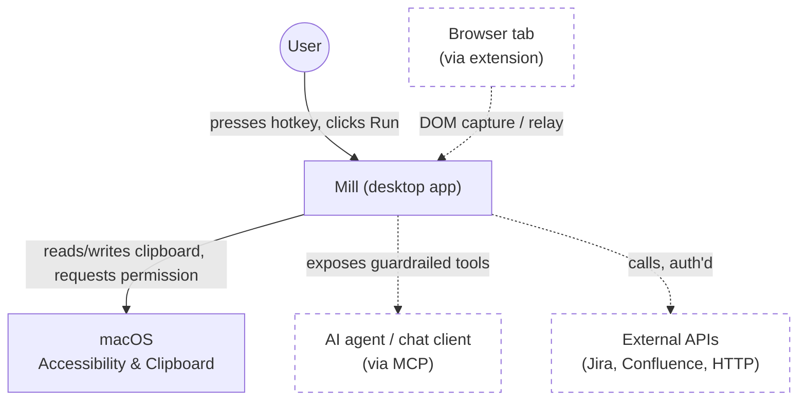
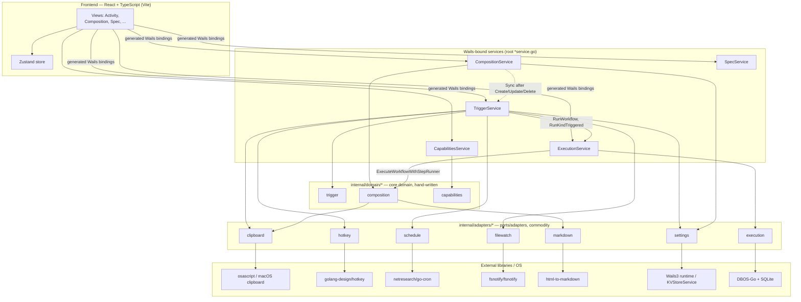

# Mill — Living Spec

This document is the single source of truth for what Mill is. It is rendered
inside the Mill app itself (Spec view) so the doc and the app can't silently
drift apart. Edit this file, not a copy of it.

Status key: `LOCKED` (decided), `OPEN` (actively undecided), `PARKED` (named,
not yet worth deciding).

Where a section describes something with an actual UI, that same status key
covers whether the *decision* to build it is settled — not whether the
pixels are the intended design. A second, orthogonal tag covers that:
`UX: PROTOTYPE` (built to prove a capability/architecture works end-to-end;
functional, not a considered design — expect it to be redesigned, not
treated as the target) vs. `UX: FINAL` (the deliberate, intentional design
for that surface). Absence of a `UX:` tag on a section with a built UI
means it hasn't been classified yet — treat that as a gap to fill, not as
an implicit `FINAL`.

---

## 0. Origin

- Proven on the work laptop already: M365 Copilot (chat agent) driving
  Hammerspoon (macOS Lua automation) as the executor. The point being proven
  was that a chat agent can be made to solve these use cases at all — proven,
  done. `LOCKED`
- That proof-of-concept is not the foundation to build on. Repeatedly hit
  three failure modes trying to grow it: **inner-platform effect** (Hammerspoon
  config drifting into an ad-hoc bespoke platform instead of staying a
  scripting tool), **point solutions** (one-off scripts per use case instead of
  a general capability), and **NIH** (reaching for custom Lua glue where a
  real library/standard already existed). Mill-as-a-Wails-app is the
  do-over specifically to avoid those three, which is why §3–§8 lean so hard
  on citing existing tools/patterns (n8n, React Flow, native messaging,
  Claude Code's project scoping) instead of inventing fresh ones. `LOCKED`

## 1. Positioning

- **What "AI-friendly" actually means — the thesis, not a slogan: what you
  see is what I see.** `LOCKED` Everything Mill composes already exists and
  is already possible by hand. The gap isn't capability, it's that an AI
  acting on a system it can't verify has to *guess* at the actual state
  (what's really on the clipboard, what a command will really do, what a
  setting is really set to) — and the distance between the guess and reality
  is exactly where hallucination and silent failure live. Mill's job is to
  give an AI the same verified, structured view of state a human has, not a
  text blob to infer from. Every recurring pain point this spec addresses is
  a specific instance of this: heredoc failures (shell syntax generated
  blind, no structured view of the real quoting context), the Confluence
  clipboard ambiguity (nothing told either party whether HTML was actually
  present until it was made checkable), MCP's typed tool calls over freehand
  bash (a structured result instead of text to parse and hope), the
  guardrail preview itself (make sure the human's view and the AI's
  about-to-happen action are the same view, before it happens), and the
  original multi-tab session-identity problem (the human's view and the
  AI's context silently diverging with no shared state to reconcile them).
  This is the actual mechanism behind "compose, don't reinvent" below — not
  a separate preference, the same one.
- Mill is not novel. It composes existing primitives — a workflow
  authoring layer with guardrails, not a new category. `LOCKED`
- Reference points: **1Password** (generic capability across every site/app,
  not site-specific), **n8n** (generic workflow/automation composition).
  `LOCKED`
- Product posture: agentic, like M365 Copilot or claude.ai — not turn-by-turn
  operator mode like Claude Code's manual-gear review. The guardrail has to be
  ambient, not a tax on every step. `LOCKED`
- Hard constraint: the guardrailed path must not be harder than the baseline
  of what a person can already do natively (copy/paste, running a command
  themselves by hand). If it is, nobody adopts it. `LOCKED`
- **Scope filter, learned from the screenshot-to-clipboard tangent**: before
  any capability goes into Mill, check whether the OS (or an existing
  launcher like Alfred/Raycast) already does it simply and well. If yes,
  Mill's job is at most to surface/point at it (a Runbook tip, not a
  reimplementation) — reimplementing a solved OS capability is the §0
  inner-platform trap aimed at macOS instead of at Hammerspoon. Mill earns
  its keep specifically where there's no native answer at all: guardrailed
  command execution, structure-preserving capture across inconsistent
  sources, cross-session identity, workflow composition — genuine gaps, not
  a "screenshot but ours" competitor to what already works. `LOCKED`

### 1.1 Hard constraints & delivery model

- No `cargo`/Rust compilation anywhere in Mill's own build or dependency
  pipeline. Reason: at the bank, Zscaler intercepts/breaks cargo's network
  calls to crates.io, and Artifactory has no Rust feed to route around it —
  so anything that requires `cargo build`/`cargo install` from source will
  not build there, in CI or locally. This rules out e.g. Tauri as an
  alternative app shell (its build step compiles Rust). `LOCKED`
  Narrower than it first sounds: a **pre-built** Rust binary installed via
  Homebrew (a compiled bottle, no local cargo invocation) is not the same
  problem — brew already works there (it's how pueue got installed). So a
  Rust-authored local dev tool installed as a pre-built binary (e.g. `mise`
  via `brew install mise`) isn't automatically disqualified by this rule;
  only compiling Rust from source is. `LOCKED`
  Same reading applies to npm packages that ship prebuilt Rust binaries:
  checked directly (ADR-0003) that Vite 8's default bundler (Rolldown,
  used transitively by `frontend/`'s `vite` dependency) and its companion
  `lightningcss` both distribute as platform-specific prebuilt native
  binaries via npm's `optionalDependencies` mechanism — `npm install`
  never invokes `cargo`/`rustc`. Same shape as the Homebrew-bottle case,
  different package manager. `LOCKED`
- No AI API calls from Mill itself, and no phone-home telemetry of any kind.
  Mill is the substrate that mediates/guards actions initiated by other
  systems (an agent CLI, a chat client) — it is not itself an LLM client, and
  it must run fully offline/on-prem with zero outbound calls it didn't
  explicitly initiate on the user's own behalf via a user-configured
  connector. `LOCKED`
- Single binary, no separate CLI/backend split. Wails3 already satisfies
  this (one Go binary embeds the compiled frontend) — this reinforces the
  existing scaffold choice, no change needed. `LOCKED`
- Install story: `git clone` + a documented local build, runnable on any work
  machine that can install the app. No hosted-service dependency for the
  core loop. `LOCKED`
- CI/CD wired from day one, not bolted on later. `LOCKED`
- Command/bash execution is mediated through Mill's own process (that's the
  guardrail hook point), but the mechanism underneath should be standard OS
  primitives (`os/exec`, a normal shell invocation) rather than a
  custom-built sandboxing/process-isolation layer — compose what exists,
  don't reinvent it. `OPEN` — confirm this reading is correct before it
  drives design.
- Architecture discipline: SOLID, DRY, DDD — proper domain/class separation
  once real domain logic exists. Not retrofitted onto the current two-file
  scaffold prematurely; applies as soon as actual capabilities land. `LOCKED`

### 1.2 Working method

- Research → Plan → Implement (the workflow Boris Cherny has described for
  Claude Code) is the standing method for every capability added to Mill:
  research what already exists before assuming it doesn't — a claimed
  "nothing exists for X" must be backed by an actual search, not an
  assumption (this is also the NIH guardrail from §0) — then plan/lock the
  approach, then implement. `LOCKED`
- DBOS and pueue were surfaced as possible durable-execution/process-queue
  candidates from earlier M365-context research, and got conflated with each
  other in that discussion — they're not the same kind of thing (DBOS is a
  durable-execution library you embed and typically pairs with Postgres;
  pueue is a standalone CLI/daemon for queueing shell commands). Both have
  now been independently evaluated — see §7 and
  [`docs/adr/0004-execution-process-tracking.md`](adr/0004-execution-process-tracking.md).
  `LOCKED` (evaluation) — ADR-0004 itself is `proposed`, not yet `accepted`.
- Concrete failure mode already hit once, worth locking as a hard filter for
  §7's eventual candidate list: pueue was `brew install`ed on the work
  machine for the M365 prototype, which (a) is written in Rust — disqualified
  by §1.1 on its own — and (b) is a separately-installed daemon outside the
  single binary, meaning anyone who `git clone`s Mill would also need to
  install and keep it in sync via a package manager Mill doesn't control.
  Generalized rule: **any process/job-queue mechanism must be embeddable
  directly in the Go binary** (a library, not a separately-installed
  daemon/CLI) — it cannot require Homebrew or any other external package
  manager at install time. This doesn't pick a replacement yet (that's
  §7's job), it just eliminates a whole class of candidate. `LOCKED`
- Access boundary: the actual work laptop this is being built for is behind
  Zscaler at the bank and is not something the assistant helping design Mill
  has any live access to — no inspecting the real clipboard, no observing
  M365/Loop/Copilot behavior directly, no running commands against that
  machine's real session. Design and research proceed from the user's
  descriptions, not empirical testing against the real target environment,
  unless the user explicitly runs something themselves and reports back.
  `LOCKED`

### 1.3 Repo layout & CI/CD

Full rationale in [`docs/adr/0001-go-module-path-and-repo-layout.md`](adr/0001-go-module-path-and-repo-layout.md)
and [`docs/adr/0002-cicd-pipeline-phased-rollout.md`](adr/0002-cicd-pipeline-phased-rollout.md).

- Go module renamed from the scaffold default `changeme` to
  `github.com/alicoding/mill` (no git remote configured yet at the time of
  this decision; path chosen to match the intended future GitHub owner
  rather than deferring and repo-wide-renaming later). `LOCKED`
- Repo layout: flat root `*.go` files stay at root (`main.go` + thin
  Wails-binding `*service.go` files) — matches wailsapp/wails v3's own CLI
  repo convention, not golang-standards/project-layout (not an official Go
  standard per Russ Cox; aimed at multi-binary services Mill isn't).
  `internal/domain/runbook` (hand-written: the Capture→Process→Apply
  orchestration for Runbook actions) and `internal/adapters/{clipboard,
  markdown,hotkey}` (thin wrappers behind small interfaces around commodity
  libs: clipboard I/O, `html-to-markdown`, `golang.design/x/hotkey`) shipped
  per ADR-0001 Phase 2. Future domain packages (guardrail eval, capability
  composition, session identity) land the same way as they're built — no
  `cmd/`, `pkg/`, `api/`. `LOCKED`
- No generic `Capability`/`Action`/`Node` interface — §3 is still `OPEN` and
  only 2 concrete Runbook actions exist; the domain/adapter boundary above
  is stable regardless of what §3 decides, the capability schema itself is
  §3's call alone. `OPEN` (defer to §3)
- npm workspaces (`frontend/` + a future `browser-extension/`, §5) — not
  adopted yet, revisit when a real second JS package is scaffolded. `go.work`
  not applicable — single Go module is permanent per §1.1. `PARKED`
- **Frontend state management: Zustand adopted.** The PARKED trigger below
  fired — `ActivityView` (a second stateful view) needed the same
  `actions`/`activity` state `App.tsx` fetched, threaded down as props.
  `frontend/src/store.ts` holds `actions`/`activity` in one small store (no
  multi-slice split — an 8-file frontend doesn't need it yet); `App.tsx`
  keeps its two data-fetching effects but writes into the store instead of
  local `useState`, and `RunbookView`/`ActivityView` read the store
  directly instead of receiving props. Hotkey-recording UI state
  (`bindings`, `bindingErrors`, `recordingId` in `RunbookView.tsx`)
  deliberately stayed local `useState` — genuinely single-view state, not
  a candidate for the shared store. `LOCKED`
- **Frontend CSS: migrated to CSS Modules.** Primer React v38 (Mill is on
  38.35.0) dropped its `styled-components`/`sx`/`Box` dependency entirely
  and its own release notes say to "prefer to use CSS modules over
  styled-components and css variables over javascript theming"
  (github.com/primer/react discussion #7086) — not an outside opinion,
  the framework's own current direction, which Mill's single hand-rolled
  `public/style.css` predated. Genuinely global chrome (design tokens,
  `html`/`body` reset, the `.app-shell` flex root, the shared `.view-pane`
  scroll-clip class) moved to `frontend/src/index.css`, imported from
  `main.tsx` so it goes through Vite's own pipeline instead of a raw
  `<link>` tag that bypassed it. Per-view styling split into co-located
  `*.module.css` files (`RunbookView.module.css` shared by `RunbookView`
  and `ActivityView`, which already reused the same card/list visual
  language). `frontend/public/style.css` deleted. `LOCKED`
- CI: GitHub Actions, all four ADR-0002 phases shipped in
  `.github/workflows/ci.yml` + `.github/workflows/release.yml`.
  `golangci-lint` v2, ESLint flat config, Vitest, `go test -race -cover`,
  `go build`/`go vet` (macOS desktop + Linux server-mode), Playwright E2E,
  `govulncheck` (advisory only, still experimental upstream), all
  merge-blocking except govulncheck. Precedent: wailsapp/wails's own v3 CI
  (native-OS matrix, no GoReleaser — wailsapp/wails#747 closed wont-fix).
  `LOCKED`
- **Linux server-mode builds require `CGO_ENABLED=0` explicitly** — not
  optional, confirmed by actually building natively in a linux/amd64
  container, not assumed. Without it, Wails3's own
  `internal/operatingsystem`/`internal/assetserver/webview` packages pull
  in GTK4/webkitgtk-6.0 regardless of the `server` build tag. Matches
  `build/docker/Dockerfile.server`'s own default — that answer was already
  in the repo, just not applied to CI until this was caught. Applies to
  any future Linux build/test/lint step touching the root package. `LOCKED`
- `internal/adapters/hotkey` is split by build tag:
  `hotkey_desktop.go` (`!server`, the real `golang.design/x/hotkey`-backed
  implementation) and `hotkey_server.go` (`server`, a zero-dependency stub
  returning a clear error) — not just a build-fix, architecturally correct
  either way, since server mode has no native run loop to ever deliver a
  keypress through. `LOCKED`
- Lefthook (Go, MIT, Evil Martians) mirrors the same checks locally as a
  pre-commit hook (`lefthook.yml`) — go vet/build/test, golangci-lint,
  eslint, vitest, tsc — verified end-to-end (a deliberate lint violation
  was caught and blocked, a clean commit passed). Playwright E2E is
  deliberately NOT in the local hook (real server build + browser launch
  is meaningfully slower than everything else there; suited to CI, not
  every local commit). `task setup:hooks` installs it once per clone.
  `LOCKED`
- **Max 500 lines per hand-written `.go`/`.ts`/`.tsx` source file** —
  `scripts/check-loc.sh`, run by both Lefthook and CI's `file-loc-limit`
  job (one script, not two copies that can drift, same "mirrors CI"
  principle as Lefthook's own header comment). Generated Wails bindings
  and the vendored gomobile scaffold (`build/ios/`, `build/android/`) are
  exempt. Introduced once two files crossed it during the Configure-
  surface work (`internal/domain/composition/composition.go` at 944
  lines, `frontend/src/CompositionCanvas.tsx` at 623) — both split along
  real package/component seams (composition.go into `types.go`/
  `nodetypes.go`/`graph.go`/`integration.go`/`execute.go`/
  `capabilitymap.go`; CompositionCanvas.tsx into `CanvasNodeView.tsx`/
  `draftWorkflowSchema.ts`/`canvasConversion.ts`/`NodePalette.tsx`), zero
  behavior change, verified via the full check suite plus a real
  server-mode Playwright smoke pass before landing. `LOCKED`
  **Checked directly, not assumed, whether this hand-rolled script
  duplicates commodity tooling** (prompted by a direct question —
  CLAUDE.md's own "default to adopting, hand-roll only when no adopted
  option satisfies the constraint" rule applies to this too, not just to
  whole libraries): ESLint ships a real built-in `max-lines` rule
  (confirmed against its own docs) that could cover the `.ts`/`.tsx` half
  today with zero new dependency — Mill doesn't currently enable it.
  Go's side is different: confirmed directly against the actually-
  installed `golangci-lint v2.12.2`'s own linter list (`golangci-lint
  linters`) that no file-length linter ships in it — `funlen` limits a
  *function's* length, `lll` limits *line width*, neither is "lines per
  file." A third-party `filen` linter exists upstream
  (github.com/DanilXO/filen, golangci-lint PR #5081) but isn't merged
  into a released version yet. Splitting into "ESLint's `max-lines` for
  TS + something else for Go" was considered and rejected: it would
  reintroduce exactly the "two copies that can drift" problem this
  bullet's own one-script design already exists to avoid (a limit number,
  an exemption list, defined twice, in two config languages, checked by
  two different tools) — the actual constraint this script satisfies
  isn't "no line-count tool exists anywhere," it's "one identical rule
  enforced the same way across both languages Mill writes," which no
  single commodity tool covers. `LOCKED` (script stays; documented
  reasoning, not an unchecked assumption).
- **`.claude/rules/*.md` frontmatter is validated the same way — a
  second small script, same "one script, mirrored by Lefthook and CI"
  shape.** Prompted directly, after a real instance: a `globs:` vs
  `paths:` typo in `.claude/rules/frontend.md` (§9.1) shipped and sat
  silently broken — the rule's path-scoping just never worked, with
  nothing anywhere flagging it. Researched before hand-rolling a fix,
  not assumed: `cclint` (github.com/carlrannaberg/cclint, MIT, active)
  is a real, existing linter for Claude Code project files, checked
  directly against its own docs — but it validates agent/command
  frontmatter, `settings.json`, and `CLAUDE.md`, not `.claude/rules/*.md`
  specifically, and Mill has no agents or commands yet for it to apply
  to regardless (adopting it now would be tooling for a problem that
  doesn't exist yet, the exact thing this repo's own anti-proliferation
  instinct exists to catch). `scripts/check-rules-frontmatter.sh` is a
  small, zero-new-dependency bash script (no YAML parser needed — the
  real schema is one optional key, `paths`, a list of strings) that
  flags any other top-level frontmatter key, run by both Lefthook
  (`rules-frontmatter` job) and a new CI job of the same name. Verified
  it actually catches the bug it was written for, not just that it
  passes on already-correct files: reintroduced the original `globs:`
  typo temporarily, confirmed the script fails with a clear message
  naming the bad key, then restored the correct file and confirmed a
  clean pass. `LOCKED`
- **`frontend/src/` reorganized into enforced bounded-context folders,
  prompted by a direct ask: the Go side already has real bounded
  contexts (`internal/domain/*`/`internal/adapters/*`) and the
  43-file-flat frontend never got the equivalent.** Full research,
  decision, and folder map are in
  [`docs/adr/0012-frontend-bounded-context-folders.md`](adr/0012-frontend-bounded-context-folders.md).
  `eslint-plugin-boundaries` was tried first (ESLint-native, zero new
  pipeline) and abandoned after real, extensive debugging — its pattern
  matching never fired against this project's own files even when
  reproducing its own upstream test fixtures exactly, confirmed by
  instrumenting the plugin's compiled source directly, not assumed
  broken. **`dependency-cruiser`** (MIT, standalone CLI, TS-aware
  module-graph resolver) replaced it: worked correctly on the first
  real run, and correctly caught a deliberately-reintroduced violation
  on verification. Five folders — `app/` (shell only), `views/`
  (top-level pages), `composition/` (§3's canvas domain), `configure/`
  (§3.5's Configure domain), `shared/` (genuinely cross-cutting, 2+
  consumers) — with import direction enforced one-way
  (`shared ← configure ← composition ← views ← app`) via
  `frontend/.dependency-cruiser.cjs`, run as `npm run boundaries`,
  wired into both Lefthook and CI's `frontend` job alongside `npm run
  lint`. The tool caught a real design mistake mid-implementation, not
  just a hypothetical one: `store.ts`/`Tabs.tsx` were first placed in
  `app/` on the assumption that "global state" and "the app shell" were
  the same context — the first clean-tree `depcruise` run then flagged
  9 files across three other folders importing them, the actual
  definition of `shared/`; moved accordingly. Documented as a standing
  rule in `.claude/rules/frontend.md` (new files land in their
  bounded-context folder from creation, not flat-then-reorganized).
  `LOCKED`
- **Testing discipline formalized as a rule, prompted by a direct ask to
  stop "paying the tax" of re-discovering the same bugs manually.**
  Four real bugs in one session (a canvas node-drop collision, a
  duplicate-trigger-drop rejection, a disabled palette item's hover
  background, the node-type-swap feature) were each verified live —
  hovering an element, dragging a node, reading a computed style via a
  throwaway Playwright script — then the script was discarded once it
  confirmed the fix, leaving zero permanent coverage for any of the
  four. `.claude/rules/testing.md` (unscoped — applies regardless of
  language) encodes the actual discipline: a bug confirmed via manual
  reproduction isn't done until that reproduction becomes a committed
  test, since the reproduction already exists at the moment of
  confirmation and re-deriving it later costs real time. Applied
  retroactively to all four bugs this pass: `canvasLayout.test.ts`
  (Vitest, `findFreeDropPosition` — previously zero test coverage on a
  pure function that had a real, demonstrated bug) and four new
  `composition.spec.ts` Playwright cases covering the other three plus
  the collision fix end-to-end. Surfaced a small real coupling issue
  while adding the unit test: `canvasLayout.ts` imported
  `CANVAS_NODE_WIDTH`/`CANVAS_NODE_HEIGHT` from `CanvasNodeView.tsx` (a
  React component file with a CSS import chain Vitest's transform
  pipeline couldn't handle), breaking the new test outright — split
  into a zero-dependency `canvasConstants.ts` both files import from
  instead, the same "split along the seam a limit just surfaced"
  discipline the 500-line rule above already established, just found
  via test-writing instead of a line count. `LOCKED`
- `HotkeyService` cannot be exercised by headless/server-mode CI — no live
  macOS Cocoa run loop in that mode. Verification stays an explicit manual
  desktop-mode check (`.claude/skills/run-mill`), never a silent CI
  skip/fake-pass. Same reasoning extends to `internal/adapters/clipboard`'s
  real round-trip test (skipped specifically in CI, not just on non-macOS —
  GitHub's `macos-latest` runners are headless, no GUI/pasteboard session
  for `osascript` either) and to the Playwright E2E suite (asserts only
  what's environment-independent — page load, both actions listed, Spec
  content, the deterministic "no HTML on clipboard" path — never the
  clipboard-dependent success content). `LOCKED`
- Release pipeline (ADR-0002 Phase 4) ships **macOS only**, deliberately:
  Linux desktop needs GTK4/webkitgtk-6.0 system packages never installed
  or tested here; Windows needs a toolchain with zero local verification
  possible from this macOS-only dev environment. Shipping CI for platforms
  nobody's actually run it against is the exact mistake the CGO_ENABLED
  finding above already caught once — not repeated for a release artifact
  people would download. Windows/Linux desktop release builds `PARKED`,
  revisit when there's a way to actually verify them. Server-mode Docker
  image also not part of v1 release scope — no confirmed hosted-deployment
  use case. `LOCKED` (macOS-only scope) / `PARKED` (the rest)

### 1.4 Architecture at a glance

Two standard architecture views, rendered as real diagrams in the Spec
tab itself (`frontend/src/SpecView.tsx`, via the `mermaid` package —
MIT, pure JS/TS dependency tree, no native/Rust anywhere, verified
directly against its own `package.json` before adopting) rather than
left as prose alone — a layered system with this many pieces built is
harder to hold in your head as text than as a picture. Mermaid's own
`C4Context`/`C4Component` diagram types would match this pair's naming
even more closely, but Mermaid's own docs flag C4 diagrams as
experimental (syntax/properties still changing); using the standard,
stable `graph`/subgraph syntax instead gets the same two conceptual
views without that risk. Dashed nodes are planned, not built — same
distinction as everywhere else in this doc, never implied as done.
Real drag-to-pan/scroll-to-zoom with visible +/−/reset controls comes
from `svg-pan-zoom` (BSD-2-Clause, zero runtime deps) — Mermaid itself
has no pan/zoom capability at all, checked directly against its own
config schema before adopting a second library. `LOCKED`

The one non-obvious wiring detail worth recording here: `mermaid.run()`
matches elements by the same literal `mermaid` class the marked-renderer
override sets (`MERMAID_CLASS` constant in `SpecView.tsx`, not two
independently hardcoded strings), and the SVG needs an explicit
`viewBox` (synthesized from its own rendered width/height, since Mermaid
never sets one) plus `width/height: 100%` CSS on the SVG itself —
without the second part, `svg-pan-zoom` sizes its coordinate system off
the SVG's intrinsic (pre-scaled) dimensions rather than the actual
container, which pushes its control icons past the visible edge.

**System Context** — Mill, its user, and the systems it touches:

**Logical / Component view** — Mill's own layered architecture:

## 2. Core primitive: Capture → Process → Apply

- **Capture**: pull content from a source preserving structure (e.g. DOM copy
  keeps HTML structure, not just flattened text).
- **Process**: a workflow transforms the captured payload into
  whatever the target needs (markdown, plain text, a structured object).
- **Apply**: deliver the processed payload to a target location — e.g. paste
  at the cursor.
- This loop is meant to be generic: the same shape applies whether the
  "capture" is a DOM selection or an LLM tool-call request, and the "apply" is
  a paste or an actual command execution. `LOCKED` (as a shape) — the concrete
  node/connector model that implements it is `OPEN`.

### 2.1 First concrete milestone — the M365 Copilot chat bridge

The use case that should drive the first real build, not further
architecture discussion. M365 Copilot chat proposes a command in its
transcript; today the user manually reads it, runs it themselves, copies the
output, pastes it back into the chat box, and hits enter. Wanted workflow:

1. User reads the proposed command in the M365 Copilot chat (no live access
   for Mill's design process into this — see §1.2's access-boundary note;
   this all comes from the user's own machine at the time they use Mill).
2. User presses a configurable hotkey. **The hotkey press is the guardrail
   gesture** — a deliberate, human-initiated trigger, not a separate
   blocking approval popup. See the open question in §8 about whether that's
   sufficient or whether a lightweight preview still belongs in between.
3. Mill captures the command (from clipboard, or via the browser bridge
   reading the chat DOM directly — §5), executes it locally through Mill's
   own guardrailed process (§6/§7 govern cwd/shell/logging), and gets the
   result payload back.
4. Mill applies the payload back into the chat's input box (auto-paste).
5. Enter is either left to the user, or sent automatically by Mill — user
   explicitly wants the option to have Mill do it, closing the loop
   end-to-end with just the one hotkey press.

This is Capture → Process → Apply instantiated concretely: Capture = read
the proposed command from the chat, Process = execute it, Apply = paste the
result back and optionally submit. It requires §5 (browser bridge, to read
the chat DOM and write back into it), a global-hotkey mechanism (not yet
researched — needs a pure-Go, non-cargo library, per §1.1), and §6/§7 for
the execution itself. `OPEN` on the concrete implementation, `LOCKED` as the
first thing to build once the browser bridge and hotkey pieces are
researched.

### 2.2 Actually-buildable-now milestone — the Runbook page (retired, see Update below)

`UX: PROTOTYPE`. The Runbook page as built (list + Run button + hotkey
assignment, current Primer React pass) proves the capability end-to-end —
it is not yet a considered design. Treat the current layout, empty states,
and hotkey-affordance UI as placeholder until a real UI/UX pass happens;
don't infer product intent from its current appearance.

§2.1 depends on two unresearched pieces (browser bridge, hotkey) and an
environment (M365 in-browser) the assistant helping build Mill has no live
access to (§1.2). This milestone de-risks the two pieces that don't require
that environment, on something testable directly in this dev session:

- A **Runbook page** — a list of available actions the user can browse and
  run directly with a click (no hotkey required), similar to how many apps
  offer example/demo actions or default workflows out of the box. Answers
  "what should I see as a user" concretely instead of describing it.
- Each action gets a **Run** button; **assign a keyboard shortcut** per
  action (Raycast/Alfred-style: click "Set shortcut," press the combo, it's
  bound) is built. `HotkeyService` (`hotkeyservice.go`) wraps
  `golang-design/hotkey`; on trigger it runs the action, completing the
  original ask — select rich text, copy, hit the hotkey, paste normally
  anywhere. Each action owns writing its own result to the clipboard as
  part of its own Apply step (`internal/domain/runbook`), not a generic
  post-hoc copy by the hotkey fire path — see the real bug this caught
  below. Integration risk checked before building, not assumed: macOS requires hotkey registration
  to coexist with the app's own native run loop, confirmed working via the
  library's own Fyne example (registers from a background goroutine while
  `ShowAndRun` owns the main thread) — same shape used here alongside
  Wails' `app.Run()`.
- **Real bug caught live: a generic "copy every action's result to the
  clipboard" fire-path step clobbered an action's own clipboard write.**
  `load-sample-html` writes real HTML to the clipboard itself, then
  returns a UI-facing status string (the prefix text + the HTML, for
  display). `HotkeyService`'s fire path used to *also* unconditionally
  `clipboard.WriteText(result)` after every action — for
  `clipboard-html-to-markdown` that's correct (the markdown result should
  land on the clipboard), but for `load-sample-html` it immediately
  overwrote the real HTML with that plain-text status string. Repro that
  looked at first like a debugging-infra problem (stale build, a
  clipboard race with an unrelated `pbcopy` call) turned out to be this —
  confirmed by reading the two files side by side, not by guessing twice.
  Fixed by moving the clipboard write into each action itself
  (`clipboard-html-to-markdown` now calls `writeClipboardText` on success,
  matching `load-sample-html`'s existing self-contained pattern) and
  removing the fire path's generic write entirely. The no-HTML
  soft-failure path deliberately still writes nothing — there's no
  successful output to Apply, and overwriting the user's actual clipboard
  content with an explainer would be its own small version of the same
  bug. `LOCKED`
- Design principle for that increment, from a real annoyance (macOS's
  default screenshot-to-clipboard shortcut is the awkward one, save-to-file
  got the easy keystroke): the easiest-to-press binding should be assignable
  to whatever the user does *most*, not whatever a default happened to claim
  first. Don't just let a shortcut be set — make it easy to see which
  actions are "easy reach" vs. "deliberately awkward" and rebalance them.
- First seeded action: **clipboard → Markdown**, directly testing the
  original Loop/structure-preservation pain point without needing M365 at
  all — works with anything that puts real HTML on the clipboard.
- Libraries verified directly (repo, license, `go.mod`, recent activity —
  not taken on assumption): [`golang-design/hotkey`](https://github.com/golang-design/hotkey)
  (MIT, cross-platform; macOS backend is cgo via Objective-C
  (`hotkey_darwin.m`) since there's no pure-Go way to hook OS-level global
  hotkeys — a C compiler dependency via Xcode CLI tools, already present,
  not Rust/cargo, so §1.1 is unaffected) and
  [`JohannesKaufmann/html-to-markdown`](https://github.com/JohannesKaufmann/html-to-markdown)
  v2 (MIT, pure Go, 3.7k★, actively maintained). `LOCKED` as the immediate
  next build step.
- **Permissions UX pattern for when this needs Accessibility access**:
  macOS supports deep-linking straight into a specific System Settings pane
  via the `x-apple.systempreferences:` URL scheme — this is the exact
  mechanism Hammerspoon/Raycast/1Password all use for their own "grant
  Accessibility permission" prompts. `RunbookView.tsx`'s Accessibility
  error now shows an "Open Accessibility Settings" button (`Browser.OpenURL`
  from `@wailsio/runtime`, not `data-wml-openURL` — the button only exists
  once a bindingError fires, well after WML's one-time mount-time DOM scan,
  so the imperative call is used instead of the declarative tag to avoid a
  wire-up timing gap) pointing at
  `x-apple.systempreferences:com.apple.preference.security?Privacy_Accessibility`
  — **verified directly on this machine (macOS 26.5.2/25F84), not assumed**:
  ran it via `open`, confirmed by the user it landed on Privacy & Security →
  Accessibility, not just System Settings' default screen. Caveat still
  stands: this is not an official documented Apple API — it's
  community-reverse-engineered, and identifiers have broken before across
  macOS System Settings rewrites (the pre-Ventura Accessibility deep-link
  stopped working when Ventura rebuilt System Settings), so re-verify
  against the target macOS version if this stops landing correctly after a
  future update. `LOCKED` (identifier verified + wired up for macOS 26;
  the show-current-state-and-deep-link pattern itself).
- **Dev builds re-trigger the Accessibility grant on every rebuild** —
  root-caused a real "a hotkey registered and fired cleanly, then after
  the next `task dev` restart the identical combo failed to register at
  all" confusion. `build/darwin/Taskfile.yml`'s dev-build task runs
  `codesign --force --deep --sign -` (ad-hoc signing) on every single
  build, which changes `bin/mill.dev.app`'s code identity each time —
  macOS's TCC ties an Accessibility grant to that identity, so every dev
  rebuild looks like a brand-new, ungranted app to TCC. Not a bug in
  Mill's own code; a known category of friction with ad-hoc-signed local
  dev builds. No fix implemented (a stable local signing identity would
  need its own investigation) — noted here so it isn't re-debugged from
  scratch next time it's hit. `LOCKED` (the root cause) / `OPEN` (whether
  it's worth a fix, e.g. a consistent local dev signing identity).
- **`HotkeyActivity` carries the actual result, not just a byte count** —
  the Activity page's rows expand (click, chevron affordance) to show the
  full text a hotkey fire copied to the clipboard, not just "copied to
  clipboard (N bytes)". Added once the fire-path logging above actually
  proved a hotkey works end-to-end and the natural next question became
  "what did it actually produce" — the same instinct as the Run button's
  own inline result block on Runbook, just for the headless hotkey path.
  Empty `Result` (failure case) means no expand affordance at all, not an
  empty expanded block. `LOCKED`
- **Activity broadened from hotkey-only to every run, with Source/
  Outcome filters** — originally only the headless hotkey fire path
  pushed into this feed; clicking Run directly on Runbook or Composition
  produced nothing, silently inconsistent with a page whose whole job is
  "did anything run." `frontend/src/store.ts`'s `ActivityEntry` is now a
  frontend-owned shape (not pinned to the Go-emitted `HotkeyActivity`
  event) carrying a `source: 'hotkey' | 'runbook' | 'composition'` and a
  `label` resolved and stored at push time, not looked up later against
  `actions`/workflows (which can drift, or have the entry deleted).
  Only the hotkey source still pushes via a Go→JS event, since it's the
  only one of the three that fires headlessly; Runbook's and
  Composition's own Run handlers push directly from their already-
  resolved promise, no new Go plumbing needed. Two `Select` filters
  (Source, Outcome) narrow the list client-side — the two real
  dimensions the data has today, not date-range (the list is an
  in-memory, session-only, 50-entry ring buffer, so everything in it is
  "this session" — a date picker over that would be cosmetic, deliberate
  scope cut, not a silent gap). **Deliberately still not persisted**:
  distinct from workflow *definitions* persisting (§3's Composition
  entry) — a run-history log is much closer to §7's still-open
  execution/session-tracking question (durable process history) than an
  authored shape is; this doesn't touch or presuppose that. This is the
  concrete first step toward the "analytics" half §3.2 already flagged
  Activity as the closest existing surface to, when the reference
  platform's Live Events view (filter by input/event type/date range)
  was reviewed. `LOCKED`
- **Small `DEV` ribbon (top-right, App.tsx) answers "am I looking at a dev
  build, and is it current."** Gated on `import.meta.env.DEV` (true only
  under a real `vite serve` process — verified directly that this is
  false for `vite build` regardless of `--mode`, see the repo-layout
  section above). Shows a timestamp captured once per mount — correct for
  a Go-triggered relaunch (the common case that actually needs checking),
  not for a frontend-only HMR edit that never remounts. A fancier version
  tried tracking true "last build" via `import.meta.hot.on('vite:after
  Update', ...)` and was reverted: subscribing to that event from
  `App.tsx`, the very file that keeps getting hot-edited, hit React Fast
  Refresh not reliably cleaning up the old listener across repeated
  hot-swaps of the same module — stray listeners kept firing. Not worth
  chasing further for a dev-convenience ribbon; mount-time-only is simpler
  and can't have that bug class. `LOCKED` (mount-time approach) / noted so
  the HMR-self-subscription approach isn't retried blind.
- **Progressive enhancement by permission, not a hard gate.** `LOCKED`
  Zero-permission floor: browsing the Runbook and running an action by
  clicking it always works, no OS permission required. Accessibility
  permission (needed for global hotkeys and simulated auto-paste/auto-
  submit) is additive convenience on top — if it's not granted, those two
  features go away, but the app is never blocked, same principle as §1's
  "never harder than the baseline." Mill's messaging must distinguish two
  different ungranted-permission situations, not treat them as one: (a) the
  user can grant it themselves (show the deep-link), vs (b) the machine is
  managed/MDM'd and the user lacks the admin rights to change Privacy
  settings at all, in which case the message should say what to ask IT for,
  not imply a self-serve fix that isn't actually available to them. Detecting
  which situation applies (e.g. checking admin-group membership) is a
  refinement for later, not required to ship the basic distinction in the
  UI copy.
- **Hotkey fire path is logged end-to-end, not a black box.** `LOCKED`
  Added after a real debugging session where a hotkey showed as
  successfully bound (label appeared, no error) but pressing it appeared
  to do nothing, with no way to tell whether the OS never delivered the
  keypress (another app already claimed the combo) or delivery succeeded
  and something after it (the action, or the clipboard write) failed
  silently. `HotkeyService` now logs each stage — registered, fired,
  action succeeded/failed, clipboard write succeeded/failed — via
  Wails3's own `application.DefaultLogger` (colorized to stderr in dev
  mode, discarded in production builds), reused rather than standing up a
  second logging setup. This is a stopgap for debuggability, not §7's
  actual inspectable/persistent process-tracking mechanism — that's
  ADR-0004's job once `internal/domain/execution` exists.
- **Hotkey assignments persist across restarts, via Wails3's own built-in
  `KVStoreService`** (`pkg/services/kvstore`) — researched before building
  (confirmed directly by reading its source, not assumed from a search
  summary): a JSON-file-backed key-value store with optional autosave.
  `internal/adapters/settings` wraps it behind Mill's own small `Store`
  interface, per CLAUDE.md's ports/adapters rule for commodity
  dependencies (persistence is a generic storage concern, same bucket as
  `internal/adapters/clipboard`/`markdown`, not core domain) — callers
  depend on Mill's interface, not the concrete Wails type. `main.go`
  builds the store at `application.Path(application.PathConfigHome)` +
  `mill/settings.json` — resolves to `~/Library/Application Support/mill/`
  on macOS (verified against the `adrg/xdg` source Wails uses internally),
  the same convention Alfred/Raycast/1Password use for their own
  persisted settings. `HotkeyService.Assign`/`Unassign` write the raw
  `(mods, key)` pairs (not the display label, which can't be parsed back
  into modifier/key names) as one JSON blob on every change; a
  `RestoreBindings` method re-registers everything on the next launch.
  **Deliberately not wired through Wails' Service lifecycle
  (`ServiceStartup`/`ServiceShutdown`)**: that would auto-expose the raw
  KVStore's `Get`/`Set`/`Delete` as JS-callable bindings, letting the
  frontend bypass `HotkeyService`'s own validation entirely — `main.go`
  calls `settings.New` (which loads any existing file itself) and
  `RestoreBindings` directly instead, keeping persistence a Go-only,
  encapsulated concern. Timing matters here and was checked, not guessed:
  global hotkey registration needs the native run loop already spinning
  (see the Fyne-example note above), which is *not* true yet during
  `ServiceStartup` — `RestoreBindings` is instead called from
  `app.Event.OnApplicationEvent(events.Common.ApplicationStarted, ...)`,
  the same hook pattern used in Wails3's own official examples
  (`examples/events`, `examples/window`). **Verified end-to-end on this
  machine, not just unit-tested**: assigned a real hotkey via the live
  desktop app (confirmed `settings.json` on disk held the exact
  `mods`/`key` pair), killed and relaunched the same built binary without
  rebuilding (avoids the ad-hoc-codesign/TCC re-grant issue noted above),
  and confirmed the binding re-registered automatically — both in the
  slog output (`hotkey registered action=... binding=...`) and in the
  live UI — with zero user interaction. `internal/adapters/settings` also
  has its own real-disk round-trip test (`t.TempDir()`, two separate
  store instances against the same file); `HotkeyService`'s JSON
  marshal/restore logic is unit-tested against a fake `Store`, consistent
  with the rest of `HotkeyService` being otherwise real-OS-hotkey-only and
  not CI-testable (§1.3). `LOCKED`
- **Capability status index, backed by real Go data, not parsed docs.**
  First design considered parsing this very doc's `LOCKED`/`OPEN`/`PARKED`
  tags out of its markdown (via `remark`/AST-walking) to drive an in-app
  status index — correctly rejected: "SPEC.md was just a quick last night
  thing," inferring structure from prose formatting that was never meant
  as a schema is exactly the kind of fragile-clever thing that breaks
  silently. The actual fix: Mill is a native app with a real backend, so
  capability status is real application data, stored and projected the
  same way `RunbookService.List()` already exposes Runbook actions —
  typed Go structs over the existing Wails binding mechanism, zero new
  frontend dependencies. `internal/domain/capabilities` (`List()`,
  mirroring `internal/domain/runbook`'s shape) is the one authoritative
  place capability status lives now; this doc's own tags stay
  human-readable commentary, not something anything parses — a known,
  accepted seam (the two could drift) rather than a forced
  consistency-checker in this pass; `spec-sync-checker` (§9.2) is the
  natural place to close that gap later. `CapabilitiesService` (thin
  Wails binding, no logic of its own) exposes `List()` and a dev-only
  `RepoPath()` (`os.Getwd()`, reliable specifically because `task dev`
  launches with the repo root as cwd — confirmed this session). The Spec
  tab's `CapabilityIndex` renders real rows from that data: a built
  capability's row jumps straight to its page (`Runbook page` → Runbook
  tab, `Activity / event log` → Activity tab — same §2.2 milestone, two
  distinct entry points); a not-built one opens a generic `PlaceholderView`
  (same Primer primitives as RunbookView's empty states — no dedicated
  empty-state component in this Primer version) showing its status and a
  way back; a capability with an `EditorPath` (no UI at all yet, e.g.
  process tracking → `docs/adr/0004-execution-process-tracking.md`) gets
  an additional dev-mode-only action opening `vscode://file/<repoPath>/
  <editorPath>` via `Browser.OpenURL` — the same mechanism already used
  for the Accessibility-settings deep link. `EditorPath` correctness is a
  real test (`TestList_EditorPathsExist`), not just a shape check — it
  must resolve to a file that exists today, never an aspirational one.
  §5 (browser bridge) deliberately excluded from the registry: a separate
  extension deliverable, not a Mill window page. Verified end-to-end on
  the real desktop app (accessibility-driven UI automation, not assumed):
  clicked "Go to page" for Runbook page → landed on the real Runbook tab;
  clicked "View status" on a placeholder → correct label/status/back-link
  rendered; clicked "Open in editor" on the process-tracking entry → VS
  Code opened the exact ADR file. `LOCKED`
- **Every capability gets a nav entry, built or not — first as a top
  `UnderlineNav`, then migrated to a `PageLayout`/`NavList` sidebar.**
  The first pass made the top `UnderlineNav` data-driven from
  `CapabilitiesService.List()`; with all 7 capabilities plus Spec that
  immediately overflowed into Primer's own "More" dropdown, which
  re-hid most of the app behind a click — directly working against the
  "see the cohesive picture" goal this index exists for. Migrated to a
  persistent sidebar instead, since a top bar doesn't scale as more
  capabilities land and a sidebar does.
  **`PageLayout.Sidebar`, not `PageLayout.Pane`** — checked directly
  against the compiled CSS before choosing, not assumed: `.Pane` is
  content-adjacent and page-scroll-oriented, responsively **stacking**
  above/below content below 768px (`overflow:auto` is even gated to
  `@media (min-width:768px)` in its own CSS) — Mill's `MinWidth: 640`
  sits inside that stacking range, wrong fit for a persistent side
  rail. `.Sidebar` stays inline at any width (`responsiveVariant:
  'default'`) and has `height:100%`/`overflow:auto` unconditionally.
  **Getting `PageLayout.Content` to actually clip (not just grow to fit
  content, page-style) took real debugging**, via the same
  200-paragraph dummy-content stress test used for the earlier
  `.app-shell` fix, confirmed at each step against live computed
  styles rather than assumed: PageLayout's own internal Sidebar+Content
  row wrapper (an unnamed, hash-classed div with no `data-component`
  hook) defaults to `min-height:auto`; fixing that wasn't enough either
  since it sits in a `flex-wrap:wrap` container where a wrapped line's
  cross-size isn't hard-clipped by `min-height` alone; and Content
  itself sits in a `flex-direction:row` context where `flex-grow` sizes
  width, not height. `App.module.css` targets the internal wrapper
  structurally (`div:has(> main.view-pane)`, not Primer's hashed class
  name — the same "don't chase vendor-owned markup" reasoning as the
  earlier `ThemeProvider`/`BaseStyles` fix) with explicit `height:100%;
  overflow:hidden`, and `.view-pane` itself gained an explicit
  `height:100%`. **Net finding: `PageLayout` is built for page-scroll
  websites, not a fixed-viewport app shell** — worth remembering before
  reaching for another `PageLayout` region expecting it to "just clip."
  `Capability.NavLabel` (falls back to `Label` when empty) keeps the
  two built entries terse in the sidebar ("Activity" vs. the fuller
  "Activity / event log" in the Spec-tab index) without a second
  hand-maintained label; `store.ts`'s `viewFor`/`viewsEqual`/
  `statusVariant` helpers are shared by the sidebar and
  `CapabilityIndex` (previously duplicated) so both surfaces navigate
  and badge identically from one mapping. The Spec-tab `CapabilityIndex`
  stays — the sidebar is for quick jumping, the Spec tab is still the
  fuller picture (status + "Go to page"/"View status"/"Open in editor"
  together). Verified end-to-end on the real desktop app via
  accessibility-driven UI automation: all 8 entries visible with no
  overflow, clicking each lands on the right page/placeholder with the
  active-state indicator following correctly. `LOCKED`
- **Window/scroll layout researched against Wails3's own docs before
  touching CSS** — confirmed Wails3's window management (`MinWidth`/
  `MinHeight`/`MaxWidth`/`MaxHeight`/`Zoom`/etc. on `WebviewWindowOptions`)
  only owns the native OS window frame; it has no opinion on in-page
  scrolling, that's plain CSS same as any web page. `main.go`'s window now
  sets `MinWidth: 640, MinHeight: 420` — Wails' own documented mechanism
  for "don't let the window shrink small enough to break the layout,"
  which Mill wasn't using. Separately, `.spec`/`.runbook` previously
  scrolled via a hand-guessed `max-height: calc(100vh - 60px)` duplicated
  in both rules — replaced with the standard flexbox scrolling-pane
  pattern (`flex: 1 1 auto; min-height: 0; overflow-y: auto`). Getting
  that pattern to actually clip required two more pieces, both found by
  stress-testing with 200 paragraphs of dummy content (not assumed): (1)
  the flex root needs a *bounded* height, not `min-height: 100vh` — `html`
  now sets `height: 100%; overflow: hidden`, matching Wails' own documented
  overscroll-bounce fix (https://wails.io/docs/guides/overscroll/); (2)
  Primer's `ThemeProvider`/`BaseStyles` inject their own plain `
`s
  (`display: block`, confirmed by walking the live DOM) between `#root`
  and Mill's actual content, which broke the flex chain — rather than
  chasing that vendor-owned markup with `display: contents` (fragile
  against a future Primer DOM change), `App.tsx` now renders its own
  `.app-shell` div as the real flex-column layout root, sized with
  viewport units (`100dvh`) rather than `%` since percentage heights
  require every ancestor to have a definite height, which the Primer
  wrapper divs don't. `LOCKED`
- **Sidebar collapse and a real light/dark/system theme switcher, plus a
  full design-token audit.** Researched before building: Primer's
  `PageLayout.Sidebar` has a `resizable` (drag-resize, persisted to
  `localStorage`) prop but no built-in collapse-to-icon-rail — confirmed
  directly against its own props/CSS, not assumed. Collapse is instead
  built on the `hidden` prop it does expose (full show/hide, not a rail),
  toggled from a footer `IconButton` whose own open/closed state persists
  to `localStorage` (a frontend-only cosmetic preference, deliberately
  not routed through Mill's Go-backed `internal/adapters/settings`, which
  is reserved for real domain data like hotkey bindings and workflow
  definitions). Theme switching uses Primer's own `ThemeProvider`
  `colorMode` prop (`'light'|'dark'|'auto'`) and `useTheme()` hook
  end-to-end — no custom theming layer — via a footer `SegmentedControl`
  of three `IconButton`s (sun/moon/desktop), also persisted to
  `localStorage` and re-applied as the initial `colorMode` on next
  launch. Primer's generated color tokens (`--bgColor-default` etc.) are
  scoped to `[data-color-mode]`/`[data-dark-theme]`/`[data-light-theme]`
  attributes Primer's `ThemeProvider` sets on an internal wrapper `
`
  *inside* `<body>` — not on `:root` — so `<html>`/`<body>`'s own
  base-layer CSS (`index.css`) couldn't see them until a theme effect in
  `App.tsx` mirrors the same three attributes onto
  `document.documentElement`, extending Primer's token scope to cover
  the two structurally-global elements that sit above Primer's own
  wrapper div. **Design-token audit** (the explicit ask: "make sure
  everything using the design token and nothing is not following the
  pattern") found and fixed real drift: `index.css` had legacy
  hand-rolled color custom properties (`--ink`/`--text`/`--muted`/
  `--accent-2`/`--glass`/`--glass-border`) and a static
  `color-scheme: dark` left over from before light mode was a real,
  user-selectable option; `SpecView.module.css` referenced those same
  legacy properties instead of their Primer equivalents
  (`--fgColor-default`/`--fgColor-muted`/`--bgColor-muted`/
  `--fgColor-accent`/`--borderColor-default`); two node-icon SVGs in
  `CompositionCanvas.tsx` hardcoded `fill="#fff"` instead of
  `var(--fgColor-onEmphasis)`. Also surfaced a substantive bug beyond
  color values: Mermaid has no live CSS-variable theming (it bakes each
  theme's actual colors into the SVG at render time, confirmed directly
  against its own output) — `SpecView.tsx` was calling
  `mermaid.initialize({theme: 'dark'})` once at module load, hardcoded,
  which would have silently kept every diagram dark-themed even after
  switching to light mode. Fixed by moving `initialize()` into a
  `useEffect` keyed on Primer's `resolvedColorMode` (mapping to
  Mermaid's own `'default'`/`'dark'` theme names) plus a companion effect
  that re-parses the already-fetched markdown on the same dependency, so
  a color-mode change forces a fresh `mermaid.run()` with the new theme
  instead of leaving a stale SVG on screen. Verified end-to-end on the
  real server-mode app via Playwright: sidebar collapse/expand, explicit
  light/dark theme switching (not just default/auto), the Spec tab's
  Mermaid diagrams re-rendering with correct colors in dark mode, and the
  Composition canvas's node icon-squares rendering correctly in dark
  mode. `LOCKED`
- **Update — sidebar collapse redone as a real icon-rail, replacing the
  full show/hide pass above, after the user pointed at a reference
  no-code platform's own sidebar (logo-adjacent toggle, icon-only
  collapsed rail) and asked directly whether the original approach was
  really custom or something Primer provided.** Re-researched rather than
  assumed: grepped `@primer/react`'s compiled output for "collapse" (zero
  hits outside icon names) and read `PageLayout`'s, `SplitPageLayout`'s,
  and `NavList`'s own `.d.ts` files directly — none of the three expose a
  collapse-to-rail mode; `PageLayout.Sidebar`/`SplitPageLayout.Sidebar`
  offer only the same plain `hidden` boolean the original pass already
  found, and `NavList` has no icon-only rendering mode. The reference
  platform's own visual precedent (and GitHub.com's own product sidebar,
  which does the same thing) is built on internal components never
  published to `@primer/react` — so an icon-rail here is necessarily
  hand-built on Primer's real primitives (`NavList.LeadingVisual`,
  `IconButton`) either way; confirmed, not assumed. Sidebar state changed
  from a visibility toggle to a width toggle: the sidebar is never fully
  hidden now, it narrows to a 52px icon rail, so the one toggle button
  (in the sidebar's own header, next to a plain-text "Mill" wordmark —
  Mill has no compact logo mark yet, only the default Wails placeholder
  icon, so the collapsed rail shows just the toggle rather than
  fabricating a mark that doesn't exist elsewhere in the app) stays
  reachable in both states, closing the earlier design's real gap (a
  second "expand" control stranded in the app-wide footer, disconnected
  from the sidebar it operated on). Each capability now gets a real
  Octicon (a frontend-owned `navIcon.ts` map keyed by `Capability.ID`,
  same pattern as `nodeKind.ts`'s `KIND_ICON` map for Composition node
  types — Go's `CapabilitiesService.List()` stays plain ID/Label/Status
  data, since icon choice is presentation, not something Go has an
  opinion on), rendered via `NavList.LeadingVisual`; collapsed rows drop
  their text label and status `Label` entirely (no room, matches the
  reference's own icon-only rail) and carry `aria-label`/`title` instead
  for accessibility and a hover tooltip. **Real bug caught during this
  pass, not assumed away**: `PageLayout.Sidebar`'s `className` prop does
  not land on the actual sized element — checked directly against
  `PageLayout.js`'s compiled source, which does
  `clsx(SidebarWrapper, className)` — so the first attempt at the width
  override (`className`-driven, `width:52px` when collapsed) silently
  clipped the *wrapper* box while the real inner Sidebar element (with
  Primer's own `width:var(--pane-width-size)` rule) stayed logically at
  its full 256px width, laying its content out there and shifting the
  icons off-canvas at a negative `x` (confirmed via
  `getBoundingClientRect()`, not guessed from the screenshot alone) —
  same "wrapper vs. real content node" shape as the earlier
  `PageLayout.Content`/`ContentWrapper` split this doc already documents,
  same fix shape too: `App.module.css` selects the real node structurally
  (`.sidebar > :first-child`, confirmed via the live DOM to be exactly
  `[Sidebar, VerticalDivider]` in that order) rather than depending on
  Primer's hashed, versioned class name. Verified end-to-end on the real
  server-mode app via Playwright, including the specific failure mode
  above: collapsed rail with all icons visible and correctly positioned,
  clicking a nav item while collapsed still navigates and keeps every
  other icon rendered (the regression the wrapper-vs-node bug caused),
  round-tripping collapse → expand → collapse, and both light and dark
  theme. `LOCKED`
- **Update — the Runbook page described in this section is retired.**
  Superseded by Composition (§3): its two actions live on as ordinary,
  fully-editable seeded workflows (`composition.BuiltInWorkflows()`),
  matching the industry pattern confirmed via research (Zapier's own
  docs: a used template "operates independently... you can edit it like
  any other Zap"), not a protected specimen on a separate page. This
  closed a real gap the two-page split had: `BuiltIn` used to gate
  Edit/Delete entirely, so a seeded example couldn't be poked at or
  deleted the way every other workflow could. The `RunbookService`/
  `internal/domain/runbook` Go package, `RunbookView.tsx`, and the
  `runbook-page` capability entry are all deleted, not just hidden.
  Hotkey binding (the one Runbook capability with no Composition
  equivalent before this) is now `TriggerService`'s job, keyed by
  workflow ID instead of action ID, with real one-combo-per-workflow
  exclusivity — see §3.4. `LOCKED`

## 3. Capability composition — how nodes connect

- `OPEN`. Reference lineage: n8n (typed node inputs/outputs, credentials
  separated from node config, JSON workflow definition under the canvas) and
  React Flow / `@xyflow/react` (canvas engine; Vue Flow is the same team's Vue
  port — moot for us since Mill's frontend is already React).
- Not yet decided: node schema shape, how a "capability" is declared/
  registered, whether workflows are user-authored on a canvas or
  config-first with canvas as a later view.
- **Terminology, locked**: the composed artifact is a **workflow**, made
  of ordered **steps** — not "recipe," which this doc used
  inconsistently alongside "workflow" (the canvas/surface) for
  overlapping concepts. Both the reference decisioning platform (§3.2)
  and n8n (this section's other reference) call the composed thing a
  "workflow"; the reference platform's own language for what's inside
  one is "steps that is specific to the workflow" (relayed directly by
  the user, not paraphrased). Mill adopts that vocabulary everywhere —
  code, docs, UI — rather than maintaining two words for one concept.
  A **node type** stays the reusable, Mill-defined primitive a step is
  a configured instance of (unchanged naming — this only retires
  "recipe"). `LOCKED`
- **A concrete proposal for all three exists now, not yet accepted:**
  [`docs/adr/0005-capability-composition-node-schema.md`](adr/0005-capability-composition-node-schema.md).
  Drafted against a detailed feature breakdown of the same reference
  no-code decisioning platform named in §3.2 (kept generic there and
  here per the standing no-vendor-names rule) — its actual node taxonomy
  (Ruleset, Decision, Value Assignment, Integration, Code, Child
  Workflow, Parallel Steps, ML Model, Database Call) and its treatment
  of Form/JSON as a coequal authoring path alongside its canvas, not a
  fallback, directly informed the recommendation below. Also surfaced,
  not yet addressed anywhere in this doc: that reference platform has a
  draft/live versioning model with staged-traffic promotion that Mill
  has no equivalent of yet — real gap, deliberately left for a future
  decision once an actual Mill workflow exists to version.
  Recommendation (ADR-0005, `proposed`): two node families — MCP-tool
  nodes (schema inherited from the wrapped tool, per §3.1's already-
  locked MCP layer) plus a small, hand-written set of Mill-native
  control-flow nodes (Decision, Value Assignment, Parallel, Child
  Workflow) that stay Mill's own code per CLAUDE.md's core-domain rule;
  composed into a data-driven workflow (JSON), authored via a form/JSON
  side panel generalized from Runbook's current UI; React Flow deferred
  (not rejected) until 2+ real multi-step workflows exist to design a
  canvas against actual content instead of speculation. `OPEN` until
  accepted.
- **Composing a workflow is inseparable from configuring it — corrected
  by the user after the first prototype pass only showed a read-only
  preview.** A step is never a bare reference to a node type; it always
  carries that node type's configuration, resolved in full (explicit
  values or the node type's own declared defaults) the moment it's
  added to a workflow. There is no such thing as an unconfigured step —
  composing without configuring was named directly as "the most
  violation" of how workflow composition should work. `LOCKED` (the
  principle) — feeds directly into the prototype below.
- **`UX: PROTOTYPE` — a Capability Composition page tests ADR-0005's
  shape, and the compose-with-configure principle above, on real,
  working capabilities**, same "actually buildable now, de-risk before
  the full architecture is decided" discipline §2.2 used for the
  Runbook milestone. `internal/domain/composition` is a new, additive
  package (not a replacement for `internal/domain/runbook`, which stays
  exactly as-is, untouched, still the tested/tuned path) — its node
  primitives (`capture-clipboard-html`, `process-html-to-markdown`,
  `apply-clipboard-write-html`, `apply-clipboard-write-text`) call the
  *same* adapter functions Runbook's actions already call. One node
  type (`apply-clipboard-write-html`) now declares a real `ConfigField`
  (the HTML it writes, defaulting to the existing sample) instead of a
  hardcoded constant — the smallest real example of a configurable
  primitive, not a contrived one. The page lets a user **compose a new
  workflow**: pick node types, and each one's config fields appear
  inline the moment it's added — composing and configuring happen in
  one motion, never as separate passes. Built and user-composed
  workflows render as plain lists with their step chain as chips
  showing the actual configured values (not just the node type's
  label) — configuration stays visible as part of composition. Newly
  composed workflows **persist across restarts**, via
  `internal/adapters/settings` (the same JSON-file store
  `HotkeyService` already uses for hotkey bindings, reapplied verbatim,
  not a new mechanism) — deliberately scoped to persisting a workflow's
  authored *definition* only; persisting/resuming a *running* workflow's
  execution state stays §7's still-open question, untouched and not
  presupposed by this. What this prototype does *not* prove:
  `ExecuteWorkflow`'s errors are plain/technical, not Runbook's tuned
  soft-failure copy (deliberate simplification, not a regression — the
  careful UX still lives in `runbook.go`); node *types* stay Mill-
  defined, not user-authorable (a "define a new node kind" UI, the
  reference platform's separate Configure-surface-for-kinds idea, is a
  bigger, unproven feature, deliberately cut from this pass); and it
  says nothing about branching/parallel/typed-payload steps, still real
  future work per ADR-0005. §3 stays `OPEN`, ADR-0005 stays `proposed`
  — this is a testable prototype to react to, not a lock.
- **Update — the config-first list above was replaced by a real React
  Flow canvas, ahead of ADR-0005 B2's own stated deferral trigger ("2+
  real multi-step workflows exist to design against").** That trigger
  had not fired — still only the two built-in linear workflows — when
  the canvas was built anyway, by explicit user decision, not a silent
  resolution of an `OPEN` item. Recorded honestly here and in ADR-0005's
  own Update section rather than rewritten as if the original condition
  had been met. `CompositionCanvas.tsx` (React Flow / `@xyflow/react`)
  replaces the old add-a-step form: drag a node type from the palette
  onto the canvas, connect nodes by dragging between handles, click a
  node to configure it in a right-side Inspector panel — composing and
  configuring still happen in one motion, same principle as above, just
  moved from inline-in-a-list-row to inline-on-select. The workflow data
  shape changed to match — `Workflow.Steps []Step` became `Workflow.Nodes
  []Node` + `Workflow.Edges []Edge`, exactly the shape this section's
  own "Schema direction" bullet (§3.3) already wrote down before this
  was built. Companion libraries, chosen from research into what real
  OSS projects (Langflow, Dify) actually pair with React Flow: `zundo`
  (undo/redo, wrapping a small zustand store scoped to canvas state,
  `frontend/src/canvasStore.ts`), `elkjs` (auto-layout, dynamically
  imported only when used — it's a large bundle, confirmed via the
  production build that it lands in its own ~2.5MB chunk, not the main
  one), and `zod` (validates a draft workflow against the same shape
  `CreateWorkflow` will receive before Save, mirroring
  `linearOrder`'s own graph-shape checks so a save-time error and a
  run-time error never disagree). `elkjs` is dual-licensed
  EPL-2.0/GPL-3.0-or-later, not MIT like the rest of Mill's dependency
  tree — EPL-2.0 is the compatible choice a consumer picks from that
  "OR" (same shape as §3.1's MCP SDK license-transition note, worth a
  compliance glance given the bank context, not a blocker). No
  Decision/Parallel/Child-Workflow node kinds exist yet, so the canvas
  and the backend both still only support a single unbranched chain —
  `isValidConnection` rejects a second outgoing edge from any node at
  draw-time (client-side), `linearOrder` (composition.go) rejects an
  invalid graph shape at run-time (server-side, can't trust the
  client), and the zod schema rejects it at save-time — three layers
  because a canvas genuinely lets a user draw something the domain
  can't yet execute, unlike the old form which couldn't represent that
  shape at all. Verified end-to-end via the real Go backend in server
  mode (Playwright-driven, not just unit tests): dragged a node type
  onto the canvas, selected it, confirmed the Inspector rendered its
  real config fields with the node type's actual defaults. `internal/
  domain/composition`'s persisted-workflow settings key was versioned
  (`composition-workflows` → `composition-workflows-v2`) since the
  shape changed and `restore()` already silently discards on unmarshal
  failure — renaming orphans old prototype data harmlessly instead of
  actively reading and dropping it. `UX: PROTOTYPE` still applies —
  this proves the shape, not a finished design (no re-opening a saved
  workflow back into the canvas to edit it yet; that list stays
  read-only).
- **Update — the gap named directly above (no re-opening a saved
  workflow to edit) is closed: the canvas is now entered via "New
  workflow" or by editing an existing one, not permanently embedded
  alongside the list.** Matches the reference no-code platform's own
  Workflows-list/canvas split named in §3.2, rather than showing the
  canvas and the list on one screen at all times. `CompositionView.tsx`
  holds a small local `editorTarget` state (`{id: string | null} |
  null` — `null` id means composing new) exactly the way
  `RunbookView.tsx` already keeps its own hotkey-recording UI state
  local rather than in the shared store (§1.3) — this is single-view
  navigation, not app-wide state, so it doesn't touch `store.ts` or
  `App.tsx`'s sidebar. The node-type palette moved from the list page
  into the canvas itself (it's only useful once you're somewhere to
  drag onto). `CompositionService.UpdateWorkflow` (Go) was added
  alongside the already-existing `CreateWorkflow`/`DeleteWorkflow`:
  same validation (`ResolveNodeDefaults`, non-empty label/nodes), keyed
  by the workflow's existing ID so editing and re-saving updates it in
  place rather than creating a duplicate — built-in workflows aren't in
  `CompositionService`'s editable set at all (same disjoint-ID-space
  reasoning `DeleteWorkflow` already relied on), so they get no Edit
  control, view- and Run-only, consistent with them having no Delete
  control either. `CompositionCanvas.tsx` loads an existing workflow's
  `Nodes`/`Edges` on mount (converting Wails' PascalCase wire shape into
  React Flow's own node/edge shape) — the parent keys the component on
  the target workflow's id (`key={editorTarget.id ?? 'new'}`) so
  switching between "compose new" and "edit workflow A" vs "edit
  workflow B" is always a fresh mount instead of a stale-state diffing
  problem. Verified end-to-end via the real Go backend (server mode +
  Playwright): composed and saved a workflow, re-opened it via Edit,
  confirmed the existing node and its configured value loaded (not an
  empty canvas), edited the config and label, saved, confirmed the
  workflow list shows the updated workflow once — not a duplicate.
- **Update — tabbed multi-editing, a collapsible node-primitives panel,
  and a starter node for new workflows, closing the remaining three
  gaps against the reference platform screenshots the user shared.**
  `CompositionView.tsx`'s single `editorTarget` swap (previous bullet)
  became a real tab bar: the Workflows list is a pinned, always-open
  tab, and "New workflow"/Edit each open their own tab rather than
  replacing the whole view — matching the reference's own tabbed
  Workflows-list/canvas-editor layout instead of Mill's prior one-at-a-
  time swap. Built on `@primer/react/experimental`'s `Tabs` plus its
  `useTab`/`useTabList`/`useTabPanel` hooks — confirmed directly against
  the package's compiled source that it ships the state machine and ARIA/
  keyboard behavior but *not* ready-made `Tab`/`TabList`/`TabPanel`
  components (its own doc comment calls those "provided for convenience,"
  but that layer isn't in the npm package) — so `frontend/src/Tabs.tsx`
  supplies thin markup wrappers on top, the intended usage of a headless
  primitive, not a reinvented tab implementation. A close control renders
  as a DOM *sibling* of each tab's own `<button role="tab">`, not nested
  inside it — nesting interactive elements inside a `<button>` is invalid
  HTML and would make a Close click ambiguously also select the tab.
  Confirmed directly (not assumed) that Primer's `useTabPanel` toggles a
  `hidden` DOM attribute rather than unmounting inactive panels — the
  precondition this whole feature depends on: every open tab's
  `CompositionCanvas` stays mounted with its own independent state,
  so switching tabs preserves in-progress edits in the others.
  `canvasStore.ts`'s `useCanvasStore` singleton became a
  `createCanvasStore()` factory for exactly this reason — one store
  instance per mounted canvas rather than one global store shared (and
  clobbered) across every open tab; `CompositionCanvas.tsx` creates its
  instance once via `useState(() => createCanvasStore())`, after which
  every other line that already called `useCanvasStore(...)` keeps
  working unchanged, since a component-scoped store has the same API
  surface as the old module-level one. Editing the same saved workflow
  twice reuses its existing tab instead of opening a duplicate editor
  over the same data. The node-type palette moved into a collapsible
  "Add steps" panel inside the canvas (closed by default), toggled via
  a toolbar button, matching the reference's own docked panel instead of
  Mill's prior always-visible row of cards. A brand-new workflow now
  starts with one real node already placed (`capture-clipboard-html`)
  instead of a blank canvas — adapted from, not copied from, the
  reference's own Input→Decision starter pair: Mill has no `Decision`
  node kind yet, and composition.go/ADR-0005 are explicit that Decision/
  Parallel/Child-Workflow control-flow kinds are deliberately *not*
  stubbed ahead of need, so fabricating a fake Decision node in the
  skeleton would have contradicted that already-recorded call. Verified
  end-to-end via the real Go backend (server mode + Playwright, including
  a scripted multi-tab check): opened two new-workflow tabs, gave each a
  distinct label and node, switched between them repeatedly, confirmed
  each tab's label/node count stayed exactly its own throughout — the
  concrete behavior this whole pass exists to deliver, not just that the
  tab bar renders.
- **Update — the "Add steps" palette is grouped by Kind via a real
  `TreeView`, replacing the flat, ungrouped `.map()` it started as.**
  Prompted by a direct question about what Primer already offered for
  categorizing node types as the primitive count grows past what a flat
  list scans well (13 today across 5 Kinds); full reasoning and the
  process fix this surfaced are in §9.1. Confirmed directly against
  `@primer/react`'s compiled source before adopting, not assumed:
  `TreeView.Item` spreads its remaining props onto the rendered `<li>`,
  so the existing `draggable`/`onDragStart` drag-source mechanism
  (`CompositionCanvas.tsx`'s `onCanvasDrop` reads the dragged node type
  ID back off the DOM event) carries over unchanged — only the container
  element changed. Each Kind renders as a `TreeView.Item` with
  `defaultExpanded` (all expanded today, since 13 items is still fully
  scannable open; the point is headroom, not hiding what exists yet),
  its `NodeType`s as draggable leaf items underneath, no `SubTree`.
  Zero new dependency — `TreeView` already shipped in the adopted Primer
  version. Verified end-to-end (Playwright, real Go backend): the
  existing e2e drag-and-drop test and the `palette-item` count assertion
  (13, leaves only — group headers don't carry that test ID) both pass
  unchanged, plus a direct screenshot check that grouping/collapse
  renders correctly. `UX: PROTOTYPE` still applies to Composition
  overall — this is a structural fix, not a design pass.
- **Update — two real bugs in the drop interaction, caught from a
  screenshot of a user dropping a second `Trigger: manual` near the
  starter node: it landed stacked almost exactly on top of the existing
  one, and React Flow's selection-outline rendering visibly broke on the
  near-identical bounding boxes.** Root-caused before fixing, not
  patched blind: `composition.go`'s `findRoot` already rejects a
  two-root graph at Save time ("a workflow must have exactly one
  starting node"), but nothing caught it earlier — `onCanvasDrop`
  (`CompositionCanvas.tsx`) placed every dropped node at the raw cursor
  position with zero overlap awareness, and the palette let a Trigger
  entry be dragged regardless of what was already on the canvas. Two
  independent fixes, matching the existing draw-time/save-time-agree
  discipline (§3.3's Decision work) rather than only catching it at
  Save: (1) `NodePalette.tsx` disables every Trigger-kind entry once the
  canvas already has one (every Trigger is structurally a graph root —
  `isValidConnection` already refuses an edge into one — so a second
  always breaks `findRoot`), with `onCanvasDrop` also rejecting the drop
  client-side as a second, belt-and-suspenders layer in case a drag
  started before the guard applied; (2) a new `canvasLayout.ts`'s
  `findFreeDropPosition` nudges *any* dropped node along an outward
  spiral if it would overlap an existing node's fixed-size card, adapted
  from `@xyflow/react`'s own documented node-collision example
  (reactflow.dev/examples/layout/node-collisions — same dependency
  already in the tree, not a new one) but simplified for the one-node
  drop case instead of a full pairwise resolve. Verified against the
  exact repro (server mode + a scripted drop at the starter node's
  coordinates): the duplicate-trigger drop is silently absorbed (node
  count stays 1), an ordinary node dropped at the same coordinates lands
  cleanly offset instead of stacked, confirmed via screenshot both
  before and after.
- **Update — the palette's truncated, page-list-like leaf rows (a
  second issue flagged on the same screenshot) fixed at the root cause,
  not just visually.** Every `NodeType.Label` is authored as
  `"<Kind>: <specifics>"` (e.g. `"Trigger: clipboard change"`) — correct
  when it stood alone in the old flat list, redundant once grouped under
  a TreeView "Trigger" header, and the repeated prefix was exactly what
  was pushing longer labels (`"Apply: write plain text to clipboard"`)
  past the available width into an ellipsis. `NodePalette.tsx`'s new
  `shortLabel()` strips the now-redundant `"<Kind>: "` prefix for
  display only — `nt.Label` itself, used verbatim by canvas node cards
  and saved-workflow step chips, is untouched. Paired with a `title`
  tooltip carrying the full label, a widened palette panel (220px →
  260px), and a chip/card visual treatment on leaf rows (background +
  radius + hover state) so they read as draggable objects rather than
  plain nav-link text — TreeView's own default styling is built for
  navigation/selection trees, not a drag-source palette, and didn't
  signal "grab me" on its own. The e2e suite's drag helper
  (`composition.spec.ts`) was switched from matching visible label text
  to a stable `data-node-type-id` attribute, since the visible text is
  now intentionally shorter and expected to keep changing independently
  of which node type it labels.
- **Update — a selected node can swap its NodeType in place, same Kind
  only, closing the dead end the Trigger guardrail above raised.** A
  real user hit it directly: a workflow already had a manual trigger,
  the palette correctly disabled every other Trigger entry (single-root
  rule), but there was no path forward from there other than delete-
  and-redrag — the guardrail explained *that* it was blocked, not *what
  to do about it*. Researched the actual pattern rather than guessing:
  Zapier's own trigger editor lets you click the existing trigger step
  and change its event from a dropdown in place; n8n, by contrast, has
  no built-in "replace node" at all (a standing, unresolved community
  feature request, confirmed directly) — n8n was closer to what Mill
  was accidentally doing than to what it should do. `canvasStore.ts`'s
  new `changeNodeType(id, nodeTypeID, label, config)` swaps a node's
  type in place — same id/position/edges, only `nodeTypeID`/`label`/
  `config` change — safe specifically because it's restricted to
  NodeTypes sharing the selected node's *Kind*, so `isValidConnection`'s
  per-kind edge rules and any edges already drawn to/from the node stay
  valid untouched, no edge rewiring needed. Surfaced as a "Node type"
  `Select` in the Inspector, shown only when the selected node's Kind
  actually has more than one NodeType to choose from (most Kinds today
  have exactly one — Capture, Decision — where a single-option dropdown
  would be noise, not a control, same reasoning as §3.5's Configure
  recheck). The palette's disabled-Trigger tooltip text was updated to
  point here directly ("Select the existing trigger node on the canvas
  to change its type instead") rather than the old, dead-end "delete it
  first." Verified end-to-end (server mode + Playwright): selected the
  starter `Trigger: manual` node, swapped it to `Trigger: hotkey` via
  the new control, confirmed the canvas card updated in place (node
  count stayed 1, not 2) and the `trigger-hotkey`-specific Inspector
  UI ("Save this workflow before assigning a hotkey") correctly kicked
  in immediately after the swap.
- **Update — `CompositionCanvas.tsx` crossed the 500-line limit once the
  above landed (538 lines); split along the same seam
  `DecisionEdgeInspector.tsx` already established for edges.** The
  entire node-selected half of the Inspector (the new type-swap control,
  the trigger-hotkey binding UI, the ConfigFields form) moved into a new
  `NodeInspector.tsx`, mirroring `DecisionEdgeInspector.tsx`'s existing
  split for the edge-selected half — the same seam, applied to the half
  of the Inspector that hadn't needed it yet. `payloadNonce` (forces a
  fresh `defaultValue` on config inputs after a type swap or "Generate
  test payload") moved to local state inside `NodeInspector` since
  nothing outside it ever read it; `CompositionCanvas.tsx` now keys its
  render of the component by node id, so switching the selected node
  gets a clean remount instead of carrying stale local state across
  selections — a strict correctness improvement that fell out of doing
  the extraction properly, not a separate fix. `useHotkeyCapture` stayed
  owned by the parent and is passed down as a prop rather than being
  re-derived inside `NodeInspector`: it's keyed by *workflow* id, not
  node id (`TriggerService.ListHotkeys()` is a workflow-id-keyed map),
  and manages a live keydown-recording subscription that must survive a
  node re-selection, not reset on every remount. Verified via the full
  check suite (tsc/eslint/vitest/LOC) plus the entire e2e suite (19
  tests across composition/activity/capabilities) passing unchanged.
- **Update — canvas-first layout pass: the meta-header and Inspector no
  longer permanently reserve space they usually aren't using.**
  Prompted directly from a screenshot: the full Label/Description form
  sat expanded above the canvas at all times, and the Inspector
  reserved 260px even showing only "Select a node to configure it." —
  between the two, over a third of a typical window was fixed chrome
  before any canvas appeared. Researched rather than guessed at a fix:
  n8n's own workflow name is inline-editable directly in a compact top
  bar, not a full form field stacked above the canvas; React Flow
  itself ships conditional-visibility primitives (`Panel`,
  `NodeToolbar`'s `isVisible`) specifically for selection-driven side
  panels; "canvas-first" (chrome recedes, the canvas dominates,
  secondary surfaces appear on demand) is the named, converged pattern
  across the workflow-builder space generally. Mill's own palette
  already did this correctly (`paletteOpen` toggle) — the gap was that
  the other two chrome regions never got the same treatment.
  Label stays a normal always-visible input (compact, `aria-label`
  instead of a `FormControl.Label` caption above it, fixed ~320px width
  so it reads as a title next to the toggle/Save button, not a
  full-width field) — hiding the one field every workflow needs behind
  a toggle would just move the friction, not remove it. Description
  (optional, used less) moved behind a disclosure toggle, collapsed by
  default unless one's already set. The Inspector now collapses to 0
  width (CSS `width` transition, not `flex-basis`, for a smooth
  collapse) whenever nothing is selected, expanding to 260px only once
  a node or edge is — `.canvas`'s existing `flex: 1 1 auto` absorbs the
  freed space automatically, no extra layout logic needed. Real bug
  caught before landing, not after: the description-toggle's
  `aria-label` ("Hide description"/"Add description") substring-matched
  Playwright's `getByLabel('Description')` (case-insensitive, non-exact
  by default), breaking one e2e test with a strict-mode "2 elements"
  error — renamed to "Hide/Add details" to avoid the collision, a
  concrete instance of `.claude/rules/testing.md`'s own discipline
  catching a real interaction bug via the test suite, not just via
  manual inspection. Verified end-to-end (server mode + Playwright, all
  23 tests, plus a direct screenshot comparison of collapsed/
  details-open/node-selected states): the canvas now starts immediately
  below a single compact title row instead of a quarter of the window
  down. `UX: PROTOTYPE` still applies to Composition overall.

### 3.1 Raw material — root cause of the heredoc pain, not yet resolved

The actual heredoc frustration (see the mise/Taskfile discussion) isn't
about which task runner executes a shell string — it's that an LLM has to
freehand-generate shell syntax at all. Four related ideas surfaced together,
captured here before being lost, none yet resolved:

- **Bring-your-own-model chat bridge**: Mill could expose a Claude-Code-like
  agent loop where the user points it at any LLM (a local Ollama model, or
  any API key) and that model drives Mill's tools directly — Mill as "a
  bridge to your allowed folder," not itself an LLM client (consistent with
  §1.1's no-AI-API-from-Mill-itself rule — the model is always brought by the
  user/host, never bundled). Composability mechanism unclear — see below.
- **Declarative/no-code action definition**: reference pattern is a no-code
  decisioning platform style the user has worked with professionally —
  generic HTTP-connector nodes configured against external data
  vendors, with typed input/decision nodes wired into a workflow (see §3.2
  for the fuller pattern description — kept vendor-name-free deliberately,
  Mill's docs stay OSS-ready from day one, no citing specific commercial
  products by name). Applied to Mill: if a user has some CLI tool installed
  locally, expose it as a typed "action" (declared inputs/outputs) instead
  of the LLM freehand-generating a shell command to invoke it.
- **Diff preview**: frustration that a prior AI tool had no file-diff
  preview for a proposed change; floated IDE integration to get it. Likely
  not a separate feature — probably the same PreToolUse-style preview
  already planned in §8, just rendering a diff when the action is a
  file write instead of a raw command. Confirm this framing once §8 is
  worked.
- **Structured primitive tools with swappable backends**: instead of the LLM
  needing to remember shell invocations, Mill exposes stable primitives —
  `Read()`, `Write()`, `Find()` — whose implementation can be Mill's own
  default (e.g. `fd`/ripgrep-equivalent, or a RAG index) or something the
  user brings themselves.

**MCP verdict: good fit, adopt as the capability-exposure layer.** `LOCKED`
Researched and independently spot-checked (repo/release/go.mod/license all
confirmed directly, not taken on the research pass's word alone):

- **Go SDK**: [`modelcontextprotocol/go-sdk`](https://github.com/modelcontextprotocol/go-sdk)
  — official, "maintained in collaboration with Google," v1.7.0
  (2026-07-28). `go.mod` deps are 100% pure Go (`jsonschema-go`,
  `segmentio/encoding`, `golang-jwt`, `x/oauth2`, `x/time`, `x/tools`, etc.)
  — no cgo, no Rust, no Node/Python. Server *and* client roles both
  implemented. Clean fit with the single-binary constraint. License
  mid-transition MIT → Apache-2.0 (new code Apache-2.0; unrelicensed old
  contributions stay MIT) — confirmed directly against the repo's `LICENSE`
  file, worth a compliance glance given the bank context but not a blocker.
- **Bring-your-own-model is real, not assumed**: the spec is explicit that
  MCP "does not dictate how AI applications use LLMs" — the host owns the
  model choice, Ollama-or-any-key is genuinely in-scope, this isn't Mill
  inventing a workaround.
- **Wrapping a local CLI as a typed tool is the mainstream pattern**, not a
  novel use — see
  [github-mcp-server](https://github.com/github/github-mcp-server) (32k★,
  Go, single binary) as a real precedent.
- **No PreToolUse-equivalent exists in the MCP spec** — that stays entirely
  Mill's own responsibility, as expected. The Go SDK does expose a real seam
  for it though: `Server.AddReceivingMiddleware(...)` wraps `tools/call`
  before dispatch — the SDK's own examples only use it for response
  caching, not approve/deny, so Mill would be writing the actual guardrail
  logic, but the interception point already exists and doesn't need to be
  built from scratch.
- **No-code workflow canvas is confirmed out of scope for MCP** — its
  primitives are flat tools/resources/prompts with no chaining semantics.
  React Flow (§3's other reference) over MCP-exposed tools as nodes still
  stands as the composition layer on top.
- **Correction to the transport question**: local **stdio** transport is
  confirmed to be pure local IPC — "newline-delimited messages over the
  standard streams of a client-launched subprocess," zero network egress,
  never touches Zscaler or any network security stack. Remote transports
  (SSE, streamable HTTP) are the actual egress path and what enterprise
  MCP-security policy typically targets. Not verified against the bank's
  actual policy text — **worth asking IS&C directly** whether the block
  names remote/HTTP MCP specifically, since local stdio MCP may already be
  usable today regardless of the broader block.
- **Prior art worth reading before designing Mill's own version**:
  [mcphost](https://github.com/mark3labs/mcphost) (Go, Ollama-native, had
  hook-based tool approval) — archived April 2026, successor project
  "Kit." Closest existing thing to "Mill's idea #1," already attempted and
  abandoned once; worth understanding why before repeating its shape.
- **Alternatives checked, not just MCP confirmed in isolation**: Eino
  (ByteDance) and langchaingo are agent *frameworks*, not protocols —
  complementary at most, heavier than Mill needs, not competing options.
  MCP isn't overkill here; the alternative would be hand-rolling the same
  tool-schema contract worse.

**Open conflict this surfaces, needs a decision**: §1.1 locks "Mill is not
itself an LLM client — no AI API calls from Mill itself." Idea #1 above
(Mill running a chat/agent loop that drives a user-supplied Ollama model)
would make Mill an MCP **host**, which sits uneasily against that lock —
even though Mill wouldn't be calling a *paid* API or phoning home, it would
be the thing orchestrating a model's tool-calling loop, not just exposing
tools to be orchestrated. Mill as MCP **server only** (exposing guardrailed
tools, something else acts as host) fits §1.1 cleanly with zero tension.
`OPEN` — this determines whether idea #1 is in scope at all.

### 3.2 Composition pattern from professional experience — kept generic, no vendor names

The user has worked professionally with a no-code decisioning platform
(fintech domain) whose composition pattern is worth adopting the shape of.
Deliberately described here without naming the product — Mill's docs stay
citeable/OSS-ready from day one, that's a standing rule now, not just for
this entry.

- **Three distinct surfaces, not two.** The reference platform separates
  **Settings** (global/app-level config — credentials, preferences, things
  that apply across the whole app) from **Configure** (where node *kinds* —
  input, decision, integration, and others — get defined: schema, required
  fields, auth for integrations) from the **workflow canvas** itself (where
  already-configured node *instances* get dragged in and wired together).
  The user specifically likes this separation and wants Mill to keep it —
  don't collapse app-level settings and capability/node-type configuration
  into one screen just because they're both "configuration." Same
  type-vs-instance split n8n uses for its second half (node package defines
  the type; workflow canvas composes instances) — two independent
  references converging on the same shape is a good signal. `LOCKED`
  (three-surface separation) — which settings live where, `OPEN`.
- **Cardinality differs by node kind.** Input nodes are 1:1 — configured for
  and used within a single workflow. Integration/vendor-connector nodes are
  reusable 1:* — one configured connector (e.g. one authenticated HTTP
  connector to a given vendor) can be wired into many different workflows.
  Decision node cardinality is unconfirmed (user wasn't sure) — check before
  assuming either way when this gets designed.
- **Connector protocol/auth support should be incrementally extensible, not
  fixed upfront.** The reference platform started with plain HTTP and grew
  — driven by real, incoming vendor requirements rather than upfront
  speculation — to also support XML/SOAP, OAuth and other auth schemes, and
  eventually mTLS. Lesson for Mill's own connector design (§4): build the
  generic HTTP connector first, but don't hardcode assumptions that would
  block adding SOAP/XML translation or new auth schemes later without a
  rearchitecture. Add real protocol/auth support when a real connector needs
  it, not speculatively.
- **Fuller detail reviewed since the above was written** — a concrete
  UX/feature breakdown of the same reference platform, still kept
  generic per the standing no-vendor-names rule. Four things not
  captured above:
  - **Left-nav surfaces beyond the three already locked**: the reference
    platform's actual nav is Workflows (canvas) / Configure (node-type
    definition — matches "Configure" above) / **AI Analytics** / **Review**.
    The latter two are surfaces Mill has no equivalent of yet — an
    analytics/observability view over past runs, and a case/queue-style
    review surface (statuses, visibility). Not a new locked surface for
    Mill — noted because it's relevant to §7 (process/session tracking,
    still `OPEN` on what a "history" view looks like) and because Mill's
    existing Activity page is the closest thing to the analytics half.
  - **Per-record schema + single-record test harness.** The platform
    treats a workflow's record schema (metadata, mappings, attributes,
    JSON schema) as first-class, and lets you test one record via a
    Form or raw JSON before trusting a full run. Directly relevant to
    §3's node-schema question (ADR-0005 leans on this precedent for its
    config-first-authoring recommendation) and to §8's requirement that
    a skip-condition rule be testable/validated before going live — same
    "verify against a sample before trusting it live" instinct, applied
    one level down (a single record) instead of a whole policy rule.
    **Update — the Form half is built**, via
    [ADR-0008](adr/0008-single-execution-path.md)'s test-input dialog
    (§3.4's own zod-schema-faker Update note has the full writeup) — an
    auto-filled, editable form per declared Attribute before a test Run.
    The raw-JSON half (paste a whole record instead of per-field inputs)
    stays unbuilt, real future work if a real need for it shows up.
  - **Draft/live versioning with staged-traffic promotion — a real gap.**
    Edits create a new version; versions are tested and validated, saved
    as a draft, then promoted live with configurable traffic allocation
    (a canary/staged rollout, not an all-at-once cutover). SPEC.md has
    no equivalent concept anywhere — no notion of a workflow having a
    draft vs. live version, no rollout mechanism. Deliberately left
    `OPEN`: worth a real decision once an actual Mill workflow exists to
    version, not invented speculatively now.
  - **Live + "shadow" events, filterable/exportable history.** The
    analytics surface shows live events plus "shadow" events (a
    draft/candidate version evaluated against real traffic without
    taking effect, purely for comparison) and lets you filter by input,
    event type, date range, and export results. Relevant to §7's
    still-open analytics/history design, and precedent for §8's dry-run
    requirement — "shadow" is the same idea as a policy dry-run, just
    named differently and applied to a whole workflow version instead of
    one rule.
  `OPEN` (all four — captured as design input for §3/§7/§8, not decided
  here).
- **Update — the reference platform's Integration/Connector surface
  reviewed in full depth, via a real screenshot walkthrough of its
  create/view/edit/test flow (16 screenshots, one real saved
  integration plus the create wizard), prompted directly by the user
  questioning whether Mill's own Configure→Integration page is right to
  hide everything behind narrow Primer Tabs the way Composition's
  canvas Inspector does.** Still kept generic per the standing
  no-vendor-names rule. This is a large capture — full detail below,
  since the ask was explicitly "don't leave out any details." Nothing
  here is decided or built; it's Research, feeding a capability-map
  addition to §4 and new `OPEN` items in §10.
  - **The read/edit-mode split, and the layout question this directly
    answers.** A *saved* integration opens in a read-only summary with
    four tabs — Details (a flat key/value dump of every backend config
    field, including masked secrets), Available attributes, Input
    parameters, Testing — plus explicit Delete/Duplicate/Edit buttons;
    editing is a deliberate mode switch, not an always-open form. The
    *create* flow, by contrast, is **one long single-column scroll**,
    sectioned by plain headings (Name → Integration type → Connection →
    Request → Authentication → Additional headers → Input parameters →
    XML configuration → Output parameters → Caching) — no tabs at all
    while actively authoring. Opened as its own pinned tab in the
    platform's own app-wide tab-bar (the list of integrations stays
    visible, dimmed, alongside it) — the same tabbed-multi-editing
    mechanism Mill's own Composition view already built (`Tabs.tsx`,
    §3.3's tabbed-multi-editing Update). **Direct answer to the user's
    question**: tabs are for re-finding things in an *already-saved*
    record you're scanning, not for the *act of authoring* one — this
    reference platform tabs the summary view, never the create/edit
    form itself. Mill's `ConnectorForm.tsx` currently tabs the
    create/edit form (General/Auth/Headers/Schema/Test), which this
    precedent argues against; a single guided scroll (or Composition's
    own tab-per-open-item pattern, applied to Configure) fits the
    evidence better. Not changed in this pass — a real UX decision,
    surfaced for the user rather than silently resolved.
  - **Connection mode — a new, connector-level, immutable-at-creation
    property with three options, directly touching §3.4's already-`OPEN`
    webhook-trigger row.** *Real-time* ("calls vendor, get a response
    instantly" — Mill's only mode today, `integration-http`).
    *Send & wait* ("calls vendor, get the result later via webhook or
    polling" — a genuinely new pattern: fire a request, then either
    receive an async callback or poll for a result, with no Mill
    equivalent at all). *Receive only* ("run workflow when event is
    received" — this **is** §3.4's own still-`OPEN` "Webhook / incoming
    HTTP" trigger row, just reframed as a property of the Connector
    rather than a standalone Trigger kind). The platform's own copy
    ("once this integration is created, you cannot switch to a
    different connection") treats this as a locked, one-time choice —
    worth adopting as a design constraint regardless of how it's built,
    since letting an already-wired workflow's execution shape change
    underneath it is a real correctness hazard. Send & wait's execution
    model plausibly maps onto DBOS's own already-adopted durable-workflow
    primitives (a workflow that awaits an external signal/event before
    resuming) rather than needing a bespoke correlation-ID mechanism
    hand-built from scratch — worth confirming against DBOS-Go's actual
    API before designing, not assumed.
  - **Integration type (connector kind) — a real, closed list observed
    directly: Generic REST API (Mill's only kind today), BigQuery,
    Postgres, Redshift, Snowflake, Custom Python Function.** Direct,
    concrete validation of §3.2's own already-locked "incrementally
    extensible, not fixed upfront" principle and §4's "`Type` supports
    one value today... a DB/SOAP connector adds its own `Type` when a
    real need surfaces" line — this is real evidence of what those
    future `Type`s actually look like, not speculation. "Custom Python
    Function" is a new idea: a connector backed by user-authored code
    rather than an external call at all, adjacent to but distinct from
    ADR-0005's original deferred "Code" node.
  - **Auth is three independent, additive layers, not one dropdown.**
    Auth type (a base scheme — Mill's `none`/`apikey`/`bearer`, likely
    also OAuth2 given "Auth token in header"/"Auth token in query"
    flags seen in the Details dump) plus two optional add-ons that
    layer on top of *any* Auth type: **JOSE Encryption** ("encrypts
    what [the platform] sends to the vendor, and optionally decrypts
    what it receives back (JWE)") and **Mutual TLS (mTLS)** ("proves
    [the platform]'s identity to the vendor using a client
    certificate") — confirmed as a real, live feature by the actual
    error message a test run surfaced: "Invalid mTLS client
    certificate — verify P12 contents, alias and password." Neither
    JOSE/JWE nor mTLS appears anywhere in Mill's current `AuthType`
    (`none`/`apikey`/`bearer`, OAuth2 named as future work) — both are
    real, net-new gaps. **Researched, not assumed**: `crypto/tls`'s own
    `Config.Certificates` is the native Go mechanism for a client cert
    (no exotic library needed for the TLS handshake itself); the P12
    *container format* (`.p12`/`.pfx`, alias + password, exactly what
    the error message names) needs a decoder —
    `software.sslmate.com/src/go-pkcs12` (successor to the now-frozen
    `golang.org/x/crypto/pkcs12`, confirmed via its own docs) decodes a
    P12 file straight into a cert+key usable by `crypto/tls.Config`.
    For JOSE/JWE, `github.com/go-jose/go-jose/v4` is the canonical,
    actively-maintained Go implementation (JWE/JWS/JWT, RFC 7516/7515/
    7519). Both are real adopt candidates, zero NIH risk — `OPEN` on
    whether/when to build, not on which library would do it.
  - **XML is a first-class, fully-parallel protocol mode, not a
    Content-Type footnote.** A real "Enable XML request and response"
    toggle, plus (seen in a saved integration's Details dump) a
    cluster of XML-specific fields: `xml preserve raw response`,
    `xml strip namespaces`, `xml response mode` (`"auto"`),
    `xml array force paths`, `unflatten response`, `content type value`.
    Mill's HTTP connector is JSON-only today — this is exactly the gap
    §3.2's own already-locked "started with plain HTTP and grew to also
    support XML/SOAP" principle already anticipated, now with a real
    reference shape to design against instead of a hypothetical.
    **Researched**: Go's stdlib `encoding/xml` is struct-based (fine for
    a fixed, compile-time shape, wrong fit for Mill's runtime-configured,
    schema-less connectors); `github.com/clbanning/mxj` decodes/encodes
    XML to/from `map[string]interface{}` (i.e. JSON-shaped data) with
    dot-path extraction and wildcard support — much closer to what a
    schema-driven, dynamically-configured XML connector actually needs;
    `github.com/basgys/goxml2json` is a simpler, one-directional
    XML→JSON option if bidirectionality turns out not to be needed.
    `OPEN` on adoption, not on the library candidates.
  - **Schema authoring gets a "Paste sample" path — infer the field
    list from a real example, for input *and* output independently —
    the single most directly-actionable finding against the user's own
    original ask** ("if you started as csv or json you will be able to
    review it using the editor"). Distinct from Mill's existing three
    paths (paste raw OpenAPI, hand-author via the Manual editor, CSV
    import, ADR-0011): none of those infer a schema from a realistic
    example payload the way this does. **Researched**: `genson-js`
    (npm, MIT) does exactly this client-side — pass it a parsed JSON
    object, get a JSON Schema back — and would slot in as a fourth
    `ManualSchemaEditor` accelerator (bulk-fills the same field table
    CSV import already bulk-fills), not a new backend surface, matching
    how CSV import itself works today. `OPEN` on adoption.
  - **Schema fields carry more than Mill's `Field` today.** The full
    output-schema editor's column set: Attribute\*(name) / Type /
    Required / Alias / Default value / Description — Mill's
    `openapispec.Field` has no `Default` or `Description` at all
    (OpenAPI itself supports both; Mill's adapter just doesn't surface
    them yet). The Type dropdown offers nine types — Boolean, Number,
    Integer, String, Array, Object, Map, Date, Datetime — vs. Mill's
    six (no `Map`/`Date`/`Datetime`); Object types are recursively
    expandable (nested "Add field," matching real nested-object schema
    authoring, not just Mill's flat field list); a String field can
    declare an optional Enum values list (a tag-style "press enter to
    create" input) — the same idea as `ConfigField`'s `FieldOptions`,
    applied one level down to a connector schema field instead of a
    NodeType config field. All real, scoped gaps against ADR-0011's
    Manual editor — `OPEN`, no decision made on which to close first.
  - **Output handling gets three capabilities Mill has none of**:
    **Response extract path** — a document-level, JSONPath-like root
    extraction applied *before* per-field extraction (real examples
    shown: `*`, `*.result`, `data.items[0]`, `$.data.result`) —
    complementary to, and more general than, Mill's existing per-field
    `x-mill-path` (ADR-0011), which only extracts one field at a time
    from an already-known response shape; this operates on the whole
    envelope first. **Restructure response into nested fields** — a
    flattening/restructuring toggle whose exact semantics weren't
    fully legible from the screenshots — flagged as genuinely
    uncertain, not guessed at, same discipline as the already-deferred
    "primary key" concept (§4/ADR-0011's own Update note). **Save a
    file from the response** — extracting/downloading a file from an
    API response, paired with **Include a file along with input
    fields** on the request side — file-bearing requests/responses are
    entirely unaddressed by Mill's connector model today.
  - **Response caching — a real capability with zero Mill equivalent.**
    "Stores and reuses API responses for identical requests within the
    cache window. Responses are matched [by request content], headers,
    and record ID." A Cache duration (TTL) setting (default 30 days)
    and a "Share cache across records" toggle ("allow different
    records to share cached responses when their requests are
    identical"). Genuinely valuable for a decisioning-style workload
    (avoid re-paying for an expensive external bureau lookup on
    identical input) but also a real design surface of its own — cache
    key derivation, invalidation, where the cache actually lives
    (in-process vs. DBOS-backed vs. `internal/adapters/settings`) — not
    a quick bolt-on. `OPEN`, no library research done yet (this is a
    design question first, an adopt-vs-build question second).
  - **The Testing tab, already built in Mill via ADR-0013, compared
    directly against a real equivalent — two small, real gaps found,
    no fundamental redesign needed.** The reference platform's test
    payload is one raw, colorized JSON blob (not Mill's per-field
    table) and its results are a collapsed table (Time sent / status
    icon) that expands per row, with a **"Copy error"** button Mill's
    `ConnectorTestPanel.tsx` doesn't have. Everything else — generate
    an example payload, run against the real API, see a session log of
    attempts with status/error — Mill already has. `OPEN`: whether to
    add a copy-to-clipboard affordance on a log entry (small, low-risk)
    and/or a raw-JSON-blob input mode alongside the existing per-field
    table (bigger, a real second input mode) — not decided here.
  - **The Configure left-nav has more top-level entities than Mill's
    four Configure tabs.** Observed: Inputs, Attributes, Integrations,
    Decisions, ML Models, Jobs, Lists. Mill has Integration(Connector)/
    Lists/Attributes/MCP Servers as Configure tabs today, plus Decision
    authored inline per-edge on the canvas (not a separate Configure
    tab). New, unrecorded entities: a separate **Inputs** tab distinct
    from Attributes (its exact scope/semantics weren't legible from
    the screenshots — flagged as uncertain, not invented), **ML
    Models** (already named `OPEN`/deferred in ADR-0005's original
    taxonomy discussion, §3.3), and **Jobs** (possibly Mill's own
    Schedule-trigger concept, or a background-execution/queue view
    closer to the Runs page — genuinely unclear which, not assumed).
    `OPEN`, real future research if any of these get prioritized.
- **Update — several items above resolved/corrected, and real new
  surface area found, via a consolidated review the user pulled
  together from their own knowledge base of the same reference
  platform** (explicitly scoped to record only directly-observed
  behavior, not speculation — the same discipline this doc already
  holds itself to). Kept generic per the standing rule; still `OPEN`
  throughout, nothing decided or built.
  - **Auth type is a 7-option catalogue, not the None/API-key/Bearer
    set Mill has.** Observed: None, Header, HMAC, a vendor-specific
    OAuth 1.0a variant, OAuth 1.0 HMAC, OAuth 2.0, Query parameter.
    OAuth 2.0 itself has real sub-configuration: grant type
    (`client_credentials` observed), token URL, client ID, client
    secret, OAuth scope, token-request content type. Mill's `AuthType`
    (`none`/`apikey`/`bearer`) plus already-named-future OAuth2 covers
    3 of 7; HMAC and the two OAuth-1.0-family variants are net-new.
  - **mTLS's full field set, now complete**: client certificate upload
    (`.p12`), keystore password, an optional certificate alias
    (defaults to the first key entry in the P12 if blank — a real,
    specific fallback rule, not "pick one arbitrarily"), an optional
    trusted CA bundle in PEM (defaults to the system trust store if
    blank), and a **"disable certificate validation"** toggle. That
    last one is flagged directly, independently, as high-risk by the
    consolidator's own review — matches Mill's own fail-safe guardrail
    posture (§8) closely enough to adopt verbatim as a constraint if
    mTLS is ever built: **never permit disabling certificate
    validation except through an explicit, governed non-production
    exception**, not a plain checkbox available everywhere.
  - **SOAP/XML has a real templating layer, not just structural
    toggles.** A "SOAP version" field (`Standard XML` observed) and an
    "XML request template" that supports field substitution,
    conditionals, and iteration over arrays (a repeated-address-object
    example was observed). This is a genuine template-engine question
    for Mill's own eventual XML support — Go's stdlib `text/template`
    (conditionals + range/iteration natively) is the obvious first
    candidate to check against whatever the real expression grammar
    turns out to need, not assumed sufficient. The exact grammar
    itself is **not** established even by this fuller review — stays
    a real unknown, not guessed at.
  - **Response caching's match key is now fully resolved** (the
    earlier capture cut off mid-sentence): responses are matched by
    **request body, headers, and record ID** — record ID is part of
    the default cache key; "Share cache across records" removes only
    that record-ID boundary, identical requests still required
    otherwise. Confirms the design surface named in §4.1's table is
    real and specific, not vague.
  - **The QA/Testing surface, independently confirmed, closely matches
    what Mill already built (ADR-0013).** One JSON record generated
    from/conforming to the input schema, Run/Test-again, Refresh,
    timestamped results, a success indicator, and the parsed response
    — validates Mill's `ConnectorTestPanel.tsx` shape rather than
    surfacing a new gap. One explicit caution worth carrying into
    Mill's own docs/UI copy: "a green transport result does not by
    itself prove the vendor returned a successful business outcome" —
    Mill's own test log already separates transport status (HTTP
    status code) from a body's contents, which already satisfies this,
    but worth stating explicitly if the Test tab ever grows a
    pass/fail judgment beyond raw status.
  - **The Integration/node relationship is confirmed to already match
    how Mill is built, not a gap.** "An Integration is not itself a
    workflow node definition — it is a reusable typed capability
    configuration. A workflow node references the published
    Integration, maps workflow data into its typed input parameters,
    and exposes the typed output parameters to downstream steps." This
    is exactly Connector (Configure-authored, reusable, §3.5) vs.
    `integration-http` (a workflow-scoped node referencing a
    `connectorId`, §3.3) — independent confirmation Mill's existing
    split is the right one, not something to redesign.
  - **Ten reused UX/component patterns, named explicitly as shared
    product primitives rather than per-surface implementations** — the
    single most actionable finding for Mill's own frontend architecture,
    since it's a statement about *component reuse discipline*, the same
    concern `.claude/rules/frontend.md` already exists to enforce one
    level down (check the kit before hand-rolling a collection UI):
    a shared **resource-inventory table** (search, name-as-link, status
    badge, sort-by-updated, one primary create action, row-click opens
    without leaving the list — Mill's Connector/List/MCP-Server rows
    already look like this by convention, never formalized as one
    component); a shared **pinned work-tab shell** (Mill already built
    this for Composition, `Tabs.tsx` — the finding is that it should
    extend to Configure too, not stay Composition-only); a shared
    **inspect-vs-edit split** (tab the read-only summary of a saved
    resource, use one full-width guided form for create/edit — never
    reuse inspect tabs as fragmented authoring steps, directly answers
    this section's own opening layout question); a shared **hierarchical
    schema-editor** (one component authoring Connector input schema,
    Connector output schema, Workflow Attributes, and any future
    fixture/test schema — differences expressed as configuration/
    validation rules passed into one editor, not four separate editors
    — Mill's `ManualSchemaEditor.tsx` today is Connector-schema-specific
    only, not yet generalized this far); a shared **read-only typed-tree
    summary** (the same compact, searchable, type-badged tree for
    viewing a schema in Configure, a canvas node's config, a run's
    input/output, and a test fixture); a shared **secret-field pattern**
    (masked value + reveal control for a plain secret; upload-status +
    remove, never re-displaying contents, for certificate material —
    Mill's write-only secret design, §3.5, already gets the "never
    re-display" half right, formalizing certificate-shaped secrets the
    same way is new); a shared **progressive-disclosure form** (which
    fields appear is driven by prior choices — connection mode, auth
    type, JOSE/mTLS toggles, XML enablement — as one conditional-form
    framework driven by schema/capability metadata, not a hand-coded
    flow per connector kind); a shared **test-and-evidence viewer**
    (one execution-result viewer reused by fixture testing, a real
    workflow run, and future Action/Playbook-shaped testing, explicitly
    distinguishing transport success / capability success / policy
    verdict / business result as four separate signals, not one
    conflated "green checkmark"); a shared **duplicate-and-edit action
    set** (consistent placement/confirmation/validation/dirty-state
    handling at both the resource level and the schema-row level —
    Mill's ADR-0013 Duplicate and `ManualSchemaEditor`'s row actions
    already do this independently, never checked against each other
    for consistency); and a shared **capability-reference-by-identifier
    pattern** (a workflow node configures a *binding* to a registry
    resource — Connector, List, MCP Server — referenced by immutable
    ID, never a copy of the resource's own definition pasted into the
    graph — confirms Mill's existing `connectorId`/`listId`/
    `mcpServerId` `RefKind` picker design, ADR-0009, is already this
    pattern, not something to change). None of these are being built
    now — named here as a real, cited precedent for *if/when* Mill
    generalizes any one of its current per-surface implementations,
    same "adopt the shape, not the product" discipline as the rest of
    this section.
  - **A concrete, curated set of genuinely-still-unresolved questions**
    (the consolidator's own review flags these as unproven even after
    a deeper pass, not just unproven from the original screenshots) —
    folded into §10 rather than reproduced in full here: Integration-
    level draft/publish/version/rollback lifecycle (distinct from the
    workflow-level draft/live versioning already `OPEN`, §3.2 above);
    exact Send-&-wait/Receive-only webhook and polling field-level
    config, correlation contract, and inbound auth/signature
    verification; the full typed-field system beyond what's already
    listed (nullable semantics, files, unions); exact URL-path
    substitution syntax/escaping; non-2xx response handling; and the
    caching system's canonicalization/invalidation rules. Each is a
    real "don't guess, research or ask before designing" flag for
    whichever of these Mill eventually prioritizes, not a checklist to
    resolve now.

### 3.3 Capability map — designing the node/edge schema against the full known need, not just today's two workflows

Deciding the node/edge schema from today's two built-in, purely-linear
workflows risks locking in exactly the point-solution shape §0 already
names as a failure mode this project has been burned by once — a schema
that fits the narrow immediate case and has to be migrated (persisted
data and all) the moment a real branching/trigger use case surfaces.
The counter-discipline, applied here for the first time and worth
reusing whenever a schema/adopt-vs-build decision spans more than one
real future use: **list every known capability first, whether it's
something to adopt or something that must stay Mill's own, before
locking the schema** — not to build all of it now, but so the *shape*
of what's built now doesn't have to be undone later. See CLAUDE.md's
Plan step for this as a standing rule.

| Capability | What it needs to do | Adopt or build | Status / source |
|---|---|---|---|
| **Capture / Process / Apply** | Read structured state from a source, transform it, deliver it | Build (core domain) | `LOCKED`, §2 — built for clipboard/markdown |
| **Trigger** | Entry-point node: listen for *any* event source (hotkey, clipboard change, a browser-bridge DOM event per §5, an incoming MCP `tools/call` per §3.1, a schedule) and emit its data as the workflow's starting input — not "the hotkey mechanism," a general category the hotkey is one instance of. A trigger's output *is* the workflow's input; these are one concept, not two. | Each concrete event source adopts its own library behind an adapter (hotkey/schedule/filesystem-watch do; clipboard-watch is a small build); the abstraction unifying them into one node kind, and `TriggerService`'s registry/exclusivity, are Mill's own | `LOCKED`, built (manual/hotkey/schedule/clipboard-watch/filesystem-watch) — see §3.4 for the fuller map. DOM-event and MCP-call triggers remain unbuilt, gated on §5/§3.1 |
| **Decision / branching** | Route execution down one of several named output edges based on a condition evaluated against the running payload | Node/graph semantics: build (core domain — composition rules). Expression evaluation underneath: adopt (`expr-lang/expr`, MIT, sandboxed/side-effect-free/loop-bounded by design — verified directly, not assumed) rather than hand-writing a condition parser | `LOCKED` (execution engine) — `internal/domain/composition`'s `ExecContext`/`ValidateGraph`/`nextNode` (see the Update note right after this table) walk real Decision branches end-to-end; `KindDecision` + `decision-route` NodeType render and connect on the canvas. Authoring real conditions (a visual rule builder) is still `OPEN` — see §3.5's Decision row |
| **Parallel Steps** | Fan out to multiple steps concurrently, then join | Graph/fan-in semantics: build. Concurrency execution: DBOS's `Queue`/`WithWorkerConcurrency` (§7) is a plausible real backing mechanism once designed, not hand-rolled goroutine management | ADR-0005 names it, deferred |
| **Child Workflow** | One workflow invokes another as a step | Graph/node semantics: build. Execution: **adopt** — DBOS (already adopted, §7) has real, native parent/child primitives (`RunWorkflow` called from inside a running workflow auto-tracks `ParentWorkflowID`; a workflow ID is DBOS's own idempotency key), corrected from ADR-0005's original "no library has an opinion" verdict | `LOCKED` — [ADR-0010](adr/0010-child-workflow.md), built |
| **Integration / Connector node** | Call an external HTTP API, auth'd | Wire protocol: adopt (stdlib `net/http`, via `internal/adapters/httpconnector`). Connector config/credential model: build (`internal/domain/connector`) + adopt (`zalando/go-keyring` via `internal/adapters/credential`) | `LOCKED` (execution) — `internal/domain/connector`'s `Connector{ID, Label, Type, BaseURL, AuthType, Headers}` + a new `integration-http` `NodeType` (`KindProcess`) execute real HTTP calls, resolving `AuthType`/secret into the right header (`X-Api-Key` or `Authorization: Bearer`) via `composition.SetConnectorLookup`'s injected seam (mirrors `TriggerService`'s `Syncer` pattern — the domain package doesn't own connector storage). §4 stays `OPEN` on the Configure-surface UI to author a Connector; see §3.5's own row |
| **List** (a reusable lookup/reference dataset) | Look up an Attributes value against a named, Configure-authored table, write the match back into Attributes | Build (core domain — no library has an opinion on Mill's own List model; the lookup itself is a plain map read) | `LOCKED` (execution) — `internal/domain/list.List{ID, Label, Entries}` + a new `list-lookup` `NodeType` (`KindProcess`) resolve a `listId` via `composition.SetListLookup` (same injected-seam pattern as Integration/Connector's `SetConnectorLookup`) and write the matched entry into `ExecContext.Attributes[outputKey]`. Not in ADR-0005's original taxonomy at all (a real gap flagged in §3.5) — added here as the first thing built against it. §3.5 stays `OPEN` on the Configure-surface UI to author a List |
| **MCP tool call** (§3.6's extension point — call a tool on a Configure-authored MCP server) | Call one tool on a locally-configured MCP server over stdio, replace the payload with its text result | Wire protocol: adopt (`modelcontextprotocol/go-sdk`'s client role, via `internal/adapters/mcpclient`). Server config/CRUD: build, same shape as Connector | `LOCKED` (execution + authoring, end-to-end) — `internal/domain/mcpserver.MCPServer{ID, Label, Command, Args}` + a new `mcp-tool-call` `NodeType` (`KindProcess`) resolve an `mcpServerId` via `composition.SetMCPServerLookup` and call `toolName` with `argumentsJSON`. Verified against a real spawned subprocess (an official MCP reference server via `npx`), not just unit tests — see §3.6 for the full writeup. This is the "add a new capability without a core code change" answer §3.6 set out to find |
| **Durable step execution / retry / resume** | Survive the process dying mid-workflow, checkpoint per step, retry transient failures | Adopt (DBOS-Go) | `LOCKED` — ADR-0004 `accepted`, `internal/adapters/execution` + `executionservice.go` built and e2e-verified; a real regression test (`TestResumeAfterFailure_DoesNotReExecuteCheckpointedStep`) proves a checkpointed step doesn't re-execute on resume against a real DBOS SQLite runtime. Since [ADR-0008](adr/0008-single-execution-path.md), this is the *only* execution path — every run is durable, not an opt-in alternative to a plain in-memory Run |
| **Replay / re-run from history** | Re-invoke a past run, ideally resuming rather than restarting | Mechanism: adopt (DBOS `ForkWorkflow`/workflow-ID resume). UI/policy: build | `LOCKED` — the Runs page's "Redrive from here" (`ExecutionService.RedriveRun`, `dbos.ForkWorkflow`) is exactly this, built and e2e-verified |
| **Draft/live versioning** | Edit a workflow without breaking the currently-live version | Build (no library owns Mill's own versioning semantics) | Real gap flagged from the reference-platform review (§3.2), `OPEN` |
| **Live + shadow events / execution history** | Filterable log of past runs; dry-run a candidate change against real traffic before trusting it | Data: adopt (DBOS `GetStatus`/`ListWorkflows`). UI: build | `LOCKED` (execution-history half) — §7's Runs page (`RunsView.tsx`, `ListWorkflows`/`GetWorkflowSteps`) built and e2e-verified. Shadow-events (dry-run a draft version against real traffic) stays unbuilt — no draft/live versioning concept exists yet (§3.2's own draft/live versioning gap, still real) |
| **Guardrail preview / policy gate** | Approve/deny before a step actually runs | Build (core domain — no library has an opinion on Mill's guardrail semantics) | §8, `LOCKED` in shape, `OPEN` in detail |
| **Visual composition surface** | Author a DAG, not just a list | Adopt (React Flow / `@xyflow/react`) — built ahead of ADR-0005 B2's original deferral trigger, by explicit decision (see the ADR's Update section) | §3, `CompositionCanvas.tsx`, `UX: PROTOTYPE` |

**React Flow, checked directly against its actual source/docs (not
assumed) specifically to shape the schema now without adopting the
canvas yet**:
- MIT-licensed. Its own runtime dependencies are `@xyflow/system`
  (its own internal package), `classcat` (a tiny classname utility),
  and **`zustand`** — already an adopted Mill dependency for frontend
  state (§1.3) — one of React Flow's three dependencies is something
  Mill already vetted for an unrelated reason, not new surface.
- A React Flow node is `{id, type, data, position}` — `type` maps via
  a `nodeTypes` registry to a component, `data` is arbitrary. This is
  already close to `composition.Step{NodeTypeID, Config}` — adding
  `Position` (ignorable until a canvas exists) is the only real gap.
  Not a coincidence worth engineering around; a reason to shape Mill's
  own schema this way now, so adopting the canvas later is additive,
  not a migration.
- A node can expose multiple named `Handle`s, and edges reference a
  specific `sourceHandle` — this is exactly a Decision node's "yes"/
  "no" (or N-way) branching, natively, not something to hack around.

**Schema direction this map and the React Flow shape point to — now
built, not just captured as design input:**
`Node{ID, Kind, NodeTypeID, Config, Position}` +
`Edge{ID, Source, SourceHandle, Target}`, replacing the former flat
`Workflow.Steps []Step` (`internal/domain/composition/composition.go`).
`LOCKED` as the schema actually in use — ADR-0005 itself stays
`proposed` (not `accepted`), since the A2 control-flow-node question and
the versioning/replay gaps this map names are still real, unbuilt future
work; only the node/edge shape moved from proposed to shipped.

**Update — Decision's execution engine is now built** (§3.5's Configure-
surface work; ADR "logical-percolating-wilkes" plan §1/§3), ahead of
ADR-0005 A2's original "deferred" framing for this one row. `Edge`'s
`SourceHandle` carries a real `expr-lang/expr` condition string (already
the adopt-pick this table named above) instead of sitting reserved and
unused; a Decision node's outgoing edges are evaluated in order, first
match wins, with exactly one required `"otherwise"`-handle edge as the
fallback — enforced at *save* time by `ValidateGraph` (compiles every
condition against the workflow's declared `Attributes` schema, so a bad
expression or a missing `otherwise` is caught before Save succeeds, not
just at Run) and walked at *run* time by `nextNode`/`ExecuteWorkflow`.
`ExecContext{Payload, Attributes}` replaces the old bare-`string` payload
threaded through `nodeExec` — `Attributes` is the new structured bag
Decision rules evaluate against; `Payload` is unchanged in shape, every
existing Capture/Process/Apply node just reads/writes it through the new
wrapper. `ExecuteWorkflow` seeds `Attributes` from the workflow's own
declared schema at each field's zero value (`attributesEnv`) — there is
no manual-test-run UI yet to supply real values (that's §3.5's still-
unbuilt Attributes-CRUD/manual-run work), so this is an honest interim:
a workflow with no `Attributes` (both built-ins today) behaves exactly
as before this existed. `internal/adapters/expression` wraps
`expr-lang/expr` behind Mill's own names (`Compile`/`Eval`), per
CLAUDE.md's ports/adapters rule — confirms the pick this table already
named rather than adding a new one. On the canvas: `KindDecision` +
one `decision-route` NodeType (no `ConfigFields` — a pure routing point,
its conditions live on its edges) render with a real icon/label/color
(`nodeKind.ts`, `GitBranchIcon`); `isValidConnection` now exempts
Decision nodes from the single-outgoing-edge limit every other kind
still has (mirrored save-time by the canvas's own draft-workflow zod
check and, authoritatively, by `ValidateGraph` server-side — "a
save-time error and a run-time error never disagree" holds across three
layers, same principle as the original linear-chain design). **What
this pass does not build**: a visual rule builder — an edge carries a
raw expression string today with no UI to author one (react-querybuilder
adoption, §3.5's plan), so a Decision node is real and executable but
only authorable by hand-editing the persisted JSON until that lands.
Verified end-to-end against the real Go backend (server mode +
Playwright, not just unit tests): dropped a Decision node onto the
canvas, connected two outgoing edges from it (previously impossible —
`isValidConnection` rejected a second outgoing edge from any node),
attempted Save with both edges lacking a condition, and confirmed the
backend correctly rejected it (`ValidateGraph` surfaced a real compile
error to the user instead of silently accepting an unexecutable graph).
`LOCKED` (execution engine, NodeType, canvas connectivity) — the rule
builder itself stays `OPEN`, tracked in §3.5's own Decision row.

**Update — the rule builder is now built, closing the gap named
directly above.** `react-querybuilder` (MIT, v8.x) adopted per the
original plan; its own runtime dependency on `@reduxjs/toolkit`/
`react-redux` (checked directly via `npm view`, not assumed) is a real,
bounded cost worth naming here the same way `elkjs`'s bundle size was
named earlier — accepted since the alternative is hand-rolling a visual
rule tree, exactly the kind of infrastructure-shaped UI CLAUDE.md's
adopt-over-hand-roll bias exists for. `frontend/src/ruleTranslate.ts` is
the bridge: `translateToExpr` walks react-querybuilder's own query-tree
shape (`RuleGroupType`) into a real `expr-lang` boolean expression string
— every operator it emits (`==`, `!=`, `<`, `>`, `<=`, `>=`, `&&`, `||`,
`!`, `in [...]`, `contains`, `startsWith`, `endsWith`) was checked
directly against a real `expr.Compile`/`expr.Run` call before being
relied on, not assumed from either library's docs; 12 Vitest cases lock
the mapping, and each generated string was independently re-verified to
compile against the real Go `expr` package. **Deliberately one-way**: there is
no reverse parser from an already-saved expression string back into the
visual tree (writing a real expr-lang parser in TypeScript is its own
project) — `frontend/src/DecisionEdgeInspector.tsx` (opened via a new
`onEdgeClick` handler, only for edges whose source is a Decision node)
always starts the builder from an empty query and shows the current
saved condition as read-only text alongside it, plus a raw-text input as
the power-user fallback for editing an existing expression directly.
Fields offered to the builder come from the *owning workflow's real,
Configure-authored* `Attributes` (`ruleTranslate.ts`'s
`fieldsFromAttributes`, excluding `FieldOptions` — `AttributeDef` carries
no `Options` list to build a choice-set from, unlike `ConfigField`) — not
a placeholder list, closing the dependency the original Decision-engine
pass named ("no manual-test-run UI yet to supply real values"). One real
correctness fix along the way: a Decision edge's condition is stored in
React Flow's own `edge.data.condition` (mirrored to `edge.label` for
on-canvas visibility), not `edge.sourceHandle` as the original wire-shape
mapping did — `sourceHandle` has a distinct, React-Flow-specific meaning
(which physical `<Handle id>` an edge attaches to), and `CanvasNodeView`
only ever renders one unnamed handle per node, so writing an arbitrary
expr-lang string there would have silently broken edge rendering; this
was caught before it shipped, not after. Verified end-to-end against the
real Go backend (server mode + Playwright): created a Connector and a
List via the new Configure page (below), added a real `boolean` Attribute
to a workflow via its Attributes tab, reopened that workflow's canvas,
dropped a Decision node, opened the rule builder on its outgoing edge,
and confirmed the field dropdown offered the real attribute by name —
not a stub. `LOCKED`.

**Update — Child Workflow is built, via
[ADR-0010](adr/0010-child-workflow.md).** Corrects this table's own row
above: DBOS (already adopted, §7) turned out to have real, native
parent/child execution — calling `dbos.RunWorkflow` from inside an
already-running workflow auto-creates a tracked child
(`ParentWorkflowID`), and a DBOS workflow ID is itself an idempotency
key (re-invoking with the same ID returns the recorded result instead
of re-running). Only buildable unconditionally after
[ADR-0008](adr/0008-single-execution-path.md) made every run durable —
before that, a Child Workflow node would have needed either a
durable-only restriction or a weaker in-process fallback. A new
`trigger-callable` `NodeType` (§3.4 below) is the only valid entry point
a workflow can be invoked as a child through — decoupled from any real
external event, modeled on n8n's own "Execute Workflow Trigger"; the
child-workflow picker (a fourth `RefKind`, "workflow", on
[ADR-0009](adr/0009-configure-entity-picker.md)'s mechanism — no
quick-create for this one, creating a workflow is Composition's own
"New workflow" flow) only lists workflows rooted there. Input binding
reuses ADR-0007 Phase 3's `parseBindings`/`resolveBindingValue`
mechanism unchanged (already generic, not integration-http-specific) —
the child's own declared Attributes are what
`ChildWorkflowBindingsEditor.tsx` offers rows for, using a
`LiteralOrAttributeField.tsx` component now shared with
`IntegrationBindingsEditor.tsx` rather than duplicated. `ExecContext`
gained one new opaque field, `RunContext any` — composition never
inspects it, only carries it, so `ExecutionService` (which owns DBOS)
can thread its own `execution.Context` through to the injected
`SetChildWorkflowRunner` function without composition importing DBOS
(domain purity). The single ad-hoc `attrValues` variadic
`ExecuteWorkflow`/`ExecuteWorkflowWithStepRunner` gained for ADR-0008's
test-input form was folded into an `ExecuteOptions` struct once
`RunContext` became a second, differently-typed optional value — Go
allows only one variadic parameter. Verified end-to-end against a real
DBOS instance, not assumed from the SDK's docs: a real parent/child run
(`TestRunChildWorkflow_TracksRealParentChildRelationship`) confirms
`ListWorkflows(WithFilterParentWorkflowID(...))` finds exactly the
child DBOS actually tracked, and a second regression test proves
re-invoking with the same idempotency key doesn't start a duplicate
child run. Frontend picker filtering (only `trigger-callable`-rooted
workflows appear) verified via Playwright
(`child-workflow.spec.ts`). **Not built this pass, named explicitly**:
a "show this run's children" UI on the Runs page (`ParentWorkflowID` is
already there via DBOS, just not surfaced yet); cascading cancel/
delete-with-children exposed anywhere in Mill's own UI; cyclic
child-workflow detection (A→B→A) — a real workflow hitting this is the
trigger to revisit, not speculative upfront. `LOCKED`.

### 3.4 Trigger primitives — capability map

§3.3's Trigger row was one line (`Kind: trigger`, `Source: "hotkey"`
(extensible)) — accurate as far as it went, but a real Trigger capability
has enough independent variety (delivery mechanism, config shape, adopt
target) that collapsing it into a single table row undersold it. Same
discipline as §3.3, applied one level deeper: list every known trigger
type before locking anything, researched against real precedent (n8n,
Zapier, Raycast — chosen because they're the platforms already anchoring
this design elsewhere in this doc) rather than invented from Mill's two
existing entry points (hotkey, manual click).

**Update — built.** Everything below was originally captured as design
direction only; `KindTrigger` + five `NodeType`s, `TriggerService`,
`ConfigField` typing, hotkey exclusivity, and payload generation are now
real code (this update lands in the same change as the implementation,
not a later pass). Left the original research prose in place below since
it's still the accurate reasoning behind each decision — only the
build-status framing changes.

**Grouping is by delivery mechanism, not business domain** — this is the
axis that actually determines config shape and the adopt-vs-build call
(a webhook and an MCP tool call are both "push," even though one is
"an app event" and the other is "an agent action"; grouping by domain
would have hidden that the two need nearly identical plumbing). Directly
confirmed against n8n's own docs, not assumed: n8n's own app-specific
triggers are themselves classified as "polling (checks the service on a
regular interval) or webhook/real-time (service pushes events instantly)"
— the same split used here.

| Group | Shape | What differs in config |
|---|---|---|
| **A — Manual/UI-driven** | User directly fires it, synchronous, no listener process | Just "which workflow" |
| **B — Scheduled/polling** | Mill wakes up on an interval and checks something | Interval/cron expression, poll target |
| **C — Push/event-driven** | An external source notifies Mill immediately, no polling | Listener/endpoint config, varies per source |
| **D — System/meta** | Fired by Mill's own execution engine, not an external source | Which upstream event (run failed, workflow updated) |

| Trigger | Group | What it needs to do | Adopt or build | Status |
|---|---|---|---|---|
| **Manual (UI click)** | A | User clicks Run/Test on the workflow | Build (Mill's own UI) | `LOCKED`, built — `trigger-manual` NodeType, every workflow's default starter node; no listener process, purely on-demand |
| **Hotkey (global shortcut)** | A | OS-level combo fires headlessly, even when Mill isn't focused | Adopt (`golang.design/x/hotkey`, already adopted, §2.2) | `LOCKED`, built — `trigger-hotkey` NodeType, registered/exclusivity-checked through `TriggerService` (`triggerservice.go`), binding captured via `CompositionCanvas`'s Inspector (`hotkeyCapture.ts`, extracted from the now-retired RunbookView) |
| **Schedule / cron** | B | Fire on an interval or cron expression | Adopt — **not** `robfig/cron` (confirmed unmaintained since 2020, known panic/DST bugs, 50+ open PRs); `go-co-op/gocron` still wraps `robfig/cron/v3` underneath so it doesn't actually escape the problem. **`netresearch/go-cron`** (MIT) is a maintained, API-compatible fork that fixes exactly those bugs and tracks current Go | `LOCKED`, built — `trigger-schedule` NodeType, `internal/adapters/schedule` |
| **Clipboard change (watch)** | B | Detect clipboard content changing | Build — confirmed by reading `internal/adapters/clipboard` directly: it's `osascript`/`pbcopy`/`pbpaste` shell-outs with no "clipboard changed" event exposed anywhere in AppleScript; needs a small poll loop, same as every clipboard manager does this | `LOCKED`, built — `trigger-clipboard-watch` NodeType, `clipboard.WatchChanges` (polls the plain-text flavor, not HTML, since HTML is frequently absent) |
| **Filesystem watch** | C | Fire when a file/folder is added/changed/deleted | Adopt (`fsnotify/fsnotify` — BSD-3-Clause, actively maintained, wraps OS syscalls — kqueue on macOS/BSD — via `golang.org/x/sys`, no cgo, no daemon) | `LOCKED`, built — `trigger-filesystem-watch` NodeType, `internal/adapters/filewatch`; direct analog to n8n's Local File Trigger |
| **DOM event (browser bridge)** | C | Fire when a watched selector/element changes in a tab | Build (the relay itself is Mill's own §5 mechanism, already `LOCKED`) | `OPEN` — blocked on §5's still-open "reachable independent of native window" question |
| **Incoming MCP tool call** | C | An agent/chat client invokes one of Mill's exposed tools | Adopt (Go SDK's `Server.AddReceivingMiddleware`, already `LOCKED`, §3.1) | `OPEN` as a graph Trigger kind — validated as a real, established category (not a Mill invention) by n8n shipping its own dedicated MCP Server Trigger node |
| **Webhook / incoming HTTP** | C | External service POSTs an event to a Mill-owned endpoint | Not a library gap — Mill already runs an HTTP server in server-mode (Wails3 + stdlib `net/http`); the open question is purely whether Mill should run a public listener at all | `OPEN` — a scope/threat-model decision, not an adoption decision |
| **App/connector-specific** (e.g. email/IMAP) | B or C | Poll or push scoped to one external service | Depends on §4 Connectors | `PARKED` until §4 resolves — not a distinct Trigger *kind*, a connector-scoped instance of Group B/C |
| **System/meta** (run failed, workflow updated) | D | Fired by Mill's own execution engine | Build, depends on §7 | `PARKED` until §7's execution engine lands — direct analog to n8n's Error Trigger / Workflow Trigger |
| **Callable by another workflow** | D | Fired only when a Child Workflow node (docs/adr/0010) invokes this workflow — never a real external event | Build (composition rule; execution rides on DBOS's native parent/child call, already adopted §7) | `LOCKED`, built — `trigger-callable` NodeType, no listener process (same shape as `trigger-manual`); direct analog to n8n's Execute Workflow Trigger |

**Architecture conclusion: each trigger type is its own `NodeType` under
one new `NodeKind = "trigger"`, not one generic Trigger node with a
`Source` dropdown.** Confirmed against real precedent, not assumed: n8n
and Zapier both expose "Webhook Trigger," "Schedule Trigger," and
"Manual Trigger" as separate, distinctly-named, separately-configured
node types in their palettes — never one polymorphic node whose fields
change based on a picked value. This maps directly onto Mill's *existing*
`NodeType`/`NodeKind` split (`composition.go:51-76` — `NodeKind` is
already the coarse category, `NodeType` is the concrete, separately-
configured thing dragged onto the canvas, each with its own
`ConfigFields`) — additive, not a new mechanism: `trigger-hotkey`
(mods + key fields), `trigger-schedule` (a cron-string field),
`trigger-clipboard-watch` (no fields), `trigger-filesystem-watch`
(path + event-type fields), `trigger-mcp-call` (tool-name field), each
a normal new `NodeType` entry (`trigger-mcp-call` remains unbuilt, gated
on §3.1's own open MCP-host question). The canvas palette
(`CompositionCanvas.tsx`) needed zero new UI concept to support this --
confirmed, not just predicted: the existing palette/Inspector code
rendered all five new Trigger `NodeType`s correctly with no changes
beyond adding their entries to `NodeTypes()`. `LOCKED`, built.

**`ConfigField` needs a real type, modeled on n8n's own node-parameter
taxonomy rather than invented from scratch.** Confirmed directly against
n8n's docs: its parameter types are `string`, `number`, `boolean`,
`options` (single-select), `multiOptions`, plus more advanced ones
(`collection`, `fixedCollection`, `resourceLocator`) that map to Mill's
own not-yet-built Decision/Parallel nodes, not needed now. The subset
Mill actually needs today — `text` / `number` / `boolean` / `options`
(with an `Options []string`) — replaces `ConfigField`'s current
flat-string-only shape (`composition.go:63-68`, `Key/Label/Description/
Default string`, no type discriminator at all), which is what's
currently blocking a source-picker on the Capture node, a provider-
picker on the Process node, or a typed field on any trigger. `LOCKED`,
built -- `CompositionCanvas.tsx`'s Inspector switches on `field.Type`
(`text`→`TextInput`, `number`→`TextInput type="number"`,
`boolean`→`Checkbox`, `options`→`Select`); a Capture source-picker and
Process provider-picker aren't built yet themselves (no node type needs
one today), only the typing mechanism they'll use.

**Payload/example generation reuses zod, already adopted — no second
schema system needed.** The "intelligently generate a sample payload
from the input's typed schema" ask (matching the reference platform's
own per-record test harness, §3.2) doesn't need full JSON Schema, which
would be heavier than Mill's actual need and would require Go and TS to
each maintain their own library for a document-validation problem this
small. The frontend already has `zod` adopted (validates a draft
workflow before Save) — **`@anatine/zod-mock` turned out not to fit**:
checked directly at integration time, not just at research time, its
peer dependency is pinned to `zod: '^3.21.4'` only, and Mill's frontend
already pins zod v4. **`zod-schema-faker`** (MIT, also wraps
`@faker-js/faker`) is the one that actually supports what's installed
(`zod: '^3.25.0 || ^4.0.0'`, confirmed via npm) — same idea, correct
library. `frontend/src/configSchema.ts`'s `configFieldsToZodSchema`
builds an ad-hoc zod object schema from a node type's typed
`ConfigFields`, and a "Generate test payload" button (shown for a
selected Trigger node with `ConfigFields`, e.g. `trigger-schedule`/
`trigger-filesystem-watch`) runs `zod-schema-faker`'s `fake()` against
it, filling the Inspector's fields in place. `LOCKED`, built.

**Update — the same mechanism now covers a *workflow's* declared
Attributes too, closing §3.2's own per-record test-harness item
end-to-end, via [ADR-0008](adr/0008-single-execution-path.md).**
`configFieldsToZodSchema`/`generateSamplePayload` were generalized from
`ConfigField[]` to a minimal structural `TypedField` shape
(`{Key, Type, Options?}`) both `ConfigField` and `AttributeDef` satisfy
— no second schema-generation function. Composition's Run button now
checks the target workflow's declared `Attributes`: none (every
built-in today) runs immediately exactly as before; one or more opens a
`TestRunDialog` (Primer `Dialog`) pre-filled via `generateSamplePayload`
— submit as-is for the common case (Oscilar's own pattern, described
directly by the user: "auto generate the attribute payload with type
input for you... unless you're trying to manually input a different
value"), or edit a field first. Submitted values flow through a new
variadic `attrValues` parameter on `composition.ExecuteWorkflow`/
`ExecuteWorkflowWithStepRunner` (kept variadic specifically so the 20+
existing test call sites didn't need touching) into `attributesEnv`,
which now prefers a supplied, type-parseable override over the zero
value it always fell back to — `executionservice.go`'s `runInput`
carries it as `Values map[string]string`, same wire shape every other
config value already uses. A real regression test
(`TestExecuteWorkflow_AttrValues_OverridesZeroValueDefault`) proves an
override actually changes Decision routing, not just that a value gets
stored somewhere. Verified end-to-end via Playwright
(`composition.spec.ts`): a workflow with no Attributes still runs with
no dialog; adding one via Configure's Attributes tab makes the next Run
open the dialog with the real field pre-filled. `LOCKED`, built.

**Hotkey exclusivity: one combo maps to at most one workflow, conflict
surfaced at capture time — not "fire every workflow listening on that
combo."** Modeled directly on Raycast's own real conflict UX, confirmed
by research rather than assumed: when recording a shortcut that
conflicts with an existing command, Raycast's recorder highlights red,
names the owning command, and offers two choices — pick a different
combo, or overwrite (steal it, and the other command loses its
binding). macOS System Settings does the same red/yellow-warning
treatment for its own built-in shortcuts, but has no visibility into
third-party apps' bindings — confirming this has to be Mill's own job,
not something the OS provides for free. "I want two things on one
keypress" is answered by workflow composition (Child Workflow, §3.3,
already named future work) once it exists, not by hotkey fan-out — keeps
the trigger primitive itself 1:1 and unambiguous. **Real gap confirmed
by reading the code, then fixed, not just described**: the old
`HotkeyService.Assign` never checked whether a `(mods, key)` combo was
already claimed by a *different* action before calling `hotkey.Bind`,
which registered unconditionally every time. `TriggerService.
AssignHotkey` (`triggerservice.go`) fixes this: `internal/domain/
trigger.CheckConflict` (a pure, independently-tested function) checks
every other workflow's persisted binding before registering, and rejects
with an error naming the conflicting workflow if one already holds that
exact combo (comparison is mod-order-independent — `cmd+shift+M` and
`shift+cmd+M` correctly collide as the same combo). `LOCKED`, built.

**Resolved — `HotkeyService`'s hardwiring to Runbook is gone, not just
repointed.** The old `HotkeyService` (actionID-keyed, hardwired to
`internal/domain/runbook.Run`) is deleted entirely, replaced by
`TriggerService` (`triggerservice.go`): workflow-ID-keyed persistence
(`triggerHotkeyBindingsKey`, superseding the old `hotkeyBindingsKey`),
`Sync(workflows)` reconciling every live listener (hotkey/schedule/
clipboard-watch/filesystem-watch) against the current workflow set from
scratch on every call (simpler than diffing, and cheap at Mill's scale),
and `AssignHotkey`/`UnassignHotkey`/`ListHotkeys` as the Wails-bound
entry points the frontend's `hotkeyCapture.ts` hook calls. This also
resolved the Runbook-retirement question §2.2 previously left open —
see §2.2's own Update note.

### 3.5 Configure surface — capability map

§3.2 already recorded "three distinct surfaces, not two" (Settings /
Configure / workflow canvas) after the reference-platform review, but
never built any of it — Mill's canvas today conflates Configure and
canvas entirely, since every `NodeType` is hardcoded Go and nothing is
user-authored. This section resolves that into a real map, prompted
directly by the user naming the actual gap: connectors belong under an
Integration category inside Configure, and several other node kinds
(Input, Attributes, Decision, List) need the same dedicated-surface
treatment "instead of inside the workflow," even though their *reuse*
cardinality differs from a connector's.

**Two orthogonal axes, not one — this is the clarification that actually
resolves the request, not just restates it.** "Lives in Configure" and
"reusable across workflows" sound like the same question but aren't:
Configure vs. inline-canvas is about *where a node kind's configuration
gets authored* (a dedicated screen with room for a real editor, vs. a
few fields in the canvas Inspector's narrow side panel); reuse
cardinality is about *how many workflows one configured instance can
serve*. A connector is Configure-authored **and** reusable (1:many). An
Input/Attributes definition is Configure-authored **but still scoped to
one workflow** (1:1) — exactly what "some of these can only be used in a
single workflow at once" was naming. Conflating the two axes would have
made every Configure-authored kind look reusable by default, which isn't
true and isn't what was asked for.

| Node kind | Authored where | Reuse cardinality | Status |
|---|---|---|---|
| Trigger config (cron expression, watch path, hotkey combo) | Inline canvas Inspector | 1:1 — inherently specific to the one workflow it triggers | `LOCKED`, built this way (§3.4) — no change; a trigger's config is never meaningfully shared |
| Capture/Process/Apply config (today's `html` field, etc.) | Inline canvas Inspector | 1:1 | `LOCKED`, built this way — genuinely simple fields, a dedicated screen would be overhead, not clarity |
| **Integration / Connector** (HTTP Connector, DB Connector, ...) | **Configure**, under a new Integration category | **1:many** — one configured connector (auth, base URL) referenced by ID from any workflow's Integration node | `LOCKED` end-to-end — `ConfigureView.tsx`'s Integration tab (`ConfigureIntegration.tsx`) is a real page: create/edit/delete a Connector, set its secret (write-only — the field clears after Save, never pre-fills on edit, matching `SetConnectorSecret`'s own no-`GetSecret` design). Reachable via the sidebar's "Configure" entry (`internal/domain/capabilities`' `capability-configure`, replacing the old flat "Connectors" placeholder row) |
| **Input / Attributes** | **Configure** | **1:1** — scoped to the one workflow that declares it, per §3.2's original cardinality note | `LOCKED` end-to-end — `ConfigureView.tsx`'s Attributes tab (`ConfigureAttributes.tsx`) picks a workflow and edits its declared schema (key/label/type rows, `FieldOptions` excluded — see §3.3's rule-builder Update note for why), calling `ConfigureService.UpdateWorkflowAttributes` |
| **Decision** | **Configure** (a rule/decision-table editor needs real room, not a narrow Inspector sidebar) | **1:1** recommended — §3.2 flagged this cardinality as genuinely unconfirmed ("check before assuming either way"); a workflow's decision logic is plausibly workflow-specific business logic, not shared, but this is a real open question, not decided here | `LOCKED` end-to-end — see §3.3's Decision Update note for the full rule-builder writeup (`react-querybuilder` + `ruleTranslate.ts`, one-way translation only, no expression round-trip parser) |
| **List** (a reusable lookup/reference dataset) | **Configure** | **1:many** recommended, same shape as Integration — a shared lookup table is the kind of thing multiple workflows would plausibly reference | `LOCKED` end-to-end — `ConfigureView.tsx`'s Lists tab (`ConfigureLists.tsx`) is a real page: create/edit/delete a List and its key/value entries, calling `ConfigureService`'s `Lists`/`CreateList`/`UpdateList`/`DeleteList` |

**What Configure is *not*: a plugin system for user-defined node kinds.**
Worth being explicit about, since "define a dedicated thing in Configure"
could be misread as "let users invent brand-new node kinds from
scratch." That's not what the reference platform actually does (its own
Configure surface defines *instances* of its own fixed kind taxonomy —
schema/auth for a specific Integration, not a mechanism for inventing a
new kind of node) and it would contradict CLAUDE.md's core-domain rule
directly: "the action/capability model and its composition rules" stays
Mill's own hand-written code, never delegated to a library or a
user-authoring mechanism. Configure is Mill offering a *better authoring
surface* for node kinds Mill itself still defines (Integration, Input,
Decision, List) — not a way to add kinds Mill doesn't know about.

**Credential storage — §4's own still-open question, now built.**
`github.com/zalando/go-keyring` (MIT), checked directly: no cgo on any
platform, and its macOS backend shells out to `/usr/bin/security` — the
exact same shape as Mill's existing `internal/adapters/clipboard`
(`osascript`/`pbcopy`), not a new kind of dependency. This resolves §4's
"1Password-style vault local to Mill vs. delegating to an existing
secrets manager" framing directly: it's neither exactly — it delegates
to the OS's *own* already-present keychain (Keychain on macOS,
Credential Manager on Windows, Secret Service on Linux) rather than
either hand-rolling a vault or depending on a separate app like
1Password being installed. `internal/adapters/credential` wraps it
behind `Set`/`Get`/`Delete(connectorID, secret)`, namespaced under one
keychain "service" name (`mill-connector`) so every connector's secret
groups under one recognizable Keychain entry. Unit-tested via
`keyring.MockInit()` (the library ships its own in-memory mock, unlike
`internal/adapters/clipboard`'s real-desktop-only testability) — a real
round-trip is CI-testable, not just a skip-in-CI placeholder. A real
Connector value never carries its own secret in memory/at rest outside
the keychain — `internal/domain/connector.Connector` has no secret
field at all; `composition.go`'s `integration-http` node resolves the
secret only at the moment of an actual call, via the injected
`ResolvedConnector`. `LOCKED` (library pick + adapter, integrated) —
still `OPEN`: a Configure-surface UI to write a secret (write-only, no
`GetSecret` binding — see the Configure-surface bullet below) doesn't
exist yet.

**Sidebar restructuring — `LOCKED` and built, all four bullets below.**
- **Composition and Configure lead the nav, in that order** —
  `internal/domain/capabilities.List()`'s own array order is the
  sidebar's order (`App.tsx` renders capabilities in-order, no separate
  sort), reordered to put the two real, working destinations first;
  Composition is already the app's default landing `view` (§2.2's Update
  note), Configure is its natural neighbor now that it exists.
- **Activity moved down**, right after Composition/Configure — a
  monitoring surface, not a primary destination, the same "present but
  not top-billed" position n8n's own Executions occupies relative to its
  Workflows/Credentials.
- **The old flat "Connectors" placeholder row is gone, replaced by
  Configure** — same capability ID slot repurposed (`capability-configure`
  now points at `ViewConfigure`, a real page, not `ViewPlaceholder`),
  confirmed against n8n's own left nav (Credentials is a real top-level
  item there, separate from Workflows — the precedent for Configure
  deserving the same top-level billing).
- **Settings is pulled out of the `NavList` entirely**, into a
  bottom-anchored sidebar footer slot (`.sidebarFooter`, a plain
  `IconButton` — confirmed against real precedent before building, not
  assumed: Notion anchors workspace settings at the bottom of its
  sidebar behind the workspace name, Slack gates it behind the profile
  menu, neither treats Settings as a flat item alongside content pages).
  Not a `capability` — no build status or SPEC section of its own, same
  reasoning that already makes the Spec entry fixed rather than
  data-driven. `SettingsView.tsx` now hosts the theme `SegmentedControl`,
  moved out of the app's bottom bar (which previously shared it with the
  version/clock/docs link) — the bottom bar keeps only those.
  Persisting the choice and mirroring it onto `<html>` stays in
  `App.tsx` (global app-shell behavior that must run regardless of
  whether the Settings page is even mounted), read via Primer's own
  shared `useTheme()` context rather than duplicated. Verified
  end-to-end on the real server-mode app: Composition/Configure/Activity
  render in the new order, the gear icon opens Settings, switching to
  dark theme there applies across the whole app (sidebar, content,
  footer) exactly as it did from the old footer location.

`LOCKED` and built: Integration/Connector, List, Attributes, and
Decision authoring (the `ConfigureView.tsx` page + `ConfigureService`),
and the sidebar restructuring this implied. `OPEN`: whether any *other*
node kind belongs in Configure — see the recheck immediately below,
which found none do, today — and the extension-points question in §3.6.

**Update — Connector layout redone as inspect-vs-edit + one-scroll
authoring + its own pinned tab, [ADR-0014](adr/0014-configure-layout-inspect-vs-edit.md),
answering the layout question §3.2's reference-platform review raised
directly.** A saved connector now opens read-only
(`ConnectorSummary.tsx`, four tabs — Details/Available attributes/
Input parameters/Testing — plus explicit Delete/Duplicate/Edit
actions) instead of an always-editable inline card; create/edit
(`ConnectorForm.tsx`) is one continuous guided scroll (General → Auth
→ Headers → Schema → Test as `Heading` section breaks, Primer `Tabs`
removed) instead of five Primer Tabs squeezed into a narrow card.
Both open as their own pinned tab in `ConfigureIntegration.tsx`,
reusing `CompositionView.tsx`'s own `EditorTab`/`tabs`/`activeTab`
mechanism (`shared/Tabs.tsx`) verbatim — extended to a second Configure
surface for the first time rather than reinvented. `ConnectorForm` now
owns its draft/headers/error state internally (seeded once from an
`editingConnector`/`duplicateFrom` prop pair, matching
`CompositionCanvas.tsx`'s own "own state, keyed remount" shape) instead
of being controlled from the parent list page — required for
correctness once more than one connector tab can be open
simultaneously, not just a style preference. The inner pinned list tab
was initially also labeled "Integration," colliding with
`ConfigureView.tsx`'s own outer section tab of the same name (two
same-named tabs in nested tab bars, caught by a real e2e failure, not
assumed) — renamed to "Connectors" to disambiguate. "Available
attributes" vs. "Input parameters" is a stated interpretation, not a
verified fact from the research (which flagged their exact
relationship as unresolved, §10): mapped onto Mill's own existing
Output/Input field split. Verified end-to-end via Playwright (the
entire connector e2e surface — `configure-integration.spec.ts`,
`connector-schema-editor.spec.ts`, `connector-test-panel.spec.ts`,
`integration-bindings.spec.ts`, `entity-ref-picker.spec.ts` — updated
for the new navigation, full suite run twice). `LOCKED`.

**Recheck against the two-axis test, applied to every current
`NodeType`, not just the ones already promoted to Configure.** Prompted
directly by the question "do we need Configure-level primitives for
things like the markdown converter" — the honest way to answer that is
to check every current node type against the same test that decided
Connector/List/Attributes/Decision, not guess. Verdict: **none of the
other eight need to move.**

| NodeType(s) | Configure-authored for room? | 1:many reusable? | Verdict |
|---|---|---|---|
| `trigger-manual`, `trigger-clipboard-watch` | No — zero config fields | No — 1:1, starts the one workflow it's on | Correctly inline (nothing to author) |
| `trigger-hotkey` | No — the binding itself lives in `TriggerService`, not `Node.Config` at all | No — 1:1 | Correctly inline |
| `trigger-schedule`, `trigger-filesystem-watch` | No — one field (`cron`/`path`), fits a narrow Inspector fine | No — 1:1 | Correctly inline |
| `capture-clipboard-html` | No — zero config, and there is exactly one clipboard backend (`internal/adapters/clipboard`, `osascript`) — no "which provider" decision exists to author | No — 1:1 | Correctly inline |
| `process-html-to-markdown` | No — zero config, and there is exactly one conversion library (`html-to-markdown`) wired in — same "no real choice" reasoning as capture | No — 1:1 | Correctly inline |
| `apply-clipboard-write-text` | No — zero config | No — 1:1 | Correctly inline |
| `apply-clipboard-write-html` | No — one field (`html`), a literal value, not a reusable resource | No — 1:1, the HTML is specific to this one step | Correctly inline |
| `decision-route` | N/A — it has no `ConfigFields` of its own; its conditions live on edges, authored via the rule builder | N/A | Correctly has nothing to promote |
| `integration-http`, `list-lookup` | **Already Configure-authored**, correctly — they reference a Connector/List by ID rather than embedding config | **Already 1:many**, correctly | Already right, no change |

The pattern worth naming: **a node only becomes a Configure candidate
once it has a real "which instance of a reusable *thing*" decision** —
which connector, which list, which MCP server (§3.6). A single-
implementation adapter with no alternative to choose between (today's
clipboard I/O, today's one markdown library) has nothing to configure
regardless of how "primitive" it sounds — promoting it would be config
surface for a decision that doesn't exist, the same premature-
abstraction trap `AuthType`'s OAuth2 gap and `AttributeDef`'s missing
`Options` list both deliberately avoided. The trigger to revisit any one
of these rows is concrete, not speculative: the day a second markdown
strategy or a second clipboard backend actually exists. `LOCKED`
(the recheck and its verdict) — revisit per-row only when a real second
implementation shows up.

**Update — the "paste the ID by hand" gap on `connectorId`/`listId`/
`mcpServerId` is closed, via
[ADR-0009](adr/0009-configure-entity-picker.md).** Each is still
`FieldText` on the wire (the value is a plain string ID, execution
unchanged) but now carries a `RefKind` (`"connector"`/`"list"`/
`"mcpserver"`) the canvas Inspector reads to render a live `Select` of
real Configure-authored entities instead of a bare text box, plus an
inline "+ Create new…" option. Deliberately **not** a literal
navigate-to-Configure-and-back flow, despite that being the user's own
original description — reading `App.tsx` first found a real blocker:
it conditionally renders one view at a time
(`{view.kind === 'composition' && <CompositionView/>}`), so switching
away unmounts `CompositionView` and its local, unlifted canvas-tab
state, which would silently discard an unsaved workflow's in-progress
edits on the round trip. Instead, "+ Create new…" opens an inline
quick-create `Dialog` over the canvas — the same converged pattern n8n
("+ Create new credential") and Zapier's own inline connection picker
use for this exact case, confirmed as precedent rather than invented.
The dialog is deliberately a minimal subset of each `ConfigureXxx.tsx`
page's own create form (Connector: Label + Base URL; List: Label; MCP
Server: Label + Command) — Configure itself stays the canonical surface
for the fuller edit (secret, OpenAPI spec, entries, args) afterward.
One generic `EntityRefField.tsx` component, keyed by `RefKind`, not
three near-duplicates. Verified end-to-end via Playwright
(`entity-ref-picker.spec.ts`, real Go backend): dropping an
`integration-http` node, opening its Connector ID picker, quick-creating
a connector inline, and confirming it's auto-selected — plus real
cleanup of the connector it creates (not just the workflow), matching
this repo's own e2e persisted-entity discipline. `LOCKED`, built.

### 3.6 Extension points — adding a new primitive capability without a core code change

Raised directly: as more primitive capabilities land, Mill risks staying
a codebase every new Trigger/Process/Integration has to be hand-added
to, rather than a platform something can extend without touching core
Go files. Worth taking seriously now, before the node-type list grows
much further — the same "decide the shape before the narrow case forces
a migration" discipline §3.3's capability map already applied to the
node/edge schema itself.

**Two genuinely different problems hiding under one question — kept
separate, not conflated (the same discipline that already avoided
merging DBOS and pueue into one research question, §1.2):**

1. **Mill's own hand-written node types are getting harder to add
   cleanly.** Every new one today touches two shared files:
   `nodetypes.go`'s `NodeTypes()` slice and `execute.go`'s `nodeExec`
   map. Real friction, but bounded — three additions this session alone
   (`decision-route`, `integration-http`, `list-lookup`) all needed both
   edits. This is an **internal code-organization** question: build
   (no library has an opinion on Mill's own node-type registration),
   likely a self-registering pattern (each node type's `NodeType` value
   + `nodeExec` function co-located in its own file, collected into the
   package's registry via an `init()`-style append — the same shape
   Go's own `database/sql` drivers and `image.RegisterFormat` use for
   exactly this "add a new implementation without editing a central
   switch" problem). Still a Mill code change per capability — this
   makes each change **isolated**, not **eliminated**.
2. **A whole class of future Integration-shaped capabilities could
   require *no* Mill code change at all**, via the MCP layer already
   adopted in §3.1 as "the capability-exposure layer" — but that section
   only worked out Mill as an MCP **server** (exposing its own tools) and
   left Mill as an MCP **host** (running an agent loop) in real,
   unresolved tension with §1.1's "not an LLM client" rule. Neither of
   those is what solves *this* problem. A third role does:

**Mill as MCP client — the actual extension point, and it doesn't
reopen §3.1's host/server tension at all.** Checked directly against
`modelcontextprotocol/go-sdk`'s own client API (already the SDK §3.1
picked, confirmed here to cover this role too, not assumed): `mcp.
NewClient` + `&mcp.CommandTransport{Command: exec.Command(...)}` connects
to any local, stdio-based MCP server (§3.1's own "wrapping a local CLI
as a typed tool is the mainstream pattern" precedent — `github-mcp-
server` etc.); `session.ListTools(ctx, ...)` returns every tool the
server exposes with its JSON-Schema `InputSchema`; `session.CallTool
(ctx, &mcp.CallToolParams{Name, Arguments})` invokes one deterministically
and returns a structured result. Nothing here drives an LLM's tool-
selection loop — a workflow author picks one specific tool at Configure
time, the same way an Integration node references one specific
Connector; **Mill is a protocol client making one deterministic call
per step, structurally identical to `integration-http` being an HTTP
client**, not an agent deciding what to call. This is exactly why it
doesn't touch the disputed Host question: no LLM is in the loop, so
§1.1's "not an LLM client" rule is untouched.

**Update — problem 2 (Mill as MCP client) is now built.**
`internal/adapters/mcpclient` wraps `modelcontextprotocol/go-sdk`'s
client role behind Mill's own `Tool`/`ListTools`/`CallTool` names, per
CLAUDE.md's ports/adapters rule — no caller imports `mcp.*` directly.
An **MCP Server** Configure entity (`internal/domain/mcpserver.
MCPServer{ID, Label, Command, Args}` — simpler than Connector, no
`AuthType`: stdio is local-process trust, not a network call) is 1:many
reusable, CRUD'd through `ConfigureService`/`ConfigureMCPServers.tsx`
(a fourth Configure tab), the same shape Connector/List already have.
A new `mcp-tool-call` `NodeType` (`KindProcess`, same family as
`integration-http`/`list-lookup`) resolves `mcpServerId` via a
`composition.SetMCPServerLookup` seam (mirrors `SetConnectorLookup`
exactly) and calls `toolName` with a raw `argumentsJSON` object — same
no-templating simplicity `integration-http`'s `bodyTemplate` already
has. **The actual discoverability answer**: each MCP Server card in
Configure has a **"List tools"** button (`ConfigureService.
ListMCPServerTools`) that connects, lists every tool with its real
`InputSchema`, and renders it inline — a user finds the exact
`toolName`/arguments to paste into a workflow node there, not by
guessing. `toolName` stays plain text (no closed set to pick from
without calling the server); `mcpServerId` itself is now a live picker,
see [ADR-0009](adr/0009-configure-entity-picker.md) below.

Tested against a real MCP protocol round-trip, not a mock:
`mcpclient`'s core `listTools`/`callTool` functions are exercised via
`mcp.NewInMemoryTransports()` + an in-process `mcp.AddTool` fixture
server (no subprocess, but a real client/server handshake) — the same
"test against something real" bar `httpconnector`'s `httptest.Server`
tests already set. **Verified end-to-end against a genuine external
process**, not just in-memory: pointed a real MCP Server entity at
`npx -y @modelcontextprotocol/server-everything` (an official MCP
reference server) via server mode + Playwright — "List tools" returned
six real tools with real JSON schemas from a real spawned subprocess;
a workflow with an `mcp-tool-call` node calling its `echo` tool with
`{"message": "hello from mill"}` returned the literal string
`"Echo: hello from mill"` back through `ExecuteWorkflow`, the full
production path (`ConfigureService` → `composition.SetMCPServerLookup`
→ `nodeExec["mcp-tool-call"]` → `mcpclient.CallTool` → real
`CommandTransport` → real subprocess → real MCP protocol) exercised
for real, not assumed to work from the unit tests alone.

**What this does not change:** §3.5's own "What Configure is *not*"
bullet still holds — this isn't a mechanism for *end users* to invent
brand-new Mill node *kinds*. `mcp-tool-call` is one more Mill-defined
`NodeType` (same as `integration-http`); what varies per configured MCP
server is which *tools* are callable through it, the same way what
varies per configured Connector is which *API* `integration-http` calls
— the kind stays fixed, only the reusable instance's shape is dynamic.

**Update — checked whether Mill needs to lower the boilerplate of
*authoring* an MCP server too (the "WXT wraps raw Chrome APIs" question
— a platform's own low-boilerplate SDK over a lower-level protocol),
not just calling one.** Mill is already a correct MCP *client* (above);
this asks about the *other* side — someone writing a new MCP server to
extend Mill. Researched rather than assumed: the answer is Mill doesn't
need to build or ship anything here. The MCP ecosystem already has
exactly the WXT-shaped layer per language an extension author would
plausibly use — `mark3labs/mcp-go` for Go (`server.NewMCPServer()` +
`AddTool` + `ServeStdio()`, genuinely minimal boilerplate, the same
"protocol correctness from the low-level SDK, convenience from the
wrapper" split WXT has over the raw Chrome extension APIs), FastMCP for
Python (the original, from the Prefect team) and FastMCP/TypeScript
(a compatible, independently-maintained port). None of these are Mill
dependencies — an MCP server is a wholly separate process in whatever
language its author picks, invoked over stdio; Mill's own hard
constraints (no Rust, single binary) don't even apply to it. Building a
Mill-owned SDK layer on top of an already-solved problem would be
exactly the inner-platform trap §0 exists to name. The concrete
action, still `OPEN`: point to these in whatever "how to extend Mill"
documentation eventually gets written (a natural fit for §9.2's
already-named `connector-scaffolder` agent candidate, once that section
moves), not a new dependency or new Mill code. `LOCKED` (the research
and the "don't build" call) — the documentation itself is real, small,
future work.

`LOCKED` (problem 2, MCP-client extension point, built end-to-end).
Problem 1 (the internal node-type self-registration pattern for Mill's
own hand-written node types) stays `OPEN` — deliberately not bundled
into this pass (kept separate per this section's own split above), a
smaller, orthogonal Go code-organization change with no user-facing
effect, worth its own pass later.

**Update — problem 1 sized properly, against the full codebase, not just
the one already-known case.** Prompted directly: line up research and a
plan on hexagonal architecture and the platform gap, so new capabilities
extend Mill instead of touching core. Re-audited every place adding a
new *instance* of an existing extensible concept requires editing a
shared file — not assumed from the one known example. Full capability
map and the researched plan are in
[`docs/adr/0006-extension-point-registration.md`](adr/0006-extension-point-registration.md)
(status `proposed`); summary:

| Extension point | Central-file cost today | Previously documented? |
|---|---|---|
| Composition `NodeType` | `nodetypes.go` + `execute.go` (2 files) | Yes — this section, `OPEN` |
| Trigger type | Same 2, **plus `triggerservice.go`'s `start()` switch** | **No — new finding** |
| Connector `AuthType` | `connector.go` + `composition/integration.go` (2 files) | **No — new finding, minor** |
| Configure entity *kind* | `ConfigureService` struct + constructor (~3-4 lines) | **No — new finding, small** |
| Capabilities index entry | `capabilities.go`'s `List()` (1 line) | Cheap already |
| MCP-tool-shaped capability | Zero Go changes | Yes — `LOCKED`, built |

Researched the mechanism too, not just catalogued the problem:
hexagonal architecture (Cockburn) is confirmed to already be Mill's
shape (`internal/domain/*`/`internal/adapters/*`, CLAUDE.md/ADR-0001)
— naming it doesn't change anything, it just gives the existing pattern
a name. The actual fix for *this* problem is narrower than the
architecture style itself: Go's `database/sql` driver
(`sql.Register`+`init()`+blank import) is the real, converged idiom for
"add an implementation without editing a shared map/switch," confirmed
directly, not assumed — same shape this section already guessed at
("the same shape Go's own `database/sql` drivers... use").
ADR-0006's recommendation is deliberately scoped, not "registry
everything": self-registration for NodeType + Trigger type only — the
two with real, repeated editing pain (three additions needing both
NodeType files in one session; Trigger type is the identical shape with
5 existing cases). Connector `AuthType` and Configure-entity-kind stay
plain switches/struct fields, explicitly accepted as a small, bounded,
infrequently-paid cost rather than abstracted preemptively — the same
"no UI for a decision that doesn't exist yet" discipline §3.5's
Configure recheck already applied, now applied to registries. `OPEN`
(plan recorded, not yet implemented — ADR-0006 stays `proposed` until
the refactor lands).

**Update — the plan is now fully specified, not just the shape of it.**
ADR-0006's own "Update — full implementation plan" section resolves
every question its original Consequences left open: the exact registry
interface (a plain `Register` function, not an interface type), why
Trigger registration genuinely needs two small registries in two
packages rather than one shared one (`TriggerService.start()`'s cases
close over `s.hkRaw`/`s.fire` — real `*TriggerService` state, confirmed
by reading `triggerservice.go` in full, not assumed from the pattern
alone) while still keeping one file own a trigger type's *whole*
definition (both registry calls, one `init()`), the concrete file list,
and a 6-step migration sequence ending in full verification (`go
test`, `golangci-lint`, the complete Playwright suite, plus a manual
desktop-mode smoke pass for `TriggerService` specifically, since its
live listener paths were never headless-CI-testable regardless of this
refactor).

**Update — implemented, `LOCKED`.** Landed as two commits. Composition
NodeTypes (all of them, including the three already-isolated
Process-family types) self-register cleanly, as planned. Triggers
needed a real correction the plan didn't anticipate — found by actually
running `internal/domain/composition`'s own tests in isolation, not by
reasoning alone: `BuiltInWorkflows()` (in that package) references
`"trigger-manual"`, which requires the registry to already have it, but
the plan's original design registered trigger schemas from `package
main`, which never runs when `composition` is tested standalone —
domain package's own fixtures can't depend on the application layer
registering something first. Fixed by keeping trigger *schemas* in
`internal/domain/composition/triggers.go` (one file, all five) while
trigger *dispatch* stays in `package main`'s five per-type files — two
files per trigger type, not one, less cohesive than hoped but the
correct dependency direction. Full detail in ADR-0006's own "Update —
implemented" section, including why the original one-file design was
wrong, not just what replaced it. Verified: full Go suite including
`composition` in isolation (the actual case that caught the bug), both
build targets, the complete 23-test Playwright suite, and a real
desktop-mode launch confirming clean startup with no panic — actually
firing a hotkey still needs a live Cocoa run loop and a real keypress,
same limitation `run-mill` already documents, left to the user.
ADR-0006's `Status` is now `accepted`.

**Update — a small, separately-flagged finding, caught while researching
an unrelated question (whether Mill's hexagonal architecture could
support a future enterprise/regulated build variant, §10): the three
self-registration registries this ADR's pattern produced
(`RegisterNodeType`, `RegisterTrigger`, `RegisterAuthStrategy`, ADR-0015)
have two different duplicate-key behaviors, undocumented until now.**
`RegisterNodeType`/`RegisterTrigger` panic on a duplicate ID (a real,
deliberate fail-fast choice, per their own doc comments — a collision is
a programming error caught at process startup). `RegisterAuthStrategy`
is a bare map assignment with no duplicate check at all — it silently
overwrites. Neither behavior was a decision recorded anywhere before
this update; the panic-vs-overwrite split is simply what each registry's
underlying data structure happened to do. Not a bug fix — nothing
depends on either behavior today, every registration site is this
repo's own `init()`-time code, registering exactly once — and none of
the three support *intentional* substitution regardless (an extension
point that wants to replace an already-registered entry, not just add a
new one, can't today, in any of the three). Documented directly on all
three functions (`registry.go`, `triggerregistry.go`, `integration.go`)
so this doesn't get rediscovered by surprise. `OPEN` — worth a real
decision (pick one semantics, or add explicit substitution support) the
day a real use case needs it, not before.

**Update — Mill as MCP server is now built, closing the third role this
section named as theoretically possible (§3.1) but never
implemented.** §3.1 locked three roles a moment MCP participant can
play — server (expose tools), client (call tools, built in this same
section above), host (run an agent's tool-calling loop, still disputed
against §1.1's no-AI-API rule) — and only client existed until now.
`MillMCPService` (`millmcpservice.go`) exposes Mill's own workflows and
Configure-authored entities (HTTPRequests, Lists, MCP Servers) as MCP
**Resources**, read-only, over a real HTTP endpoint
(`internal/adapters/mcpserving`, wrapping
`modelcontextprotocol/go-sdk`'s server role + its `StreamableHTTPHandler`
transport — the same SDK Mill already depends on for the client role
above, a new role, not a new dependency). This is squarely the
already-locked-fine server role, not the disputed host role: no LLM or
agent loop runs inside Mill here, an external agent's own host connects
to this endpoint and reads from it, structurally identical to
`httpconnector` being an HTTP client for outbound calls — Mill is a
protocol implementation, not a decision-maker, in both directions.

Each entity type gets two URIs: a plain index resource
(`mill://workflows`, `mill://requests`, `mill://lists`,
`mill://mcpservers`) listing every current ID/Label/Description as a
small JSON array, and a `ResourceTemplate`
(`mill://workflows/{id}`, etc.) whose read returns that one entity's
full definition — reusing task #10/#11's own `Export*` methods
directly as the read-model (`ExportWorkflow`, `ExportHTTPRequest`,
`ExportList`, `ExportMCPServer`), not a second one built for this.
Secrets stay excluded by the same construction those methods already
guarantee (§4's write-only design, ADR-0007) — verified independently
through this new code path too, not assumed inherited: a real test
connects a genuine MCP client over real HTTP, sets a real secret on a
real HTTPRequest, reads it back through `mill://requests/{id}`, and
asserts the secret is absent from the wire response.

Binds `127.0.0.1:8090` by default (`MILL_MCP_ADDR` overrides), loopback
-only deliberately — this is a new, unauthenticated local listener, and
staying loopback-bound is the conservative default until a real access
-control need is named, same reasoning already applied to the LAN
-exposure question elsewhere in this doc. Runs in both desktop and
server-mode builds (no build tag) — server-mode Mill has real
workflows/Configure data worth exposing the same way, and starting a
second local listener alongside the existing `:8080` server doesn't
conflict with it, confirmed by a real server-mode Playwright run with
both listeners active. A bind failure is logged, not fatal — this is
additive local tooling the rest of the app doesn't depend on.

Verified end-to-end against a genuine MCP client (the SDK's own client
role, not a mock or a direct Go call into the handler functions):
`resources/list` returns the real registered set, `resources/read`
against a just-created real workflow returns its real node data, and
reading an unknown ID returns a real resource-not-found error.

**What this does not build, named explicitly**: the write side (create/
import a workflow or Configure entity via MCP Tools) is deliberately
not implemented here. §8's guardrail policy is still `OPEN`, and
programmatic, non-human-initiated writes are a materially different
risk than read-only exposure — tracked separately, not silently
folded into this pass. `LOCKED` (the read-only server, as built).

### 3.7 Global app settings — research pending

`OPEN`, research not yet started — captured here so the ask doesn't get
lost, not a design decision. Raised directly: distinct from both
Configure (§3.5, node-*kind* authoring) and a Trigger's own per-workflow
config (§3.4, e.g. one workflow's hotkey binding) is a third, so-far-
undocumented category — settings that apply to Mill itself, globally,
independent of any specific workflow. Today's only real instance is the
theme `SegmentedControl` in `SettingsView.tsx` (§3.5's sidebar-
restructuring bullet) plus the sidebar-collapse preference — both
frontend-only, `localStorage`-persisted, cosmetic. Nothing has surveyed
what a *complete* Settings surface should hold.

**Two research questions, kept explicitly separate — don't conflate
them the way DBOS and pueue almost got conflated once (§1.2):**

1. **What global settings does a tool shaped like Mill actually need,**
   researched against real precedent rather than brainstormed from
   scratch — specifically the Spotlight/Alfred/Raycast category of app
   (a background-resident utility, summoned on demand, not a document
   editor with per-file preferences). Concretely worth checking each
   of these real apps' own Preferences/Settings surface for what they
   expose and why, before deciding what Mill needs:
   - **Launch at login** — does Mill start automatically, and is that
     itself something Wails3/the OS makes easy or something Mill would
     have to hand-roll (a launch-agent plist on macOS, etc.)?
   - **A global "summon the app" hotkey/launcher**, distinct from
     everything §3.4 already builds. §3.4's `trigger-hotkey` fires *one
     specific workflow* headlessly; this would be a single, app-level
     combo that opens/focuses Mill itself (Raycast's ⌥Space, Alfred's
     ⌘Space-alternative, 1Password's quick-access shortcut) — a
     genuinely different capability, not a workflow trigger, and not
     built anywhere today.
   - Update-check behavior, notification preferences, a default
     working directory/scope (relevant once §6's execution-environment
     question is resolved), menu-bar-vs-dock presence, and whatever
     else that same category of app converges on — needs an actual
     survey (real apps' real Settings screens), not a guessed list.
   - Explicitly not this bullet's job to decide the UI for any of the
     above — the research is "what belongs in Settings at all,"
     locking a design comes after.
2. **A `single-user`-today, `hexagonal-architecture`-future-proofing
   question about the settings/storage *boundary* itself** — not a
   proposal to build multi-user/SaaS now, which would be exactly the
   "solve a decision that doesn't exist yet" §0/CLAUDE.md already warns
   against. `internal/adapters/settings` today is one flat JSON file
   (via Wails3's `KVStoreService`) with no notion of "whose" setting a
   key belongs to — every consumer (`HotkeyService`/`TriggerService`'s
   bindings, `CompositionService`'s workflows, `ConfigureService`'s
   connectors/lists) reads/writes the same single store. The question
   worth researching before *any* future settings work locks a shape:
   is there a cheap, low-regret seam (e.g. a `Scope`/owner concept in
   the `Store` port, or key-namespacing convention) that would let a
   hypothetical future multi-tenant variant graft on without a full
   storage rewrite — versus confirming that no such seam is worth
   paying for now and single-user-forever is the honest current
   assumption. Needs real research into how hexagonal/ports-and-
   adapters literature and comparable single-user-first local apps that
   later grew a hosted/team tier (if any real, citable precedent
   exists) actually handled this, not invented from first principles.
   Whatever the answer, it must not violate §1.1's own locked
   constraints (no hosted-service dependency for the core loop, single
   binary) — this is about *not foreclosing* a future option cheaply,
   never about building toward one.

Follows the same Research → Plan → Implement discipline as everything
else in this doc (CLAUDE.md) — do not let a Settings UI get built
before this research lands and a real capability map (§3.3's own
worked example) exists for it.

**Update — research landed (dispatched to a research agent, findings
below), nothing implemented or locked yet.**

**Thread 1 verdict — what belongs in Settings, checked against real
apps' own docs (Raycast, Alfred, 1Password Quick Access, Rectangle,
Homerow, plus PowerToys Run/ulauncher as cross-platform checks), not
brainstormed.** Converged across 2+ independent apps, worth building:
**launch at login** (every app surveyed except 1Password has it);
**a global summon/toggle hotkey distinct from any per-workflow
trigger** (universal — Raycast ⌥Space, Alfred ⌥Space, 1Password Quick
Access ⇧⌘Space, PowerToys Alt+Space, ulauncher Ctrl+Space — the
strongest single finding in the survey); **menu-bar/tray presence
toggle**; **update-check/version surfaced in Settings**. Less
universal, worth deferring: appearance settings beyond light/dark
(Raycast has them, Alfred/ulauncher don't). App-specific, skip: any
AI/Account/Extensions-marketplace tab (Raycast) — out of scope given
§1.1's no-AI-in-Mill lock and Thread 2's no-accounts verdict below;
Alfred's location/newsletter settings; Windows-input-stack-specific
PowerToys options. A default working-directory/scope setting is real
but blocked on §6 (execution environment, still `OPEN`) — not
buildable yet, noted for later. **Zero-new-dependency bonus finding**:
Wails3 already ships `v3/pkg/services/dock` (menu-bar/dock presence,
badge) and `v3/pkg/services/notifications` — both cover convergence
items above with no new library.
- **Launch at login**: confirmed Wails3 v3 has **no official
  mechanism** — a PR proposing one (`wailsapp/wails#3910`) exists but
  was closed unmerged (checked directly via `gh pr view`); a
  `pkg.go.dev` page for a `v3/plugins/start_at_login` package is a
  **false positive** — no such directory exists in the current repo
  (`gh api repos/wailsapp/wails/contents/v3/pkg` confirms), it's an
  artifact of the abandoned PR's branch. v3's own systray docs example
  even calls an invented `setStartAtLogin()` placeholder, not a real
  API. Wails **v2** did ship a real one (`v2/pkg/mac/login_darwin.go`):
  shells out to `osascript`/System Events — the same shell-out pattern
  Mill's own `internal/adapters/clipboard` already uses — macOS-only,
  only works running as a real `.app` bundle. Linux equivalent is the
  standard XDG autostart `.desktop`-file-in-`~/.config/autostart/`
  convention. Net: a real, confirmed gap, but small and precedented —
  a normal `internal/adapters/*` candidate to hand-roll, not a research
  dead end. (Linux desktop autostart is moot until §1.3's `PARKED`
  Linux-desktop-build status changes.)
- **Global summon hotkey**: same underlying mechanism as §3.4's
  per-workflow hotkeys (`golang.design/x/hotkey`, already adopted) —
  registration doesn't differ, only the callback body does. Confirmed
  directly against Wails3's own current Window API
  (`*application.WebviewWindow`'s `Show()`/`Focus()`/`Restore()`) and
  its official Single-Instance guide, which shows the *exact* pattern
  needed (`OnSecondInstanceLaunch: func(...) { mainWindow.Restore();
  mainWindow.Focus() }`) for a structurally identical problem. Zero new
  dependency. Must share `TriggerService`'s existing claimed-combo
  conflict space (§3.4) so a summon hotkey can't silently collide with
  a per-workflow binding.
- **Auto-update**: initial search surfaced a community Sparkle proof-
  of-concept as if it were the answer — **overturned by checking the
  actual current Wails3 repo directly**. Wails3 ships its own
  first-party, pure-Go, actively-maintained self-update package,
  `v3/pkg/updater` (reachable as `app.Updater`), confirmed current via
  real recent commits (`gh api .../commits?path=v3/pkg/updater` shows
  activity as recent as 2026-07-31). Downloads the right OS/arch asset,
  verifies a SHA-256 digest (+ optional Ed25519 signature), shows
  release notes, swaps the binary and relaunches, "without shipping a
  separate helper executable" (its own doc comment). Ships a GitHub
  Releases provider by default, plus an `appcast` provider that speaks
  Sparkle-style AppCast XML directly (including Ed25519 verification)
  — so even the original Sparkle instinct is satisfiable through this
  same first-party package, no separate Sparkle integration needed.
  Zero new dependency either way. Worth remembering as an instance of
  this project's own "verify directly, don't trust the first search
  result" discipline changing the actual recommendation.

**Thread 2 verdict — do not add a multi-tenant/scoping seam to
`internal/adapters/settings` now. Single-user-forever is the honest
current assumption**, argued from four independent angles rather than
asserted: (1) hexagonal/ports-and-adapters literature's real answer to
tenant scoping is baking a tenant ID into every port method from day
one — a heavy commitment, not a cheap prefix-the-keys trick, so there
is no citable "free" seam to add; (2) the one substantial research
essay on exactly this class of problem (Ink & Switch's "Local-first
software," 2019) treats local-first-then-multi-user as fundamentally a
CRDT/merge-semantics problem, evidence the lightweight version isn't
actually available either way; (3) real precedent apps that added team
features later did it additively at the product/sync layer without a
pre-scoped storage seam — Raycast for Teams (2022) shipped as new,
separate surfaces layered on the existing single-user product; Obsidian
Sync for Teams points independent local vaults at one shared remote
vault rather than re-scoping local storage; 1Password 8's transition
away from standalone local vaults is a *counter*-example — a hard
breaking migration, not a graft; (4) Martin Fowler's own YAGNI framing
draws exactly this line: don't build capability for a presumptive
feature, but do keep the code easy to modify — which Mill already
satisfies via `internal/adapters/settings`'s existing `Store` interface
boundary (built for swappability, not multi-tenancy, but it's already
the seam a future scoping change would go through). Recorded as
researched-and-declined, not silently never addressed.

Both threads' findings are documented here; nothing is implemented or
locked — still `OPEN` until a capability map/plan is written up and
confirmed, per this section's own opening paragraph.

**Update — the two mechanisms the research above identified as real,
confirmed, zero-net-new-dependency gaps are now built.** `LOCKED`
(these two settings specifically) — the rest of §3.7's own convergence
table (menu-bar/tray toggle, update-check, appearance-beyond-light-dark,
a default working directory) stays `OPEN`, not silently resolved by
this pass.
- **Launch at login**: `internal/adapters/launchatlogin`, ported from
  Wails v2's own osascript/System-Events approach exactly as the
  research found it — split by `!server`/`server` build tag, same
  shape and reasoning as `internal/adapters/hotkey` (server mode has no
  login-item concept regardless of OS). `appBundlePath` walks a running
  executable's path back to its `.app` bundle and returns a real,
  named `ErrNotAppBundle` for a bare dev binary rather than silently
  no-op'ing — surfaced in `SettingsView.tsx` as a plain, non-alarming
  note rather than a raw Go error string. `GetLaunchAtLogin` queries
  the real OS state (System Events' login-items list) rather than a
  cached preference, exactly as the research recommended, so it can't
  drift from a user manually removing Mill via System Settings
  directly.
- **Global summon hotkey**: reuses the exact mechanism the research
  confirmed needs no new dependency — `golang.design/x/hotkey` (already
  adopted, §2.2) for registration, `*application.WebviewWindow`'s
  `Show()`/`Restore()`/`Focus()` for the callback (the same pattern
  Wails3's own Single-Instance guide uses for a structurally identical
  problem). `SettingsService` (new root-package service,
  `settingsservice.go`) owns it, persisted via the same
  `internal/adapters/settings` store `TriggerService` already uses.
  **Bidirectional conflict detection with per-workflow hotkeys**, the
  integration note the research flagged: `TriggerService` gained
  `ClaimedCombos()` (exposes its own bindings) and `SetReservedCombo`
  (an injected-function seam, same shape as
  `SetConnectorLookup`/`SetListLookup`) so a workflow hotkey can't
  silently collide with the summon hotkey, and vice versa
  (`SettingsService.AssignSummonHotkey` checks `TriggerService.
  ClaimedCombos()` directly) — both directions covered by real,
  permanent Go tests (`settingsservice_test.go`) using the same
  "seed state directly, assert rejection before any real OS call"
  pattern `TestAssignHotkey_RejectsConflict` already established, since
  neither direction can exercise the real OS hotkey API headless.
  Verified end-to-end via Playwright (`frontend/e2e/settings.spec.ts`)
  against the real Go backend, including the real, deterministic
  server-mode error paths (`launchatlogin`'s `server`-build stub,
  `hotkey`'s own existing server-mode stub) rather than mocking around
  them.
- **Update — auto-update wired too.** `app.Updater` (Wails3's own
  first-party `v3/pkg/updater`, confirmed zero-new-dependency by the
  research) is `Init`'d in `main.go` with a GitHub Releases provider
  pointed at `alicoding/mill`, and `SettingsService.CheckForUpdates()`
  exposes a manual check, surfaced as a real "Check for updates" button
  in `SettingsView.tsx`. **Honest limitation, not glossed over**: no
  real tagged-release process exists yet (`millVersion` in `main.go` is
  a placeholder `"0.1.0"`, and `alicoding/mill` has zero GitHub
  releases published as of this writing) — the mechanism is real and
  correctly wired (verified end-to-end via Playwright, a real call
  against the live GitHub API), but it's inert until Mill actually
  starts tagging and publishing releases. That's real future work
  (ADR-0002's release pipeline, §1.3), not something this pass claims
  to have finished. No `PublicKey` is configured either (no signing key
  exists yet) — a release carrying only a content digest still
  installs, one carrying a signature would be rejected; revisit once a
  real release/signing process exists.
- Menu-bar/dock presence toggle and trigger-fire notifications (Wails3's
  own first-party `dock`/`notifications` services, also zero-new-
  dependency per the research) are deliberately **not** built in this
  pass — unlike launch-at-login/summon-hotkey/auto-update, neither has
  a settled concrete design yet (what should a dock toggle actually
  control given Mill has no menu-bar-only mode today; what event should
  a notification fire on, and how would that interact with Activity's
  existing in-app feed) — building either now would be exactly the
  "config surface for a decision that doesn't exist yet" trap
  `.claude/rules/architecture.md` warns against, not a genuine gap like
  the three items above were. Left as real, named future work.
- **Update — navigational/app state persistence, researched then
  built.** Prompted directly by the user asking what Mill is missing
  and what Wails itself recommends here. **Researched, not assumed**:
  Wails3 has no first-party opinion at all on either half of this.
  Window geometry — confirmed directly against the SDK source
  (`v3/pkg/application/webview_window_options.go`/`webview_window.go`):
  `WebviewWindowOptions` only sets *initial* position/size at creation;
  `Position()`/`Size()`/`IsMaximised()`/`IsFullscreen()` are live
  getters with zero persistence; `v3/examples/window` demonstrates
  `OnWindowEvent(events.Common.WindowDidMove/WindowDidResize, ...)` but
  stops at printing to stdout — saving and reapplying is entirely on
  the app. General app state — `KVStoreService` (already adopted here
  as `internal/adapters/settings`) is undifferentiated key-value
  storage with no dedicated doc page anywhere; Wails3 draws no line
  between "domain data" and "UI/navigational state." No reference app
  in the Wails ecosystem does "restore where you left off" well either.
  Real, citable cross-framework precedent instead: VS Code's
  `ExtensionContext.workspaceState`/`globalState` `Memento` split, and
  Electron's `electron-window-state` package's own convention (listen
  to resize/move, debounce, persist bounds + maximized/fullscreen,
  reapply next launch). The actual dividing line for Mill turned out to
  be simpler than a policy choice: **which layer can even touch the
  state**, not an arbitrary tier assignment — window geometry is native
  OS window chrome with no frontend API at all (only the Go/Wails
  backend has `Position()`/`Size()`), so it's necessarily Go-side;
  active view, open tabs, and list filters are pure React state with no
  backend meaning, so they're `localStorage`, the exact tier
  theme/sidebar-collapse already established.
  - **Window position/size/maximized** (`settingsservice.go`,
    `SettingsService.LoadWindowGeometry`/`WatchWindowGeometry`,
    natural home given `SettingsService` already owns `SetWindow` and
    every other "global app setting"): persisted via the same
    `internal/adapters/settings` store as the summon hotkey/launch-at-
    login. `main.go` reads saved geometry before window creation and
    applies it via `WebviewWindowOptions`' `X`/`Y`/`Width`/`Height`/
    `StartState` — **a real bug caught before it shipped, not assumed
    away**: `InitialPosition` defaults to `WindowCentered` (its zero
    value), so `X`/`Y` are silently ignored unless `InitialPosition:
    WindowXY` is set explicitly, confirmed directly against the SDK
    source rather than assumed from the field names alone. Real move/
    resize/maximise/unmaximise/restore events
    (`events.Common.WindowDidMove` etc., confirmed real by grepping the
    vendored SDK source directly, not recalled from memory) are
    debounced (500ms, same reasoning `electron-window-state` uses) into
    one write. Fullscreen is deliberately not tracked — reapplying a
    persisted X/Y/Width/Height to a window last in fullscreen would be
    meaningless (macOS fullscreen occupies its own Space, with real,
    unresolved multi-monitor questions of its own), a named future gap
    rather than a guess. An off-screen guard rejects a persisted
    position far enough outside any plausible display bounds to almost
    certainly be a stale save from a since-disconnected monitor —
    Wails3, like Wails v2 before it (`wailsapp/wails#2739`, confirmed
    directly), has no monitor-identity API, so this is a known,
    accepted limitation, not a full multi-monitor solution pretending
    otherwise. Verified: the headless-testable half (persist/restore
    round trip, the off-screen guard, zero-size rejection) via real Go
    tests against a fake store, same pattern `HotkeyService`'s own
    real-OS-boundary tests already use, since `WatchWindowGeometry`
    itself needs a real window and can't run headless (§1.3's own
    documented class of gap).
  - **Active view, open Composition/Configure tabs, Activity/Runs
    filters** (`localStorage`): `useAppStore` (`shared/store.ts`) now
    wraps its `view` field in zustand's own official `persist`
    middleware (`zustand/middleware` — already a transitive part of
    the already-adopted `zustand` dependency, no new package),
    `partialize`d to just `view` (workflows/activity/capabilities stay
    unpersisted — live, refetched, or session-only data, not
    navigational state). `CompositionView.tsx`'s `EditorTab[]`/
    `ConfigureIntegration.tsx`'s `ConnectorTab[]` restore only tabs for
    entities that still exist (a new-draft or duplicate-draft tab, or
    one pointing at a since-deleted workflow/connector, is dropped, not
    restored into a broken state) via a new shared
    `shared/persistedTabs.ts` helper — Configure additionally restores
    only `'view'` tabs, never `'edit'` (reopening straight into an
    edit form with any unsaved in-progress typing already gone would
    look misleadingly "still open"). `ActivityView.tsx`'s
    `sourceFilter`/`outcomeFilter` and `RunsView.tsx`'s `kindFilter`
    persist the same way `sidebarOpen` already does. **A real bug
    caught by an actual reload-and-check e2e test, not assumed away
    (`.claude/rules/testing.md`)**: the tab-persisting `useEffect` in
    both `CompositionView.tsx`/`ConfigureIntegration.tsx` also fires on
    the very first mount (React runs every effect at least once
    regardless of its dependency array) — before the restore effect's
    async entity fetch resolves — so an unguarded write there
    immediately overwrote the previous session's persisted tabs with
    the fresh, empty initial state, destroying the exact data the
    restore effect was about to read. Fixed by gating the persist
    effect on the same one-shot "restore has been attempted" ref the
    restore effect already sets. Verified end-to-end via Playwright
    (`frontend/e2e/state-persistence.spec.ts`) against the real Go
    backend: active view, an open workflow tab, and an open connector
    view tab all correctly survive a reload; Runs' filter survives a
    reload too. Activity's own filter persistence is verified directly
    against `localStorage` rather than through a reload — Activity's
    run history is itself deliberately session-only, never persisted
    (§2.2's Update), so a reload wipes the entries the filter
    `<Select>` needs to even render, independent of whether the filter
    *value* persisted correctly; this is the honest scope of what
    reload-based verification can actually prove here. Full Go+
    frontend check suites green, complete 57-test Playwright e2e suite
    run twice with no persisted-data leakage. `LOCKED`.

## 4. Connectors

- **Generic HTTP connector: `LOCKED` and built.** `internal/domain/
  connector.Connector{ID, Label, Type, BaseURL, AuthType, Headers}` (the
  domain shape) + `internal/adapters/httpconnector` (stdlib `net/http`
  execution, 30s timeout, no knowledge of auth/credential storage — a
  pure "do an HTTP call" utility) + `internal/adapters/credential`
  (`zalando/go-keyring`-backed secret storage — see §3.5's Credential
  storage bullet). `Type` supports one value today (`TypeHTTP`) — per
  §3.2's incremental-extensibility principle, a DB/SOAP connector adds
  its own `Type` when a real need surfaces, not speculatively now.
  `AuthType` supports `none`/`apikey`/`bearer`; OAuth2 is real, named
  future work (`golang.org/x/oauth2` already vetted for it, unused so
  far), not stubbed ahead of need.
- **Update — connector maturity pass 1: retries + fail-safe status
  handling, prompted by the user calling out that the HTTP connector
  "needs a hell a lot of love" before further connector work lands.**
  `internal/adapters/httpconnector` now runs every call through
  `hashicorp/go-retryablehttp` (MPL-2.0, pure Go — checked directly
  against its own `go.mod`) instead of a bare `http.Client`, with
  `RetryMax=3`/`RetryWaitMin=1s`/`RetryWaitMax=10s` — close to the
  library's own shipped defaults (4/1s/30s), deliberately not tuned
  further without a real workload to tune against (§0's "don't build for
  a decision that doesn't exist yet," applied to config knobs). Its
  `DefaultRetryPolicy` was read directly from source
  (`client.go`'s `baseRetryPolicy`), not assumed: retries 429 and 5xx
  except 501, plus most transport errors; every other 4xx passes through
  unretried. This changes `Execute`'s error contract in a way worth
  recording precisely: a status the client does retry that never
  recovers within `RetryMax` attempts now surfaces as a Go error (no
  `Response` at all — `go-retryablehttp`'s own `Do()` drops the response
  once retries are exhausted, verified directly), same as a transport
  failure; a non-retried status (most 4xx) still returns a populated
  `Response` with a nil error, unchanged. Separately,
  `composition.go`'s `integration-http` node now rejects any response
  with `StatusCode >= 400` as a node failure instead of silently
  flowing an error body through as if it were successful workflow
  output — matches n8n's own HTTP Request node default (checked
  directly), and Mill's own fail-safe guardrail philosophy (§8). A real
  regression test (`TestExecuteWorkflow_IntegrationHTTP_NonOKStatus_Rejected`,
  a genuine `httptest.Server` returning 400) locks this in.
  `Response` gained a `Headers` map (previously silently dropped) —
  groundwork for the execution-visibility work named in §3.2/§7's
  shadow-events bullets, not yet surfaced in any UI. Deliberately not
  in this pass: OAuth2, a circuit breaker, and persisted per-run
  response visibility — the latter is sequenced together with the DBOS
  integration (§7) rather than bolted onto today's transient in-memory
  `ExecContext`, since DBOS's own step-output persistence is the natural
  home for it. `LOCKED` (this pass) — connector maturity as a whole
  stays a living list, not closed by this one change.
- **Update — connector maturity pass 2: input/output schema, ADR-0007
  Phase 1+2.** Full research (adopt OpenAPI 3.x, parsed at runtime with
  `getkin/kin-openapi` — the converged parser in the Go OpenAPI
  ecosystem, `oapi-codegen` itself depends on it just to parse specs)
  and design are in
  [`docs/adr/0007-connector-schema-and-secret-guardrail.md`](adr/0007-connector-schema-and-secret-guardrail.md).
  `Connector` gained an optional `OpenAPISpec string` field — a
  Connector with none behaves exactly as before this existed, additive
  not breaking. `internal/adapters/openapispec` wraps `kin-openapi`
  behind Mill's own names (mirrors `mcpclient`'s shape): `Parse`,
  `Operations()` (every path+method the spec declares), `Operation(path,
  method)` (its input fields from `Parameters`+`RequestBody`, output
  fields from its first 2xx JSON response — each field carrying an
  `IsSecret` flag, true for OpenAPI's own `format: "password"`
  convention or a secret-shaped name, a real bug the adapter's own
  tests caught: a naive substring match missed `"X-Api-Key"` because of
  the hyphen, fixed by normalizing dashes/underscores before matching).
  `ConfigureService.CreateConnector`/`UpdateConnector` validate a
  non-empty spec parses before persisting; `ListConnectorOperations`
  mirrors MCP Server's existing "List tools" discoverability pattern
  (§3.6) — `ConfigureIntegration.tsx` gained a spec textarea and, once
  set, a "List operations" button showing every declared operation
  inline. **What this phase does not build, named explicitly in the
  ADR**: any binding from a workflow's Attributes into a declared
  operation's fields — `integration-http` is completely unchanged in
  this phase, still the literal `path`/`method`/`bodyTemplate` config
  it always had. That binding UI (a real UX design surface on par with
  Decision's rule builder) and the secret-guardrail check in
  `ValidateGraph` (which needs that binding config to exist first — a
  design revision made honestly mid-implementation, recorded in the ADR
  rather than silently) are Phase 3, deliberately deferred. Verified
  end-to-end via Playwright (`frontend/e2e/configure-integration.spec.ts`)
  against the real Go backend: creating a connector with a real spec
  and listing its operations, an invalid spec rejected with a visible
  error, and a spec-less connector correctly showing no "List
  operations" action. `LOCKED` (Phase 1+2).
- **Update — Phase 3 (Attribute-binding + secret guardrail) is built.**
  `integration-http`'s `path`/`method` config, unchanged, now doubles as
  the operation selector: once they match a real declared operation on
  the connector's spec, the canvas Inspector renders
  `IntegrationBindingsEditor.tsx` — one row per declared input field
  (bind to a literal or to `attr:<name>`, stored as JSON in
  `Node.Config["inputBindings"]`) and one per output field (write into a
  named Attribute or discard, `Node.Config["outputBindings"]`) — a new
  `ConfigureService.ConnectorOperationFields(id, path, method)` binding
  supplies the field list. A connector with no spec, or a path/method
  that doesn't match a declared operation, shows nothing extra — the
  original literal `bodyTemplate` behavior is untouched, a strict
  superset per the ADR's own framing. Execution
  (`internal/domain/composition/attributebinding.go`) resolves each
  input field per its declared `In` placement (path-template
  substitution, query, header, or JSON body field) and writes each
  output binding into `ctx.Attributes` after a successful call. The
  secret guardrail lands in `ValidateGraph` exactly where the ADR named
  it: a save is rejected if `outputBindings` maps a
  `openapispec.Field.IsSecret` field into an Attribute — real tests
  prove both the accept and reject paths, not just that the check
  compiles. Verified end-to-end via Playwright
  (`frontend/e2e/integration-bindings.spec.ts`): matching a real
  operation surfaces the binding editor with the secret field visibly
  guarded (labeled, no Select offered) rather than silently omitted.
  `LOCKED` (Phase 3) — ADR-0007 as a whole is now fully built.
- **Update — sectioned Configure form + Manual/CSV schema authoring,
  [ADR-0011](adr/0011-connector-schema-authoring-modes.md).** Raised
  directly by the user testing the live app: the connector form was one
  flat scrolling list with no separation of concerns, and pasting a
  full OpenAPI document by hand was the *only* way to declare a
  schema. `ConfigureIntegration.tsx`'s create/edit form is now
  `ConnectorForm.tsx`, sectioned into General/Auth/Headers/Schema tabs
  (real precedent, not invented: Postman's Params/Headers/
  Authorization/Body tabs, n8n's HTTP Request node's own section
  split, both confirmed via research). The Schema tab offers a Paste-
  OpenAPI / Manual-editor toggle — not a third schema format, both
  modes converge on the same `Connector.OpenAPISpec` string
  (`frontend/src/openapiSynth.ts`'s `synthesizeOpenAPISpec`), zero
  backend changes to the execution path. The Manual editor
  (`ManualSchemaEditor.tsx`) is a repeatable operations list, each with
  input/output field tables; **CSV import** (via PapaParse — MIT, 2.1M
  weekly downloads, RFC 4180-correct, checked directly rather than
  hand-rolling comma-splitting) is an accelerator that bulk-fills the
  same table, not a fourth mode. Content authored as CSV *or* pasted as
  OpenAPI is reviewable in the same table either way
  (`parseOpenAPIToOperations` is a best-effort reverse of the synthesis
  function, round-tripping exactly what the table itself could
  produce — an arbitrarily complex hand-written spec with `oneOf`/deep
  nesting is named explicitly as out of scope, not silently mishandled).
  `openapispec.Field` gained `Alias` (a friendlier reference name shown
  in the binding editors, display-only — bindings stay keyed by `Name`)
  and `Path` (a dot-path into nested response JSON for output
  extraction, e.g. `data.name`), both read from the standard OpenAPI
  `x-*` vendor-extension mechanism (`x-mill-alias`/`x-mill-path`,
  confirmed real against `kin-openapi`'s own `Extensions` field, not a
  hack). `attributebinding.go`'s `applyOutputBindings` gained
  `extractPath` (nested-object + numeric-array-index traversal, not a
  wildcard-over-array extraction — an Attribute holds one scalar value)
  — a field with no `Path` set keeps today's exact flat-lookup
  behavior, unconditionally backward compatible. **Deferred, named
  explicitly, not built**: a "primary key" concept for a schema field —
  the user's own answer flagged real uncertainty about what it should
  mean, and no concrete consumer exists yet (see §10). Verified: real
  Go tests (alias/path extraction against a parsed document, nested-
  path extraction proven via a Decision node routing on a
  nested-only-reachable value), Vitest coverage of the synthesis/CSV/
  reverse-parse functions, and end-to-end via Playwright
  (`connector-schema-editor.spec.ts`) — authoring a field via the
  Manual editor, saving, and confirming the real backend
  (`ConnectorOperationFields`) round-trips the alias/path correctly. A
  real bug caught by that e2e test, not by unit tests alone: the save
  handler originally called `onDraftChange(...)` then `onSave()`
  immediately after, reading the *previous* render's stale
  `draft.openAPISpec` (`setState` isn't synchronous) — fixed by
  computing the final draft into a local value and passing it directly
  to `onSave`, now `.claude/rules/testing.md`'s own documented pattern
  for this class of bug. `LOCKED`.
- Jira/Confluence as a first-class example: still `OPEN`, unbuilt — the
  generic connector is real, but no named-vendor preset exists yet.
- Whether connectors are built-in or a plugin surface: still `OPEN`.
- **Backend CRUD + UI `LOCKED` and built, end-to-end.** `ConfigureService`
  (`configureservice.go`) is the Wails-bound service: `Connectors()`/
  `CreateConnector`/`UpdateConnector`/`DeleteConnector`, plus
  `SetConnectorSecret`/`DeleteConnectorSecret` (write-only — no
  `GetSecret` binding exists anywhere on it, by design). Its constructor
  wires `composition.SetConnectorLookup`/`SetListLookup` to its own
  `resolveConnector`/`resolveList` methods, so a real HTTP-connector or
  List node resolves against Configure-authored data end-to-end. The
  Configure-surface **page** (`ConfigureView.tsx`, reachable via the
  sidebar's "Configure" entry) makes this reachable without calling bound
  methods directly — a Connector/List/Attribute set is now created the
  same way a Workflow is, through the app itself. Same status as
  Decision's rule builder (§3.3/§3.5).
- **Update — two real gaps in the Configure UI, caught by the user
  testing the live dev app directly, not by this doc's own audit.**
  `Connector.Headers` (static per-call headers, always merged into a
  request alongside whatever `AuthType` adds — `integration.go`'s
  `headers` merge already supported this) had no editor anywhere in
  `ConfigureIntegration.tsx`'s form — every save silently passed `nil`.
  A key/value row editor now exists (same shape as Lists' own
  entries editor), round-tripping through both create and edit. Second
  gap: "List operations" only ever showed `Method`/`Path`/`Summary` —
  there was no way to see what fields a spec actually declares without
  opening a workflow's canvas and dropping an `integration-http` node
  (ADR-0007 Phase 3's `IntegrationBindingsEditor`). A "Show schema"
  action per operation now calls the same `ConfigureService.
  ConnectorOperationFields` Phase 3 already built, rendering each
  Input/Output field with its `In`/`Type`/`Required`/secret badges
  directly on the Configure page — no new backend surface, just wiring
  an existing method to a second caller. Verified end-to-end via
  Playwright (`configure-integration.spec.ts`): a header round-trips
  through save and re-opening Edit; a spec's declared fields (including
  a secret-classified one, flagged) render on demand. `LOCKED`.
- **Update — the Manual editor's Input fields table split into
  Parameters (path/query/header) and Request body, prompted directly:
  "the schema section still mixing concern of protocol vs payload."**
  A single flat table with a per-row placement dropdown made a
  protocol-level field (how this operation is *called* — a path
  segment, a query key, a header) look like the same kind of thing as a
  payload-level field (the JSON body's actual shape), forcing a user to
  mentally sort the two apart themselves. `ManualSchemaEditor.tsx`'s
  `OperationEditor` now renders two distinct sections — "Parameters
  (path / query / header)" (an "Add parameter" row, `in` limited to
  those three placements) and "Request body" (an "Add body field" row,
  `in` fixed at `body`, no picker needed) — filtered from the same
  underlying `inputFields` array, no schema/wire-shape change. Output
  fields intentionally kept as one table, unsplit: `openapispec.
  Operation()` only ever populates them from a JSON response body
  (`bodyFields()`), so every output field is payload, never protocol —
  there's no real distinction to surface there. The read-only schema
  summary (`ConfigureIntegration.tsx`'s `SchemaFieldList`, shown via
  "Show schema"/"List operations") got the identical split for
  consistency between authoring and viewing. `LOCKED`.
- **Connector draft testing, [ADR-0013](adr/0013-connector-draft-testing.md)
  — test a connection and payload against a real API call before Save,
  see each attempt's result, and duplicate an existing connector.**
  Raised directly: "when you in the edit mode, we need to think about
  how do we test a connection and the payload using example... you can
  test the current draft [without saving]... and also clone what you
  have already done." A new `ConnectorForm.tsx` "Test" tab
  (`ConnectorTestPanel.tsx`) picks a declared operation, generates
  example values for its input fields (`configure/testPayload.ts`, a
  small `zod`+`zod-schema-faker` adapter over `ManualField` — the
  client-side operation shape `ConnectorForm` already normalizes both
  schema-authoring modes into, so an unsaved draft's operations need no
  backend round-trip to list), and runs a real HTTP call via a new
  `ConfigureService.TestConnectorOperation` RPC. Runs server-side (not
  a browser `fetch`) specifically to avoid CORS against an arbitrary
  third-party API and to resolve a keychain secret — reuses
  `httpconnector.Execute`, the identical commodity client + retry
  policy a real workflow's `integration-http` node already goes
  through. A new `openapispec.BuildRequest(pathTemplate, op, values)`
  assembles path/query/header/body from an Operation's declared fields
  and a flat `map[string]string` of values — deliberately a new,
  separate function from `attributebinding.go`'s `resolveInputBindings`
  (that one resolves a *workflow node's* authored Attribute-bindings
  config against a running `ExecContext`, a different input shape
  entirely from a flat "here are some example values" test call).
  Secret handling (ADR-0013 §4): a request carries `Secret` (used once,
  for this call only) and falls back to the connector's real stored
  keychain secret via `ConnectorID` only when `Secret` is blank and
  editing an existing connector — **testing never calls
  `credential.Set`**, so a tested-then-abandoned draft leaves no
  keychain trace (a real Go test, `TestTestConnectorOperation_
  NeverPersistsTheSecret`, locks this in). The request/response log is
  session-local UI state (capped at 20 entries, same ring-buffer
  reasoning as Activity's own session-only feed, §2.2) — deliberately
  not persisted, since a test-call log has no value once the editing
  session ends. **Duplicate** (`ConfigureIntegration.tsx`, a new
  "Duplicate" row action) is frontend-only, no new backend method: opens
  the *create* form pre-filled from an existing connector's Label
  (suffixed " copy")/BaseURL/AuthType/Headers/OpenAPISpec — Secret is
  never copied, since it was never readable back through Mill in the
  first place (§3.5's write-only design). `composition.go`'s unexported
  `authHeader` was exported to `AuthHeader` so the test RPC reuses the
  identical AuthType→header-name mapping rather than a second,
  driftable copy. Verified: real Go tests against an `httptest.Server`
  (path/query/header placement, body-field type coercion, the keychain
  fallback and its override, the never-persists guarantee, invalid-spec
  and unknown-operation rejection) and end-to-end via Playwright
  (`connector-test-panel.spec.ts`) against the real Go backend —
  running a test against a reserved, essentially-never-bound local port
  (`127.0.0.1:1`, chosen specifically to be a deterministic connection
  failure rather than a flaky real-network dependency) correctly logs
  an error, and duplicating a connector round-trips every field except
  the secret. `LOCKED`.
- **Update — seeded example connectors, one per real implemented
  `AuthType`, extending the standing "ship a working example, not just
  a description" practice §2.2 already established for Workflows
  (`composition.BuiltInWorkflows()`) to Connectors.** Prompted directly
  by the user, after independently confirming Mill's real OAuth 1.0a
  signing against a live third party (`postman-echo.com/oauth1`
  returned `{"status":"pass","message":"OAuth-1.0a signature
  verification was successful"}` against Mill's actual implementation,
  not a mock) and asking whether that kind of proof could ship as a
  clonable/deletable example every time a feature lands. `internal/
  domain/connector.BuiltIn()` returns seven Connectors, one per real
  `AuthType` (`none`/`apikey`/`bearer`/`hmac`/`oauth1`/`oauth2`/
  `queryparam`) — `oauth1vendor`/`mtls` deliberately excluded, both are
  stub strategies (ADR-0015) that always fail, and an example
  guaranteed to fail isn't a working example. Each targets a real,
  stable, independently-verified-live public service (`httpbin.org`,
  `postman-echo.com`) — verified directly via `curl` before being
  hardcoded, not assumed: `httpbin.org/bearer` genuinely validates
  (401 without a token, 200 + `authenticated:true` with one);
  `postman-echo.com/oauth1` genuinely validates a real RFC 5849
  signature; `httpbin.org/headers` and `/get` reliably echo back
  whatever they received (used for API-key/HMAC/query-param, which no
  public service actually *validates* — each one's `Description` says
  so honestly, not silently presented as third-party-verified).
  **OAuth 2.0's example is deliberately incomplete**: a real, current
  token URL (Spotify's `accounts.spotify.com/api/token`) with no
  Client ID/Secret — OAuth 2.0 fundamentally can't be demonstrated
  without a registered app, and Mill's own repo will never carry a
  real client secret (a leaked-credential risk, not a convenience); the
  `Description` tells the user to bring their own free developer app.
  Two new `Connector` fields support this: `Description string`
  (free-text, useful generally, not just for built-ins) and `BuiltIn
  bool` (purely informational, exact same "carried forward on edit,
  drives a badge, never gates Edit/Delete" behavior `Workflow.BuiltIn`
  already has). `ConfigureService.restore()` seeds `c.connectors =
  connector.BuiltIn()` (plus each example's demo secret into the OS
  keychain — Postman's own published OAuth1 test credential, arbitrary
  placeholder strings for the ones no service actually validates) only
  on a genuinely fresh install, mirroring `CompositionService.restore()`'s
  exact lazy-seed-until-first-real-mutation shape: not eagerly
  persisted, so re-seeding identically before any real edit is
  harmless, and the moment any real mutation happens (including
  deleting a seed) it's real data from then on. Verified: `internal/
  domain/connector/builtin_test.go` (every example passes `Validate`,
  parses as JSON, is marked `BuiltIn`, never uses a stub `AuthType`,
  and the OAuth2 example never carries a pre-filled `ClientID`);
  service-layer tests proving fresh-install seeding, that deleting a
  built-in doesn't return on restart, and that `Description`/`BuiltIn`
  round-trip through Create/Update; end-to-end via Playwright
  (`connector-builtin-examples.spec.ts`) against the real Go backend —
  all seven appear with a "built-in" badge and honest Description text,
  the OAuth1 example's summary shows the independently-confirmed-live
  caveat text, the OAuth2 example's summary tells the user to bring
  their own credentials, and a seeded example is fully editable and
  (via Duplicate, not deleting the shared fixture itself) clonable and
  deletable. The actual live-network round trip for each example is
  intentionally **not** re-verified by the committed e2e suite — this
  repo's own established discipline is `httptest.Server`-only in CI, no
  live third-party dependency in a test that runs on every commit; live
  verification is a manual, one-off check (the OAuth1 proof above,
  repeatable via each example's own Test tab) rather than an automated
  test that could flake or break silently if a third party changes.
  `LOCKED`.
- **Update — the operation picker on Testing/Available-attributes/Input-
  parameters auto-selects instead of showing a dropdown when a connector
  declares exactly one operation.** Every seeded example connector above
  (and most hand-authored ones) declares exactly one operation, making
  this concretely visible: a "Select an operation…" `Select` with only
  one real choice, caught live by the user via screenshots of the
  running app — the same "no UI for a decision that doesn't exist"
  discipline already applied elsewhere (single-option `AuthType`/
  NodeType-swap Selects), now applied here too.
  `ConnectorTestPanel.tsx`/`ConnectorSummary.tsx` auto-select the sole
  operation and render it as static text (`Label`) in that case, falling
  back to the `Select` only when a connector genuinely declares more
  than one operation. `LOCKED`.
- **Update — the entity is renamed `Connector` → `HTTPRequest`, and
  Method is now an open field, [ADR-0016](adr/0016-http-request-entity-and-open-method.md),
  Phase A.** Prompted directly: the operation picker fix above still
  left Method undiscoverable by default (buried behind "Manual editor,"
  a mode switch away from the default "Paste OpenAPI"), and the user
  asked to look at Postman/Bruno's own request model before proposing
  another patch. Researched Postman, Bruno (`.bru`, MIT, git-friendly —
  the closest existing architectural precedent to Mill of anything
  surveyed), and **RFC 10008** (the HTTP `QUERY` method — safe +
  idempotent like `GET` but carries a request body like `POST`,
  published as an RFC in June 2026 after an ~11-year draft) before
  changing anything. Both tools converge on the same two findings:
  Method is never a closed enum (Bruno's own `http` block with `method:
  CUSTOM` is an explicit open escape hatch), and Params/Body/Auth are
  peers on one request object, not gated behind a schema-authoring
  mode. Decided directly with the user, with the real blast radius
  sized first (33 Go files, 13 Go test files, 13 TS files, 10 e2e
  specs, 11 ADRs referencing "connector") rather than started blind:
  **"Connector" is retired for the HTTP case and reserved as this
  section's own umbrella term for future connector kinds** (DB,
  Python-function, etc., §4.1) — today's entity becomes `HTTPRequest`,
  matching Postman/Bruno's own top-level noun. A flat rename, not a new
  two-tier split: one `HTTPRequest` still carries BaseURL+Auth+Headers+
  JOSE together, reuse stays via Duplicate (ADR-0013), not a new
  shared-base-config layer.
  Phase A (this update): `internal/domain/connector` →
  `internal/domain/httprequest` (`Connector` → `HTTPRequest`;
  `Type`/`TypeHTTP` dropped entirely — redundant now that the entity
  name itself says HTTP, same "no field for a decision that doesn't
  exist" reasoning already applied to single-option `Select`s
  elsewhere); every `ConfigureService` RPC renamed
  (`CreateConnector` → `CreateHTTPRequest`, etc.); `composition.go`'s
  `SetConnectorLookup`/`ResolvedConnector` →
  `SetHTTPRequestLookup`/`ResolvedHTTPRequest`; `connectorId` config
  key → `requestId`; `RefKind: "connector"` → `RefKind: "request"`.
  Frontend: `ConnectorForm.tsx`/`ConnectorSummary.tsx`/
  `ConnectorTestPanel.tsx`/`ConfigureIntegration.tsx`/
  `connectorHeaders.ts` → `RequestForm.tsx`/`RequestSummary.tsx`/
  `RequestTestPanel.tsx`/`ConfigureRequests.tsx`/`requestHeaders.ts`.
  **Real data migration, not a silent drop**: unlike
  `composition-workflows` → `-v2`'s own precedent (intentionally
  orphaned throwaway prototype data), `configure-connectors` holds real
  current data on a real machine (including the seven seeded
  examples) — `ConfigureService.restore()` migrates it forward into the
  new `configure-requests` key on first load if the new key is empty,
  verified end-to-end
  (`TestRestore_MigratesLegacyConnectorsKey`, a real pre-rename JSON
  blob seeded into a fake store, migrated, and confirmed to persist
  under the new key on a second restore). The OS keychain namespace
  (`mill-connector`) is deliberately **left unchanged** — an internal,
  never-user-visible token; changing it would need its own migration
  for zero user-facing benefit. Method itself is not yet opened in this
  phase (that's Phase B, still `OPEN`) — this phase is the rename plus
  the migration, verified byte-identical in behavior: full Go
  build/vet/test/lint (both desktop and `CGO_ENABLED=0` server-mode
  build tags) green, Wails bindings regenerated, complete 57-test
  Playwright suite run twice with no persisted-data leakage. `LOCKED`
  (Phase A) — Phase B (the actual Params/Body-type builder, opening
  Method to a free-text field with common methods + `QUERY` as
  suggestions) and Phase C (`QUERY` method support end-to-end) are
  `OPEN`, tracked in the ADR.
- **Update — Method opened (Phase B's method half + all of Phase C);
  the Params tab / Body-type picker stays `OPEN`.** `ConfigField`
  gained `Suggestions []string` — meaningful only for `FieldText`,
  non-restrictive (any value still accepted, unlike `Options`/
  `FieldOptions`'s closed set). `integration-http`'s `method` field is
  now `FieldText` with `GET/POST/PUT/PATCH/DELETE/HEAD/OPTIONS/QUERY`
  offered as datalist hints, not a closed `Select` — `NodeInspector.tsx`
  renders a single-line `TextInput` + sibling `<datalist>` for any
  `FieldText` field carrying `Suggestions`, instead of the generic
  4-row `Textarea` every other `FieldText` field still gets.
  **`QUERY` support proven, not assumed**: Go's `net/http`/
  `retryablehttp.NewRequest` don't special-case method when attaching a
  body, so no `httpconnector`/execution code changed — only real tests
  proving it (`TestExecute_QueryMethod_SendsBody`, a real
  `httptest.Server`; `TestExecuteWorkflow_IntegrationHTTP_
  QueryMethod_Accepted`, through the real `ExecuteWorkflow` path) and a
  real e2e proof (`request-method-field.spec.ts`: drag the node,
  confirm the datalist genuinely offers `QUERY`, set it, save, reopen
  via Edit, confirm it survived the real persist/restore round trip).
  **The Manual Schema Editor's own, separate Method field** (used when
  declaring an OpenAPI-backed operation) grew to all 8 methods
  `kin-openapi`'s `PathItem` struct actually has fields for
  (`Get/Put/Post/Delete/Options/Head/Patch/Trace`, verified directly
  against its source) but **deliberately excludes `QUERY`** — OpenAPI
  3.x has no spec-defined field for it yet (`PathItem` is a fixed Go
  struct, no generic method bucket), so an operation declared there has
  to stay representable as a real OpenAPI document; `integration-http`'s
  own literal Method field is unconstrained by that and is where
  `QUERY` actually gets used. `path`/`bodyTemplate` are untouched by
  this update. `LOCKED` (Method-opening + `QUERY` support) — the Params
  tab and Body-type picker remain real, separately-sized `OPEN` work,
  not silently folded into this pass.

### 4.1 Connector capability map — from the reference-platform review (§3.2)

Same discipline as §3.3's own capability map, applied to the new surface
area §3.2's Update (and its own follow-up Update, from a fuller
consolidated review) captured: list every observed capability before
building any of it, so the next connector-maturity pass has a real map
to work from instead of picking items ad hoc. None of these are
scheduled — this is Research, not a build plan; `OPEN` throughout.

**Terminology note (ADR-0016):** this table and its surrounding prose
predate the `Connector` → `HTTPRequest` rename and are left as written
— "connector"/"Connector" below refers to today's `HTTPRequest` entity,
not the (still-`OPEN`) future umbrella concept the name was freed up
for. Same "historical narrative stays as written, new content follows
new terminology" practice §9.1 already established.

| Capability | Mill today | Adopt or build | Status |
|---|---|---|---|
| Connection mode (real-time / send-and-wait / receive-only) | Real-time only (`integration-http`), immutable-by-nature since nothing else exists | Graph/execution semantics: build. Send-and-wait's async-resume shape: adopt, likely DBOS's own signal/await primitives (already adopted, §7) rather than a hand-built correlation ID | `OPEN` — receive-only is the same thing as §3.4's already-`OPEN` webhook trigger row, not a second decision. Exact webhook/polling field config and the correlation contract are still genuinely unresolved even after the fuller review — real research needed before design, not guessed at |
| Connector kind (DB/Python-function types) | `TypeHTTP` only | Wire protocol per kind: adopt (a DB driver per kind, e.g. `lib/pq`/`pgx` for Postgres). Kind dispatch/config: build, same shape `AuthType`'s switch already has | `OPEN`, real precedent now exists (§3.2) for what the next `Type` values should be |
| Auth type catalogue (HMAC, OAuth 1.0a/RFC 5849, OAuth 2.0 client_credentials, query-param placement, extensibility seam) | 9-value `AuthType` (`none`/`apikey`/`bearer`/`hmac`/`oauth1`/`oauth1vendor`/`oauth2`/`queryparam`/`mtls`), dispatched via a registered `AuthStrategy` per type (`internal/domain/composition/auth*.go`), not a switch | Built — HMAC-SHA256 (Mill's own stated default, no universal convention exists), RFC 5849 HMAC-SHA1 OAuth1, `golang.org/x/oauth2/clientcredentials` (via a new `internal/adapters/oauth2client` adapter) for OAuth2, query-param placement | `LOCKED` (Phase 2, ADR-0015) — 5 of 7 fully implemented; the vendor-specific OAuth 1.0a variant's exact quirk was never confirmed even after the fuller review, so `oauth1vendor` is a real, registered `AuthType` whose strategy returns a clear "not yet implemented" error rather than a guess |
| mTLS (client cert auth) | A real, registered `AuthType`/stub strategy (`authmtls.go`) proving the registry accepts it as a pure addition — no cert-handling logic | Deliberately out of scope for implementation (decided directly with the user, Phase 2's plan) — when built: adopt `crypto/tls.Config.Certificates` (stdlib) + `software.sslmate.com/src/go-pkcs12` (P12 decode). Field set now fully known: cert upload, keystore password, optional alias (defaults to first key entry), optional CA bundle (defaults to system trust store), a disable-validation toggle | `LOCKED` (the extensibility proof) / `OPEN` (the real implementation) — if built, the disable-validation toggle must be gated behind an explicit governed exception, never a plain checkbox, per the fuller review's own flagged warning matching Mill's §8 fail-safe posture |
| JOSE/JWE (request/response encryption) | `Connector.JOSE *JOSEConfig` (Enabled/Algorithm/ContentEncryption/RecipientPublicKeyPEM/DecryptResponse), independent of AuthType, wired into `integration-http`'s request/response pipeline | Adopted — `github.com/go-jose/go-jose/v4` (`internal/domain/composition/jose.go`: `ApplyJOSEEncryption`/`DecryptJOSEResponse`) | `LOCKED` (Phase 3, ADR-0015) — RSA-OAEP-256 + A256GCM is Mill's stated default (both confirmed real, supported go-jose/v4 algorithm identifiers); Mill's own private key (needed only for `DecryptResponse`) lives in a second, JOSE-specific OS-keychain entry distinct from the connector's AuthType secret |
| XML request/response, including a SOAP request-template layer (substitution/conditionals/iteration) | JSON only | Structural XML↔JSON: adopt — `github.com/clbanning/mxj` (map/JSON-shaped, dynamic — fits Mill's runtime-configured connectors better than stdlib `encoding/xml`'s struct-based model). Template engine: Go stdlib `text/template` is the first candidate to check (native conditionals/range) — the real expression grammar needed is still unresolved, don't assume `text/template` is sufficient without checking against it | `OPEN` |
| Schema-from-example ("Paste sample") | `genson-js`, a fourth `ManualSchemaEditor` accelerator alongside Paste-OpenAPI/Manual/CSV, body fields only | Adopted — `genson-js` (npm) | `LOCKED`, built (Phase 1, ADR-0011's Update) |
| Field `Default` / `Description` | On `openapispec.Field`, read from OpenAPI's own `default`/`description` keywords | Built | `LOCKED` (Phase 1, ADR-0011's Update) |
| Field types `Map`/`Date`/`Datetime` | 9 types total now (string/number/integer/boolean/object/array/map/date/datetime) | Built | `LOCKED` (Phase 1, ADR-0011's Update) |
| Enum values on a String field | `Field.EnumValues`, authored via a comma-separated text field (not Primer's `TextInputWithTokens`, found deprecated in the installed version when checked directly) | Built | `LOCKED` (Phase 1, ADR-0011's Update) |
| Response extract path (document-level, pre-field) | `Operation.ResponseExtractPath` (`x-mill-response-extract-path`), resolved before per-field `x-mill-path`. Deliberately narrower grammar than the reference platform's own (no bracket/`$.` syntax, still genuinely unresolved) — reuses the existing dot-path extractor | Built | `LOCKED` (Phase 1, ADR-0011's Update) |
| Restructure response / file-bearing requests+responses | Not built | Uncertain scope — needs more research before an adopt-vs-build call, not guessed at even after the fuller review, which flags its own transformation semantics as unresolved too | `OPEN`, genuinely under-specified |
| Response caching (TTL, record-scoped sharing) | Not built | Design question first — match key now confirmed as request body + headers + record ID, "share across records" removes only the record-ID boundary. Storage location (DBOS-backed vs. in-process vs. `internal/adapters/settings`) still undecided, library pick after that | `OPEN` |
| Test-log "Copy error" | `ConnectorTestPanel.tsx` log entries, `navigator.clipboard.writeText` (no existing frontend clipboard-write primitive to reuse — confirmed, Mill's clipboard code is all server-side) | Built | `LOCKED` (Phase 1, ADR-0011's Update) |
| Raw-JSON test-payload mode | Additive alongside the per-field table; `TestConnectorRequest.Values` on the wire unchanged | Built | `LOCKED` (Phase 1, ADR-0011's Update) |
| Read-only summary view + explicit Edit mode for a saved connector | `ConnectorSummary.tsx` (Details/Available attributes/Input parameters/Testing tabs) + a restructured one-scroll `ConnectorForm.tsx`, both opened as their own pinned tab | Built | `LOCKED` (Phase 0, ADR-0014) |
| Shared hierarchical schema-editor / typed-tree component (one editor for Connector input, Connector output, Workflow Attributes, future fixtures) | Four-plus separate, not-fully-consistent implementations (`ManualSchemaEditor.tsx` is Connector-only; `ConfigureAttributes.tsx` is its own thing) | Build — a real component-consolidation effort, not a library pick; named directly by the fuller review as one of ten reused product primitives (§3.2's Update) | `OPEN`, a frontend-architecture decision, not urgent |
| Integration-level draft/publish/version/rollback lifecycle | Not built (distinct from the already-`OPEN` workflow-level draft/live versioning, §3.2) | Build, once real | `OPEN`, genuinely unresolved even after the fuller review — real future research |

See §3.2 for the node-type-vs-instance composition pattern and the
incremental-extensibility principle for connector protocol/auth support.

## 5. Browser bridge

Full rationale in [`docs/adr/0003-browser-bridge-architecture.md`](adr/0003-browser-bridge-architecture.md).

- Needed to get page title/DOM payload and per-tab session identity out of
  a live browser tab into the native Mill app.
- **Not native messaging** — the traditional pattern (1Password, Bitwarden)
  was reconsidered and rejected under a strict rule: no hand-rolled
  protocol code, and no adequate Go native-messaging library exists
  (checked directly: the two candidates are archived since 2015, or a
  stale 2020 sample repo — neither real). `LOCKED` (rejected)
- **WXT** (extension framework, MIT, actively maintained, Vite-based) +
  a **Chrome offscreen document** (`IFRAME_SCRIPTING` reason, no forced
  timeout unlike `AUDIO_PLAYBACK`) hosting a same-origin iframe onto
  Mill's existing server-mode page. Every existing generated binding
  (`RunbookService`, etc.) works unmodified inside that iframe — zero new
  protocol, zero new Go code. The extension itself has no business logic:
  content script captures DOM, `chrome.runtime.sendMessage` relays it,
  done. `LOCKED` (architecture) — see ADR-0003 for the full options
  considered.
- This is also the mechanism that would resolve the multi-tab identity
  problem (which agent session a given tab belongs to), since the extension
  runs inside the tab and knows which one it is.
- **Open, not resolved by ADR-0003**: the iframe needs Mill's HTTP
  interface reachable whenever the browser needs it, independent of
  whether the native desktop window is open — today server mode and
  desktop mode are separate build tags that don't run concurrently.
  Intersects with §7 (a "session" already needs to span tab + agent run +
  process). `OPEN`
- **Data point, not yet confirmed**: user reports that copying an entire
  Confluence page (as opposed to a smaller in-page selection) loses
  structure on paste — comes out plain text only. Two different root causes
  are possible: (a) Confluence puts real HTML on the clipboard for a
  full-page copy but something downstream mishandles it, or (b) Confluence's
  full-page copy degrades to plain-text-only at the source, in which case
  there's nothing on the clipboard for any converter to work with. Testing
  with §2.2's Runbook action (reuses the same clipboard-HTML-read path) to
  find out which. If it's (b), that's a concrete case where clipboard-based
  capture is fundamentally insufficient and DOM-read via the browser bridge
  is the only reliable path — not just a nice-to-have for the M365 milestone,
  a requirement for at least this source. Also noted in passing: image paste
  from clipboard already works reliably in most chat apps (image clipboard
  flavors are consistent across sources) — the inconsistency is specific to
  rich-text/HTML flavors, worth keeping in mind when designing the capture
  layer's fallback order (try HTML → try DOM-read → fall back to plain
  text/image, not just clipboard-HTML-or-bust). `OPEN`, pending the test.

## 6. Execution environment & determinism

- `OPEN`. Must not blindly execute anywhere — command execution needs a
  pinned working directory (reference: Claude Code's `~/.claude/projects`
  scoping) and an explicit shell (zsh/sh/etc.) rather than an inherited,
  ambiguous one.
- Not yet decided: how env vars are scoped per project/workflow, whether
  a workflow declares its required shell/interpreter or Mill infers it.

## 7. Process & session tracking

- **Mechanism resolved: `github.com/dbos-inc/dbos-transact-golang` with its
  pure-Go SQLite backend.** Full research, alternatives considered, and a
  hands-on spike (not just docs) are in
  [`docs/adr/0004-execution-process-tracking.md`](adr/0004-execution-process-tracking.md).
  Satisfies the embeddable-in-binary hard filter below (no Postgres, no
  separate daemon) and, empirically verified via a real
  kill-the-process-mid-workflow spike, satisfies the sharpened requirement
  two bullets down: a completed step's result survives the launching
  process being killed before it's reported, without the step re-running.
  `LOCKED` (library choice).
- **Update — the workflow/step mapping is designed and built, ADR-0004
  now `accepted`.** One Mill workflow *run* = one DBOS workflow instance,
  one graph *node* execution = one DBOS step, keyed by the node's own ID.
  `internal/adapters/execution` (DBOS wrapper, mirrors `mcpclient`'s
  shape), `composition.ExecuteWorkflowWithStepRunner` (an additive
  sibling to `ExecuteWorkflow`, zero behavior change to the existing
  synchronous path), and `executionservice.go`
  (`RunWorkflowDurable`/`ListRuns`/`GetRun`/`RedriveRun`) are real,
  tested code — full reasoning, the real bug this pass caught (DBOS's
  `ListWorkflows`/`GetWorkflowSteps` return `Input`/`Output` as a raw
  JSON string, not an already-decoded value — the JSON case, not
  gob, confirmed by writing a real probe test rather than assumed from
  the `Serializer` interface's doc comments) and a full regression-test
  writeup are in ADR-0004's own Update section. `LOCKED`.
- **Update — long-running-execution inspectability is built: the Runs
  page.** `RunsView.tsx` (reachable via the sidebar,
  `process-tracking` capability flipped `StatusOpen`→`StatusLocked`,
  `ViewPlaceholder`→`ViewRuns`) lists every durable run with a real DBOS
  status, and viewing one shows its per-node step breakdown
  (status/output/error) plus a **Redrive from here** button on any
  failed step (`dbos.ForkWorkflow` from that step's ID) — the
  Oscilar/n8n-researched "fix forward from the failed step" pattern
  named in §3.2, not a from-scratch Mill mechanism. Verified end-to-end
  via Playwright against the real Go backend (`frontend/e2e/runs.spec.ts`).
  `LOCKED` (what's built) — **not** built: live streaming while a run
  is in progress (this shows a completed/failed run's history, not a
  progress bar — no identified need for the former yet), editing a
  run's original input before redrive (`ForkWorkflowInput` has no such
  field), and §3.2's "shadow events" half (dry-running a draft workflow
  version against real traffic) — all real, named future work, not
  silently dropped.
- **Update — single execution path, [ADR-0008](adr/0008-single-execution-path.md),
  `accepted` and built.** The bullet above originally described
  Composition's plain "Run" button and this page's own durable path as
  two deliberately separate mechanisms — that split was surfaced as a
  real problem, not preserved: any future DBOS-native capability (Child
  Workflow, later Parallel Steps) would either need to special-case
  "requires the durable path" or grow its own weaker shadow
  implementation for the plain path, repeating the same fork per
  capability. Audited first, not assumed: the two "paths" were never
  two execution engines — `composition.ExecuteWorkflow` was always
  `composition.executeWorkflow` (the one real graph-walking engine)
  called with a no-op `StepRunner`; the fork was entirely at the
  service-call layer. `CompositionService.RunWorkflow` (the plain path)
  is deleted; `ExecutionService.RunWorkflow` (renamed from
  `RunWorkflowDurable`) is now the single Run entrypoint for the whole
  app — Composition's canvas Run button, this page's own quick-run
  picker, and `TriggerService`'s headless listeners (hotkey/schedule/
  clipboard-watch/filesystem-watch — wired to this same path in this
  same change, via a late-bound `TriggerService.SetExecutionService`
  setter, the same shape `SetReservedCombo` already used) all go
  through it. A new `RunKind` (`test`/`triggered`) travels alongside
  every run — Composition/Runs-page clicks tag `test` (Oscilar's own
  "test run" naming, §3.2), a real headless trigger firing tags
  `triggered` — surfaced as a filter/column on this page.
  `composition.ExecuteWorkflow` stays in the codebase as the tested,
  DBOS-free primitive `internal/domain/composition`'s own unit tests
  call directly; no Wails-bound service calls it anymore. Per-step
  checkpoint overhead measured directly before accepting the ADR
  (~281µs/step, ~1.1ms for a 4-step run against real DBOS/SQLite) —
  three orders of magnitude below perceptible interactive latency, not
  assumed fine. Verified end-to-end: full Go suite, the complete
  33-spec Playwright e2e run (`composition.spec.ts`/`runs.spec.ts`
  updated for the renamed button/binding), golangci-lint, LOC check,
  frontend tsc/eslint/vitest, all green. `LOCKED`.
- **Concrete failure mode hit at work, sharpening the requirement above**:
  in the Hammerspoon-based setup, when M365 Copilot proposes a command whose
  execution edits Mill's/Hammerspoon's own Lua config file, Hammerspoon's
  file-watcher fires an async hot-reload of that config — which tears down
  and restarts the very process that was about to report the command's
  result back. The result isn't delivered late; it's silently lost, because
  the reporting channel was tied to a process lifetime that didn't survive
  the command's own side effect. This means "persist results independently
  of the launching process" (above) isn't quite sufficient on its own — the
  mechanism specifically has to survive the launching process being killed
  *by the command it ran*, not just normal exit. Rules out any design where
  a result is only held in an in-memory channel/callback scoped to one
  process's lifetime. `LOCKED` (the failure mode and this sharpened
  requirement) — the mechanism satisfying it is still `OPEN`.
- Ties into #5: a "session" spans a browser tab, an agent run, and possibly a
  background process, and Mill needs one identity that threads all three
  together so the user always knows which is which.
- Hard filter on any candidate mechanism (queue, durable-execution engine,
  job runner): must be embeddable directly in the Go binary — no
  separately-installed daemon/CLI, no dependency on a package manager
  (Homebrew etc.) at install time. See §1.2 for the pueue incident this came
  from. Resolved above — DBOS's SQLite backend needs no standalone Postgres
  server, confirmed directly rather than assumed.

## 8. Guardrails / policy

- `OPEN` in detail, `LOCKED` in shape: modeled on Anthropic's Hooks structure
  — a PreToolUse-equivalent preview of the action about to run, checked
  against policy, shown to the user before execution, with sync/async waiting
  around the check and the eventual result.
- **Resolved (§2.1's tension)**: default is a preview/approval popup —
  fail-safe, not fail-open. It is *skipped* only when the action matches an
  explicit, user-configured condition/policy rule saying it's safe to
  auto-run. So friction is the default and speed is the opt-in, not the
  other way around — you only get interrupted "when it needs your
  attention." The hotkey from §2.1 triggers the check, not a bypass of it;
  whether a given hotkey-triggered command shows a popup or runs straight
  through depends on whether it matches a skip rule. `LOCKED` (as the
  default-safe/explicit-skip shape)
- **Skip-condition rules must be testable/validated, not just declared.**
  Whatever authors a "safe to auto-run" rule needs a way to verify the rule
  actually matches what the author thinks it matches (a dry-run / test
  mode against sample actions) before it's trusted live — a policy rule
  that's silently broader than intended is exactly how a guardrail fails
  quietly. Mechanism `OPEN`, requirement `LOCKED`.
- Still not yet decided: where policy/skip-rules are authored/stored, what
  they can express (allowlist commands? path scoping? connector-level
  rules?), how pass/fail/pending/skipped states are communicated in the UI.

**Update — research landed on the "where are rules authored/stored"
question, prompted directly by the observation that a guardrail rule is
probably the same shape as the Integration/Connector split (§3.5): a
technical contract at Configure time vs. a specific instance's wiring
at workflow time.** Findings, not yet implemented:
- **Rules don't have one fixed scope — they need three layers,
  matching Mill's own already-built cardinalities, not a new concept.**
  Applying §3.5's own two-axis Configure test directly to guardrail
  rules (rather than assuming an answer) finds real examples at every
  cardinality Mill already has: a node-*kind*-wide rule ("no
  `list-lookup` node ever needs approval," 1:many across every
  workflow and every Connector — even broader than Connector's own
  reuse), a Connector-scoped rule ("any call through Connector X with
  method GET," 1:many across every workflow using that Connector — the
  same cardinality Connector itself already has), and a
  workflow/node-instance-scoped rule ("this exact step in this exact
  workflow," 1:1 — the same cardinality Trigger config/Attributes
  already have). Node-kind and Connector-level rules belong in
  Configure (a future Guardrail-rules tab, same shape as Integration/
  Lists/Attributes/Decision, satisfying the already-locked dry-run-
  testable requirement above); workflow-level rules stay inline in the
  canvas Inspector, matching Trigger config's existing precedent.
- **Precedence: deny/require-approval always wins over allow/skip,
  regardless of which layer set it — modeled on Claude Code's own
  categorical deny-first resolution (checked directly against its
  current docs: rules evaluate deny → ask → allow in that fixed order,
  and specificity never changes it — a broad `Bash(aws *)` deny blocks
  even a narrower matching allow), not on Kong API Gateway's
  specificity-wins model (also real, also checked directly — Kong's
  most-specific-scope-always-wins is the opposite philosophy, correct
  for Kong's own tuning-not-safety use case, wrong for Mill's).
  Reasoning: §8's already-locked fail-safe default is a categorical
  safety commitment, not a specificity preference — a narrow,
  later-authored workflow-level skip-rule must never be able to
  silently punch a hole in a broader, more cautious node-kind- or
  Connector-level rule.
- **Do not adopt OPA/Rego** (or any second policy-evaluation engine).
  Verified as a real, technically legitimate embeddable Go library
  (`github.com/open-policy-agent/opa/rego`, Apache-2.0, CNCF-graduated,
  pure Go, genuinely importable as a library per OPA's own docs, not
  just the `opa run` daemon mode) — cleared on constraints, rejected on
  fit: Mill already adopted `expr-lang/expr` for structurally the same
  job (Decision-edge boolean conditions, §3.3), and OPA solves
  expression evaluation, not the part of this problem that's actually
  unsolved (where a rule attaches and how layers resolve, which no
  policy-language runtime has an opinion on regardless). If a
  skip-condition ever needs a boolean expression, reuse
  `internal/adapters/expression`, don't add a second evaluation engine.
  §3.3's own "Guardrail preview / policy gate ... core domain, no
  library has an opinion" verdict stands, now backed by an actual
  evaluation instead of an assumption.
- n8n's Human-in-the-Loop gating, checked as a real precedent, turned
  out to *not* unify these concerns the way Mill needs — it has two
  independent, non-overlapping mechanisms (workflow/node-instance-scoped
  approval gating, and a separate node-*kind*-level credential-access
  restriction) rather than one layered model, itself a data point for
  why Mill needs the explicit multi-layer design above rather than
  copying one platform's narrower shape.
- Still genuinely open: how Claude Code's third `ask` state (distinct
  from allow/deny) maps onto Mill's own pass/fail/pending/skipped UI
  states — this research answered scoping, not that.

`OPEN` still — this is a locked scoping *design*, not an implementation;
still needs an ADR (same "architect pass" treatment ADR-0005/0006 got)
before `internal/domain/guardrail` gets built.

## 9. Repo AI workflow (CLAUDE.md / SKILL.md / agent profiles)

Methodology below is `LOCKED` (researched against current Anthropic docs and
cross-checked against other agent frameworks). Which specific skills/agents
actually get built is `OPEN` — the list below is candidates, not commitments.

### 9.1 Conventions — `LOCKED`

- **CLAUDE.md** is instructions-you-write, loaded in full every session —
  keep it under ~200 lines (longer files measurably reduce instruction
  adherence), concrete and verifiable ("run `task build`" not "build the
  app"), structured with headers/bullets, and free of anything Claude can
  derive itself from the codebase (directory layout, dependency lists).
  Multi-step procedures or anything that only matters for part of the repo
  belongs in a skill or a path-scoped rule (`.claude/rules/*.md`), not in
  CLAUDE.md. `docs/SPEC.md` stays the living concept/architecture doc;
  CLAUDE.md only points at it plus encodes standing process (Research →
  Plan → Implement, the hard constraints) — the two must not duplicate
  content, since duplication is exactly how they drift.
- **SKILL.md** files use YAML frontmatter (only `description` is really
  required) + a markdown body that loads on demand rather than every
  session — this progressive disclosure is the entire point: put the
  common-case instructions in the body, push large reference material
  (specs, examples) into supporting files the skill only reads when needed.
  The `description` is a trigger for auto-invocation: lead with the concrete
  use case ("Use when adding a new connector type..." not "Helps with
  connectors"), since Claude matches intent against this text. Skills follow
  the open Agent Skills standard (agentskills.io), which is also what
  Claude.ai and the Skills API consume — sticking to the standard fields
  keeps a skill portable instead of Claude-Code-only.
- **Agent/subagent profiles** are markdown + YAML frontmatter under
  `.claude/agents/`: `name` and `description` are required, `description` is
  the delegation trigger (same discipline as skill descriptions — lead with
  when to use it, not what it is), `tools` is an explicit allowlist (omit to
  inherit everything, which is the wrong default for anything narrow-purpose
  like a read-only reviewer), and the markdown body is the subagent's entire
  system prompt (it does not inherit the parent's). Two agent descriptions
  should never overlap enough to make delegation ambiguous.
- **Cross-framework check**: OpenAI's Agents SDK (instructions + tools +
  explicit handoff list per agent), LangGraph (typed state passed between
  named nodes, explicit edges), and CrewAI (role + goal + explicit tool list
  per agent) all converge on the same shape Anthropic uses here — a scoped
  system prompt, an explicit tool allowlist, and a natural-language
  trigger/role description for routing. Nothing in this repo's setup is
  Anthropic-idiosyncratic; adopting it isn't a lock-in risk.
- **Path-scoped rules are for just-in-time checks, not CLAUDE.md — proven
  against a real miss, not just asserted.** Caught live: `NodePalette.tsx`
  (§3) was built as a flat, hand-rolled `.map()` over node types with no
  grouping, despite CLAUDE.md's existing "use Primer, don't hand-roll"
  rule — the individual pieces (a `Stack`, a styled `
`) genuinely
  were Primer, so the miss wasn't a rule-compliance failure, it needed
  semantic judgment about the *collection's shape* that a rule read once
  at session start didn't surface at the moment it mattered. Researched
  whether tooling could catch this class of miss instead of relying on
  memory, rather than assuming either way: PreToolUse hooks can only
  allow/block/inject context, not run semantic code analysis — they can
  enforce "don't run `git reset --hard`" but not "a grouped-list
  component already existed for this shape"; ESLint's
  `no-restricted-imports` catches importing the wrong low-level
  primitive, not choosing the wrong JSX structure — neither tool is
  shaped for this class of check. Anthropic's own context-engineering
  guidance names the actual fix directly: just-in-time retrieval (a
  lightweight pointer surfaced at the point of need) beats upfront,
  always-loaded instructions competing for attention deep into a long
  session — which is exactly what the path-scoped-rule mechanism above
  is for, and it went unused until this. `.claude/rules/frontend.md`
  (scoped to `frontend/src/**`) now carries the actual "check the kit's
  list/group/hierarchy family before hand-rolling a collection UI"
  check; CLAUDE.md's own Primer bullet stays a short pointer rather than
  duplicating it, per this section's own anti-duplication rule. `LOCKED`
- **Update — corrected the rule-file frontmatter, and used the
  correction as the trigger to actually separate coding convention from
  product spec across all three docs, not just CLAUDE.md.**
  `.claude/rules/frontend.md` had shipped with a `globs:` frontmatter
  key, sourced from a GitHub issue claiming the documented `paths:` key
  was broken. Re-checked against Claude Code's own current official docs
  (`code.claude.com/docs/en/memory.md`, fetched directly, not recalled)
  while researching this properly at the user's request: `paths:` is
  the real, current, documented field — every example in the official
  doc uses it, `globs:` appears nowhere. The GitHub issue was either
  about a since-fixed bug or a different context; either way, trusting
  a third-party bug report over the primary source was the actual
  mistake, not the field name itself. Fixed directly.
  Same official-docs pass also confirmed the mechanism this section
  needed: a rule file with no `paths` frontmatter at all "loads at
  launch with the same priority as CLAUDE.md" — i.e. an unscoped rule is
  how a repo-wide (not one-language) coding convention stays always-
  loaded without living inside CLAUDE.md itself. Used that to finish a
  three-way split prompted directly by the user ("I don't want coding
  convention and product spec mixed up"): CLAUDE.md kept to standing
  process (Research→Plan→Implement, commit discipline) and genuinely
  product-level hard constraints (no Rust, no AI API, single binary,
  git-clone install, CI/CD day one, SPEC.md-tracks-everything) — six
  bullets, down from eleven; the other five (SOLID/DRY/DDD reuse
  boundary, adopt-over-hand-roll, the 500-line limit, Go domain-package
  purity, the Primer/UI rule) moved out into `.claude/rules/`, split by
  actual scope rather than piled together: `frontend.md` (path-scoped,
  the Primer/UI rule plus the collection-shape check above),
  `backend.md` (path-scoped to `**/*.go`, domain-package purity),
  `architecture.md` (unscoped — SOLID/DRY/DDD, adopt-over-hand-roll, the
  500-line limit, since these are cross-language, not frontend- or
  backend-specific). CLAUDE.md dropped from 156 to 103 lines. The
  boundary going forward, stated explicitly so it holds without
  re-deciding it every session: `docs/SPEC.md` is product decisions
  (what Mill is, and why — this document); CLAUDE.md is standing process
  plus hard constraints; `.claude/rules/*.md` is reusable coding
  convention (how to write code, checked against real precedent before
  being adopted). This section's own existing "Update —" entries (this
  one included) stay as decision history, not rewritten — the split is a
  forward-looking discipline for new content, not a retroactive purge of
  what's already committed. `LOCKED`
- Sources: Claude Code docs — memory (`/docs/en/memory`), skills
  (`/docs/en/skills`), subagents (`/docs/en/sub-agents`), all at
  `code.claude.com`; agentskills.io (Agent Skills open standard); OpenAI
  Agents SDK, LangGraph, and CrewAI framework docs for the cross-check;
  Anthropic's ["Effective context engineering for AI
  agents"](https://www.anthropic.com/engineering/effective-context-engineering-for-ai-agents)
  for the just-in-time-retrieval reasoning above.

### 9.2 Candidate skills/agents — `OPEN` (names + one-line justification only; none scaffolded yet)

- **ddd-modeling-helper** (skill) — guides entity/value-object/aggregate
  boundary decisions when domain logic starts landing (§1.1 SOLID/DRY/DDD
  discipline), so the split isn't ad hoc per contributor.
- **adr-writer** (skill) — turns an `OPEN` item in this doc into a proper
  decision record once it's resolved, keeping §10's open-questions log
  honest about what's actually been decided vs. still open.
- **go-wails-conventions** (skill, path-scoped to `*.go` / `frontend/**`) —
  house style for Go service structs, Wails3 binding patterns, and
  React/TS conventions once there's enough surface area to standardize.
- **spec-sync-checker** (skill or hook) — flags when code changes touch an
  area `docs/SPEC.md` marks `OPEN`/`LOCKED` without a corresponding doc
  update, so the living-spec promise in the doc's header doesn't silently
  lapse.
- **connector-scaffolder** (agent) — once §4's connector model is `LOCKED`,
  generates the boilerplate for a new connector against the settled schema —
  useful specifically to avoid point-solution drift per-connector (§0).
- **guardrail-policy-reviewer** (agent) — once §8's policy model is
  `LOCKED`, reviews a proposed guardrail/policy change for gaps before it's
  trusted to gate real command execution.

None of the above should be built before the section of the spec it depends
on (§3, §4, §8, etc.) moves off `OPEN` — building the helper before the
domain concept it encodes is settled is the inner-platform-effect failure
mode from §0 repeating itself one level up.

## 10. Open questions log

- Enterprise/regulated deployment readiness (§11, new) — researched
  (OSS public/enterprise split precedent across six real projects, and
  what Mill's actual hexagonal architecture supports today vs. doesn't),
  nothing decided or built. Two of three named example gaps (credential
  storage, execution/audit backend) turned out already fixable as
  independently-justified adapter work, done this session; the
  build-tag-vs-runtime-injection question itself stays `OPEN` pending a
  real requirement.
- Node/canvas composition model (§3) — Decision/Integration/List
  execution + authoring, and now Child Workflow (§3.3/ADR-0010), are
  built; Parallel Steps and draft/live versioning remain the open parts
- Browser extension ↔ native app protocol details (§5)
- Env/shell determinism rules (§6)
- Session identity model spanning tab + agent run + process (§7)
- Policy authoring format and storage (§8) — scoping/precedence design
  researched and recorded (three layers: node-kind/Connector/workflow,
  deny-always-wins precedence, OPA/Rego evaluated and rejected in favor
  of reusing `expr-lang/expr`) but still needs an ADR + implementation;
  the pass/fail/pending/skipped UI-states question is untouched by this
- Global app settings (§3.7) — launch-at-login and a global summon
  hotkey are `LOCKED` and built (`internal/adapters/launchatlogin`,
  `settingsservice.go`); `app.Updater` wired for manual update checks
  (inert until a real tagged-release process exists); window position/
  size/maximized state, active view, open Composition/Configure tabs,
  and Activity/Runs filters are `LOCKED` and built (window geometry
  Go-side via `settingsservice.go`, the rest `localStorage` via
  zustand's `persist` middleware + a new `shared/persistedTabs.ts`
  helper — Wails3 itself has no opinion on either, researched directly
  against the SDK source). Still `OPEN`: menu-bar/dock toggle,
  trigger-fire notifications (no settled design yet), the multi-tenant-
  seam question (researched, recorded as deliberately declined),
  fullscreen window-state tracking (deliberately not built, named gap)
- Connector input/output schema mechanism (§3.3/§3.5/§4/ADR-0007) —
  `LOCKED` and fully built (Phase 1+2+3): `internal/adapters/openapispec`,
  `Connector.OpenAPISpec`, Configure UI + "List operations", the
  `integration-http` Attribute-binding editor
  (`IntegrationBindingsEditor.tsx`), and `ValidateGraph`'s secret
  guardrail. ADR-0007 closed.
- Bash-execution-through-our-process-but-nothing-is-ours reading (§1.1) —
  confirm with the user
- Single execution path (§7/ADR-0008) — `LOCKED` and built: every
  workflow run (canvas Run, Runs-page quick-run, a headless trigger
  fire) goes through one durable `ExecutionService.RunWorkflow`
  entrypoint now, tagged `RunKind` (`test`/`triggered`); the plain
  in-memory `CompositionService.RunWorkflow` path is deleted.
- Live picker + inline quick-create for Connector/List/MCP Server/
  Workflow references (§3.5/§3.6/ADR-0009, extended by ADR-0010) —
  `LOCKED` and built: `connectorId`/`listId`/`mcpServerId`/`workflowId`
  all render as a live `Select` (`EntityRefField.tsx`) instead of a
  paste-an-ID text box; the first three get an inline quick-create
  dialog, `workflowId` deliberately doesn't (creating a workflow is
  Composition's own "New workflow" flow).
- Sectioned Connector configuration + Manual/CSV schema authoring (§4/
  ADR-0011) — `LOCKED` and built: `ConnectorForm.tsx`'s General/Auth/
  Headers/Schema tabs, `ManualSchemaEditor.tsx`, CSV import (PapaParse),
  `Field.Alias`/`Path` via OpenAPI `x-*` extensions, nested-path output
  extraction. **Still `OPEN`, deliberately deferred**: a "primary key"
  concept for a schema field — raised by the user, but their own answer
  surfaced genuine uncertainty about what it should mean and no
  concrete consumer was identified (possibly conflating connector-
  schema authoring with a separate, real question: cross-workflow data
  access, closer to this section's own still-open session-identity
  model than to connector schemas). Revisit once a real use names what
  should actually consume it, not speculatively.
- Connector draft testing + duplicate (§4/ADR-0013) — `LOCKED` and
  built: `ConnectorTestPanel.tsx`'s Test tab (real HTTP call via
  `ConfigureService.TestConnectorOperation`, example-value generation,
  a session-local request/response log) and Duplicate. ADR-0013 closed.
- Configure layout: inspect-vs-edit + one-scroll authoring + own pinned
  tab (§3.5's Update, ADR-0014) — `LOCKED` and built: `ConnectorSummary.tsx`
  (read-only, tabbed) + a restructured `ConnectorForm.tsx` (one
  continuous scroll, no more Primer Tabs), both opened as their own
  pinned tab in `ConfigureIntegration.tsx` via the same mechanism
  Composition already uses. Phase 0 of the connector-capability-maturity
  goal (§3.2/§4.1's Update) — ADR-0014 closed.
- Schema-authoring maturity (§4.1, ADR-0011's Update) — `LOCKED` and
  built: paste-sample field inference (`genson-js`), `Field.Default`/
  `Description`/`EnumValues`, the `map`/`date`/`datetime` type
  additions, a document-level `Operation.ResponseExtractPath`, and the
  Test tab's Copy-error button + raw-JSON payload mode. Phase 1 of the
  connector-capability-maturity goal.
- Auth-type catalogue + extensibility seam (§4.1, ADR-0015) — `LOCKED`
  and built: a registered `AuthStrategy` per `AuthType` replaces the
  old single-header switch; HMAC-SHA256, RFC 5849 OAuth 1.0a
  (HMAC-SHA1), OAuth 2.0 `client_credentials` (via a new
  `internal/adapters/oauth2client` adapter), and query-param placement
  are real; `oauth1vendor`/`mtls` are real, registered stubs proving
  the seam accepts a new `AuthType` as a pure addition. `configureservice.go`
  split into `configureservice_connectorauth.go` as part of the same
  change. Phase 2 of the connector-capability-maturity goal.
- JOSE/JWE request/response encryption (§4.1, ADR-0015's Phase 3
  Update) — `LOCKED` and built: `go-jose/go-jose/v4`
  (RSA-OAEP-256/A256GCM, Mill's own stated default), independent of
  AuthType, wired into `integration-http`'s pipeline before/after
  `ApplyAuth` and the HTTP call respectively. Mill's own private key
  (only needed for optional response decryption) lives in a second,
  JOSE-specific OS-keychain entry, distinct from whatever AuthType
  secret the same connector uses. `configureservice_test.go` split into
  `configureservice_connectorauth_test.go` in the same change (crossed
  500 lines). Phase 3 of the connector-capability-maturity goal — this
  closes all four planned phases (Configure layout, schema-authoring
  maturity, auth-type catalogue, JOSE/JWE).
- Seeded example connectors (§4's Update) — `LOCKED` and built: seven
  built-in Connectors, one per real implemented `AuthType`, extending
  Workflows' existing seeded-example practice to Connectors. Each
  targets an independently-verified-live public service (Postman
  Echo's real OAuth1 signature validation, httpbin.org's real Bearer
  check, or an honest self-consistency-echo where no third party
  validates the scheme); the OAuth2 example ships with a real token URL
  and no credentials, since Mill's repo will never carry a real client
  secret. `Connector` gained `Description`/`BuiltIn` fields.
- Connector/Integration surface — reference-platform-informed capability
  map (§3.2's Update, §4.1) — `OPEN`, nothing built or scheduled yet.
  Real, researched gaps: connection mode (real-time/send-and-wait/
  receive-only — the latter is §3.4's own webhook-trigger row, not a
  separate question), DB/Python-function connector kinds, mTLS, JOSE/
  JWE, XML request/response, schema-from-example authoring, richer
  Field shape (Default/Description/Map/Date/Datetime/Enum), a
  document-level response-extract-path, response caching, and a
  read-only-summary/explicit-Edit-mode UX pattern for a saved
  connector. The last one is a direct, still-open answer to whether
  Configure should keep tabbing its create/edit forms the way
  Composition's canvas Inspector does (the evidence points toward: tab
  the saved-record summary, not the act of authoring) — surfaced for
  the user, not resolved here. §4.1's table has the full adopt-vs-build
  breakdown per item. **Update — a fuller consolidated review resolved
  several items and added real new ones** (§3.2's own follow-up
  Update): the full 7-option auth-type catalogue, mTLS's complete field
  set (plus a governance flag on its disable-validation toggle), a
  SOAP request-template layer, and the caching match-key (request body
  + headers + record ID) are now known specifics, not vague gaps; ten
  reused UX/component patterns were named as a real precedent for
  Mill's own frontend component-reuse discipline (one shared schema-
  editor, one typed-tree viewer, one work-tab shell, etc.) — no
  component consolidation done yet, captured for when any one surface
  gets generalized. Genuinely still unresolved even after this pass,
  not guessed at: Send-&-wait/Receive-only's exact webhook/polling
  config and correlation contract, the XML template's real expression
  grammar, "restructure response"'s exact transformation, and
  Integration-level draft/publish/version/rollback lifecycle.
- **Connector → HTTPRequest rename + open Method field, [ADR-0016](adr/0016-http-request-entity-and-open-method.md)**
  — Phase A (`LOCKED`, built): the entity renamed end-to-end
  (`internal/domain/httprequest.HTTPRequest`, every `ConfigureService`
  RPC, the frontend's `RequestForm.tsx`/`RequestSummary.tsx`/
  `RequestTestPanel.tsx`/`ConfigureRequests.tsx`), with a real
  persisted-data migration (`configure-connectors` → `configure-requests`)
  for already-existing real data, not a silent drop. "Connector" is now
  free as this section's own umbrella term for future connector kinds.
  Method-opening (Phase B's method half) + Phase C are also `LOCKED`,
  built: `integration-http`'s Method is now an open `FieldText` +
  `Suggestions` (datalist hints including RFC 10008's `QUERY`), proven
  through the real execution path and a real e2e round trip, not just
  unit-tested. **Still `OPEN`, real future work**: the Params tab
  (query/path key-value rows, replacing the raw `path` string) and the
  Body-type picker (raw+format/form-data/x-www-form-urlencoded/binary/
  GraphQL, replacing the literal `bodyTemplate` string) as the default
  authoring UI — Phase B's own bigger, genuinely separate design
  surface, tracked in the ADR, not silently folded into what shipped.

## 11. Enterprise / regulated deployment readiness

`OPEN` throughout — this section is Research only. Nothing here is
decided, locked, or built; no code changed as a result of it beyond
what's already independently justified and recorded elsewhere (the
credential-store interface, §3.5's Configure section, and the execution
DSN parameterization, §7). Prompted directly: the user wants to run Mill
at a bank eventually, wants to keep a public OSS edition too, and asked
what the industry pattern is for that split and whether Mill's current
hexagonal architecture (Go domain/adapters + Wails3 single-binary shell
+ React frontend) could support it. Two research passes, kept separate
per this doc's own standing discipline (§1.2's DBOS/pueue precedent —
don't conflate two different questions just because they're related):
one surveying real OSS precedent for a public/enterprise split, one
reading Mill's actual code to check what the architecture supports
today versus what it doesn't.

### 11.1 OSS public/enterprise split precedent

Six real projects checked against primary sources (actual license
files, actual build tags/CI config, actual repo structure via `gh api`
— not blog-post summaries):

| Project | Split point | Enterprise code in public repo? | Gate mechanism |
|---|---|---|---|
| HashiCorp Vault | Build-time (`-tags enterprise`) | **No** — only inert `!enterprise` stubs (e.g. `enterprise_token_lookup_ce.go`) | Compiled from a separate, non-public source tree |
| GitLab CE/EE | Runtime | **Yes** — `ee/` directory, same repo | `License.feature_available?` checks |
| Grafana OSS/Enterprise | Build-time, CI-merged | **No** — separate private `grafana-enterprise` repo | A real Dagger function, `InitializeEnterprise(grafana, enterprise)`, merges two directory inputs + a license key |
| Sentry self-hosted/SaaS | Neither — single license (FSL), not a feature-gate model | Mostly yes; a few named AI/hardware features carved out | N/A — this precedent stopped being current in Nov 2023; the historical `getsentry`-private-overlay pattern this section was originally asked to check no longer exists |
| n8n | Runtime | **Yes** — `.ee.`-marked files/directories, same repo | A license-key check at startup (`LICENSE_EE.md`) |
| Coder | Build-time-inclusive by default (enterprise code always compiles into the standard binary), runtime-gated | **Yes** — `enterprise/` directory, same repo | An offline-verified, ed25519-signed JWT license token (`golang-jwt/jwt/v4`) — no phone-home to validate |

Real convergence, not asserted: **the moment a project keeps everything
in one buildable repo (GitLab, n8n, Coder), the code is physically
present and the gate is a runtime license/feature check. The moment
code must stay genuinely confidential (Vault's real enterprise
internals, Grafana's enterprise features), it lives in a separate,
privately-built repo, merged only at CI time by the vendor's own
infrastructure — never by an end user's `git clone`.**

One fact none of the six precedents had to deal with, because none use
this exact repo shape: **Go's compiler enforces that packages under
`internal/` cannot be imported by code outside the same module**
(confirmed empirically, not just cited — a throwaway module with a
`replace` directive pointing at this repo failed with `use of internal
package github.com/alicoding/mill/internal/domain/httprequest not
allowed`). This means Grafana's exact mechanism — a wholly separate
private repo importing the public repo's swappable pieces, merged at
build time — **is not directly reachable for Mill as structured today**.
A bank-side private repo cannot `import
"github.com/alicoding/mill/internal/adapters/credential"` at all.

**Recommendation (research-stage, not adopted): Coder's shape, minus
its license-key half.** One repo, enterprise/regulated-specific adapters
compiled in by default (or behind a Go build tag) rather than gated by
a commercial license key — because Mill's actual stated problem is
"different backing infrastructure for a regulated deployment," not
"unlock a paid tier." A license-key/entitlement layer (Coder's JWT half,
GitLab's `feature_available?`, n8n's Enterprise License check) is
mechanically reachable offline (an ed25519-signed local file needs no
phone-home, satisfying §1.1) but explicitly **not** recommended for now
— it would be config surface for a decision that doesn't exist yet, the
same trap this doc already names repeatedly elsewhere (single-option
`Select`s, the Configure-surface recheck, §3.5).

### 11.2 What Mill's current architecture actually supports

Read directly against the real code (file/line citations below), not
reasoned about in the abstract. The honest finding: **the three
capabilities named as examples (credential storage, audit/execution
backend, connector auth) turned out to need three different answers,
not one.**

- **`internal/adapters/settings.Store` already works as a real port.**
  Every consumer (`ConfigureService`, `CompositionService`,
  `TriggerService`) depends on the `Store` interface (`Get`/`Set`), not
  the concrete `*kvstore.KVStoreService` type. A bank-mandated backing
  store swaps in cleanly, zero domain-code changes. Confirmed working,
  not a gap.
- **`internal/adapters/execution` (DBOS) doesn't need an adapter swap at
  all.** DBOS itself already accepts Postgres/CockroachDB DSNs
  (confirmed by reading `dbos.Config`'s own doc comment) — Mill was
  just hardcoding `"sqlite:" + dbPath` in one line
  (`internal/adapters/execution/execution.go`). Fixed independently this
  session (task #4, §7 already reflects the mechanism): a regulated
  deployment's audit database is now a config decision
  (`MILL_EXECUTION_DATABASE_URL`), not an architecture change.
- **`internal/adapters/credential` was the one genuine adapter-shape
  gap** — 12 direct package-function call sites (`credential.Set/Get/
  Delete`), no interface, no injection, unlike `settings.Store`. Fixed
  independently this session (task #3): `credential.Store` now mirrors
  `settings.Store`'s exact shape. Justified on its own merits
  (testability) regardless of whether an enterprise edition ever ships.
- **Connector auth (`RegisterAuthStrategy`, ADR-0015) already supports
  pure addition** — a new `AuthType` strategy registers without
  touching existing code. The friction is smaller and elsewhere: a
  closed `Validate` switch in `internal/domain/httprequest/
  httprequest.go` and a hand-maintained frontend label map, both
  fixable in place, neither a structural blocker.
- **Build tags don't generalize to a third variant cleanly.** Mill's
  only tag today is `server`/`!server`; `!server` is a negation, so a
  third tag (e.g. `enterprise`) makes every existing `//go:build
  !server` file ambiguous (compiles into an enterprise desktop build
  too, silently, unless every such file is re-audited to add `&&
  !enterprise`). Compounding this: CI's `golangci-lint`/`go test` only
  ever run with `-tags server` — desktop-tagged code (`hotkey_desktop.go`
  etc.) is already unverified in CI today, a pre-existing gap a third
  variant would inherit and multiply, not fix.
- **`internal/domain/composition`'s registries (`RegisterNodeType`,
  `RegisterTrigger`) support addition, not substitution** — both panic
  on a duplicate ID (§3.6/ADR-0006's own documented fail-fast choice,
  now cross-referenced from the registries' own doc comments per task
  #6 this session). An enterprise variant wanting to *replace*
  `integration-http` with an audited version can't register over it.
  `RegisterAuthStrategy` diverges further (silently overwrites instead
  of panicking) — also now documented, not a decision, just a
  previously-invisible inconsistency made visible.
- **`internal/domain/composition` imports concrete adapters directly**
  (clipboard, openapispec, httpconnector, expression, mcpclient,
  oauth2client, markdown) rather than through an injected seam for
  everything — `integration.go`'s `httpconnector.Execute` call is the
  concrete example. A domain-layer file, not a service-layer one, so an
  enterprise-only HTTP client requirement (mandatory audit log per call,
  a forced proxy) would touch domain code today. Not urgent — no stated
  requirement needs this yet — but a real, named gap, not glossed over.

**Recommendation (research-stage, not adopted): favor runtime
configuration over compile-time build variants wherever the existing
seam already supports it** (settings, execution DSN, auth strategies —
three of four already do, two fixed this session), and treat build
tags as reserved for genuine platform mutual-exclusivity (the existing
`hotkey`/`launchatlogin` desktop-vs-server split), not a product-edition
axis layered on top of it. This is a *stronger* fit for §1.1's locked
single-binary constraint than a compiled variant would be, not a
compromise against it.

### 11.3 What this forecloses, and what doesn't need deciding yet

Choosing "runtime injection over build variants" (if it's ever chosen —
nothing here commits to it) would foreclose compile-time exclusion of
code from the public binary — if a bank's real requirement ever turns
out to be "the proprietary logic must not be in the shipped public
artifact," runtime injection can't satisfy that; only build tags or a
genuinely separate module could, and §11.1 already establishes that a
separate-module approach needs `internal/` → `pkg/` plus extracting the
seven root `*service.go` files out of `package main`, a repo-wide
restructuring that directly contradicts ADR-0001's locked flat-root
layout. Not evaluated further here since no concrete requirement has
named it yet — the trigger to revisit is a real requirement phrased as
that sentence, not speculation.

Nothing in §11.1 or §11.2 requires a decision now. The two adapter
fixes this session (credential interface, execution DSN) were justified
independently of this question and would have been worth doing either
way. Everything else — which of §11.1's mechanisms to adopt, if any;
whether registries should support substitution; whether
`composition`'s direct adapter imports need an injected seam — stays
`OPEN` until a real regulated-deployment requirement exists to design
against, per this doc's own standing rule (§0, CLAUDE.md's Plan step):
list the capability map before locking a schema, don't design from a
hypothetical.
