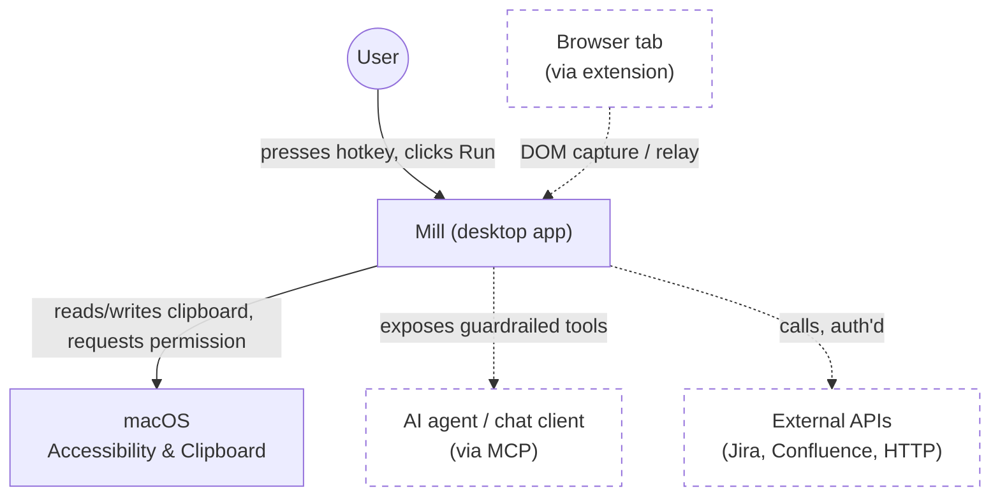
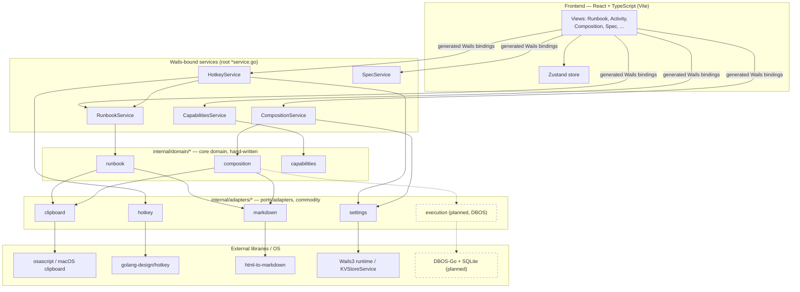

# Mill — Living Spec

This document is the single source of truth for what Mill is. It is rendered
inside the Mill app itself (Spec view) so the doc and the app can't silently
drift apart. Edit this file, not a copy of it.

Status key: `LOCKED` (decided), `OPEN` (actively undecided), `PARKED` (named,
not yet worth deciding).

Where a section describes something with an actual UI, that same status key
covers whether the *decision* to build it is settled — not whether the
pixels are the intended design. A second, orthogonal tag covers that:
`UX: PROTOTYPE` (built to prove a capability/architecture works end-to-end;
functional, not a considered design — expect it to be redesigned, not
treated as the target) vs. `UX: FINAL` (the deliberate, intentional design
for that surface). Absence of a `UX:` tag on a section with a built UI
means it hasn't been classified yet — treat that as a gap to fill, not as
an implicit `FINAL`.

---

## 0. Origin

- Proven on the work laptop already: M365 Copilot (chat agent) driving
  Hammerspoon (macOS Lua automation) as the executor. The point being proven
  was that a chat agent can be made to solve these use cases at all — proven,
  done. `LOCKED`
- That proof-of-concept is not the foundation to build on. Repeatedly hit
  three failure modes trying to grow it: **inner-platform effect** (Hammerspoon
  config drifting into an ad-hoc bespoke platform instead of staying a
  scripting tool), **point solutions** (one-off scripts per use case instead of
  a general capability), and **NIH** (reaching for custom Lua glue where a
  real library/standard already existed). Mill-as-a-Wails-app is the
  do-over specifically to avoid those three, which is why §3–§8 lean so hard
  on citing existing tools/patterns (n8n, React Flow, native messaging,
  Claude Code's project scoping) instead of inventing fresh ones. `LOCKED`

## 1. Positioning

- **What "AI-friendly" actually means — the thesis, not a slogan: what you
  see is what I see.** `LOCKED` Everything Mill composes already exists and
  is already possible by hand. The gap isn't capability, it's that an AI
  acting on a system it can't verify has to *guess* at the actual state
  (what's really on the clipboard, what a command will really do, what a
  setting is really set to) — and the distance between the guess and reality
  is exactly where hallucination and silent failure live. Mill's job is to
  give an AI the same verified, structured view of state a human has, not a
  text blob to infer from. Every recurring pain point this spec addresses is
  a specific instance of this: heredoc failures (shell syntax generated
  blind, no structured view of the real quoting context), the Confluence
  clipboard ambiguity (nothing told either party whether HTML was actually
  present until it was made checkable), MCP's typed tool calls over freehand
  bash (a structured result instead of text to parse and hope), the
  guardrail preview itself (make sure the human's view and the AI's
  about-to-happen action are the same view, before it happens), and the
  original multi-tab session-identity problem (the human's view and the
  AI's context silently diverging with no shared state to reconcile them).
  This is the actual mechanism behind "compose, don't reinvent" below — not
  a separate preference, the same one.
- Mill is not novel. It composes existing primitives — a workflow
  authoring layer with guardrails, not a new category. `LOCKED`
- Reference points: **1Password** (generic capability across every site/app,
  not site-specific), **n8n** (generic workflow/automation composition).
  `LOCKED`
- Product posture: agentic, like M365 Copilot or claude.ai — not turn-by-turn
  operator mode like Claude Code's manual-gear review. The guardrail has to be
  ambient, not a tax on every step. `LOCKED`
- Hard constraint: the guardrailed path must not be harder than the baseline
  of what a person can already do natively (copy/paste, running a command
  themselves by hand). If it is, nobody adopts it. `LOCKED`
- **Scope filter, learned from the screenshot-to-clipboard tangent**: before
  any capability goes into Mill, check whether the OS (or an existing
  launcher like Alfred/Raycast) already does it simply and well. If yes,
  Mill's job is at most to surface/point at it (a Runbook tip, not a
  reimplementation) — reimplementing a solved OS capability is the §0
  inner-platform trap aimed at macOS instead of at Hammerspoon. Mill earns
  its keep specifically where there's no native answer at all: guardrailed
  command execution, structure-preserving capture across inconsistent
  sources, cross-session identity, workflow composition — genuine gaps, not
  a "screenshot but ours" competitor to what already works. `LOCKED`

### 1.1 Hard constraints & delivery model

- No `cargo`/Rust compilation anywhere in Mill's own build or dependency
  pipeline. Reason: at the bank, [corporate-proxy] intercepts/breaks cargo's network
  calls to crates.io, and Artifactory has no Rust feed to route around it —
  so anything that requires `cargo build`/`cargo install` from source will
  not build there, in CI or locally. This rules out e.g. Tauri as an
  alternative app shell (its build step compiles Rust). `LOCKED`
  Narrower than it first sounds: a **pre-built** Rust binary installed via
  Homebrew (a compiled bottle, no local cargo invocation) is not the same
  problem — brew already works there (it's how pueue got installed). So a
  Rust-authored local dev tool installed as a pre-built binary (e.g. `mise`
  via `brew install mise`) isn't automatically disqualified by this rule;
  only compiling Rust from source is. `LOCKED`
  Same reading applies to npm packages that ship prebuilt Rust binaries:
  checked directly (ADR-0003) that Vite 8's default bundler (Rolldown,
  used transitively by `frontend/`'s `vite` dependency) and its companion
  `lightningcss` both distribute as platform-specific prebuilt native
  binaries via npm's `optionalDependencies` mechanism — `npm install`
  never invokes `cargo`/`rustc`. Same shape as the Homebrew-bottle case,
  different package manager. `LOCKED`
- No AI API calls from Mill itself, and no phone-home telemetry of any kind.
  Mill is the substrate that mediates/guards actions initiated by other
  systems (an agent CLI, a chat client) — it is not itself an LLM client, and
  it must run fully offline/on-prem with zero outbound calls it didn't
  explicitly initiate on the user's own behalf via a user-configured
  connector. `LOCKED`
- Single binary, no separate CLI/backend split. Wails3 already satisfies
  this (one Go binary embeds the compiled frontend) — this reinforces the
  existing scaffold choice, no change needed. `LOCKED`
- Install story: `git clone` + a documented local build, runnable on any work
  machine that can install the app. No hosted-service dependency for the
  core loop. `LOCKED`
- CI/CD wired from day one, not bolted on later. `LOCKED`
- Command/bash execution is mediated through Mill's own process (that's the
  guardrail hook point), but the mechanism underneath should be standard OS
  primitives (`os/exec`, a normal shell invocation) rather than a
  custom-built sandboxing/process-isolation layer — compose what exists,
  don't reinvent it. `OPEN` — confirm this reading is correct before it
  drives design.
- Architecture discipline: SOLID, DRY, DDD — proper domain/class separation
  once real domain logic exists. Not retrofitted onto the current two-file
  scaffold prematurely; applies as soon as actual capabilities land. `LOCKED`

### 1.2 Working method

- Research → Plan → Implement (the workflow Boris Cherny has described for
  Claude Code) is the standing method for every capability added to Mill:
  research what already exists before assuming it doesn't — a claimed
  "nothing exists for X" must be backed by an actual search, not an
  assumption (this is also the NIH guardrail from §0) — then plan/lock the
  approach, then implement. `LOCKED`
- DBOS and pueue were surfaced as possible durable-execution/process-queue
  candidates from earlier M365-context research, and got conflated with each
  other in that discussion — they're not the same kind of thing (DBOS is a
  durable-execution library you embed and typically pairs with Postgres;
  pueue is a standalone CLI/daemon for queueing shell commands). Both have
  now been independently evaluated — see §7 and
  [`docs/adr/0004-execution-process-tracking.md`](adr/0004-execution-process-tracking.md).
  `LOCKED` (evaluation) — ADR-0004 itself is `proposed`, not yet `accepted`.
- Concrete failure mode already hit once, worth locking as a hard filter for
  §7's eventual candidate list: pueue was `brew install`ed on the work
  machine for the M365 prototype, which (a) is written in Rust — disqualified
  by §1.1 on its own — and (b) is a separately-installed daemon outside the
  single binary, meaning anyone who `git clone`s Mill would also need to
  install and keep it in sync via a package manager Mill doesn't control.
  Generalized rule: **any process/job-queue mechanism must be embeddable
  directly in the Go binary** (a library, not a separately-installed
  daemon/CLI) — it cannot require Homebrew or any other external package
  manager at install time. This doesn't pick a replacement yet (that's
  §7's job), it just eliminates a whole class of candidate. `LOCKED`
- Access boundary: the actual work laptop this is being built for is behind
  [corporate-proxy] at the bank and is not something the assistant helping design Mill
  has any live access to — no inspecting the real clipboard, no observing
  M365/Loop/Copilot behavior directly, no running commands against that
  machine's real session. Design and research proceed from the user's
  descriptions, not empirical testing against the real target environment,
  unless the user explicitly runs something themselves and reports back.
  `LOCKED`

### 1.3 Repo layout & CI/CD

Full rationale in [`docs/adr/0001-go-module-path-and-repo-layout.md`](adr/0001-go-module-path-and-repo-layout.md)
and [`docs/adr/0002-cicd-pipeline-phased-rollout.md`](adr/0002-cicd-pipeline-phased-rollout.md).

- Go module renamed from the scaffold default `changeme` to
  `github.com/alicoding/mill` (no git remote configured yet at the time of
  this decision; path chosen to match the intended future GitHub owner
  rather than deferring and repo-wide-renaming later). `LOCKED`
- Repo layout: flat root `*.go` files stay at root (`main.go` + thin
  Wails-binding `*service.go` files) — matches wailsapp/wails v3's own CLI
  repo convention, not golang-standards/project-layout (not an official Go
  standard per Russ Cox; aimed at multi-binary services Mill isn't).
  `internal/domain/runbook` (hand-written: the Capture→Process→Apply
  orchestration for Runbook actions) and `internal/adapters/{clipboard,
  markdown,hotkey}` (thin wrappers behind small interfaces around commodity
  libs: clipboard I/O, `html-to-markdown`, `golang.design/x/hotkey`) shipped
  per ADR-0001 Phase 2. Future domain packages (guardrail eval, capability
  composition, session identity) land the same way as they're built — no
  `cmd/`, `pkg/`, `api/`. `LOCKED`
- No generic `Capability`/`Action`/`Node` interface — §3 is still `OPEN` and
  only 2 concrete Runbook actions exist; the domain/adapter boundary above
  is stable regardless of what §3 decides, the capability schema itself is
  §3's call alone. `OPEN` (defer to §3)
- npm workspaces (`frontend/` + a future `browser-extension/`, §5) — not
  adopted yet, revisit when a real second JS package is scaffolded. `go.work`
  not applicable — single Go module is permanent per §1.1. `PARKED`
- **Frontend state management: Zustand adopted.** The PARKED trigger below
  fired — `ActivityView` (a second stateful view) needed the same
  `actions`/`activity` state `App.tsx` fetched, threaded down as props.
  `frontend/src/store.ts` holds `actions`/`activity` in one small store (no
  multi-slice split — an 8-file frontend doesn't need it yet); `App.tsx`
  keeps its two data-fetching effects but writes into the store instead of
  local `useState`, and `RunbookView`/`ActivityView` read the store
  directly instead of receiving props. Hotkey-recording UI state
  (`bindings`, `bindingErrors`, `recordingId` in `RunbookView.tsx`)
  deliberately stayed local `useState` — genuinely single-view state, not
  a candidate for the shared store. `LOCKED`
- **Frontend CSS: migrated to CSS Modules.** Primer React v38 (Mill is on
  38.35.0) dropped its `styled-components`/`sx`/`Box` dependency entirely
  and its own release notes say to "prefer to use CSS modules over
  styled-components and css variables over javascript theming"
  (github.com/primer/react discussion #7086) — not an outside opinion,
  the framework's own current direction, which Mill's single hand-rolled
  `public/style.css` predated. Genuinely global chrome (design tokens,
  `html`/`body` reset, the `.app-shell` flex root, the shared `.view-pane`
  scroll-clip class) moved to `frontend/src/index.css`, imported from
  `main.tsx` so it goes through Vite's own pipeline instead of a raw
  `<link>` tag that bypassed it. Per-view styling split into co-located
  `*.module.css` files (`RunbookView.module.css` shared by `RunbookView`
  and `ActivityView`, which already reused the same card/list visual
  language). `frontend/public/style.css` deleted. `LOCKED`
- CI: GitHub Actions, all four ADR-0002 phases shipped in
  `.github/workflows/ci.yml` + `.github/workflows/release.yml`.
  `golangci-lint` v2, ESLint flat config, Vitest, `go test -race -cover`,
  `go build`/`go vet` (macOS desktop + Linux server-mode), Playwright E2E,
  `govulncheck` (advisory only, still experimental upstream), all
  merge-blocking except govulncheck. Precedent: wailsapp/wails's own v3 CI
  (native-OS matrix, no GoReleaser — wailsapp/wails#747 closed wont-fix).
  `LOCKED`
- **Linux server-mode builds require `CGO_ENABLED=0` explicitly** — not
  optional, confirmed by actually building natively in a linux/amd64
  container, not assumed. Without it, Wails3's own
  `internal/operatingsystem`/`internal/assetserver/webview` packages pull
  in GTK4/webkitgtk-6.0 regardless of the `server` build tag. Matches
  `build/docker/Dockerfile.server`'s own default — that answer was already
  in the repo, just not applied to CI until this was caught. Applies to
  any future Linux build/test/lint step touching the root package. `LOCKED`
- `internal/adapters/hotkey` is split by build tag:
  `hotkey_desktop.go` (`!server`, the real `golang.design/x/hotkey`-backed
  implementation) and `hotkey_server.go` (`server`, a zero-dependency stub
  returning a clear error) — not just a build-fix, architecturally correct
  either way, since server mode has no native run loop to ever deliver a
  keypress through. `LOCKED`
- Lefthook (Go, MIT, Evil Martians) mirrors the same checks locally as a
  pre-commit hook (`lefthook.yml`) — go vet/build/test, golangci-lint,
  eslint, vitest, tsc — verified end-to-end (a deliberate lint violation
  was caught and blocked, a clean commit passed). Playwright E2E is
  deliberately NOT in the local hook (real server build + browser launch
  is meaningfully slower than everything else there; suited to CI, not
  every local commit). `task setup:hooks` installs it once per clone.
  `LOCKED`
- `HotkeyService` cannot be exercised by headless/server-mode CI — no live
  macOS Cocoa run loop in that mode. Verification stays an explicit manual
  desktop-mode check (`.claude/skills/run-mill`), never a silent CI
  skip/fake-pass. Same reasoning extends to `internal/adapters/clipboard`'s
  real round-trip test (skipped specifically in CI, not just on non-macOS —
  GitHub's `macos-latest` runners are headless, no GUI/pasteboard session
  for `osascript` either) and to the Playwright E2E suite (asserts only
  what's environment-independent — page load, both actions listed, Spec
  content, the deterministic "no HTML on clipboard" path — never the
  clipboard-dependent success content). `LOCKED`
- Release pipeline (ADR-0002 Phase 4) ships **macOS only**, deliberately:
  Linux desktop needs GTK4/webkitgtk-6.0 system packages never installed
  or tested here; Windows needs a toolchain with zero local verification
  possible from this macOS-only dev environment. Shipping CI for platforms
  nobody's actually run it against is the exact mistake the CGO_ENABLED
  finding above already caught once — not repeated for a release artifact
  people would download. Windows/Linux desktop release builds `PARKED`,
  revisit when there's a way to actually verify them. Server-mode Docker
  image also not part of v1 release scope — no confirmed hosted-deployment
  use case. `LOCKED` (macOS-only scope) / `PARKED` (the rest)

### 1.4 Architecture at a glance

Two standard architecture views, rendered as real diagrams in the Spec
tab itself (`frontend/src/SpecView.tsx`, via the `mermaid` package —
MIT, pure JS/TS dependency tree, no native/Rust anywhere, verified
directly against its own `package.json` before adopting) rather than
left as prose alone — a layered system with this many pieces built is
harder to hold in your head as text than as a picture. Mermaid's own
`C4Context`/`C4Component` diagram types would match this pair's naming
even more closely, but Mermaid's own docs flag C4 diagrams as
experimental (syntax/properties still changing); using the standard,
stable `graph`/subgraph syntax instead gets the same two conceptual
views without that risk. Dashed nodes are planned, not built — same
distinction as everywhere else in this doc, never implied as done.
Real drag-to-pan/scroll-to-zoom with visible +/−/reset controls comes
from `svg-pan-zoom` (BSD-2-Clause, zero runtime deps) — Mermaid itself
has no pan/zoom capability at all, checked directly against its own
config schema before adopting a second library. `LOCKED`

The one non-obvious wiring detail worth recording here: `mermaid.run()`
matches elements by the same literal `mermaid` class the marked-renderer
override sets (`MERMAID_CLASS` constant in `SpecView.tsx`, not two
independently hardcoded strings), and the SVG needs an explicit
`viewBox` (synthesized from its own rendered width/height, since Mermaid
never sets one) plus `width/height: 100%` CSS on the SVG itself —
without the second part, `svg-pan-zoom` sizes its coordinate system off
the SVG's intrinsic (pre-scaled) dimensions rather than the actual
container, which pushes its control icons past the visible edge.

**System Context** — Mill, its user, and the systems it touches:

**Logical / Component view** — Mill's own layered architecture:

## 2. Core primitive: Capture → Process → Apply

- **Capture**: pull content from a source preserving structure (e.g. DOM copy
  keeps HTML structure, not just flattened text).
- **Process**: a workflow transforms the captured payload into
  whatever the target needs (markdown, plain text, a structured object).
- **Apply**: deliver the processed payload to a target location — e.g. paste
  at the cursor.
- This loop is meant to be generic: the same shape applies whether the
  "capture" is a DOM selection or an LLM tool-call request, and the "apply" is
  a paste or an actual command execution. `LOCKED` (as a shape) — the concrete
  node/connector model that implements it is `OPEN`.

### 2.1 First concrete milestone — the M365 Copilot chat bridge

The use case that should drive the first real build, not further
architecture discussion. M365 Copilot chat proposes a command in its
transcript; today the user manually reads it, runs it themselves, copies the
output, pastes it back into the chat box, and hits enter. Wanted workflow:

1. User reads the proposed command in the M365 Copilot chat (no live access
   for Mill's design process into this — see §1.2's access-boundary note;
   this all comes from the user's own machine at the time they use Mill).
2. User presses a configurable hotkey. **The hotkey press is the guardrail
   gesture** — a deliberate, human-initiated trigger, not a separate
   blocking approval popup. See the open question in §8 about whether that's
   sufficient or whether a lightweight preview still belongs in between.
3. Mill captures the command (from clipboard, or via the browser bridge
   reading the chat DOM directly — §5), executes it locally through Mill's
   own guardrailed process (§6/§7 govern cwd/shell/logging), and gets the
   result payload back.
4. Mill applies the payload back into the chat's input box (auto-paste).
5. Enter is either left to the user, or sent automatically by Mill — user
   explicitly wants the option to have Mill do it, closing the loop
   end-to-end with just the one hotkey press.

This is Capture → Process → Apply instantiated concretely: Capture = read
the proposed command from the chat, Process = execute it, Apply = paste the
result back and optionally submit. It requires §5 (browser bridge, to read
the chat DOM and write back into it), a global-hotkey mechanism (not yet
researched — needs a pure-Go, non-cargo library, per §1.1), and §6/§7 for
the execution itself. `OPEN` on the concrete implementation, `LOCKED` as the
first thing to build once the browser bridge and hotkey pieces are
researched.

### 2.2 Actually-buildable-now milestone — the Runbook page

`UX: PROTOTYPE`. The Runbook page as built (list + Run button + hotkey
assignment, current Primer React pass) proves the capability end-to-end —
it is not yet a considered design. Treat the current layout, empty states,
and hotkey-affordance UI as placeholder until a real UI/UX pass happens;
don't infer product intent from its current appearance.

§2.1 depends on two unresearched pieces (browser bridge, hotkey) and an
environment (M365 in-browser) the assistant helping build Mill has no live
access to (§1.2). This milestone de-risks the two pieces that don't require
that environment, on something testable directly in this dev session:

- A **Runbook page** — a list of available actions the user can browse and
  run directly with a click (no hotkey required), similar to how many apps
  offer example/demo actions or default workflows out of the box. Answers
  "what should I see as a user" concretely instead of describing it.
- Each action gets a **Run** button; **assign a keyboard shortcut** per
  action (Raycast/Alfred-style: click "Set shortcut," press the combo, it's
  bound) is built. `HotkeyService` (`hotkeyservice.go`) wraps
  `golang-design/hotkey`; on trigger it runs the action, completing the
  original ask — select rich text, copy, hit the hotkey, paste normally
  anywhere. Each action owns writing its own result to the clipboard as
  part of its own Apply step (`internal/domain/runbook`), not a generic
  post-hoc copy by the hotkey fire path — see the real bug this caught
  below. Integration risk checked before building, not assumed: macOS requires hotkey registration
  to coexist with the app's own native run loop, confirmed working via the
  library's own Fyne example (registers from a background goroutine while
  `ShowAndRun` owns the main thread) — same shape used here alongside
  Wails' `app.Run()`.
- **Real bug caught live: a generic "copy every action's result to the
  clipboard" fire-path step clobbered an action's own clipboard write.**
  `load-sample-html` writes real HTML to the clipboard itself, then
  returns a UI-facing status string (the prefix text + the HTML, for
  display). `HotkeyService`'s fire path used to *also* unconditionally
  `clipboard.WriteText(result)` after every action — for
  `clipboard-html-to-markdown` that's correct (the markdown result should
  land on the clipboard), but for `load-sample-html` it immediately
  overwrote the real HTML with that plain-text status string. Repro that
  looked at first like a debugging-infra problem (stale build, a
  clipboard race with an unrelated `pbcopy` call) turned out to be this —
  confirmed by reading the two files side by side, not by guessing twice.
  Fixed by moving the clipboard write into each action itself
  (`clipboard-html-to-markdown` now calls `writeClipboardText` on success,
  matching `load-sample-html`'s existing self-contained pattern) and
  removing the fire path's generic write entirely. The no-HTML
  soft-failure path deliberately still writes nothing — there's no
  successful output to Apply, and overwriting the user's actual clipboard
  content with an explainer would be its own small version of the same
  bug. `LOCKED`
- Design principle for that increment, from a real annoyance (macOS's
  default screenshot-to-clipboard shortcut is the awkward one, save-to-file
  got the easy keystroke): the easiest-to-press binding should be assignable
  to whatever the user does *most*, not whatever a default happened to claim
  first. Don't just let a shortcut be set — make it easy to see which
  actions are "easy reach" vs. "deliberately awkward" and rebalance them.
- First seeded action: **clipboard → Markdown**, directly testing the
  original Loop/structure-preservation pain point without needing M365 at
  all — works with anything that puts real HTML on the clipboard.
- Libraries verified directly (repo, license, `go.mod`, recent activity —
  not taken on assumption): [`golang-design/hotkey`](https://github.com/golang-design/hotkey)
  (MIT, cross-platform; macOS backend is cgo via Objective-C
  (`hotkey_darwin.m`) since there's no pure-Go way to hook OS-level global
  hotkeys — a C compiler dependency via Xcode CLI tools, already present,
  not Rust/cargo, so §1.1 is unaffected) and
  [`JohannesKaufmann/html-to-markdown`](https://github.com/JohannesKaufmann/html-to-markdown)
  v2 (MIT, pure Go, 3.7k★, actively maintained). `LOCKED` as the immediate
  next build step.
- **Permissions UX pattern for when this needs Accessibility access**:
  macOS supports deep-linking straight into a specific System Settings pane
  via the `x-apple.systempreferences:` URL scheme — this is the exact
  mechanism Hammerspoon/Raycast/1Password all use for their own "grant
  Accessibility permission" prompts. `RunbookView.tsx`'s Accessibility
  error now shows an "Open Accessibility Settings" button (`Browser.OpenURL`
  from `@wailsio/runtime`, not `data-wml-openURL` — the button only exists
  once a bindingError fires, well after WML's one-time mount-time DOM scan,
  so the imperative call is used instead of the declarative tag to avoid a
  wire-up timing gap) pointing at
  `x-apple.systempreferences:com.apple.preference.security?Privacy_Accessibility`
  — **verified directly on this machine (macOS 26.5.2/25F84), not assumed**:
  ran it via `open`, confirmed by the user it landed on Privacy & Security →
  Accessibility, not just System Settings' default screen. Caveat still
  stands: this is not an official documented Apple API — it's
  community-reverse-engineered, and identifiers have broken before across
  macOS System Settings rewrites (the pre-Ventura Accessibility deep-link
  stopped working when Ventura rebuilt System Settings), so re-verify
  against the target macOS version if this stops landing correctly after a
  future update. `LOCKED` (identifier verified + wired up for macOS 26;
  the show-current-state-and-deep-link pattern itself).
- **Dev builds re-trigger the Accessibility grant on every rebuild** —
  root-caused a real "a hotkey registered and fired cleanly, then after
  the next `task dev` restart the identical combo failed to register at
  all" confusion. `build/darwin/Taskfile.yml`'s dev-build task runs
  `codesign --force --deep --sign -` (ad-hoc signing) on every single
  build, which changes `bin/mill.dev.app`'s code identity each time —
  macOS's TCC ties an Accessibility grant to that identity, so every dev
  rebuild looks like a brand-new, ungranted app to TCC. Not a bug in
  Mill's own code; a known category of friction with ad-hoc-signed local
  dev builds. No fix implemented (a stable local signing identity would
  need its own investigation) — noted here so it isn't re-debugged from
  scratch next time it's hit. `LOCKED` (the root cause) / `OPEN` (whether
  it's worth a fix, e.g. a consistent local dev signing identity).
- **`HotkeyActivity` carries the actual result, not just a byte count** —
  the Activity page's rows expand (click, chevron affordance) to show the
  full text a hotkey fire copied to the clipboard, not just "copied to
  clipboard (N bytes)". Added once the fire-path logging above actually
  proved a hotkey works end-to-end and the natural next question became
  "what did it actually produce" — the same instinct as the Run button's
  own inline result block on Runbook, just for the headless hotkey path.
  Empty `Result` (failure case) means no expand affordance at all, not an
  empty expanded block. `LOCKED`
- **Activity broadened from hotkey-only to every run, with Source/
  Outcome filters** — originally only the headless hotkey fire path
  pushed into this feed; clicking Run directly on Runbook or Composition
  produced nothing, silently inconsistent with a page whose whole job is
  "did anything run." `frontend/src/store.ts`'s `ActivityEntry` is now a
  frontend-owned shape (not pinned to the Go-emitted `HotkeyActivity`
  event) carrying a `source: 'hotkey' | 'runbook' | 'composition'` and a
  `label` resolved and stored at push time, not looked up later against
  `actions`/workflows (which can drift, or have the entry deleted).
  Only the hotkey source still pushes via a Go→JS event, since it's the
  only one of the three that fires headlessly; Runbook's and
  Composition's own Run handlers push directly from their already-
  resolved promise, no new Go plumbing needed. Two `Select` filters
  (Source, Outcome) narrow the list client-side — the two real
  dimensions the data has today, not date-range (the list is an
  in-memory, session-only, 50-entry ring buffer, so everything in it is
  "this session" — a date picker over that would be cosmetic, deliberate
  scope cut, not a silent gap). **Deliberately still not persisted**:
  distinct from workflow *definitions* persisting (§3's Composition
  entry) — a run-history log is much closer to §7's still-open
  execution/session-tracking question (durable process history) than an
  authored shape is; this doesn't touch or presuppose that. This is the
  concrete first step toward the "analytics" half §3.2 already flagged
  Activity as the closest existing surface to, when the reference
  platform's Live Events view (filter by input/event type/date range)
  was reviewed. `LOCKED`
- **Small `DEV` ribbon (top-right, App.tsx) answers "am I looking at a dev
  build, and is it current."** Gated on `import.meta.env.DEV` (true only
  under a real `vite serve` process — verified directly that this is
  false for `vite build` regardless of `--mode`, see the repo-layout
  section above). Shows a timestamp captured once per mount — correct for
  a Go-triggered relaunch (the common case that actually needs checking),
  not for a frontend-only HMR edit that never remounts. A fancier version
  tried tracking true "last build" via `import.meta.hot.on('vite:after
  Update', ...)` and was reverted: subscribing to that event from
  `App.tsx`, the very file that keeps getting hot-edited, hit React Fast
  Refresh not reliably cleaning up the old listener across repeated
  hot-swaps of the same module — stray listeners kept firing. Not worth
  chasing further for a dev-convenience ribbon; mount-time-only is simpler
  and can't have that bug class. `LOCKED` (mount-time approach) / noted so
  the HMR-self-subscription approach isn't retried blind.
- **Progressive enhancement by permission, not a hard gate.** `LOCKED`
  Zero-permission floor: browsing the Runbook and running an action by
  clicking it always works, no OS permission required. Accessibility
  permission (needed for global hotkeys and simulated auto-paste/auto-
  submit) is additive convenience on top — if it's not granted, those two
  features go away, but the app is never blocked, same principle as §1's
  "never harder than the baseline." Mill's messaging must distinguish two
  different ungranted-permission situations, not treat them as one: (a) the
  user can grant it themselves (show the deep-link), vs (b) the machine is
  managed/MDM'd and the user lacks the admin rights to change Privacy
  settings at all, in which case the message should say what to ask IT for,
  not imply a self-serve fix that isn't actually available to them. Detecting
  which situation applies (e.g. checking admin-group membership) is a
  refinement for later, not required to ship the basic distinction in the
  UI copy.
- **Hotkey fire path is logged end-to-end, not a black box.** `LOCKED`
  Added after a real debugging session where a hotkey showed as
  successfully bound (label appeared, no error) but pressing it appeared
  to do nothing, with no way to tell whether the OS never delivered the
  keypress (another app already claimed the combo) or delivery succeeded
  and something after it (the action, or the clipboard write) failed
  silently. `HotkeyService` now logs each stage — registered, fired,
  action succeeded/failed, clipboard write succeeded/failed — via
  Wails3's own `application.DefaultLogger` (colorized to stderr in dev
  mode, discarded in production builds), reused rather than standing up a
  second logging setup. This is a stopgap for debuggability, not §7's
  actual inspectable/persistent process-tracking mechanism — that's
  ADR-0004's job once `internal/domain/execution` exists.
- **Hotkey assignments persist across restarts, via Wails3's own built-in
  `KVStoreService`** (`pkg/services/kvstore`) — researched before building
  (confirmed directly by reading its source, not assumed from a search
  summary): a JSON-file-backed key-value store with optional autosave.
  `internal/adapters/settings` wraps it behind Mill's own small `Store`
  interface, per CLAUDE.md's ports/adapters rule for commodity
  dependencies (persistence is a generic storage concern, same bucket as
  `internal/adapters/clipboard`/`markdown`, not core domain) — callers
  depend on Mill's interface, not the concrete Wails type. `main.go`
  builds the store at `application.Path(application.PathConfigHome)` +
  `mill/settings.json` — resolves to `~/Library/Application Support/mill/`
  on macOS (verified against the `adrg/xdg` source Wails uses internally),
  the same convention Alfred/Raycast/1Password use for their own
  persisted settings. `HotkeyService.Assign`/`Unassign` write the raw
  `(mods, key)` pairs (not the display label, which can't be parsed back
  into modifier/key names) as one JSON blob on every change; a
  `RestoreBindings` method re-registers everything on the next launch.
  **Deliberately not wired through Wails' Service lifecycle
  (`ServiceStartup`/`ServiceShutdown`)**: that would auto-expose the raw
  KVStore's `Get`/`Set`/`Delete` as JS-callable bindings, letting the
  frontend bypass `HotkeyService`'s own validation entirely — `main.go`
  calls `settings.New` (which loads any existing file itself) and
  `RestoreBindings` directly instead, keeping persistence a Go-only,
  encapsulated concern. Timing matters here and was checked, not guessed:
  global hotkey registration needs the native run loop already spinning
  (see the Fyne-example note above), which is *not* true yet during
  `ServiceStartup` — `RestoreBindings` is instead called from
  `app.Event.OnApplicationEvent(events.Common.ApplicationStarted, ...)`,
  the same hook pattern used in Wails3's own official examples
  (`examples/events`, `examples/window`). **Verified end-to-end on this
  machine, not just unit-tested**: assigned a real hotkey via the live
  desktop app (confirmed `settings.json` on disk held the exact
  `mods`/`key` pair), killed and relaunched the same built binary without
  rebuilding (avoids the ad-hoc-codesign/TCC re-grant issue noted above),
  and confirmed the binding re-registered automatically — both in the
  slog output (`hotkey registered action=... binding=...`) and in the
  live UI — with zero user interaction. `internal/adapters/settings` also
  has its own real-disk round-trip test (`t.TempDir()`, two separate
  store instances against the same file); `HotkeyService`'s JSON
  marshal/restore logic is unit-tested against a fake `Store`, consistent
  with the rest of `HotkeyService` being otherwise real-OS-hotkey-only and
  not CI-testable (§1.3). `LOCKED`
- **Capability status index, backed by real Go data, not parsed docs.**
  First design considered parsing this very doc's `LOCKED`/`OPEN`/`PARKED`
  tags out of its markdown (via `remark`/AST-walking) to drive an in-app
  status index — correctly rejected: "SPEC.md was just a quick last night
  thing," inferring structure from prose formatting that was never meant
  as a schema is exactly the kind of fragile-clever thing that breaks
  silently. The actual fix: Mill is a native app with a real backend, so
  capability status is real application data, stored and projected the
  same way `RunbookService.List()` already exposes Runbook actions —
  typed Go structs over the existing Wails binding mechanism, zero new
  frontend dependencies. `internal/domain/capabilities` (`List()`,
  mirroring `internal/domain/runbook`'s shape) is the one authoritative
  place capability status lives now; this doc's own tags stay
  human-readable commentary, not something anything parses — a known,
  accepted seam (the two could drift) rather than a forced
  consistency-checker in this pass; `spec-sync-checker` (§9.2) is the
  natural place to close that gap later. `CapabilitiesService` (thin
  Wails binding, no logic of its own) exposes `List()` and a dev-only
  `RepoPath()` (`os.Getwd()`, reliable specifically because `task dev`
  launches with the repo root as cwd — confirmed this session). The Spec
  tab's `CapabilityIndex` renders real rows from that data: a built
  capability's row jumps straight to its page (`Runbook page` → Runbook
  tab, `Activity / event log` → Activity tab — same §2.2 milestone, two
  distinct entry points); a not-built one opens a generic `PlaceholderView`
  (same Primer primitives as RunbookView's empty states — no dedicated
  empty-state component in this Primer version) showing its status and a
  way back; a capability with an `EditorPath` (no UI at all yet, e.g.
  process tracking → `docs/adr/0004-execution-process-tracking.md`) gets
  an additional dev-mode-only action opening `vscode://file/<repoPath>/
  <editorPath>` via `Browser.OpenURL` — the same mechanism already used
  for the Accessibility-settings deep link. `EditorPath` correctness is a
  real test (`TestList_EditorPathsExist`), not just a shape check — it
  must resolve to a file that exists today, never an aspirational one.
  §5 (browser bridge) deliberately excluded from the registry: a separate
  extension deliverable, not a Mill window page. Verified end-to-end on
  the real desktop app (accessibility-driven UI automation, not assumed):
  clicked "Go to page" for Runbook page → landed on the real Runbook tab;
  clicked "View status" on a placeholder → correct label/status/back-link
  rendered; clicked "Open in editor" on the process-tracking entry → VS
  Code opened the exact ADR file. `LOCKED`
- **Every capability gets a nav entry, built or not — first as a top
  `UnderlineNav`, then migrated to a `PageLayout`/`NavList` sidebar.**
  The first pass made the top `UnderlineNav` data-driven from
  `CapabilitiesService.List()`; with all 7 capabilities plus Spec that
  immediately overflowed into Primer's own "More" dropdown, which
  re-hid most of the app behind a click — directly working against the
  "see the cohesive picture" goal this index exists for. Migrated to a
  persistent sidebar instead, since a top bar doesn't scale as more
  capabilities land and a sidebar does.
  **`PageLayout.Sidebar`, not `PageLayout.Pane`** — checked directly
  against the compiled CSS before choosing, not assumed: `.Pane` is
  content-adjacent and page-scroll-oriented, responsively **stacking**
  above/below content below 768px (`overflow:auto` is even gated to
  `@media (min-width:768px)` in its own CSS) — Mill's `MinWidth: 640`
  sits inside that stacking range, wrong fit for a persistent side
  rail. `.Sidebar` stays inline at any width (`responsiveVariant:
  'default'`) and has `height:100%`/`overflow:auto` unconditionally.
  **Getting `PageLayout.Content` to actually clip (not just grow to fit
  content, page-style) took real debugging**, via the same
  200-paragraph dummy-content stress test used for the earlier
  `.app-shell` fix, confirmed at each step against live computed
  styles rather than assumed: PageLayout's own internal Sidebar+Content
  row wrapper (an unnamed, hash-classed div with no `data-component`
  hook) defaults to `min-height:auto`; fixing that wasn't enough either
  since it sits in a `flex-wrap:wrap` container where a wrapped line's
  cross-size isn't hard-clipped by `min-height` alone; and Content
  itself sits in a `flex-direction:row` context where `flex-grow` sizes
  width, not height. `App.module.css` targets the internal wrapper
  structurally (`div:has(> main.view-pane)`, not Primer's hashed class
  name — the same "don't chase vendor-owned markup" reasoning as the
  earlier `ThemeProvider`/`BaseStyles` fix) with explicit `height:100%;
  overflow:hidden`, and `.view-pane` itself gained an explicit
  `height:100%`. **Net finding: `PageLayout` is built for page-scroll
  websites, not a fixed-viewport app shell** — worth remembering before
  reaching for another `PageLayout` region expecting it to "just clip."
  `Capability.NavLabel` (falls back to `Label` when empty) keeps the
  two built entries terse in the sidebar ("Activity" vs. the fuller
  "Activity / event log" in the Spec-tab index) without a second
  hand-maintained label; `store.ts`'s `viewFor`/`viewsEqual`/
  `statusVariant` helpers are shared by the sidebar and
  `CapabilityIndex` (previously duplicated) so both surfaces navigate
  and badge identically from one mapping. The Spec-tab `CapabilityIndex`
  stays — the sidebar is for quick jumping, the Spec tab is still the
  fuller picture (status + "Go to page"/"View status"/"Open in editor"
  together). Verified end-to-end on the real desktop app via
  accessibility-driven UI automation: all 8 entries visible with no
  overflow, clicking each lands on the right page/placeholder with the
  active-state indicator following correctly. `LOCKED`
- **Window/scroll layout researched against Wails3's own docs before
  touching CSS** — confirmed Wails3's window management (`MinWidth`/
  `MinHeight`/`MaxWidth`/`MaxHeight`/`Zoom`/etc. on `WebviewWindowOptions`)
  only owns the native OS window frame; it has no opinion on in-page
  scrolling, that's plain CSS same as any web page. `main.go`'s window now
  sets `MinWidth: 640, MinHeight: 420` — Wails' own documented mechanism
  for "don't let the window shrink small enough to break the layout,"
  which Mill wasn't using. Separately, `.spec`/`.runbook` previously
  scrolled via a hand-guessed `max-height: calc(100vh - 60px)` duplicated
  in both rules — replaced with the standard flexbox scrolling-pane
  pattern (`flex: 1 1 auto; min-height: 0; overflow-y: auto`). Getting
  that pattern to actually clip required two more pieces, both found by
  stress-testing with 200 paragraphs of dummy content (not assumed): (1)
  the flex root needs a *bounded* height, not `min-height: 100vh` — `html`
  now sets `height: 100%; overflow: hidden`, matching Wails' own documented
  overscroll-bounce fix (https://wails.io/docs/guides/overscroll/); (2)
  Primer's `ThemeProvider`/`BaseStyles` inject their own plain `
`s
  (`display: block`, confirmed by walking the live DOM) between `#root`
  and Mill's actual content, which broke the flex chain — rather than
  chasing that vendor-owned markup with `display: contents` (fragile
  against a future Primer DOM change), `App.tsx` now renders its own
  `.app-shell` div as the real flex-column layout root, sized with
  viewport units (`100dvh`) rather than `%` since percentage heights
  require every ancestor to have a definite height, which the Primer
  wrapper divs don't. `LOCKED`

## 3. Capability composition — how nodes connect

- `OPEN`. Reference lineage: n8n (typed node inputs/outputs, credentials
  separated from node config, JSON workflow definition under the canvas) and
  React Flow / `@xyflow/react` (canvas engine; Vue Flow is the same team's Vue
  port — moot for us since Mill's frontend is already React).
- Not yet decided: node schema shape, how a "capability" is declared/
  registered, whether workflows are user-authored on a canvas or
  config-first with canvas as a later view.
- **Terminology, locked**: the composed artifact is a **workflow**, made
  of ordered **steps** — not "recipe," which this doc used
  inconsistently alongside "workflow" (the canvas/surface) for
  overlapping concepts. Both the reference decisioning platform (§3.2)
  and n8n (this section's other reference) call the composed thing a
  "workflow"; the reference platform's own language for what's inside
  one is "steps that is specific to the workflow" (relayed directly by
  the user, not paraphrased). Mill adopts that vocabulary everywhere —
  code, docs, UI — rather than maintaining two words for one concept.
  A **node type** stays the reusable, Mill-defined primitive a step is
  a configured instance of (unchanged naming — this only retires
  "recipe"). `LOCKED`
- **A concrete proposal for all three exists now, not yet accepted:**
  [`docs/adr/0005-capability-composition-node-schema.md`](adr/0005-capability-composition-node-schema.md).
  Drafted against a detailed feature breakdown of the same reference
  no-code decisioning platform named in §3.2 (kept generic there and
  here per the standing no-vendor-names rule) — its actual node taxonomy
  (Ruleset, Decision, Value Assignment, Integration, Code, Child
  Workflow, Parallel Steps, ML Model, Database Call) and its treatment
  of Form/JSON as a coequal authoring path alongside its canvas, not a
  fallback, directly informed the recommendation below. Also surfaced,
  not yet addressed anywhere in this doc: that reference platform has a
  draft/live versioning model with staged-traffic promotion that Mill
  has no equivalent of yet — real gap, deliberately left for a future
  decision once an actual Mill workflow exists to version.
  Recommendation (ADR-0005, `proposed`): two node families — MCP-tool
  nodes (schema inherited from the wrapped tool, per §3.1's already-
  locked MCP layer) plus a small, hand-written set of Mill-native
  control-flow nodes (Decision, Value Assignment, Parallel, Child
  Workflow) that stay Mill's own code per CLAUDE.md's core-domain rule;
  composed into a data-driven workflow (JSON), authored via a form/JSON
  side panel generalized from Runbook's current UI; React Flow deferred
  (not rejected) until 2+ real multi-step workflows exist to design a
  canvas against actual content instead of speculation. `OPEN` until
  accepted.
- **Composing a workflow is inseparable from configuring it — corrected
  by the user after the first prototype pass only showed a read-only
  preview.** A step is never a bare reference to a node type; it always
  carries that node type's configuration, resolved in full (explicit
  values or the node type's own declared defaults) the moment it's
  added to a workflow. There is no such thing as an unconfigured step —
  composing without configuring was named directly as "the most
  violation" of how workflow composition should work. `LOCKED` (the
  principle) — feeds directly into the prototype below.
- **`UX: PROTOTYPE` — a Capability Composition page tests ADR-0005's
  shape, and the compose-with-configure principle above, on real,
  working capabilities**, same "actually buildable now, de-risk before
  the full architecture is decided" discipline §2.2 used for the
  Runbook milestone. `internal/domain/composition` is a new, additive
  package (not a replacement for `internal/domain/runbook`, which stays
  exactly as-is, untouched, still the tested/tuned path) — its node
  primitives (`capture-clipboard-html`, `process-html-to-markdown`,
  `apply-clipboard-write-html`, `apply-clipboard-write-text`) call the
  *same* adapter functions Runbook's actions already call. One node
  type (`apply-clipboard-write-html`) now declares a real `ConfigField`
  (the HTML it writes, defaulting to the existing sample) instead of a
  hardcoded constant — the smallest real example of a configurable
  primitive, not a contrived one. The page lets a user **compose a new
  workflow**: pick node types, and each one's config fields appear
  inline the moment it's added — composing and configuring happen in
  one motion, never as separate passes. Built and user-composed
  workflows render as plain lists with their step chain as chips
  showing the actual configured values (not just the node type's
  label) — configuration stays visible as part of composition. Newly
  composed workflows **persist across restarts**, via
  `internal/adapters/settings` (the same JSON-file store
  `HotkeyService` already uses for hotkey bindings, reapplied verbatim,
  not a new mechanism) — deliberately scoped to persisting a workflow's
  authored *definition* only; persisting/resuming a *running* workflow's
  execution state stays §7's still-open question, untouched and not
  presupposed by this. What this prototype does *not* prove:
  `ExecuteWorkflow`'s errors are plain/technical, not Runbook's tuned
  soft-failure copy (deliberate simplification, not a regression — the
  careful UX still lives in `runbook.go`); node *types* stay Mill-
  defined, not user-authorable (a "define a new node kind" UI, the
  reference platform's separate Configure-surface-for-kinds idea, is a
  bigger, unproven feature, deliberately cut from this pass); and it
  says nothing about branching/parallel/typed-payload steps, still real
  future work per ADR-0005. §3 stays `OPEN`, ADR-0005 stays `proposed`
  — this is a testable prototype to react to, not a lock.
- **Update — the config-first list above was replaced by a real React
  Flow canvas, ahead of ADR-0005 B2's own stated deferral trigger ("2+
  real multi-step workflows exist to design against").** That trigger
  had not fired — still only the two built-in linear workflows — when
  the canvas was built anyway, by explicit user decision, not a silent
  resolution of an `OPEN` item. Recorded honestly here and in ADR-0005's
  own Update section rather than rewritten as if the original condition
  had been met. `CompositionCanvas.tsx` (React Flow / `@xyflow/react`)
  replaces the old add-a-step form: drag a node type from the palette
  onto the canvas, connect nodes by dragging between handles, click a
  node to configure it in a right-side Inspector panel — composing and
  configuring still happen in one motion, same principle as above, just
  moved from inline-in-a-list-row to inline-on-select. The workflow data
  shape changed to match — `Workflow.Steps []Step` became `Workflow.Nodes
  []Node` + `Workflow.Edges []Edge`, exactly the shape this section's
  own "Schema direction" bullet (§3.3) already wrote down before this
  was built. Companion libraries, chosen from research into what real
  OSS projects (Langflow, Dify) actually pair with React Flow: `zundo`
  (undo/redo, wrapping a small zustand store scoped to canvas state,
  `frontend/src/canvasStore.ts`), `elkjs` (auto-layout, dynamically
  imported only when used — it's a large bundle, confirmed via the
  production build that it lands in its own ~2.5MB chunk, not the main
  one), and `zod` (validates a draft workflow against the same shape
  `CreateWorkflow` will receive before Save, mirroring
  `linearOrder`'s own graph-shape checks so a save-time error and a
  run-time error never disagree). `elkjs` is dual-licensed
  EPL-2.0/GPL-3.0-or-later, not MIT like the rest of Mill's dependency
  tree — EPL-2.0 is the compatible choice a consumer picks from that
  "OR" (same shape as §3.1's MCP SDK license-transition note, worth a
  compliance glance given the bank context, not a blocker). No
  Decision/Parallel/Child-Workflow node kinds exist yet, so the canvas
  and the backend both still only support a single unbranched chain —
  `isValidConnection` rejects a second outgoing edge from any node at
  draw-time (client-side), `linearOrder` (composition.go) rejects an
  invalid graph shape at run-time (server-side, can't trust the
  client), and the zod schema rejects it at save-time — three layers
  because a canvas genuinely lets a user draw something the domain
  can't yet execute, unlike the old form which couldn't represent that
  shape at all. Verified end-to-end via the real Go backend in server
  mode (Playwright-driven, not just unit tests): dragged a node type
  onto the canvas, selected it, confirmed the Inspector rendered its
  real config fields with the node type's actual defaults. `internal/
  domain/composition`'s persisted-workflow settings key was versioned
  (`composition-workflows` → `composition-workflows-v2`) since the
  shape changed and `restore()` already silently discards on unmarshal
  failure — renaming orphans old prototype data harmlessly instead of
  actively reading and dropping it. `UX: PROTOTYPE` still applies —
  this proves the shape, not a finished design (no re-opening a saved
  workflow back into the canvas to edit it yet; that list stays
  read-only).

### 3.1 Raw material — root cause of the heredoc pain, not yet resolved

The actual heredoc frustration (see the mise/Taskfile discussion) isn't
about which task runner executes a shell string — it's that an LLM has to
freehand-generate shell syntax at all. Four related ideas surfaced together,
captured here before being lost, none yet resolved:

- **Bring-your-own-model chat bridge**: Mill could expose a Claude-Code-like
  agent loop where the user points it at any LLM (a local Ollama model, or
  any API key) and that model drives Mill's tools directly — Mill as "a
  bridge to your allowed folder," not itself an LLM client (consistent with
  §1.1's no-AI-API-from-Mill-itself rule — the model is always brought by the
  user/host, never bundled). Composability mechanism unclear — see below.
- **Declarative/no-code action definition**: reference pattern is a no-code
  decisioning platform style the user has worked with professionally —
  generic HTTP-connector nodes configured against external data
  vendors, with typed input/decision nodes wired into a workflow (see §3.2
  for the fuller pattern description — kept vendor-name-free deliberately,
  Mill's docs stay OSS-ready from day one, no citing specific commercial
  products by name). Applied to Mill: if a user has some CLI tool installed
  locally, expose it as a typed "action" (declared inputs/outputs) instead
  of the LLM freehand-generating a shell command to invoke it.
- **Diff preview**: frustration that a prior AI tool had no file-diff
  preview for a proposed change; floated IDE integration to get it. Likely
  not a separate feature — probably the same PreToolUse-style preview
  already planned in §8, just rendering a diff when the action is a
  file write instead of a raw command. Confirm this framing once §8 is
  worked.
- **Structured primitive tools with swappable backends**: instead of the LLM
  needing to remember shell invocations, Mill exposes stable primitives —
  `Read()`, `Write()`, `Find()` — whose implementation can be Mill's own
  default (e.g. `fd`/ripgrep-equivalent, or a RAG index) or something the
  user brings themselves.

**MCP verdict: good fit, adopt as the capability-exposure layer.** `LOCKED`
Researched and independently spot-checked (repo/release/go.mod/license all
confirmed directly, not taken on the research pass's word alone):

- **Go SDK**: [`modelcontextprotocol/go-sdk`](https://github.com/modelcontextprotocol/go-sdk)
  — official, "maintained in collaboration with Google," v1.7.0
  (2026-07-28). `go.mod` deps are 100% pure Go (`jsonschema-go`,
  `segmentio/encoding`, `golang-jwt`, `x/oauth2`, `x/time`, `x/tools`, etc.)
  — no cgo, no Rust, no Node/Python. Server *and* client roles both
  implemented. Clean fit with the single-binary constraint. License
  mid-transition MIT → Apache-2.0 (new code Apache-2.0; unrelicensed old
  contributions stay MIT) — confirmed directly against the repo's `LICENSE`
  file, worth a compliance glance given the bank context but not a blocker.
- **Bring-your-own-model is real, not assumed**: the spec is explicit that
  MCP "does not dictate how AI applications use LLMs" — the host owns the
  model choice, Ollama-or-any-key is genuinely in-scope, this isn't Mill
  inventing a workaround.
- **Wrapping a local CLI as a typed tool is the mainstream pattern**, not a
  novel use — see
  [github-mcp-server](https://github.com/github/github-mcp-server) (32k★,
  Go, single binary) as a real precedent.
- **No PreToolUse-equivalent exists in the MCP spec** — that stays entirely
  Mill's own responsibility, as expected. The Go SDK does expose a real seam
  for it though: `Server.AddReceivingMiddleware(...)` wraps `tools/call`
  before dispatch — the SDK's own examples only use it for response
  caching, not approve/deny, so Mill would be writing the actual guardrail
  logic, but the interception point already exists and doesn't need to be
  built from scratch.
- **No-code workflow canvas is confirmed out of scope for MCP** — its
  primitives are flat tools/resources/prompts with no chaining semantics.
  React Flow (§3's other reference) over MCP-exposed tools as nodes still
  stands as the composition layer on top.
- **Correction to the transport question**: local **stdio** transport is
  confirmed to be pure local IPC — "newline-delimited messages over the
  standard streams of a client-launched subprocess," zero network egress,
  never touches [corporate-proxy] or any network security stack. Remote transports
  (SSE, streamable HTTP) are the actual egress path and what enterprise
  MCP-security policy typically targets. Not verified against the bank's
  actual policy text — **worth asking IS&C directly** whether the block
  names remote/HTTP MCP specifically, since local stdio MCP may already be
  usable today regardless of the broader block.
- **Prior art worth reading before designing Mill's own version**:
  [mcphost](https://github.com/mark3labs/mcphost) (Go, Ollama-native, had
  hook-based tool approval) — archived April 2026, successor project
  "Kit." Closest existing thing to "Mill's idea #1," already attempted and
  abandoned once; worth understanding why before repeating its shape.
- **Alternatives checked, not just MCP confirmed in isolation**: Eino
  (ByteDance) and langchaingo are agent *frameworks*, not protocols —
  complementary at most, heavier than Mill needs, not competing options.
  MCP isn't overkill here; the alternative would be hand-rolling the same
  tool-schema contract worse.

**Open conflict this surfaces, needs a decision**: §1.1 locks "Mill is not
itself an LLM client — no AI API calls from Mill itself." Idea #1 above
(Mill running a chat/agent loop that drives a user-supplied Ollama model)
would make Mill an MCP **host**, which sits uneasily against that lock —
even though Mill wouldn't be calling a *paid* API or phoning home, it would
be the thing orchestrating a model's tool-calling loop, not just exposing
tools to be orchestrated. Mill as MCP **server only** (exposing guardrailed
tools, something else acts as host) fits §1.1 cleanly with zero tension.
`OPEN` — this determines whether idea #1 is in scope at all.

### 3.2 Composition pattern from professional experience — kept generic, no vendor names

The user has worked professionally with a no-code decisioning platform
(fintech domain) whose composition pattern is worth adopting the shape of.
Deliberately described here without naming the product — Mill's docs stay
citeable/OSS-ready from day one, that's a standing rule now, not just for
this entry.

- **Three distinct surfaces, not two.** The reference platform separates
  **Settings** (global/app-level config — credentials, preferences, things
  that apply across the whole app) from **Configure** (where node *kinds* —
  input, decision, integration, and others — get defined: schema, required
  fields, auth for integrations) from the **workflow canvas** itself (where
  already-configured node *instances* get dragged in and wired together).
  The user specifically likes this separation and wants Mill to keep it —
  don't collapse app-level settings and capability/node-type configuration
  into one screen just because they're both "configuration." Same
  type-vs-instance split n8n uses for its second half (node package defines
  the type; workflow canvas composes instances) — two independent
  references converging on the same shape is a good signal. `LOCKED`
  (three-surface separation) — which settings live where, `OPEN`.
- **Cardinality differs by node kind.** Input nodes are 1:1 — configured for
  and used within a single workflow. Integration/vendor-connector nodes are
  reusable 1:* — one configured connector (e.g. one authenticated HTTP
  connector to a given vendor) can be wired into many different workflows.
  Decision node cardinality is unconfirmed (user wasn't sure) — check before
  assuming either way when this gets designed.
- **Connector protocol/auth support should be incrementally extensible, not
  fixed upfront.** The reference platform started with plain HTTP and grew
  — driven by real, incoming vendor requirements rather than upfront
  speculation — to also support XML/SOAP, OAuth and other auth schemes, and
  eventually mTLS. Lesson for Mill's own connector design (§4): build the
  generic HTTP connector first, but don't hardcode assumptions that would
  block adding SOAP/XML translation or new auth schemes later without a
  rearchitecture. Add real protocol/auth support when a real connector needs
  it, not speculatively.
- **Fuller detail reviewed since the above was written** — a concrete
  UX/feature breakdown of the same reference platform, still kept
  generic per the standing no-vendor-names rule. Four things not
  captured above:
  - **Left-nav surfaces beyond the three already locked**: the reference
    platform's actual nav is Workflows (canvas) / Configure (node-type
    definition — matches "Configure" above) / **AI Analytics** / **Review**.
    The latter two are surfaces Mill has no equivalent of yet — an
    analytics/observability view over past runs, and a case/queue-style
    review surface (statuses, visibility). Not a new locked surface for
    Mill — noted because it's relevant to §7 (process/session tracking,
    still `OPEN` on what a "history" view looks like) and because Mill's
    existing Activity page is the closest thing to the analytics half.
  - **Per-record schema + single-record test harness.** The platform
    treats a workflow's record schema (metadata, mappings, attributes,
    JSON schema) as first-class, and lets you test one record via a
    Form or raw JSON before trusting a full run. Directly relevant to
    §3's node-schema question (ADR-0005 leans on this precedent for its
    config-first-authoring recommendation) and to §8's requirement that
    a skip-condition rule be testable/validated before going live — same
    "verify against a sample before trusting it live" instinct, applied
    one level down (a single record) instead of a whole policy rule.
  - **Draft/live versioning with staged-traffic promotion — a real gap.**
    Edits create a new version; versions are tested and validated, saved
    as a draft, then promoted live with configurable traffic allocation
    (a canary/staged rollout, not an all-at-once cutover). SPEC.md has
    no equivalent concept anywhere — no notion of a workflow having a
    draft vs. live version, no rollout mechanism. Deliberately left
    `OPEN`: worth a real decision once an actual Mill workflow exists to
    version, not invented speculatively now.
  - **Live + "shadow" events, filterable/exportable history.** The
    analytics surface shows live events plus "shadow" events (a
    draft/candidate version evaluated against real traffic without
    taking effect, purely for comparison) and lets you filter by input,
    event type, date range, and export results. Relevant to §7's
    still-open analytics/history design, and precedent for §8's dry-run
    requirement — "shadow" is the same idea as a policy dry-run, just
    named differently and applied to a whole workflow version instead of
    one rule.
  `OPEN` (all four — captured as design input for §3/§7/§8, not decided
  here).

### 3.3 Capability map — designing the node/edge schema against the full known need, not just today's two workflows

Deciding the node/edge schema from today's two built-in, purely-linear
workflows risks locking in exactly the point-solution shape §0 already
names as a failure mode this project has been burned by once — a schema
that fits the narrow immediate case and has to be migrated (persisted
data and all) the moment a real branching/trigger use case surfaces.
The counter-discipline, applied here for the first time and worth
reusing whenever a schema/adopt-vs-build decision spans more than one
real future use: **list every known capability first, whether it's
something to adopt or something that must stay Mill's own, before
locking the schema** — not to build all of it now, but so the *shape*
of what's built now doesn't have to be undone later. See CLAUDE.md's
Plan step for this as a standing rule.

| Capability | What it needs to do | Adopt or build | Status / source |
|---|---|---|---|
| **Capture / Process / Apply** | Read structured state from a source, transform it, deliver it | Build (core domain) | `LOCKED`, §2 — built for clipboard/markdown |
| **Trigger** | Entry-point node: listen for *any* event source (hotkey, clipboard change, a browser-bridge DOM event per §5, an incoming MCP `tools/call` per §3.1, a schedule) and emit its data as the workflow's starting input — not "the hotkey mechanism," a general category the hotkey is one instance of. A trigger's output *is* the workflow's input; these are one concept, not two. | Each concrete event source adopts its own library behind an adapter (hotkey already does — `internal/adapters/hotkey`); the abstraction unifying them into one node kind is Mill's own | Hotkey mechanism exists (`HotkeyService`) but isn't modeled as a graph node yet — needs `Kind: trigger`, `Source: "hotkey"` (extensible), not a separate bolted-on mechanism |
| **Decision / branching** | Route execution down one of several named output edges based on a condition evaluated against the running payload | Node/graph semantics: build (core domain — composition rules). Expression evaluation underneath: adopt (`expr-lang/expr`, MIT, sandboxed/side-effect-free/loop-bounded by design — verified directly, not assumed) rather than hand-writing a condition parser | ADR-0005 names it, deferred, still `OPEN` |
| **Parallel Steps** | Fan out to multiple steps concurrently, then join | Graph/fan-in semantics: build. Concurrency execution: DBOS's `Queue`/`WithWorkerConcurrency` (§7) is a plausible real backing mechanism once designed, not hand-rolled goroutine management | ADR-0005 names it, deferred |
| **Child Workflow** | One workflow invokes another as a step | Build (composition rule — no library has an opinion on Mill's own workflow-of-workflows semantics) | ADR-0005 names it, deferred |
| **Integration / Connector node** | Call an external HTTP API, auth'd | Wire protocol: adopt (stdlib `net/http`, or MCP per §3.1 if exposed as a tool). Connector config/credential model: build | §4, `OPEN` |
| **Durable step execution / retry / resume** | Survive the process dying mid-workflow, checkpoint per step, retry transient failures | Adopt (DBOS-Go) | ADR-0004, integration in progress this session |
| **Replay / re-run from history** | Re-invoke a past run, ideally resuming rather than restarting | Mechanism: adopt (DBOS `ForkWorkflow`/workflow-ID resume). UI/policy: build | Named this session — not built, deliberately deferred past the current DBOS-integration pass |
| **Draft/live versioning** | Edit a workflow without breaking the currently-live version | Build (no library owns Mill's own versioning semantics) | Real gap flagged from the reference-platform review (§3.2), `OPEN` |
| **Live + shadow events / execution history** | Filterable log of past runs; dry-run a candidate change against real traffic before trusting it | Data: adopt (DBOS `GetStatus`/`ListWorkflows`). UI: build | §3.2 shadow-events bullet; §7 already calls Activity "the closest thing to the analytics half" |
| **Guardrail preview / policy gate** | Approve/deny before a step actually runs | Build (core domain — no library has an opinion on Mill's guardrail semantics) | §8, `LOCKED` in shape, `OPEN` in detail |
| **Visual composition surface** | Author a DAG, not just a list | Adopt (React Flow / `@xyflow/react`) — built ahead of ADR-0005 B2's original deferral trigger, by explicit decision (see the ADR's Update section) | §3, `CompositionCanvas.tsx`, `UX: PROTOTYPE` |

**React Flow, checked directly against its actual source/docs (not
assumed) specifically to shape the schema now without adopting the
canvas yet**:
- MIT-licensed. Its own runtime dependencies are `@xyflow/system`
  (its own internal package), `classcat` (a tiny classname utility),
  and **`zustand`** — already an adopted Mill dependency for frontend
  state (§1.3) — one of React Flow's three dependencies is something
  Mill already vetted for an unrelated reason, not new surface.
- A React Flow node is `{id, type, data, position}` — `type` maps via
  a `nodeTypes` registry to a component, `data` is arbitrary. This is
  already close to `composition.Step{NodeTypeID, Config}` — adding
  `Position` (ignorable until a canvas exists) is the only real gap.
  Not a coincidence worth engineering around; a reason to shape Mill's
  own schema this way now, so adopting the canvas later is additive,
  not a migration.
- A node can expose multiple named `Handle`s, and edges reference a
  specific `sourceHandle` — this is exactly a Decision node's "yes"/
  "no" (or N-way) branching, natively, not something to hack around.

**Schema direction this map and the React Flow shape point to — now
built, not just captured as design input:**
`Node{ID, Kind, NodeTypeID, Config, Position}` +
`Edge{ID, Source, SourceHandle, Target}`, replacing the former flat
`Workflow.Steps []Step` (`internal/domain/composition/composition.go`).
`LOCKED` as the schema actually in use — ADR-0005 itself stays
`proposed` (not `accepted`), since the A2 control-flow-node question and
the versioning/replay gaps this map names are still real, unbuilt future
work; only the node/edge shape moved from proposed to shipped.

## 4. Connectors

- `OPEN`. Named so far: generic HTTP connector, Jira/Confluence as a
  first-class example.
- Not yet decided: credential storage model (1Password-style vault local to
  Mill vs. delegating to an existing secrets manager), auth flow per
  connector type (OAuth vs. token vs. API key), and whether connectors are
  built-in or a plugin surface.
- See §3.2 for the node-type-vs-instance composition pattern and the
  incremental-extensibility principle for connector protocol/auth support.

## 5. Browser bridge

Full rationale in [`docs/adr/0003-browser-bridge-architecture.md`](adr/0003-browser-bridge-architecture.md).

- Needed to get page title/DOM payload and per-tab session identity out of
  a live browser tab into the native Mill app.
- **Not native messaging** — the traditional pattern (1Password, Bitwarden)
  was reconsidered and rejected under a strict rule: no hand-rolled
  protocol code, and no adequate Go native-messaging library exists
  (checked directly: the two candidates are archived since 2015, or a
  stale 2020 sample repo — neither real). `LOCKED` (rejected)
- **WXT** (extension framework, MIT, actively maintained, Vite-based) +
  a **Chrome offscreen document** (`IFRAME_SCRIPTING` reason, no forced
  timeout unlike `AUDIO_PLAYBACK`) hosting a same-origin iframe onto
  Mill's existing server-mode page. Every existing generated binding
  (`RunbookService`, etc.) works unmodified inside that iframe — zero new
  protocol, zero new Go code. The extension itself has no business logic:
  content script captures DOM, `chrome.runtime.sendMessage` relays it,
  done. `LOCKED` (architecture) — see ADR-0003 for the full options
  considered.
- This is also the mechanism that would resolve the multi-tab identity
  problem (which agent session a given tab belongs to), since the extension
  runs inside the tab and knows which one it is.
- **Open, not resolved by ADR-0003**: the iframe needs Mill's HTTP
  interface reachable whenever the browser needs it, independent of
  whether the native desktop window is open — today server mode and
  desktop mode are separate build tags that don't run concurrently.
  Intersects with §7 (a "session" already needs to span tab + agent run +
  process). `OPEN`
- **Data point, not yet confirmed**: user reports that copying an entire
  Confluence page (as opposed to a smaller in-page selection) loses
  structure on paste — comes out plain text only. Two different root causes
  are possible: (a) Confluence puts real HTML on the clipboard for a
  full-page copy but something downstream mishandles it, or (b) Confluence's
  full-page copy degrades to plain-text-only at the source, in which case
  there's nothing on the clipboard for any converter to work with. Testing
  with §2.2's Runbook action (reuses the same clipboard-HTML-read path) to
  find out which. If it's (b), that's a concrete case where clipboard-based
  capture is fundamentally insufficient and DOM-read via the browser bridge
  is the only reliable path — not just a nice-to-have for the M365 milestone,
  a requirement for at least this source. Also noted in passing: image paste
  from clipboard already works reliably in most chat apps (image clipboard
  flavors are consistent across sources) — the inconsistency is specific to
  rich-text/HTML flavors, worth keeping in mind when designing the capture
  layer's fallback order (try HTML → try DOM-read → fall back to plain
  text/image, not just clipboard-HTML-or-bust). `OPEN`, pending the test.

## 6. Execution environment & determinism

- `OPEN`. Must not blindly execute anywhere — command execution needs a
  pinned working directory (reference: Claude Code's `~/.claude/projects`
  scoping) and an explicit shell (zsh/sh/etc.) rather than an inherited,
  ambiguous one.
- Not yet decided: how env vars are scoped per project/workflow, whether
  a workflow declares its required shell/interpreter or Mill infers it.

## 7. Process & session tracking

- **Mechanism resolved: `github.com/dbos-inc/dbos-transact-golang` with its
  pure-Go SQLite backend.** Full research, alternatives considered, and a
  hands-on spike (not just docs) are in
  [`docs/adr/0004-execution-process-tracking.md`](adr/0004-execution-process-tracking.md).
  Satisfies the embeddable-in-binary hard filter below (no Postgres, no
  separate daemon) and, empirically verified via a real
  kill-the-process-mid-workflow spike, satisfies the sharpened requirement
  two bullets down: a completed step's result survives the launching
  process being killed before it's reported, without the step re-running.
  `LOCKED` (library choice) — ADR-0004 is `proposed`, not yet `accepted`;
  the actual `internal/domain/execution` design (what a "step" is for
  Mill, how session identity maps to a workflow ID) is still `OPEN`, not
  resolved by picking the library.
- Long-running command/workflow executions need to be inspectable while
  running (like Claude Code's background task view) and their
  logs/results need to persist and stay viewable after the process exits —
  not just streamed and discarded.
- **Concrete failure mode hit at work, sharpening the requirement above**:
  in the Hammerspoon-based setup, when M365 Copilot proposes a command whose
  execution edits Mill's/Hammerspoon's own Lua config file, Hammerspoon's
  file-watcher fires an async hot-reload of that config — which tears down
  and restarts the very process that was about to report the command's
  result back. The result isn't delivered late; it's silently lost, because
  the reporting channel was tied to a process lifetime that didn't survive
  the command's own side effect. This means "persist results independently
  of the launching process" (above) isn't quite sufficient on its own — the
  mechanism specifically has to survive the launching process being killed
  *by the command it ran*, not just normal exit. Rules out any design where
  a result is only held in an in-memory channel/callback scoped to one
  process's lifetime. `LOCKED` (the failure mode and this sharpened
  requirement) — the mechanism satisfying it is still `OPEN`.
- Ties into #5: a "session" spans a browser tab, an agent run, and possibly a
  background process, and Mill needs one identity that threads all three
  together so the user always knows which is which.
- Hard filter on any candidate mechanism (queue, durable-execution engine,
  job runner): must be embeddable directly in the Go binary — no
  separately-installed daemon/CLI, no dependency on a package manager
  (Homebrew etc.) at install time. See §1.2 for the pueue incident this came
  from. Resolved above — DBOS's SQLite backend needs no standalone Postgres
  server, confirmed directly rather than assumed.

## 8. Guardrails / policy

- `OPEN` in detail, `LOCKED` in shape: modeled on Anthropic's Hooks structure
  — a PreToolUse-equivalent preview of the action about to run, checked
  against policy, shown to the user before execution, with sync/async waiting
  around the check and the eventual result.
- **Resolved (§2.1's tension)**: default is a preview/approval popup —
  fail-safe, not fail-open. It is *skipped* only when the action matches an
  explicit, user-configured condition/policy rule saying it's safe to
  auto-run. So friction is the default and speed is the opt-in, not the
  other way around — you only get interrupted "when it needs your
  attention." The hotkey from §2.1 triggers the check, not a bypass of it;
  whether a given hotkey-triggered command shows a popup or runs straight
  through depends on whether it matches a skip rule. `LOCKED` (as the
  default-safe/explicit-skip shape)
- **Skip-condition rules must be testable/validated, not just declared.**
  Whatever authors a "safe to auto-run" rule needs a way to verify the rule
  actually matches what the author thinks it matches (a dry-run / test
  mode against sample actions) before it's trusted live — a policy rule
  that's silently broader than intended is exactly how a guardrail fails
  quietly. Mechanism `OPEN`, requirement `LOCKED`.
- Still not yet decided: where policy/skip-rules are authored/stored, what
  they can express (allowlist commands? path scoping? connector-level
  rules?), how pass/fail/pending/skipped states are communicated in the UI.

## 9. Repo AI workflow (CLAUDE.md / SKILL.md / agent profiles)

Methodology below is `LOCKED` (researched against current Anthropic docs and
cross-checked against other agent frameworks). Which specific skills/agents
actually get built is `OPEN` — the list below is candidates, not commitments.

### 9.1 Conventions — `LOCKED`

- **CLAUDE.md** is instructions-you-write, loaded in full every session —
  keep it under ~200 lines (longer files measurably reduce instruction
  adherence), concrete and verifiable ("run `task build`" not "build the
  app"), structured with headers/bullets, and free of anything Claude can
  derive itself from the codebase (directory layout, dependency lists).
  Multi-step procedures or anything that only matters for part of the repo
  belongs in a skill or a path-scoped rule (`.claude/rules/*.md`), not in
  CLAUDE.md. `docs/SPEC.md` stays the living concept/architecture doc;
  CLAUDE.md only points at it plus encodes standing process (Research →
  Plan → Implement, the hard constraints) — the two must not duplicate
  content, since duplication is exactly how they drift.
- **SKILL.md** files use YAML frontmatter (only `description` is really
  required) + a markdown body that loads on demand rather than every
  session — this progressive disclosure is the entire point: put the
  common-case instructions in the body, push large reference material
  (specs, examples) into supporting files the skill only reads when needed.
  The `description` is a trigger for auto-invocation: lead with the concrete
  use case ("Use when adding a new connector type..." not "Helps with
  connectors"), since Claude matches intent against this text. Skills follow
  the open Agent Skills standard (agentskills.io), which is also what
  Claude.ai and the Skills API consume — sticking to the standard fields
  keeps a skill portable instead of Claude-Code-only.
- **Agent/subagent profiles** are markdown + YAML frontmatter under
  `.claude/agents/`: `name` and `description` are required, `description` is
  the delegation trigger (same discipline as skill descriptions — lead with
  when to use it, not what it is), `tools` is an explicit allowlist (omit to
  inherit everything, which is the wrong default for anything narrow-purpose
  like a read-only reviewer), and the markdown body is the subagent's entire
  system prompt (it does not inherit the parent's). Two agent descriptions
  should never overlap enough to make delegation ambiguous.
- **Cross-framework check**: OpenAI's Agents SDK (instructions + tools +
  explicit handoff list per agent), LangGraph (typed state passed between
  named nodes, explicit edges), and CrewAI (role + goal + explicit tool list
  per agent) all converge on the same shape Anthropic uses here — a scoped
  system prompt, an explicit tool allowlist, and a natural-language
  trigger/role description for routing. Nothing in this repo's setup is
  Anthropic-idiosyncratic; adopting it isn't a lock-in risk.
- Sources: Claude Code docs — memory (`/docs/en/memory`), skills
  (`/docs/en/skills`), subagents (`/docs/en/sub-agents`), all at
  `code.claude.com`; agentskills.io (Agent Skills open standard); OpenAI
  Agents SDK, LangGraph, and CrewAI framework docs for the cross-check.

### 9.2 Candidate skills/agents — `OPEN` (names + one-line justification only; none scaffolded yet)

- **ddd-modeling-helper** (skill) — guides entity/value-object/aggregate
  boundary decisions when domain logic starts landing (§1.1 SOLID/DRY/DDD
  discipline), so the split isn't ad hoc per contributor.
- **adr-writer** (skill) — turns an `OPEN` item in this doc into a proper
  decision record once it's resolved, keeping §10's open-questions log
  honest about what's actually been decided vs. still open.
- **go-wails-conventions** (skill, path-scoped to `*.go` / `frontend/**`) —
  house style for Go service structs, Wails3 binding patterns, and
  React/TS conventions once there's enough surface area to standardize.
- **spec-sync-checker** (skill or hook) — flags when code changes touch an
  area `docs/SPEC.md` marks `OPEN`/`LOCKED` without a corresponding doc
  update, so the living-spec promise in the doc's header doesn't silently
  lapse.
- **connector-scaffolder** (agent) — once §4's connector model is `LOCKED`,
  generates the boilerplate for a new connector against the settled schema —
  useful specifically to avoid point-solution drift per-connector (§0).
- **guardrail-policy-reviewer** (agent) — once §8's policy model is
  `LOCKED`, reviews a proposed guardrail/policy change for gaps before it's
  trusted to gate real command execution.

None of the above should be built before the section of the spec it depends
on (§3, §4, §8, etc.) moves off `OPEN` — building the helper before the
domain concept it encodes is settled is the inner-platform-effect failure
mode from §0 repeating itself one level up.

## 10. Open questions log

- Node/canvas composition model (§3)
- Credential/vault model for connectors (§4)
- Browser extension ↔ native app protocol details (§5)
- Env/shell determinism rules (§6)
- Session identity model spanning tab + agent run + process (§7)
- Policy authoring format and storage (§8)
- Bash-execution-through-our-process-but-nothing-is-ours reading (§1.1) —
  confirm with the user
